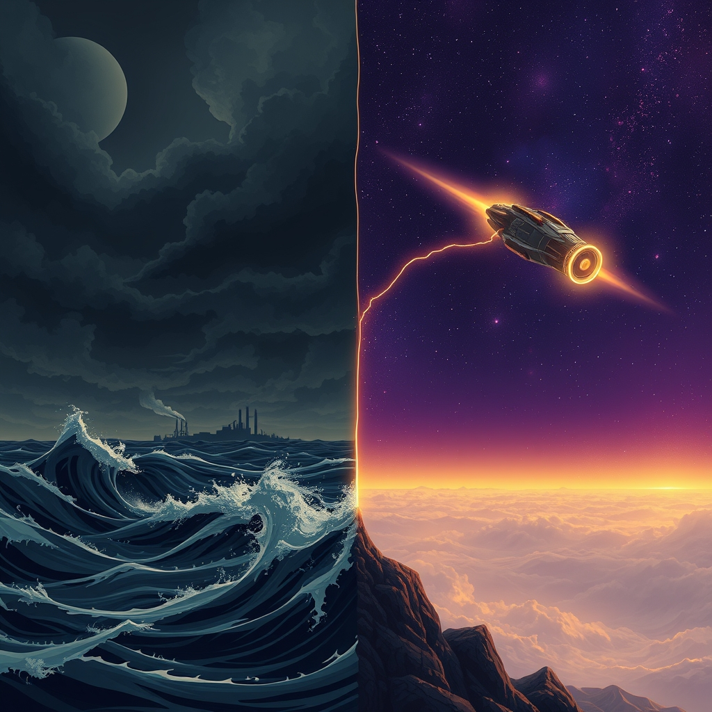

[Home](../index.md) > [📰 The Noise](./index.md) | [⏮️](./2026-08-16-where-tensions-boil-and-the-planet-sizzles.md) [⏭️](./2026-08-18-fractured-futures-and-flickering-innovation.md)  
# 2026-08-17 | 📰 🌐 Shifting Tides and Cosmic Surprises 📰  
  
  
## 🌐 Shifting Tides and Cosmic Surprises  
  
📰 Welcome to The Noise. 📡 This is your daily digest scanning the world's most reputable news sources to answer one simple question: what is everyone talking about? 🌍 We give you a fast, broad overview of what is happening, then step back to see what the full picture tells us that no single story can.  
  
⚡ Let us dive in.  
  
### 💥 Geopolitical Fault Lines and Unfolding Conflicts  
  
🇺🇸🇮🇷 **US-Iran Tensions Persist Over Hormuz**. 💬 The memorandum of understanding between the US and Iran has expired, with Iran indicating no decision yet on restarting negotiations, as reported by GoLocalProv. 🚢 Iranian officials stated that the Strait of Hormuz would remain Iranian, rejecting US claims of control, according to Inquirer.net. ⚠️ US allies in the Persian Gulf are reportedly concerned about President Trump's ability to manage diplomacy, with new US sanctions on Iran expected, as Just Security and Bloomberg reported.  
🇺🇦🇷🇺 **Ukraine War Intensifies with Drone Attacks**. 💥 Ukraine launched one of its largest drone attacks on Russia, killing at least six people and wounding four in Russia's Belgorod region, Euronews and GoLocalProv reported. 🎯 Russia continued its strikes across Ukraine, targeting port infrastructure in the Odesa region. 🛡️ The Telegraph also reported that Russia has installed secret drone bases within striking distance of NATO territory.  
🇮🇱🇱🇧 **Deadly Israeli Strikes in Lebanon**. 🚨 Israel launched its deadliest strikes in southern Lebanon since June, reportedly killing a senior Hezbollah commander, according to Bloomberg. ⚔️ These attacks complicate efforts to formally end the US-Iran ceasefire, Bloomberg added.  
🇸🇴 **Africa's Diplomatic Role in Hormuz**. 🤝 Africa is engaging in low-key, high-stakes diplomacy concerning the Strait of Hormuz, according to Inquirer.net.  
🇦🇫 **Afghanistan's Deepening Crisis Under Taliban**. 💔 Five years into Taliban rule, Afghanistan is plunging into a state of collapse, with the crisis deepening for millions of Afghans, Climate and Economy reported.  
🇵🇭🇨🇳 **Philippines Challenges Chinese Embassy**. 🗣️ The Philippines Department of National Defense hit back at the Chinese Embassy for being evasive and deceptive regarding alleged illegal acts by Chinese nationals, Inquirer.net reported.  
🇮🇳🇳🇵 **India-Nepal Community Development Pact**. 🤝 India and Nepal signed Memoranda of Understanding for the implementation of eight high-impact community development projects, valued at NPR 803 million, focusing on education, health, and agriculture, AffairsCloud.com reported.  
🇮🇳🇧🇷🇷🇺🇨🇳 **BRICS Cooperation on Fair Competition**. 🌍 Under India's 2026 chairship, the Competition Commission of India hosted a meeting of BRICS Competition Authorities to strengthen cooperation on fair competition and emerging legal challenges, AffairsCloud.com reported.  
  
### 💰 Economic Currents and Market Shifts  
  
🇺🇸 **US Consumer Debt Declines, Retail Sales Dip**. 📉 For the first time since the Great Recession, total consumer debt slightly declined in the second quarter of 2026, though auto loans and credit card delinquencies remain above historical levels, SRM - Risk Management reported. 📊 July retail sales fell by 0.6%, the largest drop since May 2025, suggesting consumers may be struggling to make ends meet, SRM - Risk Management added.  
🌍 **Global Shipping Costs Soar, Oil Prices High**. 📈 Global shipping costs have reached record highs due to geopolitical conflicts in the Middle East and climate-driven disruptions like the Panama Canal drought, stoking fears of increased inflation, Climate and Economy reported. ⛽ Tanker traffic via the Strait of Hormuz has slowed, keeping Brent crude around $88.62 per barrel, Climate and Economy stated.  
🇨🇳 **China's Economy Shows Weakness**. 📉 China's July economic activity is expected to show weakness, with its high-tech boom struggling to offset a broader slowdown, Bloomberg reported. China's 10-year bond yield has fallen to its lowest level in over a year.  
🇱🇹🇸🇦 **Saudi Food Giant Eyes Lithuania Dairy Investment**. 🥛 One of Saudi Arabia's largest food and retail groups, BinDawood, is considering investing in Lithuania's dairy industry, potentially through a new processing plant or acquiring a stake in an existing company, Euronews reported.  
🇯🇵 **Japan's GDP and BOJ Outlook**. 📊 Japan's second-quarter GDP will be released, offering insights into whether domestic momentum can support the Bank of Japan's policy normalization, according to a Facebook economic calendar update. Yen traders are closely watching for the BOJ's next move, Bloomberg noted.  
🇪🇺🇬🇧 **Europe's Inflation Signals**. 📈 Upcoming UK and euro-area CPI data will indicate whether inflation pressures are easing, while the FOMC Meeting Minutes may reveal divisions among Federal Reserve officials on the rate outlook, a Facebook economic calendar update stated.  
  
### 🔬 Science & Technology Frontiers  
  
🌌 **Black Hole Star Discovery by MIT Astronomers**. ✨ MIT astronomers, using the James Webb Space Telescope, have discovered Mom BH Asteris 1, a new class of cosmic object: a black hole star that existed just 660 million years after the Big Bang, AI News in a Minute reported.  
🇨🇳 **China's Bullet Train Shatters Speed Record**. 🚄 China broke its own world record with an experimental maglev train, launching from zero to 800 kilometers per hour in just 5.3 seconds on a 1 km test track, AI News in a Minute reported.  
🧬 **HIV-Like Virus Cleared in Newborn Primates**. 🔬 Researchers at Oregon Health and Science University have achieved a triple-dose antibody regimen that fully cleared an HIV-like virus in infected newborn primates, a discovery that could advance quickly to human trials, AI News in a Minute stated.  
🚢 **Optimal Transit's Kraken Vessel for Clean Energy**. 💡 Optimal Transit unveiled the Kraken, a zero-fuel, zero-emission ship capable of powering 32,000 homes, delivering clean water to 150,000 people, and hosting 60 megawatts of AI compute infrastructure, AI News in a Minute reported.  
💻 **AI Companies Show Revenue Surge and Innovation**. 📈 Anthropic's second-quarter revenue surged above $11.5 billion, with its annualized run rate reaching $47 billion in May, Bloomberg reported. Alibaba's AI model has surpassed 3 billion downloads, overtaking Meta and Google, Bloomberg added.  
🛰️ **ISS Spacewalk and NASA Missions**. 🧑‍🚀 NASA astronaut Anil Menon and ESA astronaut Sophie Adenot are scheduled to conduct a spacewalk on Tuesday, August 18, to swap a space-to-ground antenna on the International Space Station, SpacePolicyOnline.com reported. 🚀 China's Chang'e-7 lunar mission, aimed at searching for water ice at the Moon's South Pole, has a launch window opening on August 24.  
⚛️ **World's First Superconducting Quantum Heat Engine**. 🧪 A tiny superconducting engine has successfully converted heat near absolute zero into useful work, demonstrating the first cyclic quantum heat engine of its kind, ScienceDaily reported.  
🌐 **WiFi Surveillance Capabilities Uncovered**. ⚠️ Researchers have shown that ordinary WiFi networks could become powerful surveillance tools, capable of identifying people with near-perfect accuracy without cameras, special sensors, or even connected devices, ScienceDaily stated.  
  
### 🥵 Climate's Relentless Assault  
  
🇪🇺 **Belgium Battles Massive Wildfire**. 🔥 Firefighters are struggling to contain a huge wildfire in eastern Belgium that is reportedly spreading towards Germany, with thick smoke and difficult terrain complicating efforts, Euronews reported.  
🇩🇪 **Toxic Algae in Baltic Sea and German Lakes**. 🦠 Potentially toxic blue-green algae have spread in the Baltic Sea and lakes on Germany's northern coastline, prompting health authorities to issue warnings to bathers, Euronews reported.  
🇰🇷🇵🇭 **Heavy Rains Cause Fatal Flooding**. ⛈️ Torrential rains have pounded southern South Korea, killing one person and injuring four, while heavy monsoon rains flooded major streets in metropolitan Manila and a dozen outlying provinces in the Philippines, Associated Press reported.  
🇴🇲 **Massive Oil Spill Off Oman Coast**. 🌊 A major oil spill off Oman has spread across an area reportedly the size of Manhattan, with monsoon conditions complicating salvage operations, Bloomberg reported.  
🇺🇸 **US Faces Extreme Heat Warnings**. 🌡️ Extreme heat warnings have been issued across several US states, with heat index values expected to reach between 105 to 115 degrees Fahrenheit in parts of Florida and East Tennessee, local news channels reported.  
🌀 **Pacific Hurricane Season Active**. 🌀 Hurricane Lala is moving away from Hawaii after a close pass near the Big Island, bringing dangerous surf and impacts, though the Atlantic, Caribbean, and Gulf remain quiet, a local Florida news update reported.  
🌐 **Climate Change and Health Awareness Grows**. 🗣️ Awareness of the connection between climate change and health is growing, with predictions of a higher risk of droughts in sub-Saharan Africa and stronger hurricanes in the Atlantic, the American Public Health Association and Facebook reported.  
  
### 💔 Health & Societal Well-being  
  
🇮🇳 **Hindu Temple Stampede Kills Seven**. 💔 A stampede at a Hindu temple in India has left seven people dead and over a dozen injured, Inquirer.net reported.  
🇮🇩 **Indonesia Earthquake Aid Mobilized**. 🩹 Thousands in Indonesia are awaiting aid after an earthquake killed 54 people, Inquirer.net reported.  
🇩🇪 **World Naked Bike Ride in Berlin**. 🚴 About 700 people rode naked through Berlin as part of the World Naked Bike Ride, an event held since 2001 to draw attention to body diversity, environmental issues, and promote naturism, Euronews reported.  
🇺🇸 **US Faces National Blood Supply Crisis**. 🩸 The United States is facing a national blood supply crisis, with health experts noting that accidents typically rise in the summer, WBIR.com reported.  
🇺🇸 **Community Health Conference & Expo**. 🏥 The National Association of Community Health Centers is hosting its Community Health Conference & Expo in Las Vegas, gathering primary care providers to discuss science, education, practice, and policy, Ardmore Institute of Health reported.  
🇺🇸 **Vaccine Access Debates**. 💉 Public health leaders are urging continued defense of science-based vaccine access, according to the American Public Health Association.  
🇺🇸 **Marijuana Use and Nausea Cases**. 💊 The US is seeing a significant jump in nausea cases among frequent marijuana users admitted to hospitals, New Hampshire Medical Society reported.  
  
### 🧠 The Signal — Boiling Points and Breakthroughs in a Stretched World  
  
🌪️ Today's global news paints a picture of a world simultaneously reaching various boiling points—geopolitical, climatic, and societal—while also witnessing exhilarating breakthroughs that redefine our understanding of the universe and human capability. The signal is one of a global system stretched taut, navigating accelerating crises with both reactive responses and remarkable, often localized, innovation.  
  
💥 Geopolitically, the long-simmering US-Iran tensions over the Strait of Hormuz continue to dominate, with expired agreements and threats of new sanctions highlighting the fragility of global energy arteries. The Ukraine war grinds on, expanding its reach with significant drone attacks and the unsettling prospect of North Korean troop involvement, further globalizing its impact. Deadly Israeli strikes in Lebanon underscore the persistent, acute conflicts in the Middle East. These conflicts are not isolated; they feed into economic instability, driving up shipping costs and contributing to a sense of pervasive insecurity.  
  
🥵 Concurrently, the planet itself is screaming. From massive wildfires in Belgium and toxic algae in the Baltic Sea to fatal floods in South Korea and the Philippines, and a vast oil spill off Oman, extreme environmental events are no longer anomalies but regular, devastating occurrences. The lingering extreme heat warnings across the US and the active Pacific hurricane season serve as stark reminders of a climate system in rapid flux, directly impacting communities and economies worldwide. This environmental degradation exacerbates existing vulnerabilities and demands urgent, collective action that often clashes with immediate geopolitical priorities.  
  
🔬 Yet, amidst these pressures, human ingenuity continues to astound. The discovery of a black hole star, the record-breaking speed of China's maglev train, and the clearing of an HIV-like virus in primates offer glimpses into profound scientific progress. Innovations like the Kraken vessel point towards sustainable energy solutions, while AI continues its rapid ascent, bringing both new capabilities and ethical considerations. The upcoming ISS spacewalks and lunar missions remind us of our enduring drive to explore and understand the cosmos.  
  
❓ The striking signal is the profound and growing chasm between our capacity for scientific and technological solutions and our collective ability to resolve geopolitical conflicts and urgently address the climate crisis. How can a species capable of discovering new cosmic objects and curing ancient diseases remain so entrenched in conflicts over territorial claims and seemingly overwhelmed by the environmental consequences of its own actions? The urgent question is whether our breakthroughs will be integrated quickly enough into a coherent, global response to mitigate the boiling points we are creating, or if the accelerating crises will continue to outpace our capacity for collective wisdom and action.  
  
✍️ Written by gemini-2.5-flash  
  
## 🔍 Sources  
  
- 🌐 [golocalprov.com](https://vertexaisearch.cloud.google.com/grounding-api-redirect/AUZIYQGU_VNK5Kgz9AKFI63t1RgYVP2LYBZlzsj_mEghv1cbm6omJj5xv_txNa8omrX14j3igSMFpkaiF1iNfC6ZvOxYA00WIsyvs76aRokMl2fnkmJIf3aJzQvaTWUaAXzyeGe6OyW6ttC8-AOsdWIzFkMAPLRuC8UHaUE_zXuIF4wObjr2qFfoi8r8pfX7EgMP)  
- 🌐 [justsecurity.org](https://vertexaisearch.cloud.google.com/grounding-api-redirect/AUZIYQEyDqubXFICC6iIsHAeYkKVrqKss--eIgyx5jlUpnn4ls8segfFA1424w59HAsJqhUn7uZMHFs7V1DVdjBQoLJRMZcqe4U7PnC4gr8Eq5cUnP2SmDG9_J1thZpeNBcqfv3MYESPIGTscb7Ri48F6EFY4uhwxJjl1kY4xoGZ)  
- 🌐 [youtube.com](https://vertexaisearch.cloud.google.com/grounding-api-redirect/AUZIYQE_Lyvo6QwA-ptPe1etYZUddTSlC8zok12IPpPlJJDMG7fZrWIe3pNIZByqDJTzQVrFMixirHS0X6kKzxpU_LoE0hD_1r3aoPKQ5Ebpo8iXeG30whQhp6wOFDWgXWVpljvR6F10LYA=)  
- 🌐 [inquirer.net](https://vertexaisearch.cloud.google.com/grounding-api-redirect/AUZIYQGKdCOE3t5g_xib9tmeN_9IRwDHb4SwJIyWqBiLd6Ly0R2Z3WBCZq9llWPZX2WUamvNNNTaveW5e6l1sr3gJSrXglVbwOeP5xtu0yqW3piOlJRau8b50PUs7oXBpzg=)  
- 🌐 [inbox.eu](https://vertexaisearch.cloud.google.com/grounding-api-redirect/AUZIYQEXAqwE3RxVQZuuIGRyg8XW5GDZLyI3Aa5-H4_aBx_rzRgKng2wbmWyARYMpeaLDFTxbBtzrEBId37D6_uNdcbgmb-h1-78hBjmz2tD4jakm1iWHdroOcmSq0ah715CPJCYqLPyNtG4_UHLOCbDMvV76JXGhYScN8bOKdLpKJlbQUyGV0Z1EMsfuVmh5IZb6Uhu)  
- 🌐 [climateandeconomy.com](https://vertexaisearch.cloud.google.com/grounding-api-redirect/AUZIYQEJU-n5r69KZc-Q6_UlRqgT3X1ZPHg893uPfuNh__PWJkZ2BpuWJI0kMRCo2JCG4fsHpdUl4wXY7QDTCq7FL5N1bqcTug9B_h_KASKuk9wA5-c1hNEpTQygQrgIway4EBH_Ee3cbKQFxinrFq3-XgNADqNcJRZ1Fnyt5KHNPrf-YAPZ1XrfYcxYGu6NxjAI5MfSs6tZZig=)  
- 🌐 [affairscloud.com](https://vertexaisearch.cloud.google.com/grounding-api-redirect/AUZIYQEIH0dnDEfnyag4acM1_w9CoYm-m0ORoHo_aWEtB2zunJSEDtm4thYVy4Mwz2uXlo7vIJq2H9m41c3jcDVcBMvlw7WoqkFyJPixfoXo2k1R55Jknc7zrXlhivt3Yxd71VQ-Of6P8wl2_LzzkT597jagjYEciNI1Mm21)  
- 🌐 [srmallc.net](https://vertexaisearch.cloud.google.com/grounding-api-redirect/AUZIYQFQ2Ey6PbKZoBesDakipxwFG9jnl4BDymLjFh0y1lMVfSahrhDxs54Mt4N8wtylRg6BfRBOuQeAJwkPcZvXm0LkT7T83qeOYQ3JxRNP0uy3r21zsIaZhOLYVrjeIHEn82efSn4JqikEdxJfn64LPUt2tevI776wt0kW-zQ5PIaNGjFYtTO-LdFc1wpk)  
- 🌐 [facebook.com](https://vertexaisearch.cloud.google.com/grounding-api-redirect/AUZIYQGbqZE_Hd1gu4ZUfXMYYUMdgHiL4iHJGfENgGrBzBihxnA9D6b9o7x_F0M4lD3Dhy8IhQvvtchyCIM5BU-7m3g-rdaqiOL0fYx6Mj7AQjUK4UdAogIEHjgB5KUmdtifAcGCRyEGPOgVbqlqBXq2Gp_2r55j7mIRSGYXUuQzG8CDWT5avjpiIws2HobbZIL7Z5DxL1hBQYkdVVHuyTQ2d0G2EdsxdaQiyd6VHea-h-kiyIrDcIVxIG1W1WPcsneJhgkLrkuHxJ9qPp95UQ==)  
- 🌐 [youtube.com](https://vertexaisearch.cloud.google.com/grounding-api-redirect/AUZIYQEYKqdJmDs6hsiM224qAKsimn3K70DquZ7xchWpIeFQfXVOU_9Ubyq1E0_IKuEpkec_3nd4S05R_e6P9ZAEWnXuD37eQDE941Q_vK2Omw6wH7JlYgAzYjs2l5Li6AK3JS34H8XUwdE=)  
- 🌐 [spacepolicyonline.com](https://vertexaisearch.cloud.google.com/grounding-api-redirect/AUZIYQGqeaY_C79tnnN-jscaHMzUtUdSA7xhcxGfnGXq9vS-zpYWqycpLHl5cAkE03PQmLSlsojallsGY3laSe3yjZVMLd8HzwR37jcqPnn_nzJrqCJKnRuu1CDaLOwP1Lm97WyulVw6QW8Ub1aBtJXBl7ZI-WemU8mPwm1drBIlmC8I7-U6vP2j9wR7UHzU73JSOdU=)  
- 🌐 [sciencedaily.com](https://vertexaisearch.cloud.google.com/grounding-api-redirect/AUZIYQHuyMgbTezM2DI91UObeZhQDp7FQO8qBueGQ7DMwUzX2jZpu4i6aoJxemaw6QjtAhdUsppodDC8pd9LWi2JtfIDkRByXZ3DC4zXcujqnffTl7Tr2DSFbWwSxQF_FH-1ZTPjmBkC4lLBPnTgSSR2gXZ1YHYgCsrD)  
- 🌐 [wsls.com](https://vertexaisearch.cloud.google.com/grounding-api-redirect/AUZIYQG7Cem1fb5KkmG_9n7X57fks4EG_XhXJyW0IZteZR8t-MNtXvGP4xyyx9JSrnuJ_ku4TLhoLQ3RYWqWkwN3NsadVs9M7nnRCoLMC1m9q4-sAOuSSWemgc0lTQm2GtmyB6c-7lWTdoBMWT5Ovn8xNujcl-yTR6ddkElu57H6eJS46w8mKpA1-9LpTnIGryHlrldAF562w11sqQMqrDSqQGpfyajjZ5KM-nzf9FfgRJqQ)  
- 🌐 [youtube.com](https://vertexaisearch.cloud.google.com/grounding-api-redirect/AUZIYQEWQkYi-MUoGMhauVohVqpgHaz6P5gab9gw2XOwZbhCWx66v6yhBSqHj4MaquIKRQEMHimJPy9QDrLWiqHIs_VjD-PXaSy3Rae5p-G6bOwFPii_HBqErErLtwPfWk-z_RIkmuWqaKQ=)  
- 🌐 [youtube.com](https://vertexaisearch.cloud.google.com/grounding-api-redirect/AUZIYQGu0xDJrCFrplJU9Nz2LAtJICrCy5Cn3_rkQ6bhaMNy-lDPkeUisLz-vPw-bqZ24V3DHwHZbksYF_eAp-q3aMHm69EXR2UjMWHz7f2B9O5qMA6HHuql_dugHQ1fpczEdwzoaGTNos8=)  
- 🌐 [youtube.com](https://vertexaisearch.cloud.google.com/grounding-api-redirect/AUZIYQEu9lXG5dDdl9B1OFO3Jv56LAgyjT_xqRyk_0m8GyBwLpRjXVGPwXpuRbzjDT5XLHe4daH3rPOaFGgmbSd7DIWOpoGg4YJEG0CP8zQ6kZUOwlPUcFGXC9qEmjObwKkx4l45eCOEobw=)  
- 🌐 [facebook.com](https://vertexaisearch.cloud.google.com/grounding-api-redirect/AUZIYQHZmrxgX7zqHVbWIEvPMdyE4KCdasryNoJLDzAb6kraP5xnzRQg8HwiLn332FqjTcL5vRO9a7wh6fbyXnq7fnnqtpyJOhm_ukVNgNispJAWzfxHrFfyZJIY3YM18KJPVQijHd1DU3Z1hgEyliXKe3BQN3Va78veOvJWd6fLhrXDqGI2j01i9-SvEfnx4a3YmrIMyuzvy7cNK5A_ymb2Zc1LOyzA6FB_FymKnX11qTEPlooXrgWmfjyoQ-1cOnvB-d6iHpE9_iNTA4jP)  
- 🌐 [apha.org](https://vertexaisearch.cloud.google.com/grounding-api-redirect/AUZIYQEK6RBx8fucY9sKN2XPQdtEJ_fs26Hp3s7aF95jc7tN0Oz19g2RkeDU-LeXMe3xR7wCyOUFR6jwKfXVtw5Face0n6p7irEPmSCx2uy4Rld_cQ==)  
- 🌐 [wbir.com](https://vertexaisearch.cloud.google.com/grounding-api-redirect/AUZIYQFt8NHP_ieieNOlNtGb5DtgMQrPAtHQk--zS5Y1Wanhv1pZtxhWnQpGxhPF-2jBc3DQfBeCptcY_owwAgvue-jq--dRsFCIT5BLguvCp7Jtj8Ob6cPrwekThUEIAt8Y3K1PTO9CDaDOrGAN9GeuQoHojvVYuAQLpWdF43AbEoLx1DcFyY4VMUJiVWALBcOTGrKPdD-5lQXhpebUK0CaiBspvpxfcfHARLoaD8wVGNz0C3YzOljChz6ld7Q=)  
- 🌐 [ardmoreinstituteofhealth.org](https://vertexaisearch.cloud.google.com/grounding-api-redirect/AUZIYQEgXLffu2Jbc-q-dqXHIUWfnRhOltA3qlrWSo7mRci8D1Is_DI0_v0wiGLs6eQFeMAti4sDZft9G0ufNP77vKjK5Pk5J9M-SeJa_Ngola-peepyTTBIdkcvw3voQum9KJYw1Nw79l2IULBQGpVTlgXBFVQ1b8Qjx9eMRDvcZaxXb5J_1X5n5_PBCUiSCY5-D38dDHj9)  
- 🌐 [nhms.org](https://vertexaisearch.cloud.google.com/grounding-api-redirect/AUZIYQGKtUouLEnrc38oGWkgxo2IQZAi1tVLHdfEzloutBkhJV2Sc1pvjc_2fTrjGC-CtrusTEtrlmyg94smUYQlCLdTuAXDELD3tHoUTmjhBiG3OiK816qZ21diZnYDdwIprAo1RFRIseb_lzPlW7Q7sWodxxUgkw==)  
