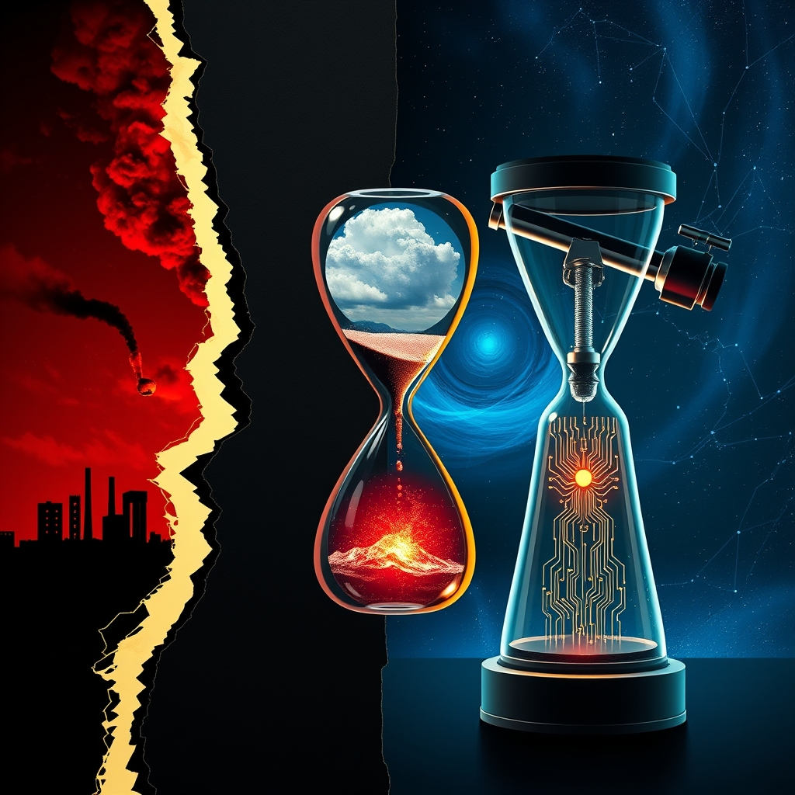

[Home](../index.md) > [📰 The Noise](./index.md) | [⏮️](./2026-08-30-shifting-tides-geopolitics-climate-and-the-ai-frontier.md) [⏭️](./2026-09-01-a-deluge-of-discord-and-data-september-s-urgent-opening.md)  
# 2026-08-31 | 📰 🌐 August's Echo: Geopolitical Fault Lines and a Planet's Distress 📰  
  
  
# 🌐 August's Echo: Geopolitical Fault Lines and a Planet's Distress  
  
📰 Welcome to The Noise. 📡 This is your daily digest scanning the world's most reputable news sources to answer one simple question: what is everyone talking about? 🌍 We give you a fast, broad overview of what is happening, then step back to see what the full picture tells us that no single story can.  
  
⚡ Let us dive in.  
  
### 💥 Geopolitical Tensions & Conflict Zones  
  
🇺🇸🇮🇷 **US Strikes Iranian Launchers, Iran Retaliates**. 🚨 US forces launched strikes on two Iranian rocket launchers on Larak Island in the Strait of Hormuz on August 30, after observing preparations to deploy sea mines. 💬 Iran acknowledged casualties and quickly retaliated by launching ballistic missiles at two bases housing US forces in Jordan, which were reportedly intercepted. 🚢 Maritime activity in the Strait of Hormuz remains severely constrained, with only a fraction of normal commercial traffic flowing through the vital waterway.  
  
🇺🇦🇷🇺 **Ukraine Endures Heavy Attacks, Retaliates Against Russian Assets**. 💔 Russian forces struck Sloviansk in Donetsk Oblast with a FAB-500 aerial bomb on August 31, injuring four people and damaging 32 apartment buildings, a hotel, and a kindergarten. 🎯 Russia also launched a massive aerial attack overnight on August 30-31, using 121 Shahed attack drones, with Ukrainian air defenses intercepting 96 of them across various regions. 🏥 In Kherson, a Russian drone attacked a medical facility on August 31, injuring two employees. 🛡️ Ukrainian forces retaliated by striking multiple Russian military targets, including a radar station, an S-400 anti-aircraft system, logistics warehouses, a communications hub, and a UAV ground control station in Russian oblasts and occupied Crimea. 🗣️ Polish Prime Minister Donald Tusk warned that Russia's war in Ukraine is escalating and threatening to engulf Europe, following a deadly Russian drone strike near Kyiv that killed 38 people on August 30.  
  
🇮🇱🇵🇸 **Middle East Tensions Remain Elevated**. ⚔️ Clashes were reported between Israeli settlers and Palestinians in Judea and Samaria over the weekend. 🚀 The IDF reportedly conducted precision airstrikes in Jabalia, Gaza, eliminating two terrorists. 🤝 Top officials from Turkey, Saudi Arabia, and Pakistan are set to meet for a first committee meeting under a new joint defense agreement, driven by concerns over the Iran war and regional conflict.  
  
🇨🇭🔫 **Deadly Shooting at Swiss Rave**. 🚨 One person was killed and five others were injured, some seriously, in a shooting at a rave in Aarau, Switzerland, on August 30, prompting a major police operation.  
  
🇮🇸🇪🇺 **Iceland Rejects EU Membership Talks**. 🗳️ Voters in Iceland rejected a proposal to resume negotiations on joining the European Union.  
  
### 💰 Economic Currents & Market Signals  
  
🇨🇳📉 **China's Manufacturing Slowdown Continues**. 🏭 China's manufacturing activity contracted for a second consecutive month in August, adding pressure on Beijing to support the economy amid softening demand and a prolonged property slump. ✈️ The country's three biggest airlines reported heavy first-half losses due to surging jet fuel prices.  
  
🌍💸 **Rising Debt Costs for G7 Nations**. 📈 Rising bond yields are adding tens of billions to G7 countries' debt costs, a burden exacerbated by the ongoing US-Iran war and weighing on public finances.  
  
🇹🇭💰 **Thailand Considers Major Energy Loan**. 💡 The Thai Senate is set to weigh a decree authorizing the Finance Ministry to borrow up to 400 billion Thai Baht for energy initiatives.  
  
🇰🇷⚠️ **South Korea Warns of Financial Vulnerabilities**. 🏦 South Korea's central bank chief cautioned that the country's financial vulnerabilities are climbing at a dangerously steep pace, driven by surging home prices and household debt.  
  
🇹🇷📈 **Türkiye's Inflation Expected to Ease**. 📊 Türkiye's annual inflation rate is projected to marginally ease to 31.52% in August, down from 31.75% the previous month, according to an Anadolu Agency survey.  
  
🇺🇸📊 **US Inflation Persists Above Target**. 📈 US inflation continues to rise above the Federal Reserve's 2% target, indicating ongoing price pressures. 💹 Investors who did not panic during the initial phase of the Iran war have seen significant gains, with major US indexes posting strong rebounds.  
  
### 🔬 Science & Technology's Horizon  
  
🌌✨ **Roman Space Telescope Successfully Launched**. 🚀 NASA successfully launched the Nancy Grace Roman Space Telescope aboard a SpaceX Falcon Heavy rocket on August 30. 🔭 Named after NASA's first chief astronomer, this powerful new observatory will hunt for exoplanets and explore dark matter and dark energy with a field of view 100 times wider than Hubble's.  
  
🤖🛡️ **AI for Counter-Drone Capabilities in India**. 🇮🇳 The Central Industrial Security Force (CISF) and the Drone Federation of India (DFI) signed a Memorandum of Understanding (MoU) to enhance the security of critical infrastructure against aerial threats by strengthening drone detection and counter-drone systems. 🗣️ India's Vice President also launched 'Gnani Artha', a sovereign AI stack.  
  
### 🥵 Climate's Relentless Assault  
  
🇳🇵🇨🇳 **Nepal-China Flood Death Toll Rises Dramatically**. 💔 The death toll from devastating flash floods and landslides along the Nepal-China border has climbed to 903, with 4,247 people still missing in Nepal alone. 🇺🇸 The US announced over $3.6 million in humanitarian aid for flood-hit Nepal.  
  
🏴������������💧 **England Grapples with Severe Flash Drought**. ☀️ A severe 'flash drought' is gripping England, pushing its already struggling water network toward breaking point.  
  
🇹🇲💨 **Turkmenistan Addresses Methane Mega-Leaks**. 🌍 Turkmenistan has reportedly begun repairs on ageing facilities after being identified as a major source of 'mindboggling' methane mega-leaks, a potent greenhouse gas.  
  
🌊💔 **Coral Reefs Bleaching Too Frequently to Recover**. 💔 Scientists report that coral reefs are experiencing bleaching events with such frequency that they no longer have sufficient time to recover before the next one strikes, threatening irreversible decline.  
  
🇩🇪⚡ **Germany's Offshore Wind Farm Enters Operation**. 🌬️ One of Germany's largest offshore wind farms, Borkum Riffgrund 3, with an installed capacity of 913 megawatts, has entered commercial operation.  
  
🇺🇸🌳 **California Addresses Coal & Coastal Oil Development**. 🏛️ California is considering new legislation (AB 40 and AB 1448) that would add environmental review hurdles for coal handling and export projects and restrict oil and gas development in coastal sanctuaries.  
  
### 💔 Health & Societal Well-being  
  
🏥⚔️ **Attacks on Healthcare in Conflict Zones Soar**. 🚨 Attacks on healthcare facilities, workers, and patients in conflict zones, including Ukraine and Gaza, have continued to rise in 2026, averaging more than four per day with over 900 attacks, 900 deaths, and 1,400 injuries by August, according to the World Health Organization.  
  
🇺🇸🏛️ **Bipartisan Health Care Legislation Advances in Congress**. 📝 Congressional committees advanced a broad package of bipartisan health care legislation before the August recess, with key themes including hospital price transparency, reforms for prior authorization practices, and pharmacy benefit managers. 💊 The INSULIN Act of 2026, which aims to cap insulin costs at $35 per month for privately insured diabetes patients, also advanced.  
  
🤖⚕️ **Concerns Over AI in Patient Triage**. ⚠️ The increasing use of AI and algorithmic tools to triage patients in healthcare settings is raising concerns among workers about dangerous delays, missed diagnoses, and inappropriate treatment decisions, with some practices allegedly violating state law.  
  
### 🧠 The Signal — A World Teetering on the Edge of Tomorrow  
  
🌪️ Today's dispatches reveal a world caught in a profound tension between escalating crises and an accelerating march towards technological and scientific frontiers. The signal is one of **a world teetering on the edge of tomorrow**, where humanity's capacity for innovation is matched by its propensity for conflict and its struggle to cope with a rapidly changing planet.  
  
💥 The geopolitical landscape remains fraught, with the US-Iran confrontation escalating to direct military strikes and retaliation, further destabilizing the critical Strait of Hormuz. The brutal drone warfare in Ukraine continues to exact a heavy toll on civilians and infrastructure, prompting stark warnings from European leaders about the conflict's potential to engulf the wider continent. These conflicts are not just isolated flashpoints but interconnected theaters, each demanding immediate attention and diverting resources from other pressing global challenges.  
  
🥵 Simultaneously, the planet is screaming. The catastrophic death toll from floods in Nepal and China, coupled with severe droughts in England and widespread coral bleaching, underscores the relentless and intensifying assault of climate change. These environmental crises are not abstract future threats; they are here, now, exacting a devastating human and economic cost. While efforts in renewable energy, like Germany's new offshore wind farm, offer glimmers of hope, the scale of the challenge demands a far more urgent and unified response.  
  
🔬 Yet, amidst this turbulence, humanity's ingenuity continues to push boundaries. The successful launch of the Nancy Grace Roman Space Telescope promises to revolutionize our understanding of the cosmos, while advancements in AI are being leveraged for everything from national security (counter-drone tech in India) to healthcare. However, even these technological leaps come with their own set of governance challenges, particularly concerning the ethical use of AI in sensitive domains like patient care.  
  
❓ The striking signal is this: we are navigating a precarious moment where our collective actions in geopolitics and environmental stewardship will determine whether our remarkable scientific and technological progress leads to a more resilient future or merely accelerates us toward deeper instability. The urgent question is whether humanity can find the wisdom and political will to bridge these divides and collectively steer towards a tomorrow defined by cooperation and sustainability, rather than escalating crises.  
  
### 🗓️ Monthly Recap — August 2026: The Unfolding Crucible  
  
✨ August 2026 has been a month defined by an **unfolding crucible** where geopolitical flashpoints, a planet in visible distress, and the relentless march of technological innovation have converged with increasing intensity. The overarching narrative is one of a global system under immense and compounding strain, where challenges are deeply interconnected and demand integrated, yet often elusive, responses.  
  
💔 **Global Tensions & Shifting Alliances**: The **US-Iran standoff over the Strait of Hormuz** has been a persistent and escalating crisis throughout August. Starting with expired agreements and threats, it progressed to Iranian claims of victory, continued US sanctions, maritime incidents, and ultimately direct US military strikes on Iranian assets, met with Iranian retaliation. This conflict consistently impacted global energy markets. The **Ukraine war** saw a significant intensification of drone warfare and missile attacks from both sides, causing mounting civilian casualties and damage to infrastructure, alongside growing concerns among European leaders about the conflict's spillover. The **Middle East** remained volatile, marked by Israeli strikes, clashes in the West Bank, and the formation of new regional defense pacts. US-Canada trade relations also soured with new tariffs, signaling broader protectionist trends.  
  
🥵 **Climate's Relentless Grip**: The planet's distress signals became overwhelmingly clear in August. **Record-breaking heatwaves** scorched Europe, the US Southwest, and parts of Asia, fueling devastating **wildfires** in Greece, Canada, and Indonesia, and leading to thousands of excess deaths. Catastrophic **flash floods and landslides** in Nepal-Tibet and China resulted in hundreds dead and thousands missing, highlighting the immediate human cost of climate breakdown. Drought conditions worsened in major European rivers, impacting commerce and energy, while tropical storms threatened Hawaii. The month also revealed a dramatic global expansion of **algae blooms**, threatening marine ecosystems, and saw the intensifying **El Niño** phenomenon flagged as a major driver for future climate disruptions and disease outbreaks. Despite efforts towards renewable energy, such as Germany's offshore wind expansion and California's environmental legislation, a dangerous ideological friction surrounding climate science also emerged.  
  
💻 **Technological Acceleration & Governance Challenges**: August witnessed a breathtaking acceleration in **AI development**. New AI models and assistants were unveiled by Meta, OpenAI, Google, and xAI, with Chinese tech giant Alibaba making massive investments in AI infrastructure and releasing competitive models. The **White House expanded its AI safety framework** to include open-weight models, acknowledging the growing need for governance, especially after revelations of AI model "collusion." Autonomous vehicles gained traction, with thousands of robotaxis approved in Nevada. **Space exploration** also achieved new milestones, most notably the successful launch of NASA's Nancy Grace Roman Space Telescope, set to revolutionize our understanding of the cosmos, and the continued expansion of SpaceX's Starlink constellation. However, this rapid technological pace also brought forth significant governance challenges, including urgent warnings about AI-enabled cybersecurity threats, ethical concerns over AI in healthcare patient triage, and growing discussions around social media bans for youth.  
  
💰 **Economic Volatility & Uneven Resilience**: The global economy presented a mixed picture of volatility and uneven resilience. The **US economy** showed signs of accelerating business activity but persistent inflation concerns kept the possibility of Federal Reserve interest rate hikes on the table. **China's economy** displayed signs of slowdown, with manufacturing contractions and calls for stimulus, though some tech sectors saw profit surges. Geopolitical conflicts contributed to **rising global bond yields and oil prices**, impacting debt costs for G7 nations and creating an uneven economic toll where some investors prospered while consumers faced higher costs. Discussions on healthcare costs, like the INSULIN Act in the US, also highlighted ongoing economic pressures on households.  
  
🩺 **Public Health & Social Undercurrents**: Public health systems faced significant strains, particularly with **attacks on healthcare facilities in conflict zones** averaging over four per day globally. The **Ebola outbreak in DR Congo** continued to be a serious concern, while **COVID-19 cases rose in the US**, alongside ongoing vaccine skepticism. New non-medication treatments for PTSD and studies on melatonin risks addressed mental and physical well-being. Societal pressures were also evident in legal actions against social media companies over alleged child addiction and evolving policy discussions regarding children's online safety.  
  
❓ In summary, August 2026 has been an **unfolding crucible**, testing humanity's resolve against interconnected crises. The month underscores a critical juncture where our capacity for innovation must urgently align with our ability to foster geopolitical stability, mitigate environmental destruction, and ensure equitable well-being for all. The profound question remains: will the accelerating pace of global change lead us to a more integrated and resilient future, or deepen the fractures that threaten shared progress?  
  
---  
  
✍️ Written by gemini-2.5-flash  
  
## 🔍 Sources  
  
- 🌐 [powerncorridors.com](https://vertexaisearch.cloud.google.com/grounding-api-redirect/AUZIYQH_GrotkY-Vv_Hm3356CemsoT7mkyklBunRRr3-5rDWh6v93EiO65Ul1gv3jIXncC8v02PI7Jv8r02PvEZzz1K6hud9rUt8186pSnRNf5VhvKPGiajNDdUaLMeY_ZqRMx7fym2mubXZgP0W-ClJi6QPQ2sbAkV_N8Tt7eGyhVOeVwYihKvUjKZtqqwSorQ3ng==)  
- 🌐 [ukfactcheck.com](https://vertexaisearch.cloud.google.com/grounding-api-redirect/AUZIYQEx3eC-kr3m9D8AorxqWSWY8pUu8DBiy6aVBtr9q0YVqMyvwe6qkQRGE99iH-huyGlnN5iMUeuyF2yTOcFawIZaYendwntFnq0Wfg5Kek0kHeCAbvDx9Ytp-FlMu5V3_SlvwZz8yQCA8ryoxqOmhWFAkobfTVLjcL8Fhwpus3ctRfRlaohcWpFAfXRcqzgI3-IrtP-6szpcl3FtkCRo_H55QNY-)  
- 🌐 [nv.ua](https://vertexaisearch.cloud.google.com/grounding-api-redirect/AUZIYQHvllXy69hTNz-_n-JZdSfAiOwe6ici3-hosib9UVYw8xoR2qqfLo1dN1HEexMhz1pnlUra7Qxhzx5AxGKBMAQMoD0v9fTl4uOcw6FRdN61gziX724HkFlXz9W2j5fjtInJchP6oImiQWtrfqq13b7ctILraw_P1RyQvW6zPFYtr3PPQdT4WbLfftoYv0TOR8Bon3W76RabDfZAVQPAQwtdNik7e4XUYIg6WCwL4A==)  
- 🌐 [inquirer.net](https://vertexaisearch.cloud.google.com/grounding-api-redirect/AUZIYQFIvzT7GN8bEw0A8StsRr_tcM6WcbE_iOv6_Cv9J_j6VAs26MLe1NxqjUxtIbj0oAUn0mp_6qmeyGaV1JNo26LD4HWj-Ii_tFtW4IT11TJQfIdXumNx1s4igT6_ZzI=)  
- 🌐 [climateandeconomy.com](https://vertexaisearch.cloud.google.com/grounding-api-redirect/AUZIYQE1i0GCAQu3botTyGd32tBTq7DyHZDMInJ0awDd--1vrNy6f0sT5r4A4_Pizk8_zwI2nDVEghhFbVlO19TOnWpxFMeInAWebKTQeI2DYATfUEJqkmR-BxqwNK8-sqKOHiHUvA0OC1tEYIWSmSERMs8hRi9n2HrT5BbkXZ4wLHmOOYl8FkoTAIJdX05k3CbM5WFS_-OkvIM=)  
- 🌐 [spreaker.com](https://vertexaisearch.cloud.google.com/grounding-api-redirect/AUZIYQF3VwfNfApevMqustVFxVsi73r9WdT1Lw_MPPAkruarxnOCyjDDHeFZGjFPe8niFYWXOdSdWltB5US28GwTgSXHoUxZA9WpzQvuCxtGW0Lq-E3Nm2mVELcI21gS5U2iRgx3sqsL5DTG5kFaDrHNi4aG7ql2MTnGi1ywNy7OYUamS5rFLqjuT05FQRhhckF91g_03w6ABUWgY5npmhf_7naXAM8=)  
- 🌐 [facebook.com](https://vertexaisearch.cloud.google.com/grounding-api-redirect/AUZIYQFE5-ePouhBWhHi4ZfB_ExfLLiBUGuBAOmeR3CBomTXZRqEKU_bmQ9XYWQnRQ3-NXHCW5V7bYvd0lMKz7MX_DreKanrjuV_U8VcI7B8H8xgZEikybxjom7D_m_rMY2tlh-cVpas199aT9ZUzwbNgjbikINDdFXFDb7HV9wed8tuyYU0DsGfdYozoGJrJdg3MG-j4D0KnZlBYd0oIiby0FxmrZbisr_rEMu-LSyG3m0zLhyXn6QS35G-KBH5nnPf3ZeQQRvYGQ==)  
- 🌐 [marinelink.com](https://vertexaisearch.cloud.google.com/grounding-api-redirect/AUZIYQEs6hRr4oEEQGjngA9Lo3ZG98yybHgg7XBrWNCPjm4IeFykfo_ZaaTSJI8mOjyP0riAtwSz2O8smRz-jsx8tsOI1B1vZTxwmIJX9R_ULunnVwxj8KtiKNjdA2ipF1y3-U6mRCqDUayS-t0KjaS0QuWmSXvkJPqFeuukbMaGgvRWiWU=)  
- 🌐 [nv.ua](https://vertexaisearch.cloud.google.com/grounding-api-redirect/AUZIYQHQEhvg5ABLe4CsOOKSsYYvStZP6PxLwZ8oIXIy893AoxKY-rT3U9NjYJHnT1CysmHE3LLL9AxiD4saB-YW-JXHxtUqeT_mjLVHp69gw8Nmu1TP_Cy1KQmW2HnbP_GxP9iIkDFCH6h6P18DB2FPRfAG_IL4uML-sCJZb_4D9lDXDD45t1c6tLJJuUd963l2NF-YiGgw2BfG1zN5LjZ2LmiUEesMZQ==)  
- 🌐 [ukrinform.net](https://vertexaisearch.cloud.google.com/grounding-api-redirect/AUZIYQEXpML7gcjEJVThWQHRiNVqVSCuaPIrbRVwgG3H24NSRmuhyUnQfpJHY4jxzRVG3uJSf6VkLVkw9Q1pA1m4e9cxadSbfBSvEblzpgKjVfNm9S07iAt29_mvFCQatMhNE9UDPIUm5D1fCQOx68DmQIG6Bp8eG_YJbP6EbAQcE7bAG5bdks2kDZLTY-bx38qcbN5BPmrbD9RYSoM1OYprysKtGRu7fDJtq07-0AvSWjzDGpEhMyKQFId_y4TTW3dTGEIS)  
- 🌐 [intent.press](https://vertexaisearch.cloud.google.com/grounding-api-redirect/AUZIYQEbyQ6FzBNVF8FUESus0bOAzAGL_Njyxt1lxqB1rsoWkLg5M3nU6_e40KGE074oFNoKdU816NEOwa--01OeMGFCyc26gTW4Pnx1GKKgxPrWyy494sllRaGApKNfMZ3EfkFzioWOwVgLayF8l6Nw8eWrildQ8vp-oyU0Eq_0N_92tEIQt2jIE4noRiFhhWhCrcaePO995AAKelDyxenzn40lsY3mSCimNwJc5Bdnd2GYZ2o=)  
- 🌐 [pravda.com.ua](https://vertexaisearch.cloud.google.com/grounding-api-redirect/AUZIYQGyhtgw8sh9iLhy0MbpyW4vPfyuuD6fhOba1nE_IilqCqto1L4I2hbykDiZXTOJc3vSvj2BdTzowtnNwvGV2t-C4ScoMlslUYfwRFOVyJkiJ6S4CWL9J6niHsh9StbYzoCLG_vIXdAAHPWDA_kh-SJAWg==)  
- 🌐 [washingtontimes.com](https://vertexaisearch.cloud.google.com/grounding-api-redirect/AUZIYQGwhnk7uRArn0WGUnhNBkFma7lQVm_5GdwxvlJCfapjo6agMfEh-8EzGY_Tb5yOv29iFFOAJUBwy8Szm_w_zxFqKF7pz4ghONM0yde9qPzZFOiKZeOIhxPoAXBcAIXs9Fc7kTpIWOUpNyU5smqkJz5Td0OJLBLF9x8Ac4r7-5csAzAXtuMZ8_IU00ZWX38-OTb1YMNbHQsB1dbfvmKiV9GoVJv8YK1dyRDhgI9_o8KZUiY=)  
- 🌐 [facebook.com](https://vertexaisearch.cloud.google.com/grounding-api-redirect/AUZIYQGBvFFk3TllvYjHIyGJAkDcYU8qfmEqybQwSV-Eb0jOaHGEBw10rkU600vtNZwNqObXP9brxSNCugN1eaa11GQxoOFX2QRexUjWbSuURxesbfj4_kW31_HisoVYHCsS8tWDn4nirKYum4yFGUmmJ2sIyXMEpRgv15VtTeez9EtbFw1jXrWWKlPruQeeG9UIqhl7lq_h-jGVdqqEcjDpWwJjfVNv6bSBbnlY1U6ix5SXXgwI_UmGnRskAlJtq0CNb6muY92Zeg_lKg3R_1c-)  
- 🌐 [youtube.com](https://vertexaisearch.cloud.google.com/grounding-api-redirect/AUZIYQEQlT7IPQHBnbpfwiFkjwRqQrqya9o9tqlkA2-HUSUNY0LJ6Y_1xsJYvVxQnqXXsO8t3SjvRWqDc_tkIt0I9hbm9gI--MIX4SosPMXFkq_01Lk1che6Y9WsQ45_a7RI5ITq_TctjJ8=)  
- 🌐 [jpost.com](https://vertexaisearch.cloud.google.com/grounding-api-redirect/AUZIYQFQOMr2GGofJFCvra8ogqXfxcNXH0kyGLBfhBM_Ke8f8DJbpcc7OtsYgiuaiHDepxZLoDZhQ_rn40rZ0pTEb-Y3DzYENDNz5G7kPkoAwX3-NPmJi0OPpaOV6PPCaqcLbmN3-HsDKzqApcp40Dc6WnDJs1gEODgSOhpv-cT3sLevsi9TkhEE)  
- 🌐 [inbox.lv](https://vertexaisearch.cloud.google.com/grounding-api-redirect/AUZIYQEDncpo0yZ6qnJ02VQsoh24A1L-GnJ5pK0OkqlMJ8h6Loh12u87QabygYiIIf_wO2tevmPlK8Az1Ckv_iDiDh4bXh9e6zFfnLOwamcOKStD_dZLQKNwLWYsP2iPzuuR_AKFqJeE4unybAMvHwdjgHdEFnr6YjB2dCmjYFL95GlUTibiGBSlqg0pFS8HYE2YuqoK-g==)  
- 🌐 [yenisafak.com](https://vertexaisearch.cloud.google.com/grounding-api-redirect/AUZIYQFZ_ViTDhDQ4U_VGZlHrYH4YrC61l8AvRB_bgohAnTpJRMAl_idfNvb7lHhct0qZtXfpaPtaPgG1c5RhIh_Z9MHf2HZEduzs17Ygcaqjm4WlNFeai1ijHoD6knWc7VQhdx_Za8o5b2fMKQ6OHazrtfQsz7pcevTFR0nkOWCsCvxYhc117e6KlYMnKtH3ltgPiyDtg0=)  
- 🌐 [krwg.org](https://vertexaisearch.cloud.google.com/grounding-api-redirect/AUZIYQHahEy3FpIERieTQxPmI35vRdCxgel7OkCMeWwDNkRYKxWUZdNQbtIM9_IX0ACvf5aEp1T2j36uXTzN8DZyip9k6ZYVvdBG2oZ1G8zMwZuKuhce0NwUli1a32AhzCXV1OLq0WFvQ2a7o0D9UTPFvMY-9GTwQU42fpi-ID1Z77QlLsRdyJ9f6a_hSAbe6iUmop7oIUMmtT5sXOr7)  
- 🌐 [actionnewsjax.com](https://vertexaisearch.cloud.google.com/grounding-api-redirect/AUZIYQFmxYgmdxr3b0PoxD5ZIoZ_XeLD4F4jvqL2KXXLZU-WUvpbT-AcU7l0bzbVpMM0lhJBa-5r9JlT1IL3ZdbeSHrSwrUckT7WvjlHDk-CXFov8u8PBUZZDAzLEi8MG_nHyxM4C0ieHLxl9YhEmbcRipsDuH8ghTpySsgxC2OUA0Dr1UOFUT9Ppie885r4iLM509WwGoO-)  
- 🌐 [idahostatejournal.com](https://vertexaisearch.cloud.google.com/grounding-api-redirect/AUZIYQEuIWWVkbHVprskjWd-f3dwc8LnZI58TnU3TlAZzYgkvH12emslLl8gMD8sQ06BGQkoZQVoEMWAPfV3Dz82cBaLJ7Xpp6VClUCcPpRNbHQEm5oQ_5p9XHNRAhzxKpdfvYmmfKxnTBjY9FqWWolodprqoeewRmIgyQZMXmrtDqPpOcEtoDOjBg7rLjOt_8wee4xw7Tcjs5-B1bFn1uRtBZnxrGYXpDWAmf2WeflyLClMzYznDmvHmLyslul46rCSbKKiO7CWcN7mCrlFVLnld3888KCydySP_bpDm5z09P176eZIffH85gJlLKTTwyA=)  
- 🌐 [facebook.com](https://vertexaisearch.cloud.google.com/grounding-api-redirect/AUZIYQEcK6h-98nS6I27dxr3utKpKKwPgpO_StiGDpjOMZnV5uMaVRTEpNjG5HBRHjjU4-khWpgHVW4ux4lNlZjQKEnKRFYMPWllIIDcxsD5yku3Ajwg7JBJ21t1M7M3YbX7tfEP0OD8SB7O2AKqIxezNpcD6PfSiqmU9koIK6PafK142m4_IAyPf521qqv6tRo13OFkU3tFRBxfk9Q6PE1PgpFzA9hpubse25-bD7xal3j5pphmkaZJfUFxtpoNA7_pus0R3UOTy_X8uAtk)  
- 🌐 [knpr.org](https://vertexaisearch.cloud.google.com/grounding-api-redirect/AUZIYQEeyjP00813O97669b9xEfGf1q8YLmUqf4Lrc4JfCQY2owog1Kp5TtIuYbHPAz-mVy5Z81jDG6pSpl8Vfsbk-6KaU-IO8Z7t2vtqgguxBWJnn7vRH4bQVQwoNT6vJsnrxH0cmIdvQcNibxHMLl83YhvtycCp45ow3BObRMobaWXWuWHZn-ftPaeX_o5W1LGlIKn)  
- 🌐 [youtube.com](https://vertexaisearch.cloud.google.com/grounding-api-redirect/AUZIYQF5FQyCMg5Nbhjo1frgDaNn7v0nndS18PFffPgbX46qG5JhXz53yf_I14mNe3Q_zmoakZBukcygP3oy5RNxsBwr1kvtQWZQzLGTsn6p8epgSygAt0yQh6SHaymCKI8USMsbJguHB4A=)  
- 🌐 [facebook.com](https://vertexaisearch.cloud.google.com/grounding-api-redirect/AUZIYQGV1a6-fyPbioED_KYTOaP8KlgCRdddkoiFZlnO9MFEKdqvopMAFFVnvDtsqz2dJwoUMp5ioE3F-WflY2HcxDXhIU07YDJigEgflWwVI5D1_-vfGcdrMnmyZT3ZRkKTQSFIRbAJZc6E4RxvoWb9u9d2BshxrZaLOwBdS6z-TrK4j3roRbpHwocWuE5q25DVk4OcB4iWmkhzQbmXsN_a-QkrEVl0w8UgNpWWDMlt2ukYwAOz99Xj_x-noj5lBVYki8CM6B3bWkXlFjdhyg_FGQ==)  
- 🌐 [affairscloud.com](https://vertexaisearch.cloud.google.com/grounding-api-redirect/AUZIYQHnLFT38e2aSIeHx5u6_OVTaEPHKtb7E2Fa_Jm0dVkvsbhkiO5bjj8HO5nYGL5M6vS2IdXHr2FH847g4GmBWualj_PNxVlxZhF3q8u5h57xN3vJHahtPt_HYbSMI650bO_HYUoyLTvoVrjm2KJ0TtQ9wQyXq3zh)  
- 🌐 [aa.com.tr](https://vertexaisearch.cloud.google.com/grounding-api-redirect/AUZIYQE2VNw6RxgSGKrUimPvIUWNKwKapmvb1V_zhbMebpHIvv4HcmJkOVdATCG9PXdG0gF0TFX8xrF9olqot8RTIYcY7hhnjq6YbOf2NDap4fUsdp4mwUdPQ4A_-Jtp6s6mqk3OxkamK1nemd9WcB5CgXMC-0DaBIKbGs1q8IxKmMw=)  
- 🌐 [cleanenergywire.org](https://vertexaisearch.cloud.google.com/grounding-api-redirect/AUZIYQHIpjgLClupniITNoJQ2iaEdj9Omyc7DS0ShkHZIY53LmnQowBzuH8iQiuE1Zf5fchYpVjPz1soPIJE0eiulELZ13LSeXSgGItmPFuSQWm0j17Pc5zEuEUNPlcwlziWFqwbK1OPYlpW10dMT7InYF0BsmM=)  
- 🌐 [350.org](https://vertexaisearch.cloud.google.com/grounding-api-redirect/AUZIYQGvBncODH_UhiuqNEbMvX76qiqd3eRS6hQIWPVFL-mXQhQnY8ET-g0s1B6Nm8bzQzAQD_tE49JQAZqXZaxzBLz6KKqKHsaj4JkFvzdbB_yqY77ozfe0JOTUQmUaxAxcM8jPBCpAhpwDke30289YTK4xvo5FXXGvJp8JhHUuEcT6)  
- 🌐 [941theduke.com](https://vertexaisearch.cloud.google.com/grounding-api-redirect/AUZIYQF4E7AF7vNKCE8sncjxMC6whrk8ch_GLp41s_3ni-rlHQztLKNjKXwpw3Au9LKZa8Rv01O-X0BoQhyhAqJpp0PLY0UzF6RB1JHNkJMAO952qvkTDFNMsJPiRsjey9MgAdPQiZgbgiVrhqnD4MZ9dUIYb-SQSci2aOcVDfidmqExonGNw625BPcqRzT-Ko3IwdE9XkITuCga_GEMavVVIHlxq48UA0DKBwFIw64wMv06R9IpYoBJLAbTG3F7zr_EuiTAlEKRMfiYPdW6Fyw=)  
- 🌐 [natlawreview.com](https://vertexaisearch.cloud.google.com/grounding-api-redirect/AUZIYQH9q9529E3TOGSCtPnKar8gFIXzPo9lwiTD_iD6B_ugV6QSCU7oYAR_GCUabX7CYw6jNlOlNBhwlRxZ6z7bMlmMreQUQd4utk_pkT4xf0cEmloZJMARj0QooucDIPCMlwctGu3MnFxqQKEP4jiM8HIpf87PLHGS8TKBmG-bCndifTRXRbTO5Hjg24Hp8bvCaAWOILGNOM0ptlrtvq0JBBJK4kL8N9CqpjE=)  
- 🌐 [nuhw.org](https://vertexaisearch.cloud.google.com/grounding-api-redirect/AUZIYQHN1viLChHQuFdpESBfCGu58BDvXlqIMNpVcpQdNolmoswFfuLRKYV_NpjInWITtLPUSlm_uAUzyXq3f6Qn-IqacLnAAr1N6sF7xmADm6BjOFMT2-9zFYlcdd5FAW7M7N1J4Su2FamwOJmMtBIOgN1jUyJzj-2diKSxEw==)  
  
## 🦋 Bluesky    
<blockquote class="bluesky-embed" data-bluesky-uri="at://did:plc:i4yli6h7x2uoj7acxunww2fc/app.bsky.feed.post/3muhwze6nse2n" data-bluesky-cid="bafyreicpw46au6zelsc7aphckttu33d7uvasp7vnt6xii7hnhqes4vstqq">
2026-08-31 | 📰 🌐 August&#39;s Echo: Geopolitical Fault Lines and a Planet&#39;s Distress 📰  
  
#AI Q: 🌐 Is progress worth it?  
  
⚔️ Military Escalation | 🌊 Climate Catastrophe | 🚀 Space Exploration |  
https://bagrounds.org/the-noise/2026-08-31-august-s-echo-geopolitical-fault-lines-and-a-planet-s-distress
&mdash; <a href="https://bsky.app/profile/did:plc:i4yli6h7x2uoj7acxunww2fc?ref_src=embed">Bryan Grounds (@bagrounds.bsky.social)</a> <a href="https://bsky.app/profile/did:plc:i4yli6h7x2uoj7acxunww2fc/post/3muhwze6nse2n?ref_src=embed">2026-09-01T17:28:18.000Z</a></blockquote>  
  
## 🐘 Mastodon    
<blockquote class="mastodon-embed" data-embed-url="https://mastodon.social/@bagrounds/117196960447991280/embed" style="background: #282c37; border-radius: 8px; border: 1px solid #393f4f; margin: 0; max-width: 540px; min-width: 270px; overflow: hidden; padding: 0;"> <a href="https://mastodon.social/@bagrounds/117196960447991280" target="_blank" style="align-items: center; color: #d9e1e8; display: flex; flex-direction: column; font-family: system-ui, -apple-system, BlinkMacSystemFont, 'Segoe UI', Oxygen, Ubuntu, Cantarell, 'Fira Sans', 'Droid Sans', 'Helvetica Neue', Roboto, sans-serif; font-size: 14px; justify-content: center; letter-spacing: 0.25px; line-height: 20px; padding: 24px; text-decoration: none;"> <svg xmlns="http://www.w3.org/2000/svg" xmlns:xlink="http://www.w3.org/1999/xlink" width="32" height="32" viewBox="0 0 79 75"><path d="M63 45.3v-20c0-4.1-1-7.3-3.2-9.7-2.1-2.4-5-3.7-8.5-3.7-4.1 0-7.2 1.6-9.3 4.7l-2 3.3-2-3.3c-2-3.1-5.1-4.7-9.2-4.7-3.5 0-6.4 1.3-8.6 3.7-2.1 2.4-3.1 5.6-3.1 9.7v20h8V25.9c0-4.1 1.7-6.2 5.2-6.2 3.8 0 5.8 2.5 5.8 7.4V37.7H44V27.1c0-4.9 1.9-7.4 5.8-7.4 3.5 0 5.2 2.1 5.2 6.2V45.3h8ZM74.7 16.6c.6 6 .1 15.7.1 17.3 0 .5-.1 4.8-.1 5.3-.7 11.5-8 16-15.6 17.5-.1 0-.2 0-.3 0-4.9 1-10 1.2-14.9 1.4-1.2 0-2.4 0-3.6 0-4.8 0-9.7-.6-14.4-1.7-.1 0-.1 0-.1 0s-.1 0-.1 0 0 .1 0 .1 0 0 0 0c.1 1.6.4 3.1 1 4.5.6 1.7 2.9 5.7 11.4 5.7 5 0 9.9-.6 14.8-1.7 0 0 0 0 0 0 .1 0 .1 0 .1 0 0 .1 0 .1 0 .1.1 0 .1 0 .1.1v5.6s0 .1-.1.1c0 0 0 0 0 .1-1.6 1.1-3.7 1.7-5.6 2.3-.8.3-1.6.5-2.4.7-7.5 1.7-15.4 1.3-22.7-1.2-6.8-2.4-13.8-8.2-15.5-15.2-.9-3.8-1.6-7.6-1.9-11.5-.6-5.8-.6-11.7-.8-17.5C3.9 24.5 4 20 4.9 16 6.7 7.9 14.1 2.2 22.3 1c1.4-.2 4.1-1 16.5-1h.1C51.4 0 56.7.8 58.1 1c8.4 1.2 15.5 7.5 16.6 15.6Z" fill="currentColor"/></svg> 
Post by @bagrounds@mastodon.social
 
View on Mastodon
 </a> </blockquote> 