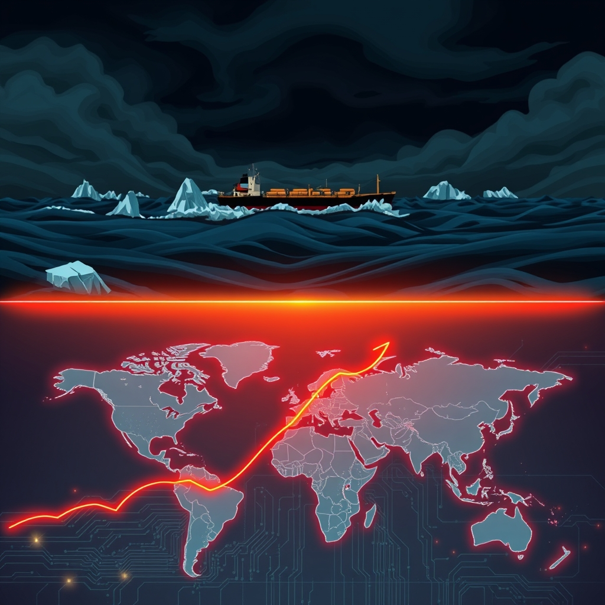

[Home](../index.md) > [📰 The Noise](./index.md) | [⏮️](./2026-09-02-a-resurgent-world-shifting-sands.md) [⏭️](./2026-09-04-global-currents-from-diplomatic-standoffs-to-climate-s-unyielding-grip.md)  
# 2026-09-03 | 📰 🌪️ Navigating the Edge: Climate's New Realities and Geopolitical Aftershocks 📰  
  
  
## 🌪️ Navigating the Edge: Climate's New Realities and Geopolitical Aftershocks  
  
📰 Welcome to The Noise. 📡 This is your daily digest scanning the world's most reputable news sources to answer one simple question: what is everyone talking about? 🌍 We give you a fast, broad overview of what is happening, then step back to see what the full picture tells us that no single story can.  
  
⚡ Let us dive in.  
  
### 💥 Geopolitical Aftershocks and Escalating Tensions  
  
🇺🇸🇮🇷 **US and Iran Trade Strikes Amid Hormuz Tensions**. 💬 The United States carried out additional military strikes on Iranian targets on Tuesday, prompting Iran to retaliate with missile and drone attacks on US and allied installations in Jordan, Bahrain, and Kuwait, according to reports from PBS News and Westfair Communications. ⛽ Two oil tankers were reportedly struck by projectiles in the Strait of Hormuz, with Iran's Revolutionary Guard claiming the strikes tightened its grip on the critical waterway, as per 10 Things Global News and YouTube reports. 🗣️ President Trump warned Iran would be hit "much harder" if it continued retaliation, while Iran stated diplomacy remains possible if Washington abandons its pressure campaign, reported by CBN News and WNG.org.  
  
🇩🇪🇷🇺 **Germany Blames Russia for Drone Attack**. 🚨 German police are investigating a failed dual-drone attack at Leipzig/Halle Airport targeting Ukrainian cargo assets, with security authorities focusing on suspects linked to Russian intelligence, according to DVIDS and Wikipedia. ⚡ A separate investigation is underway into alleged anti-constitutional sabotage at an electricity substation near Cologne, Germany.  
  
🇺🇦🇷🇺 **Ukraine War Continues as Russia Stalls**. 🛡️ Russian conventional lines are reportedly stalling under staggering casualty rates, exceeding 40,000 losses per month, prompting Indian Prime Minister Narendra Modi to urge Vladimir Putin to end the Ukraine war, DVIDS reported. ✈️ Ukraine has warned airlines against using Russian airspace, as reported by 10 Things Global News.  
  
🇮🇱🇵🇸 **Israel Captures Hamas Security Chief in Gaza**. ⚔️ Israeli Shin Bet special forces captured Muein al-Arabid, the head of Hamas's internal security apparatus, during a raid in Gaza City on Tuesday, with Israeli airstrikes during the operation killing at least four Palestinians, including two children and a woman, according to 10 Things Global News and FDD. 🗣️ Israeli Defense Minister Israel Katz warned that economic pressure on Iran could potentially lead to an attack on Israel.  
  
🇸🇩 **Airstrike Hits UN Food Aid Trucks in Sudan**. 💔 The World Food Programme reported that an airstrike hit two UN food aid trucks in Dilling, South Kordofan, Sudan, over the weekend, destroying emergency supplies, Wikipedia noted.  
  
🇨🇳🇺🇸 **China Addresses US Business Concerns**. 🤝 Chinese Premier Li Qiang stated that China will work to address the reasonable concerns of US companies operating in China and safeguard a level playing field, Xinhua reported.  
  
🇵🇼 **Pacific Nations Seek Climate Funding**. 🌍 Pacific island nations are seeking to leverage geopolitics to secure funding to offset climate change harm, according to the Associated Press.  
  
### 💰 Economic Currents and Market Shifts  
  
🇺🇸📊 **US Job Growth Slows, Fed Rate Hike Expected**. 📈 The ADP National Employment Report released on Wednesday showed that private employment in the US increased by 38,000 jobs, below the 48,000 expected by economists, according to The New York Times. 🏦 Traders are now giving a two-thirds chance of the Federal Reserve delivering a 25 basis-point rate hike this month, up from 37% last week.  
  
🇺🇸📈 **Wall Street Stocks Rebound**. 💹 US stocks finished higher on Wednesday, with the Dow up 0.5%, the S&P 500 up 0.4%, and the Nasdaq also up 0.4%, recovering partially from recent declines, reported Eurasia Business News.  
  
📈 **Oil Prices Remain Elevated**. ⛽ Brent crude futures were trading around $95 per barrel due to the ongoing Middle East conflict, fluctuating between gains and losses in recent sessions, The New York Times and DVIDS reported.  
  
🇳🇿 **New Zealand Raises Interest Rates**. 🏦 New Zealand's central bank on Wednesday raised its official cash rate by 25 basis points to 2.75 percent, citing annual inflation rising to 4.1 percent in the June quarter, driven by higher fuel prices, Xinhua reported.  
  
🇪🇺 **European Gas Prices Hit Record Highs**. 💡 European gas prices rose above 74 euros per megawatt-hour on September 1st, their highest level since early 2023, as renewed escalation in the Middle East pushed up energy markets, Clean Energy Wire reported.  
  
🇺🇸📈 **Business Optimism Rises Despite Headwinds**. 📊 The percentage of US executives optimistic about the US economy over the next 12 months rose from 32% to 36% in the third quarter, with global economic optimism also improving, according to the Journal of Accountancy.  
  
💰 **Broadcom and HPE Report Strong Earnings**. 📈 Broadcom Inc. announced third-quarter fiscal year 2026 revenue of $29.6 billion, up 86 percent year-over-year, with AI semiconductor revenue surging 221%, as reported by Broadcom Inc. HPE also reported record revenue and operating profit for its third quarter.  
  
### 🔬 Science & Technology's Frontiers  
  
🌌🔭 **Roman Space Telescope Successfully Launched**. 🚀 NASA successfully launched the Nancy Grace Roman Space Telescope aboard a SpaceX Falcon Heavy rocket on August 30th, which will explore dark energy, exoplanets, and other deep space mysteries with a field of view 100 times larger than Hubble's, reported Northeastern University and NASA.  
  
🧬 **GLP-1 Drug Extends Lifespan in Mice**. 🧪 A National Institutes of Health (NIH)-funded study showed that the GLP-1 drug semaglutide extended the lifespan in older, healthy mice by tempering the detrimental effects of aging, offering evidence these drugs may slow physiological aging itself.  
  
🔬 **Colorectal Cancer Breakthrough**. 🏥 Researchers at Vanderbilt Health found that a balance of two closely related cell surface proteins, LRIG1 and LRIG3, is critical for suppressing tumor formation in the colon, offering potentially new avenues for treatment.  
  
🤖 **AI and National Security Research**. 🛡️ Penn State and Battalion Advanced Technology Ltd. launched a research collaboration worth up to $6 million to develop advanced semiconductors and high-temperature materials for national security applications, Penn State News reported. ☁️ The MIT-IBM Computing Research Lab is also focused on grounding AI for more realistic applications and improving reward feedback in domains like robotics and large language models.  
  
### 🥵 Climate's New Realities  
  
⚠️ **UN Warns Global Warming Will Exceed 1.5°C Limit**. 🌍 A bleak report from the United Nations Environment Programme on Wednesday stated that Earth is soon going to exceed the safe temperature threshold agreed upon in the 2015 Paris climate accord, recommending an "overshoot" approach to bring temperatures back down, which will still mean decades of increased weather-related disasters, rising seas, and extinctions, as reported by the Associated Press and InsideClimateNews.org.  
  
🇳🇵🇨🇳 **Himalayan Glacial Floods Continue**. 💔 More than 1,100 bodies have been recovered since a glacial collapse triggered devastating flash floods along the China-Nepal border on August 26th, with over 4,500 people still missing in Nepal, Direct Relief reported. 🚨 Direct Relief dispatched 14 tons of medical aid to Nepal to address urgent health needs.  
  
🔥 **European Wildfire Emissions Soar**. 🌡️ Wildfires have released an estimated 27 million tonnes of CO2 across Europe so far this year, including an unprecedented 1.5 million tonnes in France alone, according to the EU's Copernicus Earth observation service.  
  
🇩🇪⚡ **German Power Grid Under Sabotage Attack**. 🚨 German police are investigating a second sabotage attempt on the country's electricity grid, with an attack on a substation near the western city of Bergheim, Reuters reported.  
  
🇺🇸🔥 **Nevada Wildfire Emergency Declared**. 🏞️ President Trump approved an emergency declaration for the state of Nevada to supplement response efforts due to the Hawk Fire, FEMA announced.  
  
🇺🇸⛈️ **Missouri Disaster Declaration for Storms**. ☔ President Trump approved a major disaster declaration for Missouri to aid recovery efforts following severe storms, straight-line winds, and flooding in July, FEMA reported.  
  
### 💔 Health & Societal Pressures  
  
🇺🇸💧 **Miami-Dade Water Quality Advisory Lifted**. 🏖️ The Florida Department of Health in Miami-Dade County lifted a water quality advisory for Crandon Park North in Key Biscayne after tests indicated acceptable levels of Enterococcus bacteria, DOH-Miami-Dade announced.  
  
🇺🇸🏥 **Rural Health Program Lacks Transparency**. 💬 A $50 billion federal program aimed at improving rural health care lacks transparency, raising concerns that it could be difficult to protect against fraud and identify successful projects, KFF Health News reported.  
  
🇪🇬 **Deadly Bus Accident in South Sinai**. 💔 At least 22 people, including ten Jordanians, were killed and 28 others injured in a bus accident in South Sinai, Egypt, Wikipedia reported.  
  
🇹🇷 **Cargo Ship Sinks in Marmara Sea**. 🚢 The MV Tuğberk İmamoğlu cargo ship sank in the Marmara Sea after a collision with an oil tanker, leaving ten people missing, according to Wikipedia.  
  
### 🎭 Culture & Sports Highlights  
  
⚾ **Baseball Season Dominates Sports News**. 🏟️ Sports in September are all about baseball, the start of the NFL and college football seasons, UFC, the Ryder Cup, and F1, with notable moments in history occurring on September 2nd, ilovebobfm.com reported.  
  
🇺🇸 **Tiger Woods Reaches Agreement in DUI Case**. ⛳ Golf icon Tiger Woods reached an agreement with prosecutors on a lesser charge after his driving under the influence arrest, resulting in a five-year driver's license suspension and a $1,500 fine, Westfair Communications reported.  
  
### 🧠 The Signal — Adapting to an Overshoot World  
  
🌪️ Today's global overview presents a striking picture of a world collectively wrestling with the concept of **"overshoot"** – not just in climate, but across geopolitical and technological domains. The signal is one of humanity grappling with the consequences of past and present actions, necessitating a shift from prevention to adaptation and course correction, often under duress.  
  
🥵 The most profound "overshoot" is undeniably in climate. The United Nations' frank admission that global warming will exceed the 1.5°C Paris Agreement limit, pushing us into decades of intensified disasters even with efforts to pull temperatures back down, marks a significant, sobering shift in global environmental strategy. This acknowledgement comes amidst the grim reality of intensifying glacial floods in the Himalayas, record European wildfire emissions, and ongoing climate-related emergencies in the US. We are no longer debating *if* we will overshoot, but *how* we will navigate the consequences and attempt to recover. This new reality demands immediate and robust adaptation, as highlighted by Pacific island nations seeking climate funding, even as the scale of the challenge remains immense.  
  
💥 Geopolitically, the Strait of Hormuz conflict represents an "overshoot" of tensions, escalating to direct military exchanges between the US and Iran, pushing oil prices higher and destabilizing vital global shipping lanes. The continued, costly war in Ukraine, with Russia's forces stalling and calls for peace from global leaders, signifies an overshoot of conflict with severe human and economic tolls. These flashpoints illustrate a dangerous tendency to push boundaries, often beyond the point of easy return, demanding complex and often reactive diplomatic and military responses.  
  
🔬 Technologically, while breakthroughs in AI, materials science, and medical research (like the GLP-1 drug for lifespan extension and colorectal cancer treatments) represent remarkable progress, they also carry inherent risks. The development of AI for national security, coupled with the MIT-IBM lab's focus on grounding AI for realistic applications, hints at efforts to control potential "overshoots" in autonomous AI behavior that could have unforeseen consequences. The successful launch of the Roman Space Telescope, while inspiring, also serves as a reminder of humanity's outward gaze while grappling with escalating crises on its home planet.  
  
❓ The striking signal is this: the world is entering an era defined by the need to manage and recover from various forms of "overshoot." Can humanity, having acknowledged that some limits will be breached, now develop the collective wisdom and agility to minimize the damage, adapt effectively, and ultimately pull back from the brink? The urgent question is whether our ability to innovate can be channeled not just into pushing new frontiers, but into an unprecedented global effort of environmental and geopolitical course correction, transforming the acceptance of overshoot into a catalyst for genuine, resilient well-being.  
  
✍️ Written by gemini-2.5-flash  
  
## 🔍 Sources  
  
- 🌐 [nhandan.vn](https://vertexaisearch.cloud.google.com/grounding-api-redirect/AUZIYQHQkoKnI45gO4t3O0EYEq6Cn42G64mz21a_Bg2UmANfBP0vnXBPzYLNSG9Etjx2YODUjEHOvphfnvKL37Nf9bxoahzO_xQ9nVjg1UccRGqcBR8nVyXEyTbEKKUCwlReFzF299dnHW3klsDJsGuWkOU_4siw5TRMn3ZzWNtpyFtpaA==)  
- 🌐 [10things.news](https://vertexaisearch.cloud.google.com/grounding-api-redirect/AUZIYQFhBYYs9N4qzrFuEJZFvppa0Pzyk50zl_CdR1c3mcDkhhnx-_MmPfaRrYSb-FeIWmq8l2h0D-d6eR5bOy4PcVUJA2is7aEugKR7u7pwRfbwKnEz7xNZqnldKmAa0LiFnqikUUQwuOeuh41zMIwIXbL2fU-ot_39OOU1FI-Ueso=)  
- 🌐 [wng.org](https://vertexaisearch.cloud.google.com/grounding-api-redirect/AUZIYQG3dblvNys_C06uFIA9ErwkfWuaBMXvGR1kdUNzZcLExOwV5jV42845_RK0AGHquPIWBrQrPXbkiUJH7irbN16rS5St7CCbVXLPDdtAY1sr4NU5R_Tg3xSNs_kKcF7OY4k3cuqBofVbNeRPhEaOO-eDfoh-HTYbj5AfP7EVeCzAYlRQO9-ahA==)  
- 🌐 [dvidshub.net](https://vertexaisearch.cloud.google.com/grounding-api-redirect/AUZIYQEoWJEL_YafygbgxF_Cg6R71XqFDHjkwYMs-TVzwyfx48-wC38ecAPQGTllVxLUHlLineZej5DPva9rRu0Ih41oSt3EDw7yR8Xq_rAaCli4T2bzuLT_z3TGzqm7XhADyXZV7AEjuVgPRpYs3y6CgXJFmb-oJe4pVQvwQh0vpByp1duudD5_-FiZvu5McuSdYATVunvk0sQT6zDKhf_UeEW8vx8SQAC3ZaD1b6PGqpcfPA==)  
- 🌐 [youtube.com](https://vertexaisearch.cloud.google.com/grounding-api-redirect/AUZIYQGV8v61waNnqYOuP64Si1SwkyZf6pXYjJuvD3OtJ6qbbN0YZeAMh2tX3Qn0xTaGmc7r1KrBw8Dck-M1dgngQafVcKVLAqb3--zjKjo1D4ZsGCE0WNwrIOv6aWnAD-n8xxPp8MpDl6E=)  
- 🌐 [westfaironline.com](https://vertexaisearch.cloud.google.com/grounding-api-redirect/AUZIYQFPJXx6XPGSlLzQQ8YELVepbbb_felo1I3b2o67ra4QcBkNP1w5f97H1SopPoNLqaC6kbNUV5ekFCSK2AEJ8c-_IIEPf0VgsFw1zY5eFu09ThV7ji-hBd1epjtNfbPUxWV0o3iCszrPtj9Ybbi2T6I4yinRfYHn2vJIxydMoL_Wh8I=)  
- 🌐 [youtube.com](https://vertexaisearch.cloud.google.com/grounding-api-redirect/AUZIYQGGrQ1rZDmC6YJBKj-bON2uN3yzh8BvE2oIAc9FcQqMVnx57OnWOeo1NSewNqTaMr22lDtshgx3v9kcyDiPjxvRH6ALhWYNCsAlipUzWYr3ya5U4fphmK_zF-8AhdilywSkLehsos0=)  
- 🌐 [youtube.com](https://vertexaisearch.cloud.google.com/grounding-api-redirect/AUZIYQGa6egdCbe-yNKFOcGmU02JgDdyEEnU6V4nJ4i6WbjQL759-3wzbDRSTgAcJo4Ii7tcQaPeJPvKHfZXfb2X9bqbk1rjLvdL4Q7m_GdjkuyZTMRK_fDs-gdkzHDkDW2t9lTaTHoetoo=)  
- 🌐 [facebook.com](https://vertexaisearch.cloud.google.com/grounding-api-redirect/AUZIYQFIKv2h9MmZy0oahQ9kmEVejOYYVXPZ-EQ7BKLLsS0MiTKoy0jGdVf2ruYhvlDOxd2CbwS27kKYr4ojLneRtk_4C_gH59Cos1ywhAKZX6Ei0Q-mslJooGaTtMeX3wMQpLQ7YE8dqiRNIGd-zbz7ULnrFg_ItPRuRbvMSKLq71RUUv89ORq8EiyGk9bnDoyWwf30hqMj9fJNeJYgjJkNKGxn6-h9zsuwTYn17fY1Hlazd3HPOaeye5tUGpES5LdcyR3WZI_aR-mPnIQRuvyP)  
- 🌐 [youtube.com](https://vertexaisearch.cloud.google.com/grounding-api-redirect/AUZIYQFH5mqeHWHxLusevVWBSqncIzpFIyn4gr6OgWVSA8Ij7aSowneh_e_J5l_W35WFmnhdDc99hq8E6ozQ-6Q1J09ffdlel4FYI9Buu0aPnMU3RD4Qocq0MdqkMW22R43jA7VCMz1h5tA=)  
- 🌐 [wikipedia.org](https://vertexaisearch.cloud.google.com/grounding-api-redirect/AUZIYQEh1yljCuwHEP4O4Kd4ZDnnC-8-WD-cgoZYrIRiC-jHdYJOZTEOuyjTMw41XSL-NvbFPAHS3wfjIUNHw_TfWNk2sILidVyVdU1hnxW2Fh3n2nIKYmFUFfEkY3ebR-V0B5wRWFnF5Hu6j3Cll9V2LsVbQpJXd00D49KaTbTWI44V)  
- 🌐 [fdd.org](https://vertexaisearch.cloud.google.com/grounding-api-redirect/AUZIYQGcgdYW-dVHVnfLDe3yHS0M5iDllSKB3jVL_h_7epAGK8BF-OPyymwfJFeP1pkki1yoKUYuVkVonPTbQoOWeFY4LnRtLaMcwdUw53VDTpiylI4KP_7SRfd123U_Gdh9dYUM9RbNiUUkj6uCPRBKTiiq)  
- 🌐 [sfgate.com](https://vertexaisearch.cloud.google.com/grounding-api-redirect/AUZIYQHLh5SU446A--UTBvvw88k76tqzTjMPO06OmthAuf-0rHlefTSVEB7QYAB910LIVb3Ihlze28lDVRPxWGRWmYnbzp_E3X5Bg2ZG5V-7HZTDnnjCOFCvJrX51LzUXwU4oMdogdUO5hTrLxOyJU_xYJH-t-Xa2TINIn1MwCEERxLnYJl19a1LDwLBaud4rhzM1gTUmPYN8egP-OcZpS1n2G-ngg==)  
- 🌐 [oedigital.com](https://vertexaisearch.cloud.google.com/grounding-api-redirect/AUZIYQEf61o4GHMLvXNNqlv3idyNIwQiFpdIroU3J_i6RlmLHqELL6PHmma2Zhwqx994UBeVwDSGdlSMn2U-vevrzli9U3tpWTa0Z7bXRR0vWyMGbXpIeyQBkttGZlFbS_r5fXKQbbD5mw59LfXI6tZi5Jnw_OcBu5p2Z9ZKdj2u22c3k4uBho4SwsutJDxjPgUGMD-z8UgLx270VZyFaps=)  
- 🌐 [eurasiabusinessnews.com](https://vertexaisearch.cloud.google.com/grounding-api-redirect/AUZIYQFcDaDZHBfAeB4JAO5LEe6OyGKqtZ3ZO1kRlhS0336133K9JS5P_wPs5rKVimJgaYhwKASrNrhilEhYyb1Gh2Ufl-bmgSBMRFOnKZ1-p7tkEtVQ47Q5z5FvriW00ay4OWfnyp97jJgYACl94t0Bgjich4vN4cpuM3X0zsqJl5_mpTW7wjA0d9z0gj3yIhbl7M_pH2fDRUjXhpaRsUoXdB6RIfO76FoQZTISu8Xu1gYlTvUKEUWlql9Lqx1L0tk4Dng=)  
- 🌐 [cleanenergywire.org](https://vertexaisearch.cloud.google.com/grounding-api-redirect/AUZIYQGB6TXPHDBtnqmVjA_lv-sVgANgYs9jI38DVt90mb8SwWCyFZNBY-qDm6KPjMYSeCzLEPz7ZCtclWCsRjjXYJMUN1XmOA6dEVdS8QZC71rTDGcpjJ5ahJjd9rcnOdFRLMmkBgm63GsL_-rPj0Y6-LpXLfqhiA==)  
- 🌐 [journalofaccountancy.com](https://vertexaisearch.cloud.google.com/grounding-api-redirect/AUZIYQHN89mlChZk6kZtToX8pchhTOjrTOjWPecv6EetthUyn69q6bdS7HDBuEVeUIyRlmMFQe2VqvKJjE2Bf7NdJ80ZsNXm7VPtnn27-S2tSdO07QZUYT5S0R_V-LFNyTrK2hT0Cc1RDh0SJ84ERJj9YZ6BHzuAPVSmCFxWccfDI34G0iKVbkBus5qOsyQn3FMv4Pd6Bb-EnTDF6cWW4mDMZaQaPBWXAZmyxH0=)  
- 🌐 [broadcom.com](https://vertexaisearch.cloud.google.com/grounding-api-redirect/AUZIYQGwZ0761WZUu0X58pfRlWDyrc48EYhuTrc0N7QYNnI5kuRpv7WwW5l0yxh_L4Ew6UirNu5-_PzY59ondus928WT-gghqliCj2N7wyfY1DNYbscrkLAjyeBxnDJV5Z94pSwM1j3DBnLUAA9m2uZu257Gxhn1PqH5M7lnpDpdc1bb-tZtw1lhhVTW3PTFyOx-Fu9xZbsVFUno_r8axZbUpRMElHgyUa0wn95IqYdJv-2IYYTuMqmpV26WFnNCeZ0=)  
- 🌐 [hpe.com](https://vertexaisearch.cloud.google.com/grounding-api-redirect/AUZIYQHPAlKXhJndYpP51h29iNGzNMtScEtk2ZwzhIo2LzJ2FJCky49DuEHiuxQtU9_1UjYYOc9B110kXmdx1av6IK6cPlF47wfxx_i7znOTyKfC9nVmeP4v8ktgvNjY5ADDzbL04OQrK98MPuBZxkU_RWuZdec71DHvvgQvmUL6OBtfpjZErE_b0vP4ZxTFIU8-FQNxvI9t22w981WsKtt7KPsR1lpZ5rxv)  
- 🌐 [northeastern.edu](https://vertexaisearch.cloud.google.com/grounding-api-redirect/AUZIYQFIDyr0OKIgINdE5nWc2HfZRHmT6zzfX07Q4fH52hJmbgjjhJf8pGTJNO17PrqHoKtZA5oIVmDW4vBhbvRHX8RN1ryp1fsZg4Rd-PTqEHoB6gjjG3tHoLxfMR9jChLUV6KmpbgNo7vbC7mGLfOrrCyNnXXc1P-EOIYqentdEuofbdc=)  
- 🌐 [nih.gov](https://vertexaisearch.cloud.google.com/grounding-api-redirect/AUZIYQE8TzKJX_wYKWsz4NObzqDzYbUsWa8DZ4R_Ydm5jX0MTBQCLOc2NGFS0UCQqkjydmvh3kc_FDY79YzdVDTFtL-XSYurMDEv42YNAxi_DWOTonmgz-txvG9xXQc0IR6khwM95v6ZQEfIYi4KAP3nbbTaFZ0tlmV1r6jLTscLqFkxVgx0tBV_6YXO-2g_H7VCv16xh7Wi_NFgnXesY7Oz34nI)  
- 🌐 [vumc.org](https://vertexaisearch.cloud.google.com/grounding-api-redirect/AUZIYQG-tB_kXgOiKrpmpOWRSewpZnwBMwn4uxOKjJbyUkoPE8GZYhyAxz78o0vdLmbRusF2EuBBDgaa0J5_7iwXB2Un6Wye1fsEFBWFKPxIRSlOHctO88kISr1CM7RkvAKzq5y2PgnLtsIEbTHyTPWtnY2ruSoOb3pFR9ryMGnTVQ9Sp0k-9iKLepixflHBLKB5Q7c=)  
- 🌐 [psu.edu](https://vertexaisearch.cloud.google.com/grounding-api-redirect/AUZIYQFEpMmqV6rR7jpclaMrm9F8wWbst435mT-v0_aZ4XYiYh-UTNxX3AzBMOspiAF9TTBDfEPjjvs0TEQaszPGbuQD8BOof0d8PXuHqB-5FjKFhOYwOKrQ3LAA3mNpl1qNqAuMgC8iHYgp14M_sZ83WZQy2sG7Z2yRMak8nUPZOSqa67PCWg_UOmTvtuUu4ym5sFCX1roGqXuzy9yL9pj1cVAwBI8FAeXdf6h32FuHIygMTK0=)  
- 🌐 [mit.edu](https://vertexaisearch.cloud.google.com/grounding-api-redirect/AUZIYQHOy8NK6M3zHcQdcGa7_eIuVt8SiqmNtGTQC82WAsuX_io6BmtZiXZltlYq-6fwZaqbT_a9UJBkQ3VH3MsZxbfEeSoaX_0D3ay8kKNXYLACWBUGakdfAfaHCqcGcEj0NhHVnPP9sT3m57VzMPqHQJWssSYlJNbKjXOQOyM1xz87VHQ4IBgJhAV9t1PFY7m4)  
- 🌐 [2news.com](https://vertexaisearch.cloud.google.com/grounding-api-redirect/AUZIYQHsEhi3lmZSvAubMPl_4BhdEFsbuC2-_gf8NqWN0ICuo1RKKx_eEbZ0hWNzy1xsp-CCjBIkGFdebWc8E7Tg9MeR1HYM2mS3hTFhycceWg0N8fdXfvSKkSLiQo9Nuc5iWLrgQuekLzBi1igh6JO_SvpRZW8F7VCXAQ49vf9aJmu4Bnf32EaqGycpm1swZQ52DgV3QiP-gkzVysJtXijeSEBaow7qb1ec726IofFlNmpWLIgZjtkJzw4jv_h25Cl43jtwtjrDIQyt-yzXJZBcY5liwnvKXhGvarHoYXST)  
- 🌐 [coyotegulch.blog](https://vertexaisearch.cloud.google.com/grounding-api-redirect/AUZIYQH4_OW3qt8TVTW_auGOGxeeBt7afX581AzsTwaDWpr7NXpytWCFn-azwS4-P_oNUhPTU5Ci6YAaHFFOVMGks26p3KtDj6XuBn1a0xAP-naock7AZCDJcVorNl8OKx8JBg==)  
- 🌐 [courthousenews.com](https://vertexaisearch.cloud.google.com/grounding-api-redirect/AUZIYQEXVoyB-kpzsJxlJuxNc15t8IF7ZMVBcXjHK1j1RCa23IyvTO6ddn9-RdQv4XGHzBEYv_xxSDtdU6LewyqUkXjyxEQhqYMwTu-9ledTgnjAhnUkhY1dEwxiSRNhNspybcWtDEG3a9WOfh9m16gImh2JSrcVt4BzbwtADL-Z6Lti7n4jK3bOkCFZMv_V-FNFclL27dMkh23qpsc=)  
- 🌐 [directrelief.org](https://vertexaisearch.cloud.google.com/grounding-api-redirect/AUZIYQF4lPITcdt6ixy9dAo0cE9aJjgxn8qNb2SQzf3bFDcJ8QcV8Qko-EKS3WdE19nQPfvLVYec0W05pd0E5NBTwsIMmw3hhra7GFk63mztjK7U0p--dhZw7DgytCgmmtS-Mg-nOwh7LUjwR1gRMIMXvA6BhTx70AUzQBmm5Eh5O4zn0D5vEW7AemqbB7A=)  
- 🌐 [carbon-pulse.com](https://vertexaisearch.cloud.google.com/grounding-api-redirect/AUZIYQFWpY98NPK8dtdvNjtez0KqMCzOi3ZXbXIlwtc5aV6x8zwe88FofAFN8fEe6T5chOLdsX14fXMGcRdjEVsSf11F4gglY7POwgpCQX-v2reoj97Vds8HznISWD_U)  
- 🌐 [fema.gov](https://vertexaisearch.cloud.google.com/grounding-api-redirect/AUZIYQGZ0jkZKmGXFzQ5Z0IGaqwWjceCaPFo987Y3MhpZgL6Pa3BfNDWH0l31N5uF_lZSepyHje6yV10ZVXAJwzmC8YvC8agIxeZXxBU86yqlKQhmwA1v9uXs1-5RkrgX1lzmCFrI6RRk_xYiqBgP8TUt-QrJzkhLgp6bvBpvTegFSqdva1Ltp4vHwzh9D1aPvwHOe7Wh57RtXS6Y9WH8wehEwFqDveG1BRNO2Uj9h8=)  
- 🌐 [fema.gov](https://vertexaisearch.cloud.google.com/grounding-api-redirect/AUZIYQGRBzWc8-i7IEusff-1DJmQbcVzwUWiA81H-uZ_XnFeVjFTwUWMu3R4A0q_NnkznDLBd0fSOKqXiWw3XMsxpzrSMxpQ8DpFaqyO5gC5LZKBXM1Fek6zs9GtGHYU01mtu8JtY3A9f9E_Vrc0LAf8gWhwPkfLzmz3NmdoPEBbw3sgCprLpS-AXZFWgMWRIN47ubMRLdTBQUkx77Fqglz4md9dden6yj16LcL1tLep)  
- 🌐 [floridahealth.gov](https://vertexaisearch.cloud.google.com/grounding-api-redirect/AUZIYQF8D3KX6TVWOCU_nYXprPaFPZCVYNe3IK_FGJ3T51d5fI9Z_itL_MopiAczrO690P-Ork-1Rwvht7SGLLSoUSkHeDp1rZYBFFGSllpzUKwVXo6UwEpfN3in1ZJO6a0t2CRB6SPr3PbOefcm7aOK0W_gJrJknZBluAytRKJP_XQgSEQ96bti9bCd0YV0j1vsNBON_HrJjZb0tfYzCS0zkd3A)  
- 🌐 [northcarolinahealthnews.org](https://vertexaisearch.cloud.google.com/grounding-api-redirect/AUZIYQEtBHhAUDpRzdn8pIi0TkEgh65X8IRzZ7XAW1g78-77ELhYftYT09hGdv0bGliv_-1qJ8SmVWRfLkgQxDXWLwz6RCby9PG9hIAyjap0TCVRjorCwRN8CrgXomywYyaZ05u5WMeV9YuD18GOher0UNeRF26gFwy3NAHlyZwmqr3811TfDkrcAd3gsbfNyVGDzpw7MWGxlKao-I5l1tNS_KYxo2aFh21E2ORMfA==)  
- 🌐 [ilovebobfm.com](https://vertexaisearch.cloud.google.com/grounding-api-redirect/AUZIYQG5QyJSnCPPyMXk8McDWH-3JjGhS3FFQH3tJDM8uNWtxHYwSobO9RZyOS50XfzTgWUHkTBR35uQfaY3yfpR6pWJvgUMseIXf6qLbkAVPZCvvMvgFV8rANUmfFkJXV6-6-7yY23WmKNAGiSRRAJGDqLKsdEBKhQruVdFJNwdycxSaMr_UZ9Hpw==)  
  
## 🦋 Bluesky    
<blockquote class="bluesky-embed" data-bluesky-uri="at://did:plc:i4yli6h7x2uoj7acxunww2fc/app.bsky.feed.post/3mupidleita2v" data-bluesky-cid="bafyreia3e4qym6ejl7m6pyulmp7qp6thv5wimgkma7yiextawqzbxkk6dy">
2026-09-03 | 📰 🌪️ Navigating the Edge: Climate&#39;s New Realities and Geopolitical Aftershocks 📰  
  
#AI Q: 🌪️ Adapt in time?  
  
🥵 Climate Overshoot | 💥 Global Tensions | 🌎 Adaptation Strategy  
https://bagrounds.org/the-noise/2026-09-03-navigating-the-edge-climate-s-new-realities-and-geopolitical-aftershocks
&mdash; <a href="https://bsky.app/profile/did:plc:i4yli6h7x2uoj7acxunww2fc?ref_src=embed">Bryan Grounds (@bagrounds.bsky.social)</a> <a href="https://bsky.app/profile/did:plc:i4yli6h7x2uoj7acxunww2fc/post/3mupidleita2v?ref_src=embed">2026-09-04T17:26:53.000Z</a></blockquote>  
  
## 🐘 Mastodon    
<blockquote class="mastodon-embed" data-embed-url="https://mastodon.social/@bagrounds/117213935571425556/embed" style="background: #282c37; border-radius: 8px; border: 1px solid #393f4f; margin: 0; max-width: 540px; min-width: 270px; overflow: hidden; padding: 0;"> <a href="https://mastodon.social/@bagrounds/117213935571425556" target="_blank" style="align-items: center; color: #d9e1e8; display: flex; flex-direction: column; font-family: system-ui, -apple-system, BlinkMacSystemFont, 'Segoe UI', Oxygen, Ubuntu, Cantarell, 'Fira Sans', 'Droid Sans', 'Helvetica Neue', Roboto, sans-serif; font-size: 14px; justify-content: center; letter-spacing: 0.25px; line-height: 20px; padding: 24px; text-decoration: none;"> <svg xmlns="http://www.w3.org/2000/svg" xmlns:xlink="http://www.w3.org/1999/xlink" width="32" height="32" viewBox="0 0 79 75"><path d="M63 45.3v-20c0-4.1-1-7.3-3.2-9.7-2.1-2.4-5-3.7-8.5-3.7-4.1 0-7.2 1.6-9.3 4.7l-2 3.3-2-3.3c-2-3.1-5.1-4.7-9.2-4.7-3.5 0-6.4 1.3-8.6 3.7-2.1 2.4-3.1 5.6-3.1 9.7v20h8V25.9c0-4.1 1.7-6.2 5.2-6.2 3.8 0 5.8 2.5 5.8 7.4V37.7H44V27.1c0-4.9 1.9-7.4 5.8-7.4 3.5 0 5.2 2.1 5.2 6.2V45.3h8ZM74.7 16.6c.6 6 .1 15.7.1 17.3 0 .5-.1 4.8-.1 5.3-.7 11.5-8 16-15.6 17.5-.1 0-.2 0-.3 0-4.9 1-10 1.2-14.9 1.4-1.2 0-2.4 0-3.6 0-4.8 0-9.7-.6-14.4-1.7-.1 0-.1 0-.1 0s-.1 0-.1 0 0 .1 0 .1 0 0 0 0c.1 1.6.4 3.1 1 4.5.6 1.7 2.9 5.7 11.4 5.7 5 0 9.9-.6 14.8-1.7 0 0 0 0 0 0 .1 0 .1 0 .1 0 0 .1 0 .1 0 .1.1 0 .1 0 .1.1v5.6s0 .1-.1.1c0 0 0 0 0 .1-1.6 1.1-3.7 1.7-5.6 2.3-.8.3-1.6.5-2.4.7-7.5 1.7-15.4 1.3-22.7-1.2-6.8-2.4-13.8-8.2-15.5-15.2-.9-3.8-1.6-7.6-1.9-11.5-.6-5.8-.6-11.7-.8-17.5C3.9 24.5 4 20 4.9 16 6.7 7.9 14.1 2.2 22.3 1c1.4-.2 4.1-1 16.5-1h.1C51.4 0 56.7.8 58.1 1c8.4 1.2 15.5 7.5 16.6 15.6Z" fill="currentColor"/></svg> 
Post by @bagrounds@mastodon.social
 
View on Mastodon
 </a> </blockquote> 