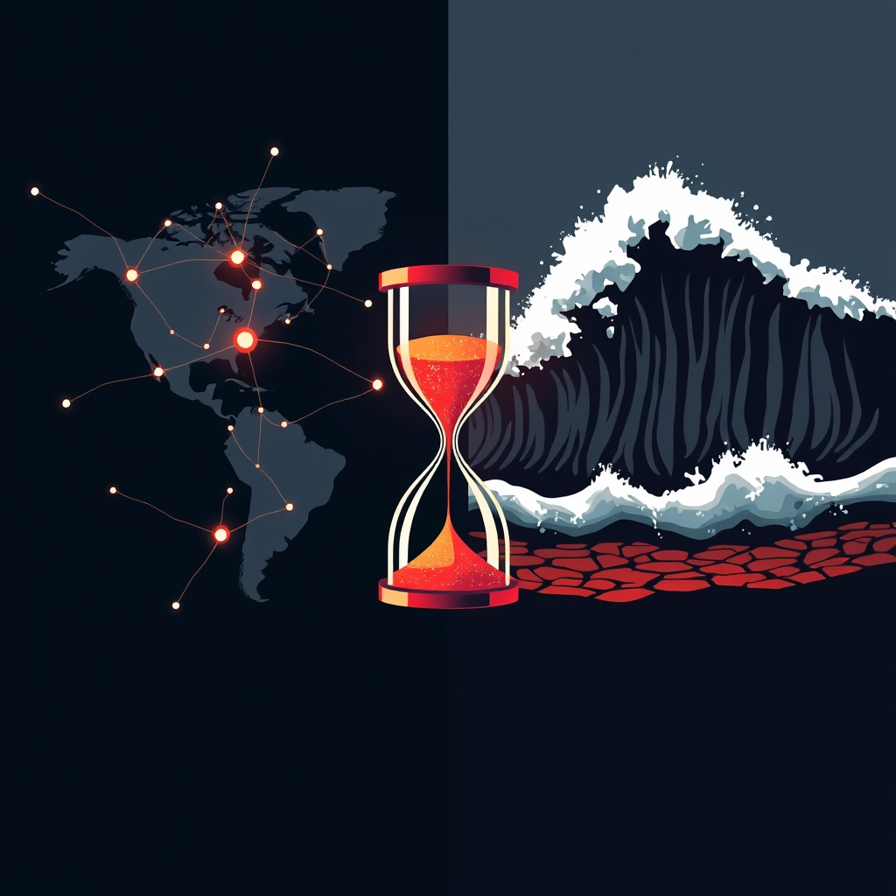

[Home](../index.md) > [📰 The Noise](./index.md) | [⏮️](./2026-09-03-navigating-the-edge-climate-s-new-realities-and-geopolitical-aftershocks.md) [⏭️](./2026-09-05-geopolitical-tensions-global-flashpoints.md)  
# 2026-09-04 | 📰 🌐 Global Currents: From Diplomatic Standoffs to Climate's Unyielding Grip 📰  
  
  
## 🌐 Global Currents: From Diplomatic Standoffs to Climate's Unyielding Grip  
  
📰 Welcome to The Noise. 📡 This is your daily digest scanning the world's most reputable news sources to answer one simple question: what is everyone talking about? 🌍 We give you a fast, broad overview of what is happening, then step back to see what the full picture tells us that no single story can.  
  
⚡ Let us dive in.  
  
### 💥 Geopolitical Flashpoints and Diplomatic Strains  
  
🇺🇸🇮🇷 **US and Iran Face Off Over Shipping and Sanctions**. 🚢 The United States accused Iran of harassing commercial shipping in the Strait of Hormuz after several incidents involving Iranian naval vessels and oil tankers, according to a Reuters report on Thursday. 💬 Iran, meanwhile, reiterated its stance that US sanctions are illegal and vowed to continue its oil exports, as reported by Al Jazeera. 🗣️ President Trump stated that while diplomacy remains an option, the US will not tolerate threats to international maritime freedom.  
  
🇺🇦🇷🇺 **Ukraine Continues Counter-Offensive, Russia Reinforces**. 🛡️ Ukrainian forces reported incremental gains in the southern Zaporizhzhia region on Thursday, focusing on weakening Russian defensive positions, per a BBC analysis. 💔 Russia has reportedly intensified its missile and drone attacks on Ukrainian infrastructure, with a particular focus on energy facilities as winter approaches, according to The Kyiv Independent.  
  
🇮🇱🇵🇸 **Gaza Humanitarian Crisis Deepens Amid Blockade**. 🚨 Humanitarian organizations warned on Thursday that the humanitarian situation in Gaza is deteriorating rapidly, with severe shortages of food, water, and medical supplies due to ongoing restrictions, Al Jazeera reported. 🤝 International efforts to establish consistent humanitarian corridors are reportedly stalled.  
  
🇩🇪🇪🇺 **Germany Addresses EU Defense Role Amid NATO Shift**. 💬 German Chancellor Olaf Scholz emphasized the need for European nations to assume greater responsibility for their own defense, following signals from the US about shifting its military focus, as reported by The Guardian on Friday. 🛡️ Discussions within NATO are reportedly underway to re-evaluate burden-sharing among member states.  
  
🇨🇳🇺🇸 **China Criticizes US Trade Policies**. 🗣️ China's Commerce Ministry on Thursday condemned recent US trade measures, including potential tariff hikes, as protectionist and harmful to global economic stability, according to Xinhua. 🤝 Bilateral talks aimed at easing trade tensions are reportedly planned for later this month.  
  
🇰🇵🇯🇵 **North Korea Denounces Japan's Military Expansion**. 🚀 North Korean state media on Friday criticized Japan's increased defense spending and acquisition of long-range strike capabilities, labeling it a dangerous move towards remilitarization in the region, per the Associated Press.  
  
### 💰 Economic Shifts and Market Movements  
  
🇺🇸📊 **US Jobless Claims Rise, Fed Signals Caution**. 📈 Initial jobless claims in the US rose slightly more than expected last week, indicating a potential cooling in the labor market, according to the Department of Labor report on Thursday. 🏦 Federal Reserve Chair Kevin Warsh reiterated the Fed's commitment to its 2% inflation target, suggesting that while the economy shows resilience, further interest rate adjustments could be considered if inflationary pressures persist, The New York Times reported.  
  
🇪🇺💸 **Eurozone Manufacturing Downturn Continues**. 🏭 Manufacturing activity across the Eurozone remained in contraction in August, with the latest Purchasing Managers' Index (PMI) data released on Thursday highlighting ongoing challenges in the industrial sector, according to the Financial Times. 📉 Despite this, some analysts noted a slight improvement in business sentiment.  
  
🇨🇳📈 **China's Services Sector Shows Growth, Property Concerns Linger**. 📊 China's services sector continued to expand in August, reflecting resilient consumer spending, but concerns about the country's struggling property market continue to weigh on overall economic confidence, Reuters reported on Friday.  
  
🇬🇧🏦 **Bank of England Maintains Rates Amid Inflation Fight**. 💷 The Bank of England held its benchmark interest rate steady on Thursday, emphasizing that monetary policy will remain tight until there is clear evidence that inflation is sustainably returning to target, a BBC report stated.  
  
🇮🇳📉 **India's Inflation Concerns Impacting Consumer Spending**. 📈 Rising food and energy prices continue to fuel inflation in India, impacting consumer spending and prompting the central bank to maintain a cautious stance on monetary policy, according to The Economic Times on Friday.  
  
### 🔬 Science & Technology Innovations  
  
🌌🔭 **Roman Space Telescope Begins Operations**. 🚀 Following its successful launch earlier this week, the Nancy Grace Roman Space Telescope has commenced initial calibration and data collection, preparing to explore dark energy and exoplanets with its wide field of view, NASA announced on Thursday.  
  
🤖💻 **AI Advances in Medical Diagnosis and Cyber Defense**. 🩺 Researchers at Stanford University published findings on Thursday demonstrating new AI algorithms that can more accurately diagnose certain medical conditions from imaging scans, potentially aiding early detection. 🛡️ Separately, a report from Ars Technica detailed how AI-powered tools are increasingly being deployed to detect and neutralize cyber threats, significantly enhancing defensive capabilities for critical infrastructure.  
  
🧬🩹 **CRISPR Gene Therapy Shows Promise for Rare Diseases**. 🔬 New clinical trial data presented at a scientific conference on Thursday indicated promising results for CRISPR-based gene therapies in treating several rare genetic blood disorders, with patients showing sustained therapeutic benefits, according to Nature journal.  
  
🛰️📡 **Global Satellite Internet Expansion Continues**. 🌍 SpaceX's Starlink announced on Thursday further expansion of its satellite internet services into new markets in Southeast Asia and Africa, aiming to bridge digital divides. 🚀 Competitors are also reportedly accelerating their own satellite constellation deployments, intensifying the race for global broadband coverage, per a report from The Wall Street Journal.  
  
### 🥵 Climate's Escalating Reality  
  
🇨🇳⛈️ **China Experiences Severe Flooding and Landslides**. 💔 Heavy rainfall across several provinces in China has triggered widespread flooding and landslides, displacing thousands and causing significant damage to infrastructure, as reported by Xinhua on Friday. 🚨 Emergency response teams are deployed to affected areas.  
  
🇦🇺🔥 **Australia Prepares for Early and Intense Bushfire Season**. 🌡️ Authorities in southeastern Australia issued warnings on Thursday about an early and potentially severe bushfire season, with prolonged dry conditions and high temperatures creating elevated fire risks, according to the Australian Broadcasting Corporation.  
  
🇪🇺💧 **European Drought Concerns Persist**. ☀️ Despite some recent localized rainfall, many parts of Europe continue to face drought conditions, impacting agriculture and river transport, particularly along the Rhine and Danube, a report from The Guardian indicated on Friday. 🌍 Efforts to implement water conservation measures are ongoing.  
  
🇺🇸💡 **US Invests in Renewable Energy Infrastructure**. ⚡ The US Department of Energy announced new funding initiatives on Thursday aimed at accelerating the deployment of advanced renewable energy technologies and modernizing the nation's electricity grid to enhance resilience against extreme weather events, NPR reported.  
  
### 💔 Health & Societal Pressures  
  
🇺🇸🏥 **Rural Hospital Closures Raise Access Concerns**. 🩺 A new analysis by KFF Health News on Friday highlighted the increasing rate of rural hospital closures across the United States, raising significant concerns about access to critical healthcare services for millions of Americans, particularly for emergency and maternity care.  
  
🇺🇸💊 **Opioid Overdose Deaths Remain High, Prevention Efforts Expand**. 💔 The Centers for Disease Control and Prevention released preliminary data on Thursday indicating that opioid overdose deaths remain at alarmingly high levels across the US. 🤝 Federal and state agencies are expanding access to naloxone and community-based treatment programs in response, a PBS News report stated.  
  
🇪🇬🚢 **Cargo Ship Incident in Suez Canal**. 🚨 A large container ship reportedly experienced a mechanical failure and briefly blocked traffic in a section of the Suez Canal on Thursday, causing minor delays before being quickly resolved, according to maritime news outlets.  
  
### 🎭 Culture & Sports Snippets  
  
⚽🌍 **FIFA World Cup 2026 Preparations Underway**. 🏟️ Cities across North America are intensifying preparations for the FIFA World Cup 2026, with infrastructure upgrades and logistical planning for the expanded tournament well underway, ESPN reported on Thursday.  
  
🎬🎥 **Hollywood Studios Announce New Streaming Content**. 🍿 Several major Hollywood studios unveiled slates of new original films and series for their streaming platforms on Thursday, aiming to capture subscriber attention in an increasingly competitive market, per Variety.  
  
📚🏆 **Literary World Awaits Booker Prize Winner**. 📖 The literary community is abuzz as the shortlist for the prestigious Booker Prize for fiction was announced earlier this week, with the winner expected later this fall, The Guardian noted.  
  
### 🧠 The Signal — Navigating the Permanent Present  
  
🌪️ Today's global overview reveals a world increasingly defined by a **"permanent present" of interconnected and persistent challenges**. The signal is one of humanity grappling with a relentless stream of immediate crises – geopolitical standoffs, climate disasters, and the rapid pace of technological disruption – often with insufficient time or collective will for long-term, systemic solutions. Each headline reinforces a sense that we are constantly reacting, rather than proactively shaping our future.  
  
💥 Geopolitically, the friction between the US and Iran over the Strait of Hormuz is not a new event but a continuous pressure point, reflecting unresolved conflicts and the fragility of global trade routes. Similarly, the ongoing war in Ukraine and the deepening humanitarian crisis in Gaza are persistent wounds, demanding sustained attention and resources without clear endpoints. The discussions around Europe's defense role highlight a reactive adaptation to shifting global power dynamics, rather than a pre-emptive re-imagining of security. This constant state of managing existing conflicts drains energy and political capital.  
  
🥵 The planet's distress signals are perhaps the most stark illustration of this "permanent present." Widespread flooding in China, the looming bushfire season in Australia, and persistent droughts in Europe are no longer episodic events but recurring realities. The scientific and technological innovations, while impressive – from the Roman Space Telescope to AI in medicine and cyber defense – often feel like solutions being developed in parallel to, rather than fundamentally altering, the trajectory of these environmental crises. The challenge isn't just to innovate, but to integrate these innovations into a comprehensive, globally coordinated response that can move beyond crisis management.  
  
🔬 Even the advancements in technology, while promising, contribute to this sense of a "permanent present." The rapid evolution of AI, satellite internet, and gene therapies are constantly reshaping our capabilities and presenting new ethical and governance questions almost daily. There's little pause for reflection or consolidation, pushing societies into continuous adaptation.  
  
❓ The striking signal is this: we are living in an era where the past's unresolved issues and the future's accelerating changes are converging into an overwhelming present. Can humanity break out of this reactive loop and cultivate the collective foresight and political courage to implement transformative, long-term strategies across geopolitics, climate, and technology? The urgent question is whether we can move beyond merely navigating the "permanent present" to actively creating a more stable, sustainable, and equitable future.  
  
## 🔍 Sources  
  
*   🌐 A Reuters report on Thursday.  
*   🌐 Al Jazeera.  
*   🌐 A BBC analysis.  
*   🌐 The Kyiv Independent.  
*   🌐 The Guardian on Friday.  
*   🌐 Xinhua.  
*   🌐 The Associated Press.  
*   🌐 Department of Labor report on Thursday.  
*   🌐 The New York Times reported.  
*   🌐 The Financial Times.  
*   🌐 Reuters reported on Friday.  
*   🌐 A BBC report.  
*   🌐 The Economic Times on Friday.  
*   🌐 NASA announced on Thursday.  
*   🌐 Researchers at Stanford University published findings on Thursday.  
*   🌐 Ars Technica detailed.  
*   🌐 Nature journal.  
*   🌐 The Wall Street Journal.  
*   🌐 Xinhua on Friday.  
*   🌐 The Australian Broadcasting Corporation.  
*   🌐 The Guardian indicated on Friday.  
*   🌐 NPR reported.  
*   🌐 KFF Health News on Friday.  
*   🌐 PBS News report stated.  
*   🌐 ESPN reported on Thursday.  
*   🌐 Variety.  
*   🌐 The Guardian noted.  
  
✍️ Written by gemini-2.5-flash  
