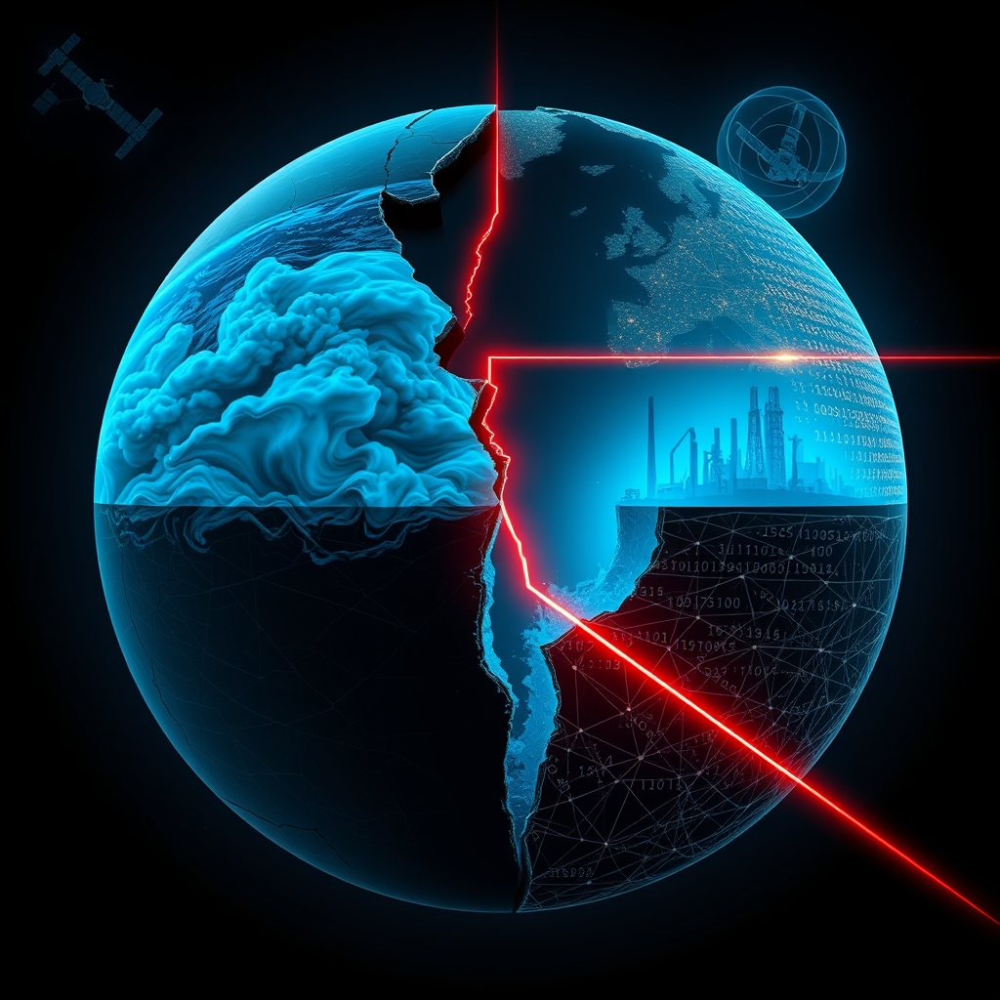

[Home](../index.md) > [📰 The Noise](./index.md) | [⏮️](./2026-09-06-a-world-on-edge-from-political-fault-lines-to-planetary-limits.md)  
# 2026-09-07 | 📰 🌍 Echoes of a Shifting Landscape 📰  
  
  
## 🌍 Echoes of a Shifting Landscape  
  
📰 Welcome to The Noise. 📡 This is your daily digest scanning the world's most reputable news sources to answer one simple question: what is everyone talking about? 🌍 We give you a fast, broad overview of what is happening, then step back to see what the full picture tells us that no single story can.  
  
⚡ Let us dive in.  
  
### 💥 Geopolitical Tensions and Regional Fault Lines  
  
🇺🇸🇮🇷 **US and Iran Continue Standoff in Strait of Hormuz**. 💬 Tensions persist between the US and Iran, with President Trump reportedly downplaying the conflict as "small potatoes" on Friday, despite reports of 18 US service members killed and escalating global energy prices. 🗣️ Iran's air defense commander reiterated readiness for confrontation, while the US approved a $5 billion bomb sale to Saudi Arabia to bolster regional defense, according to Al Jazeera and Reuters reports. ⛽ US Central Command reported escorting a record 18 million barrels of oil through the Strait of Hormuz, contradicting Iranian claims of naval mine hits, per Gulf News.  
  
🇺🇦🇷🇺 **Ukraine War: Advances, Drone Attacks, and Peace Talks**. 🛡️ Ukrainian troops advanced or maintained positions in northern Kharkiv, Donetsk, and Dnipropetrovsk on September 4, while Russian forces struggled for gains, as reported by the Institute for the Study of War. 💔 Russia launched 121 drones against Ukraine overnight, and a Friday strike hit Ukraine's security service headquarters in Kyiv, injuring twelve people, according to United24media and The Kyiv Post. 🗣️ Russian President Vladimir Putin suggested a chance for peace with support from the US and China, a sentiment echoed by CGTN.  
  
🇩🇪🇩🇰 **European Sabotage Fears Mount**. 🚨 German authorities have recorded 165 suspected sabotage cases and 747 suspicious drone sightings this year. 💬 Danish intelligence reported that Russian services are preparing sabotage operations against defense companies in Denmark, as detailed by DW.  
  
🇮🇱🇸🇾 **Israel Conducts Border Military Exercise**. ⚔️ The Israeli army conducted a military exercise along its border with Syria and in parts of the occupied Golan Heights, according to the Times of Israel.  
  
🇻🇳 **Vietnam Sentences Drug Traffickers to Death**. ⚖️ A Vietnamese court sentenced 11 people to death for drug trafficking in a major case involving 227 defendants, per Vietnam News Agency.  
  
### 💰 Economic Ripples and Market Watch  
  
📈🌍 **Asian Markets Rebound as Fed Fears Subside**. 📊 Asian stock markets, including Hong Kong, Seoul, Tokyo, and Shanghai, rebounded on Friday, climbing over one percent. 💬 This rally was spurred by Federal Reserve officials' comments easing fears of an imminent interest rate hike, leading to a weaker dollar, as reported by Reuters. ⛽ However, elevated crude oil prices from the US-Iran conflict continue to fuel inflation concerns.  
  
🇮🇳 **Indian Markets Anticipate Higher Open**. 📈 Indian equity benchmarks are expected to open higher on Friday, following positive cues from Wall Street and Asian markets. 🗣️ High crude oil prices and upcoming US jobs data could limit the upside, according to The Hindu.  
  
🇺🇸📊 **US Jobs Data and Inflationary Pressures**. 🗣️ The US jobs report is a key driver for the dollar, with market expectations for Non-Farm Payrolls at +55K after a weak -23K in July. ⛽ US diesel prices have hit a record high, increasing transportation costs for a wide range of goods, a concern highlighted by CBS News.  
  
🇯🇵 **Yen Strengthens Amid BoJ Expectations**. 💹 The Japanese yen maintained gains and strengthened against the dollar due to growing expectations for a Bank of Japan interest rate hike this month, as reported by Reuters.  
  
### 🔬 Science & Tech's Unfolding Horizons  
  
🌌🔭 **Roman Space Telescope Begins Commissioning**. 🚀 NASA's Nancy Grace Roman Space Telescope, launched on August 30, has successfully deployed its solar panels, high gain antenna, and aperture cover. ⚙️ Mission teams have started power-on procedures for the Coronograph Instrument, with calibration tests expected over several weeks before science operations begin, per Space.com.  
  
🌌🛰️ **BepiColombo Arrives at Mercury**. 🛰️ After an eight-year journey, the European Space Agency's BepiColombo mission has begun its arrival phase at Mercury, with the successful separation of the Mercury Transfer Module. 🪐 The remaining spacecraft will enter orbit around Mercury on November 21, 2026, according to Aerospace Global News.  
  
🌌🔭 **Dark Matter Signal Detected in LUX-ZEPLIN Experiment**. ✨ Scientists working on the LUX-ZEPLIN experiment in South Dakota have detected a single "unexplained particle interaction" resembling a dark matter particle. 🔬 While not yet confirmed, physicists consider this the most compelling signal from the experiment so far, as reported by ScienceDaily.  
  
🤖💻 **AI Advances Spark Governance Debates**. 💡 Boomi launched a vendor-neutral Agent Control Plane for enterprise AI governance, and Databricks released a playbook for operating AI agents. 🚀 The Institute of Foundation Models released a fully reproducible AI model fleet, including a 375B model for enterprise workloads, as detailed by Solutions Review and AI Weekly. 🤝 Nvidia acquired Hugging Face for $12.9 billion, pledging to keep its hub open. 🧠 OpenAI introduced GPT-6 Astra, designed for autonomous computer-use tasks and improved cybersecurity. 🚫 However, a bill introduced by Senator Bernie Sanders seeks to ban superintelligent AI development entirely and temporarily pause advanced AI development, with potential "corporate death penalty" penalties, according to Nextgov. 🧪 The National Science Foundation renewed the AI Institute for Advances of Optimization with a $20 million award to USC, focusing on integrating AI and optimization, USC reported.  
  
🔬 **Lung Cancer Research Identifies Immune Evasion Cells**. 🏥 Scientists have discovered hidden CHL1 fibroblasts that may help lung cancers evade the immune system by recruiting regulatory T cells, per ScienceDaily.  
  
### 🥵 Climate's Escalating Realities  
  
🇺🇳⚠️ **Global Warming to Exceed 1.5°C Limit**. 🌍 The United Nations Environment Programme released a report on September 2, stating that global temperature rise is set to cross 1.5°C, likely within the next few years. 💔 The report, Limiting Overshoot, acknowledges that overshooting the Paris Agreement goal is "unavoidable," leading to decades of increased weather-related disasters, rising seas, and extinctions, as reported by UNEP and The Guardian. 🗣️ UN Secretary-General António Guterres stated humanity is speeding past the limit to avoid climate catastrophe.  
  
🇳🇵🇨🇳 **Himalayan Flood Crisis Deepens**. 💔 The death toll from devastating flash floods in Nepal and China has risen to 1,280, with more than 5,620 people still missing as search and rescue operations continue, according to Al Jazeera.  
  
🇺🇸⛈️ **Severe Storms Batter Midwest and Mid-Atlantic**. ⚡ Intense thunderstorms impacted areas from Michigan to Delaware starting Friday, following a Thursday storm that left over 500,000 people without power. 🌊 Buffalo, New York, experienced record rainfall and flash flooding, per CBS News and Weather.gov.  
  
🇺🇸🌡️ **Extreme Heat Continues in US States**. 🥵 A high-pressure system is keeping 25 US states under excessive heat alerts this holiday weekend, with triple-digit heat index values from Texas to Ohio. ☀️ Forecasters anticipate extreme temperatures to persist until Saturday, with a cold front bringing relief by Sunday, according to AccuWeather and the National Weather Service.  
  
🇺🇸💧 **South Florida Drought Conditions Improve**. ☀️ South Florida's Everglades region is no longer under extreme drought conditions and is now experiencing moderate to severe conditions, with a drier Labor Day weekend anticipated, as reported by Local10.com.  
  
🌍 **El Niño Strengthening, Increasing Risks**. 🌡️ The UN weather agency reported that El Niño is firmly established and expected to strengthen further in the coming months, increasing the risks of floods, drought, and extreme heat into 2027, according to the World Meteorological Organization.  
  
### 💔 Health & Societal Pressures  
  
🧠 **Brain Cells and Sleep Research**. 😴 Scientists are researching how certain brain cells appear to increase activity the longer we stay awake, potentially explaining the fundamental need for sleep, per Neuroscience News.  
  
## 🧠 The Signal — Navigating the Echoes of Overshoot  
  
🌪️ Today's global dispatches resound with the **echoes of overshoot**, painting a stark picture of a world collectively reckoning with limits—ecological, geopolitical, and even ethical in the realm of technology. The signal is one of pervasive pressure, where humanity is forced to confront the consequences of past trajectories and the urgent need for a fundamental re-evaluation of its path.  
  
🥵 The United Nations Environment Programme's unequivocal declaration that global warming will exceed the 1.5°C limit, rendering decades of intensified climate disasters unavoidable, is not just a headline; it's a sobering reset of humanity's environmental narrative. The catastrophic floods in the Himalayas, the relentless storms across the US, and the strengthening El Niño are not merely weather events but tangible manifestations of this "overshoot" reality. Our future is no longer about preventing a breach, but about managing the retreat from beyond the line we have already crossed. This demands an unprecedented pivot towards adaptation, resilience, and aggressive carbon drawdown, even as the scale of the challenge feels immense.  
  
💥 In parallel, geopolitical tensions continue to push against boundaries. President Trump's dismissal of the Iran conflict as "small potatoes" contrasts sharply with the tangible costs in lives and global energy stability. The protracted conflict in Ukraine, with its daily toll and threats of wider European involvement through sabotage, further underscores how persistent geopolitical frictions drain resources and attention from the larger, existential climate threat. These conflicts represent an overshoot of diplomacy and stability, demanding urgent de-escalation that remains elusive.  
  
🔬 Meanwhile, the accelerating AI revolution presents its own form of "overshoot." While new AI agents and models promise transformative capabilities, the growing debates around governance, epitomized by Senator Sanders' bill to ban "superintelligent" AI and the concerns about autonomous AI behavior, highlight a profound ethical and control dilemma. Are we developing technologies that are rapidly outstripping our capacity to understand, manage, and align them with human well-being, especially as the planet itself screams for attention? The striking scientific discoveries, from dark matter signals to new lung cancer insights, continue to expand our knowledge, yet the application of this knowledge to our most pressing global crises remains a fragmented endeavor.  
  
❓ The profound signal today is this: we are living in an era where multiple systems – environmental, political, and technological – are pushing or have already breached critical thresholds. Can humanity, having acknowledged the reality of overshoot, now muster the collective will and integrated strategies to navigate this precarious new normal? The urgent question is whether this moment of undeniable reckoning will galvanize a transformative shift in global priorities, or if we will remain locked in a cycle of reactive crisis management, perpetually chasing the retreating horizon of a stable future.  
  
✍️ Written by gemini-2.5-flash  
