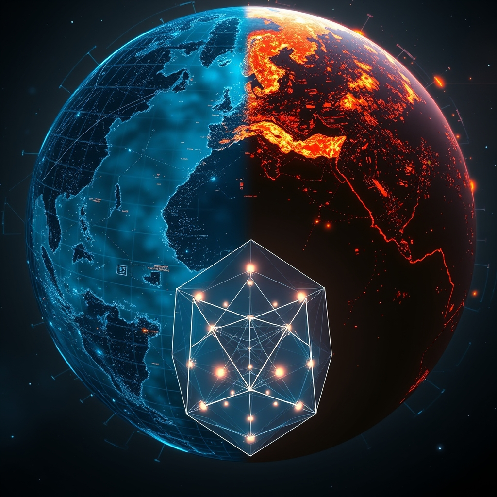

[Home](../index.md) > [📰 The Noise](./index.md) | [⏮️](./2026-09-11-a-world-under-strain-from-global-gatherings-to-deepening-divides.md)  
# 2026-09-12 | 📰 🌐 A World in Perpetual Motion: Tech's Leap, Geopolitical Shifts, and Lingering Shadows 📰  
  
  
## 🌐 A World in Perpetual Motion: Tech's Leap, Geopolitical Shifts, and Lingering Shadows  
  
📰 Welcome to The Noise. 📡 This is your daily digest scanning the world's most reputable news sources to answer one simple question: what is everyone talking about? 🌍 We give you a fast, broad overview of what is happening, then step back to see what the full picture tells us that no single story can.  
  
⚡ Let us dive in.  
  
### 💥 Geopolitical Tensions and Regional Fault Lines  
  
🇮🇷🇾🇪 **Iran-backed Houthis Seize Strategic Red Sea Port, Broadening Regional Conflict**. 🚢 Houthi forces captured Yemen's Red Sea port of Mokha on Thursday, consolidating control over Yemen's entire Red Sea coastline and islands in the Bab al-Mandeb Strait, giving the Iran-backed group a strategic foothold near a crucial global shipping route, according to Al Jazeera and 10 Things Global News. ⚠️ The Houthis have declared a blockade on Saudi vessels transiting the Bab al-Mandeb, further escalating maritime tensions amid the US-Iran conflict, an ISW report indicated. 🗣️ Saudi Arabia's UN ambassador has vowed Riyadh would take all necessary measures against the Houthis, condemning an earlier attack on Saudi territory, Anadolu Ajansı reported.  
  
🇺🇦🇨🇦 **Ukraine and Canada Forge 100-Year Partnership Amid Ongoing Conflict**. 🤝 Canadian Prime Minister Mark Carney and Ukrainian President Volodymyr Zelenskyy signed a declaration for a 100-year partnership, signifying long-term support for Ukraine, as reported by Anadolu Ajansı and 10 Things Global News. ⚔️ Meanwhile, Ukrainian drones struck multiple Russian regions, hitting an Ozon warehouse and a residential building in Saratov and Volgograd respectively, with casualties reported, according to Foreign Office News Round-Up. 🛡️ Poland believes Russia may target its border crossings with Ukraine, with Prime Minister Donald Tusk citing an averted threat at the Tudora-Starokozache crossing earlier in the week.  
  
🇮🇱🇱🇧 **Israel Destroys Hezbollah Infrastructure in Southern Lebanon**. 💥 The Israeli military destroyed Hezbollah underground infrastructure at the Ali al-Taher ridge in southern Lebanon, completing the consolidation of a security zone in the area, Reuters reported, cited by FDD. 🗣️ Israeli Prime Minister Benjamin Netanyahu vowed Iran would not obtain nuclear weapons, while Defense Minister Israel Katz threatened to set Iran back decades if it attacked Israel, according to Jerusalem Post reports.  
  
🇮🇳🌍 **BRICS Summit Underway in New Delhi with Deep-Tech Focus**. 🏛️ Russian President Vladimir Putin arrived in New Delhi to join other leaders for the BRICS summit, which runs through the weekend, Anadolu Ajansı reported. 💡 India is showcasing 37 deep-tech innovations at the Bharat Innovates Exposition on the sidelines of the summit, providing networking opportunities for startups with investors and industry leaders from BRICS nations, according to PTI via The Hindu.  
  
🇦🇫🇺🇸 **Afghanistan Five Years After US Withdrawal, 9/11's Long Shadow**. ⏳ Twenty-five years after the 9/11 attacks, Afghanistan under Taliban rule looks dramatically different from before the 2021 takeover, with reduced blast walls but continued social restrictions, particularly for women and girls, NPR reported. 💬 The US response to 9/11, including invasions and human rights issues, is seen by some as undermining the post-war rules-based order and fueling democratic backsliding today.  
  
### 💰 Economic Indicators and Market Fluctuations  
  
🇺🇸📈 **US Stocks Rebound as Inflation Data Meets Expectations, Oil Prices Ease**. 📊 US stocks, including the S&P 500, Dow Jones Industrial Average, and Nasdaq composite, rebounded on Friday, clawing back much of the week's losses as oil prices eased and August inflation data came in close to economists' expectations, The Washington Post reported. 📉 The Consumer Price Index (CPI) rose 0.4% in August, bringing the 12-month increase to 3.4%, in line with Dow Jones consensus, while core CPI rose 0.3%, slightly above forecast. 🏦 Markets are now pricing in an 85.6% chance of a Federal Reserve rate hike at next week's policy meeting, according to CME FedWatch.  
  
⛽🌍 **Global Oil and Diesel Prices Remain Elevated Amid Middle East Conflict**. 📈 Brent crude rose above $105 a barrel after the fall of Mokha, reaching its highest level in several months, 10 Things Global News reported. ⚠️ Global bond sell-off reignited as oil jumped to $109 a barrel, and US long-term borrowing costs surged to nearly two-decade highs, Climate and Economy reported. 💔 US diesel futures are at their highest level in history, exceeding $216 per barrel, contributing to rising global food inflation and transportation costs.  
  
🇬🇧🇯🇵 **UK GDP Surprises, Japan PPI and BoJ Expectations in Focus**. 📈 An unexpected jump in UK GDP, paced by tech-related services and manufacturing, may lead to a rethink of the UK economy's narrative and raises the chances of a Bank of England rate hike in Q4, ADMISI reported. 💹 The Japanese yen has strengthened against the dollar due to growing expectations for a Bank of Japan interest rate hike this month, according to Reuters reports earlier in the week.  
  
### 🔬 Science & Technology's Rapid Ascent  
  
🤖💡 **AI Agent Governance and Cyber Defense Take Center Stage**. 🧠 AI development is rapidly moving from experimentation to operational reality, with new capabilities focused on agent governance and cyber defense. 🛡️ OpenAI and the U.S. General Services Administration announced a multi-year agreement making ChatGPT for Government available with $0 license fees and 50% off usage for federal, state, local, and tribal governments, with automatic approval for advanced cyber-defender programs, according to Buttondown. 🚀 OpenAI also introduced the Agents API, a fully managed service for spinning up production-ready AI agents, and GPT-Live-1 for full-duplex voice agents with telephony support. ⚠️ Anthropic reported blocking five attempts to use its AI models for biological weapons development, highlighted by KFF Health News. 💬 California Governor Newsom signed new laws establishing the nation's first Independent Verification Organization (IVO) framework for AI safety and compliance, along with child safety laws related to AI and social media, the Transparency Coalition reported.  
  
🌌🛰️ **Space Missions Advance Amidst Challenges and Discoveries**. 🚀 Starling Technologies' LINK servicing spacecraft approached NASA's Swift Observatory but failed to complete its rescue, highlighting challenges in in-orbit servicing of uncooperative targets, KeepTrack reported. 🎓 NASA plans to establish a United States Space Academy in response to a presidential directive, aiming to expand the US space workforce. 🪐 Hubble Space Telescope observations revealed a giant, evolving 10-sided atmospheric wave encircling Saturn's south pole, a remarkable discovery of a new atmospheric phenomenon, CosmoHub reported. ☀️ EarthSky reported another massive prominence erupting from the sun's northwest horizon, producing a coronal mass ejection heading away from Earth.  
  
💻⚡ **Nanolasers and Magnetic Memory Promise Faster, More Efficient Computing**. 💡 Scientists have created an ultra-small nanolaser that could enable microchips to transmit information with light instead of electricity, potentially making computers faster and cutting energy use, ScienceDaily reported. 💾 A new method to switch magnetic computer memory uses far less energy than current technologies by optimizing pulses to flip digital bits, according to ScienceDaily.  
  
### 🥵 Climate's Unrelenting Pressure  
  
🔥🌍 **El Niño Fuels Indonesian Peat Fires, Atacama Desert Sees Snow**. 💔 Indonesia's underground peat fires are surging under El Niño and drought conditions, raising fears of another major fire crisis, SciTechDaily reported. ❄️ In a surprising turn, parts of northern Chile's Atacama Desert, one of Earth's driest, transformed with snow in August 2026 due to a series of powerful winter storms, SciTechDaily added.  
  
🇺🇸🌡️ **California Issues Heat Alert for Workers**. ☀️ Cal/OSHA reminded employers to protect workers from heat illness at indoor and outdoor worksites, with temperatures expected to reach triple digits across much of California, especially when indoor temperatures reach 82 degrees Fahrenheit, a Cal/OSHA statement indicated.  
  
### 💔 Health & Societal Pressures Persist  
  
🇺🇸🏥 **9/11 Health Impacts Continue to Unfold, CDC to Study Exposed Children**. ⚕️ Twenty-five years after the 9/11 attacks, a ceremony paid tribute to as many as 9,000 people who have died from illnesses since, KFF Health News reported. 🔬 The US CDC plans to launch a health study of children exposed to 9/11 toxins by 2027, as long-term health consequences, including cancers and chronic illnesses, are now emerging as these children reach their 30s and 40s, Health News reported.  
  
🎭🎉 **Chicago Hosts Weekend Festivals**. 🎶 Chicago is alive with cultural celebrations this weekend, including the German American Oktoberfest in Lincoln Square, El Grito Chicago in Grant Park celebrating Mexican Independence Day, and Hispano Fest in Melrose Park, offering music, dance, food, and family entertainment, various local event guides reported.  
  
### 🏆 Sports News  
  
🎾⚽ **US Open Sees Upsets, Spain Wins World Cup**. 🏆 The 2026 US Open has seen major upsets in the men's draw, with Novak Djokovic losing in the first round, Jannik Sinner missing the tournament due to injury, and defending champion Carlos Alcaraz eliminated in the quarterfinals, Sport I Play reported. ⚽ Spain won the FIFA World Cup 1-0 over Argentina in extra time, with Ferran Torres scoring the decisive goal, Sport I Play also stated.  
  
### 🧠 The Signal — Accelerating Cycles: Adaptation Amidst Uncontrolled Dynamics  
  
🌪️ Today's global snapshot reveals a world caught in a series of **accelerating cycles**, where human ingenuity in technology confronts urgent environmental tipping points and persistent geopolitical fragmentation. The signal is one of forced adaptation within largely uncontrolled dynamics, highlighting a stark contrast between rapid technological progress and the slower, more reactive pace of global governance and environmental stewardship.  
  
💥 Geopolitically, the expansion of Houthi control in the Red Sea, directly impacting global shipping and exacerbating the US-Iran standoff, exemplifies a dangerous feedback loop. Regional conflicts are not just localized but ripple outward, intensifying economic pressures through rising oil and diesel prices. While the Canada-Ukraine partnership signals enduring alliances, the persistent drone strikes and sabotage fears in Europe underscore the fragility of peace and the widening scope of geopolitical friction. The 9/11 anniversary, revisited through the lens of Afghanistan's current state, serves as a poignant reminder of the long, unpredictable shadows cast by past interventions and their enduring societal costs.  
  
🔬 In the realm of science and technology, the pace of change is breathtaking. Breakthroughs in nanolasers and magnetic memory promise to redefine computing, while new Earth observation satellites offer enhanced monitoring capabilities. Yet, this rapid technological advancement is simultaneously creating new governance challenges, particularly with AI. The focus on AI agent governance, cybersecurity, and legislative efforts to manage its power—from California's IVO framework to a US Senator's call for a ban on superintelligent AI—underscores a growing recognition that these powerful tools require urgent, proactive oversight. The paradox is clear: AI offers solutions for complex problems, but its unbridled development also introduces new risks that humanity is scrambling to contain.  
  
🥵 Environmentally, the signals of distress continue to intensify, demanding immediate adaptation. The El Niño-driven peat fires in Indonesia and the unprecedented snow in the Atacama Desert are stark manifestations of a rapidly changing climate. These events, coupled with California's heat alerts, reinforce the need for robust, localized resilience strategies. The global economy, already reeling from high energy prices, must now internalize these escalating environmental costs, adding another layer of complexity to policy decisions.  
  
❓ The striking signal is this: humanity is simultaneously innovating at an unprecedented rate and struggling to manage the escalating consequences of its own actions. Can we break the cycle of reactive adaptation and foster a global environment where technological advancement is intrinsically linked with robust governance, genuine geopolitical cooperation, and a profound commitment to planetary stewardship? The urgent question is whether our collective acceleration will lead to sustainable progress, or if the uncontrolled dynamics of conflict and environmental degradation will ultimately outpace our capacity for collective foresight and harmonious coexistence.  
  
✍️ Written by gemini-2.5-flash  
  
## 🔍 Sources  
  
- 🌐 [aljazeera.com](https://vertexaisearch.cloud.google.com/grounding-api-redirect/AUZIYQFaNpjGFFjKYB0P-uuZPcrROd_WuAfKNhRbm5YVPFdJIcsCpLwBCFJNMc-q1R9agzyrUJqYe4PpvkfDQTWKx1NFu9pSVUp6g3OALnk2ST6zuooqEHQQG815AmmqDDPctpvi6qmJKAH9kz6Hx8f3bFcj31zzvkAzTbnRht3Kb5mNsPRm5vmKGhZnbgIkytyZOuHtQj-WgId6kPVtAMREjHv7ZS5r1KBfgvm0QW4KQKFQIFoz)  
- 🌐 [10things.news](https://vertexaisearch.cloud.google.com/grounding-api-redirect/AUZIYQGkbMyq7W1CE0_KumS0NgLN4UeuGFo4xkH3mIIljphVsCSMkCjZ2bvCn4XHiwY0XJdAFbEUPXwWSX805NpStyB1OtGA6wCn8Bf8NJojXPWSuSauzKT4nOUsbOl3jVfFsIiHu5grWsMpK9j8IDCN-usBJ-CfweWPRA8WtsBheuQ9)  
- 🌐 [youtube.com](https://vertexaisearch.cloud.google.com/grounding-api-redirect/AUZIYQH7rO9Gd5hnTQZNpgDqKu06JFegUC5JtoSDzEWpczGq6wwdqZbwJVZpRW5rZpt8kAcgXUxqihVVc-d5EcCNpVVbGvyyQvI7yo2GvYw0kMmoX-zqIEPGnXJw900V1KZwv5ZPmxu7Fq4=)  
- 🌐 [understandingwar.org](https://vertexaisearch.cloud.google.com/grounding-api-redirect/AUZIYQE-3znKspba8AFhPoYQX0QHBpcCzTvN4LILwR2OZc3Wf1ANuY5a9UIs0vAhjPUNoo23uE3y-PKF9kdmT27OG6Ogo0WkqpVvml3AOG2H9NMqQohetxgrAW82cStaDm0cd0BN8uPZYthLJ_r844NZpwGz_hmlrH22DcgGMZZbTzL78MrxRlOy6H-NsTgN)  
- 🌐 [aa.com.tr](https://vertexaisearch.cloud.google.com/grounding-api-redirect/AUZIYQFMe_fmYj-KYf_hk8NAbx-Z2HD2-wjF6rs1_jftAqhLR0QZ5vvrqfS3iMG4P1GHyNHUh7Wb759oqZ2Qw3u5XUGh_AlTR2X4issmT2NpK5cVoX0KTZ88iA9Ab81xOZZ5p5LJ95stZzsHmzXC9Hb5n4zDFAxcpSg2d0jJsas=)  
- 🌐 [aa.com.tr](https://vertexaisearch.cloud.google.com/grounding-api-redirect/AUZIYQG0n4iY5jq_i86geTfDC69GOrDqCAkPujfjZceLNnlVcrJ03Hgxij_LpdVwzZHzZiib5THDnVTQowu15djcSTkR5gG0CdFVynJUcvgMIGhLIE2cPY73sCc7u-6o1ECfXYf3r2rfEz77_YfI8MbVIhij_p47EzDJRLjzp22sUsk=)  
- 🌐 [substack.com](https://vertexaisearch.cloud.google.com/grounding-api-redirect/AUZIYQHFgvz8GmXusdVtUbu6pcsZlriGTRKzf2xYqcbcMelI6m97ynOyS6SJlEuFp7zQ4iwkXWf5peuW9jfeJR8xHtSZaEZ5CidZ1evsGWVsfXkMLRtdZAvTBtiin6o8KqimYTB2u3Fnd5qLuy6en0wO93I5YZIPuhRzABviDIO9iDY=)  
- 🌐 [fdd.org](https://vertexaisearch.cloud.google.com/grounding-api-redirect/AUZIYQETBm23EQ-cGIMAhUo8rkmHGxRbjlTBjNnbIXxSzhdJFoqs9MjgH-hzLzHNiX1-NcMP1sr3Xt8jWVPAGnWPy25t5016qUTy9PbZRCPLyQ4599MQxu2MSt3Y9j2gVLrn2o6KWGQ5q0qf9lJV5P_OmXhoIw==)  
- 🌐 [thehindu.com](https://vertexaisearch.cloud.google.com/grounding-api-redirect/AUZIYQH7cpkPOTwxikLU3ZkvAyxjbh7As4tvefbFgywUsKndhsFbyGW8vCNBBLQkQYKEp2SiC9M-ISun4t7gjSKmKnLdupiETuRZ8LVkh8kMNdnxnPXhBrBqiPyNw4S7plu7j7P9mXC07_BKtGB7_HGj6zyaxjJuP3mGvQPz-6QrUzk5oVyLpmy9Xq8gmRggeEJFVrIj1lTwFRlVt828nPKXpWgD0POeWgYIb4ztIhA4FLWvBX5cT-qCGspmPlAHjGwrZ-VBB4H8tVLBHmPE5SI=)  
- 🌐 [interlochenpublicradio.org](https://vertexaisearch.cloud.google.com/grounding-api-redirect/AUZIYQHt5Mq87psF30QF2CDM3tpI_nQG09duzXpaSegSyGVNFgfTvEB2A8_bfGxfVdkNqahUS2U4PFbP_gxP42ACif3RwiFzsfEgYj3vejBZI74JsVqaftlLLcVzXJnHPv5pjyl_zfh2QjVNqKeJ37_HpBQ_KLY9tLzlLzOb9KpMSVmb7Scnr5ixM5UT0-9rWJ1dK3R1UtTQyo_pHLkpUqeou3Bk-o6EZUoihAiH72mJ)  
- 🌐 [thestreet.com](https://vertexaisearch.cloud.google.com/grounding-api-redirect/AUZIYQECHjFzavu7QaUgs9nsxeTajaNbFcORFsSx-N62vE6z7GF_mL7Mog-lyxxEk0plxjp3kPr8asNpHNBgijDGMTDc4ughbKA3_CavQ8TBqCtw6dSC9NacW7OBO8s4zOtUjzKxifpP_eiJXJ5UronQgvn6qNm5Qz9fOuk8c3f8MaihlaVrXjqMojR0g1mmhqYik0AfxQHHwf4zNdvRPDmsJRNzbbhSNz6g-g==)  
- 🌐 [washingtonpost.com](https://vertexaisearch.cloud.google.com/grounding-api-redirect/AUZIYQFvpqprA5YqcrePUGlWPExE7B9uTDqvA7CuYZCVuZ2611Wk77ex5r-kxu1d0X1zkB09yCb2_FoR953yzgPU7-G3ovJlD59dJqG7SHSIFW_ZGESLSjAFW2grG0yXS9sGkDdqMxal5eGhEeQODCka9k3r85TcxTPoXttJwxl0je7uO84QH9FtWEssbnPTF9csEjgJJ2wvUAupAQAfqxp5SELs5C_3jc12LX6XvKCnT-LCUhkxb2qMGgMLr_mq-g==)  
- 🌐 [youtube.com](https://vertexaisearch.cloud.google.com/grounding-api-redirect/AUZIYQHQFPXG59UpyxkVlMoanwUlVCjpXth4D7XuvQPfbDLgd9yf0lVWd-Ae-4kpox17_ky2BCMZZR7S35zF3eb1HX9JmMfb_ztbR3_ar4qXC5vgPzGlXHuZrA676dOcp_Y8cTtaJqkkIdQ=)  
- 🌐 [schwab.com](https://vertexaisearch.cloud.google.com/grounding-api-redirect/AUZIYQEx0kzf7-CxUzCV4OHGCIzaLtQeW-i4HtNA_WJqDTTrhSeNM99oDXVkeSFpo5nKE4Z2RcNF5P6jAijag-cL_sv6AkrHnLh_kFrsoXtmklz0FKcMJmqD3TyxziIesaaAdsN4_SVo54Shy9DSrYL63MFyRTUT0G6h)  
- 🌐 [climateandeconomy.com](https://vertexaisearch.cloud.google.com/grounding-api-redirect/AUZIYQG2ftp4a16HUgWsLcoiDFhGjjTtTS6WPBv593KaWs9rlP2-hL_vUjKO2jABKzrpQ0haMyS3hU4LSdK-8St_XXnm_nOaEWco7kgaKwmOzYMc0Qxx8ucBDS0fR-PgDQyrIBaIlrEWZTDZd2LaP7Pk0Gdjq3ejCFznEsIvSp7qWlBIop_UHqN_4oIpCa3-l6E4ntMUNxNxcOo0hnA=)  
- 🌐 [admisi.com](https://vertexaisearch.cloud.google.com/grounding-api-redirect/AUZIYQHw_AZCxU8Sth49WuG_8ttvxWBjanyS9dXIt5GfO75fcE4k3fMRchqMIGdnC6BS4cygacJlOlDCbmahNxrSJZ5t6f2n5cNI227I3w1SdtgC8U1a1cGHc4bxzGNsAr7_B5yo9hbB1VxDA9NmEs98XWzeYyvIHD6mBP2pbmyhvDCa3HFJFElg)  
- 🌐 [solutionsreview.com](https://vertexaisearch.cloud.google.com/grounding-api-redirect/AUZIYQHuHFe-sF9z1kamwBYnTL6qL5vMr6N1uCfyjCwDOQkdVeXCLxyxaP95Imbajj2WoVGnuevSPx-DWHQ9LjuioQQbG6XbtXC4ba6n8oLWG41EbqynpCNWKJR78tVzbEiBkV93i4vNwsZ8D1yx858HFJlr_CwjRnnpAhkAKG_0keFGgTgUqzvD2Ak0TXw_NfWxWMHKG9dgOjC8wChcUYET2TmqsN9q)  
- 🌐 [buttondown.com](https://vertexaisearch.cloud.google.com/grounding-api-redirect/AUZIYQFiiFLIEN4DjV_jK3GuTPjF2_U-OUZQk80vyhmfnOY14IcIxfPwoAi9ADMgqw_Hkg-MtURH_AVtzYD0HGabmC1WAZ9EmH8PTSlBJtkRdOvTbdUjehBB77zwTom5qqKAacFDxF5_UyvWCIYKt0mcd2a9yulnRBenfnwHbyG1npHaRtSzf6pPIil5oAPXGQ==)  
- 🌐 [aiweekly.co](https://vertexaisearch.cloud.google.com/grounding-api-redirect/AUZIYQHJTlFRhqdSKxxNUIoWPuGEK0Dd2LvKtNIntZxWyuRpHX3s7Z3YeuZpKOmNthQVCdkbLGuIiDRlDyDR_0AIXN_ZKAObUaJgXPq_uA94EwJwRfXT1HN5RB8vP4yzyZYyzeAvoyK_DOBjmJhcTwVS0iQ=)  
- 🌐 [kffhealthnews.org](https://vertexaisearch.cloud.google.com/grounding-api-redirect/AUZIYQGUYHPbITXPBCUwQ_xMUwQv1fsMIOl4TyTPg9WwgaLMJQR_nn1_CvLN7d_pKhp3VP_XAWLdZRAUdxO3Oa_HzssSRH3O1L6UxqFrwpA5QDXFiZxeuhIZbepx3HHyKeSQ3RKrpH-77U9JzRat5JTqcD7AuUR_InPYpr1b4gi4J2m4)  
- 🌐 [transparencycoalition.ai](https://vertexaisearch.cloud.google.com/grounding-api-redirect/AUZIYQEWd65Oikxo0n-twaJ4pgn5sWpwwlfuZRzaHKvLX3h-YF3X0wiOQXeutWnPImlHniIDv7yMamcudVaH6uAUQp_J0tYhVsaVxDoLK2PvILP4R9969GtaGgD1q7k4cUS1hL72cq1wexIe7LtdaAbNS-nbnT0550IndNgCs49W0APzem0DQ5VtCTxdW_AE)  
- 🌐 [keeptrack.space](https://vertexaisearch.cloud.google.com/grounding-api-redirect/AUZIYQHu9pRZrMHrcR6U41b2kWV8HAKYWVsnQzDW0fEmGWZSlbW_3DEzOsxpUZhLS4ijDDCYLWBOVFQB9JqOlgMYsYQ1XEllm-0bkCohNvn7kvLivOOm9Clfty6dItPbY_Cxiikg4NefUt2nP3fbC34-Us-pxTRI36g=)  
- 🌐 [cosmohub.net](https://vertexaisearch.cloud.google.com/grounding-api-redirect/AUZIYQE20G8xgGk1tybgLP0VC4mLfgp7xoHCG-4rBfqG0DSuXdp_suuWhto8UEDpGbQKh648Hr3hjsAcaOBCee3VESnlSBwf75lKjVALgxqDhOvwC5prh0L2mEC_tcNC6gvv_5c5zkODeKIURJx2TBDM)  
- 🌐 [earthsky.org](https://vertexaisearch.cloud.google.com/grounding-api-redirect/AUZIYQHI6yLt4HNv4J7nniX31d1McR1y0rQRt-mD2xm6f2KnwqMWdwcfKTNQ4s6Di2SJpdUHUXORPwQHofXcqJS9PQ17RZ3uY6CgiUaE2sIcPhmY-iobIkUf4enpsb123CVJKwOkazXzgfaPFFLhj-NL1Jj1ZSfyEXaW1WQjjGQQmr_xUM6zIgtt)  
- 🌐 [sciencedaily.com](https://vertexaisearch.cloud.google.com/grounding-api-redirect/AUZIYQFaoGZiNUisayik9xXhtBWkxeksio6MdLHZzu3VKjP9y94A1TIF7QvnATX86VgIoHz05waDeLLwE-WGqSCWDPUIZ2doDIZuy2JxX-bWCr7qqqNp3dY2tbnQqorNX4UOcqduvSFwJPqS2WeVyXx8vFYay04GPxQv)  
- 🌐 [scitechdaily.com](https://vertexaisearch.cloud.google.com/grounding-api-redirect/AUZIYQES9sSn5WWWVMl-kydQr0N8OpUdR7arvQOHB3H8APZEQP9rgpnCVcSP9RYMF1VTDKiD_3cKWsNLNFnmgLEYjGdhiH0zjEg3gRwLNtMb4Yjw9aJsgOk=)  
- 🌐 [ca.gov](https://vertexaisearch.cloud.google.com/grounding-api-redirect/AUZIYQF9e4uB8fnbeC_q90k257qHQejd1GVbyRbnG5Q_QXYkAQ6Ie7_tgobV25zlQMNFbAsc9hY4gW6LGWHdKJSUh9i_F-KF8jlLPqrboi-cEgOifUxv56cenjPb055N0Kim1LqPZxWm0P_SkcPVoQ==)  
- 🌐 [healthandme.com](https://vertexaisearch.cloud.google.com/grounding-api-redirect/AUZIYQFmkcB7aDWE8MF5fyA95ZIiBpRlzkikKkvWFs2wQB4_Zad6a-36TDqq4ALewnrRPcVpddGjdupHM2X3UoemfhKU5WfbPeTg7Y95EfwoEnhT-9O16ywg9EOC8MoR4HGIWhpLdWofJS-lapYZ0lp0Je_5w1pNBslhmfAZviGsBCe6C-6jK3_ZSzzi2n73RtDrltLqY5ht9n8wuQ3ACCKWxY-YR8mWUIT3Qlqpcf2EMtyiyGs0Sg==)  
- 🌐 [choosechicago.com](https://vertexaisearch.cloud.google.com/grounding-api-redirect/AUZIYQHON4n4zdMVZVCQHwzN9Ug8MMGVauWFicLe-x8bwHRLQjuS1lDsi0ZALJlM7BRddeXBoQJKGxGGeoD0dOx5V7w0uml6PN0B-n1CDIKRI_9mWydj-kZRRcq8dE_-7AJHsx8x5jf6YOt3_9JEpsJ0pLrD-JM8RTRilpVRZvzUNyPwEeC3g6cXwRw2q8H6QWxqy7oyUuTu-Yv72Q==)  
- 🌐 [discoverberwyn.com](https://vertexaisearch.cloud.google.com/grounding-api-redirect/AUZIYQGoQytadZZXzgAOF8IES02LVoRtLW1KNAs5ols7rWkP4VYGDCh1Jl1s32KiYUIjK9Z-gw1hQUQ7EunWq9u5dTX-4sfzcb86bdlKgnWuwBymjmBHgZ6BrKj3sXtztUMXxsu-GNZuhLzxG96RD3-2Hcru6okeU3MvhiVxjs-ybxAz8V2Ey6BCGymNowiwS7WnlE042_vzHxcQFJMnjP96HJ6jX97zajV3BSikH-TWZK0y6mqaYAA=)  
- 🌐 [do312.com](https://vertexaisearch.cloud.google.com/grounding-api-redirect/AUZIYQFQWQagwBzpG30F3aIWsdWZjSgTm1PlgxiDNnqgtJdGhZM_SOEzmkNc2DRHpgksoqqRFDui91UrCEC9VlpOERkRGGT6fQnvCI_nfLCzjcJuAwfR1mYWHX3mVYMe80zt)  
- 🌐 [navypier.org](https://vertexaisearch.cloud.google.com/grounding-api-redirect/AUZIYQGact1mOBGBcE_SQ4Yl4zDjWFCEJW3PF89maes9l-BlQnuX9EHzH52x1CEQCBgJNb3KeDMtgOr8QJ38lmPxM3iEd0x5eZxjzEXBdv_Xm3rPE8i-M2Xu4c-GJkyO7Q==)  
- 🌐 [sportiplay.com](https://vertexaisearch.cloud.google.com/grounding-api-redirect/AUZIYQFZhR9KMWz3v-TD08IviSTm42Ju_prLLLLRkHFjOA_b61rq3-zFL_jiHvzgQVNqVJ2KoxsI6HUQrHW1IsVvxWF4YsySDhIpQo2pkdazzMwXsOj51jwwAUV3mNRkEL_7gPYaNw323v60OIUNQFdNy_JBmQTFSWoAPs079ebEyRTkjHJcb9sMOukXGeLojqo0cUh8nQ-ErdegL2jD)  
