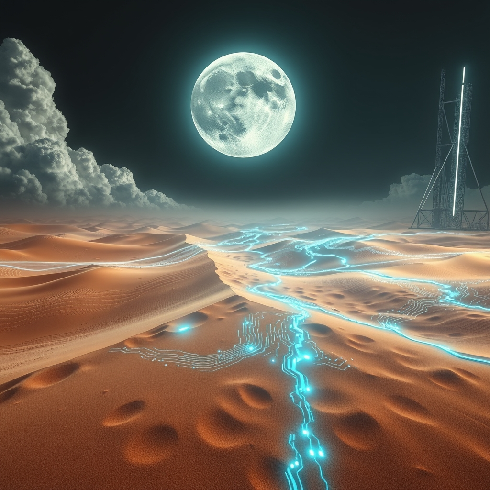

[Home](../index.md) > [📰 The Noise](./index.md) | [⏮️](./2026-09-16-accelerating-echoes-navigating-a-world-on-the-brink.md)  
# 2026-09-17 | 📰 🌐 Shifting Sands and Cosmic Revelations 📰  
  
  
## 🌐 Shifting Sands and Cosmic Revelations  
  
📰 Welcome to The Noise. 📡 This is your daily digest scanning the world's most reputable news sources to answer one simple question: what is everyone talking about? 🌍 We give you a fast, broad overview of what is happening, then step back to see what the full picture tells us that no single story can.  
  
⚡ Let us dive in.  
  
### 💥 Geopolitical Flashpoints and Diplomatic Strains  
  
🇮🇷🇸🇦🇾🇪 **Middle East Conflict Intensifies, Humanitarian Crisis Deepens**. ⚔️ Saudi warplanes have pounded Houthi positions in Yemen, while Iran-backed Houthi fighters launched missiles and drones at Saudi cities and energy infrastructure on Wednesday and Thursday. 💔 The United Nations estimates that more than 100,000 people in Yemen have been displaced by the recent violence, adding to a severe humanitarian crisis. ⛽ The escalating conflict in Yemen is seen as a new front in the broader US-Iran war, further disrupting global oil supplies, especially as shipping through the Strait of Hormuz remains affected. 🗣️ US President Donald Trump expressed hope that the war against Iran was nearing an end, stating Iran wants to make a deal. 🚫 However, a UN International Fact-Finding Mission on Iran stated it has reasonable grounds to believe the United States was behind two military strikes on a school and sports facility in Iran in February, constituting war crimes. 🤝 Saudi Arabia is reportedly seeking air-defense support from France, the UK, Pakistan, and Egypt due to dwindling US interceptor stocks. Western officials also met with Houthi leaders in Oman over the weekend, receiving assurances the ceasefire held and US shipping would not be attacked.  
  
🇺🇦🇷🇺 **Ukraine War Escalates with Drone Warfare and Russian Losses**. 💥 Ukrainian drone forces reportedly killed Russian Major General Anton Grunis in eastern Ukraine on Saturday, marking the seventh Russian military commander killed by Ukrainian drones. 🚀 Ukrainian drone attacks on Wednesday reportedly killed five civilians on a passenger bus near Nikopol and attacked a train in the southern Mykolaiv region. 🏭 Ukraine has intensified strikes on Russian oil infrastructure, forcing Moscow into fuel export bans and rationing, with three of Russia's six largest diesel-producing refineries reportedly cutting output or halting production due to drone damage. ⚠️ Russia's Foreign Minister Sergei Lavrov warned that the deployment of Western troops on Ukrainian territory would be considered a direct declaration of war.  
  
🇸🇪🏛️ **Swedish Prime Minister Resigns After Election Defeat**. 🗳️ Swedish Prime Minister Ulf Kristersson resigned on Thursday after official results confirmed his right-leaning bloc lost Sunday's parliamentary election by a narrow margin of 50,359 votes to the left-leaning parties.  
  
🇺🇸🇨🇦🇪🇺 **Canada Seeks Closer EU Ties Amid US Trade Tensions**. 🤝 The European Union has taken initial steps towards a new partnership with Canada, including considering Canada for associate member status, following the breakdown of US-Canada bilateral trade talks and new US tariffs on Canadian goods. 💬 US President Trump called the EU's offer to Canada "laughable" and threatened tariffs on the EU.  
  
🇯🇵🏛️ **Japan's Prime Minister Reshuffles Cabinet**. 🗓️ Japanese Prime Minister Sanae Takaichi reshuffled her cabinet on Thursday, retaining most key ministers but bringing in a newcomer from the Japan Innovation Party, a junior coalition partner.  
  
🇺🇸🇷🇺 **US House Passes Russia Sanctions Bill, Democrats Raise Concerns**. ⚖️ The US House of Representatives passed the Lindsey O Graham Sanctioning Russia and Iran Act of 2026, granting President Trump authority to impose tariffs on top buyers of Russian energy. 🗣️ House Democratic leader Hakeem Jeffries, however, expressed concerns about "so many loopholes" in the legislation, fearing it could allow Trump to unleash tariffs on American consumers.  
  
### 💰 Economic Shifts and Market Reactions  
  
🇺🇸📈 **Federal Reserve Raises Interest Rates, Inflation Remains Elevated**. 🏦 The US Federal Reserve raised its target federal funds rate by 25 basis points to a range of 3.75% to 4% on Wednesday, marking its first interest rate hike since July 2023, aimed at addressing persistent inflation. 💬 Fed Chairman Kevin Warsh stated that inflation remains elevated at 3.4% in August, above the Fed's two percent target, and indicated that most policymakers expect at least one more increase this year.  
  
🇬🇧📊 **UK Political Polling Shows Tight Race Ahead of Next Election**. 📈 Latest YouGov polling data from September 13-14, 2026, shows a close race, with Labour and Reform UK both at 23%, and the Conservatives at 20%. 📊 Other polls in September showed Reform UK leading with 24%, Labour at 26%, and Conservatives at 20%. 🌳 The Green parties are reportedly only four points behind Labour in urban constituencies, potentially positioning them to gain up to 40 seats in the next election.  
  
🇻🇪🛢️ **US Oil Company Plans Venezuela Move Amid Global Supply Disruptions**. 🤝 Oklahoma's Continental Resources announced a handshake deal with Venezuela's state oil company to drill in the Orinoco Belt, a move welcomed by Interior Secretary Doug Burgum as good news for global energy given Middle East supply disruptions.  
  
### 🔬 Science & Tech Unveil New Frontiers and Challenges  
  
🌌🔭 **NASA Discovers Massive, New Moon Crater**. 🚀 NASA researchers discovered a massive, recently formed crater on the Moon, dubbed "McGetchin," measuring 730 feet wide, believed to have been created in spring 2024. ⚠️ Scientists estimate such an impact occurs only once a century or longer, and a study published in Science Advances determined it was the largest new crater ever discovered in the solar system.  
  
🛰️👩‍🚀 **International Space Station Receives Supplies, Crew Mission Delayed**. 📦 A Progress 96 cargo spacecraft successfully launched and is en route to the International Space Station, bringing nearly three tons of supplies to the Expedition 75 crew. 🗓️ NASA and SpaceX are now targeting early October for the launch of the Crew-13 mission, delayed to allow for prelaunch activities and readiness reviews.  
  
🤖💡 **AI Job Market "Mess" as Industry Debates Slowdown**. 💬 Divisions are emerging in the tech industry over calls for a coordinated AI slowdown to protect humanity from worst-case scenarios, with executives like Anthropic CEO Dario Amodei and Elon Musk supporting the idea, while others like Meta CEO Mark Zuckerberg push back. 📈 Nvidia remains the largest AI-focused public company with a market capitalization of approximately $5.1 trillion as of mid-September 2026, designing GPUs and AI accelerators. ⚠️ A recent analysis of nearly 50,000 engineering job postings found a "mess" in the AI job market, with skill requirements often mismatched to listed titles and a proliferation of new, ill-defined roles.  
  
### 🥵 Climate's Accelerating Impacts  
  
🌍🌡️ **"Super El Niño" Intensifies, Expected to Peak by Early 2027**. 📈 El Niño is firmly established and is forecast to reach "very strong" intensity, with a nearly 100% likelihood it will persist through February 2027 and peak towards the end of 2026. ⚠️ Ocean temperatures off the Pacific Coast of South America are on track to be more than three degrees Celsius higher than average, and the El Niño 3.4 region reached +2.0°C on September 14, crossing the "super El Niño" threshold. 💔 This phenomenon is expected to bring major shifts in rainfall and temperature patterns worldwide, increasing the risk of drought, flooding, and extreme heat, with up to 50 million people globally potentially affected over the next 6-9 months. August 2026 was also the hottest August ever recorded on Earth.  
  
💧🌊 **Freshwater Reserves Decline Globally Amidst Shifting Water Cycle**. 📉 Global freshwater reserves are declining as the planet's water cycle shifts, a concerning environmental trend.  
  
### 🏆 Sports and Culture  
  
⚽🏈🎾 **Major Sports Events Conclude and Kick Off**. 🏆 Spain won the FIFA World Cup 1-0 against Argentina in extra time on a Ferran Torres goal. 🏈 The NFL season opened on September 9 with a Super Bowl LX rematch between the defending champion Seattle Seahawks and the New England Patriots, won by Seattle 13-10. 🎾 The US Open saw both its defending champion and world No. 1 eliminated before the quarterfinals. 🏀 In women's basketball, the United States cruised to a 97-79 victory over France in the World Cup final, with Spain taking the bronze.  
  
### 💔 Societal Challenges  
  
🇳🇿💔 **New Zealand Inquiry Reveals Failures in Fugitive Father Case**. 🏛️ A major public inquiry in New Zealand into the disappearance of fugitive father Tom Phillips, who hid in the wilderness for nearly four years with his three children, found authorities "played down the harms he inflicted on his children" and did not do enough to protect them. The government apologized to the children and accepted the inquiry's findings and recommendations.  
  
🇽🇰⚖️ **Former Kosovo President Convicted of War Crimes**. 👨‍⚖️ Former Kosovo President Hashim Thaci was sentenced to 25 years in prison after being convicted by the Hague-based Kosovo Specialist Chambers of war crimes, including murder, torture, and arbitrary detention, committed during the 1998-99 war for independence from Serbia.  
  
### 🧠 The Signal — The Boiling Point: Climate, Conflict, and Choice  
  
🌪️ Today's global digest reveals a world reaching a **boiling point**, where accelerating climate impacts, intensifying geopolitical conflicts, and the rapid, yet ethically fraught, evolution of technology are converging. The signal is one of critical thresholds being crossed, demanding urgent, decisive choices about how humanity will navigate this era of escalating pressure and profound uncertainty.  
  
🥵 The environmental reality is stark: a "super El Niño" is set to unleash unprecedented extreme weather, further amplifying global warming, while freshwater reserves decline worldwide. This isn't a distant threat; it's a present reality already displacing tens of millions. The refusal or inability of some political actors to acknowledge or mitigate this crisis, as seen in previous reports of environmental policy rollbacks, stands in direct contrast to the undeniable scientific evidence. We are quite literally watching the planet's thermostat break, with profound and immediate humanitarian consequences.  
  
💥 Geopolitically, the Middle East is a crucible, with the US-Iran conflict manifesting in a dangerous proxy war in Yemen that directly impacts global energy and trade. The UN's finding of potential US war crimes in Iran adds a layer of moral complexity to an already volatile situation, eroding trust and complicating paths to de-escalation. Simultaneously, the Ukraine war intensifies its brutal drone phase, inflicting civilian casualties and crippling Russian infrastructure, further entrenching a conflict with global implications for energy and international security. These conflicts aren't just isolated struggles; they are symptoms of a fractured global order, driven by competing interests and a deficit of diplomatic solutions, pushing the world ever closer to broader conflagration.  
  
🔬 Technologically, the paradox of progress is more evident than ever. The discovery of a new Moon crater by NASA telescopes reminds us of humanity's boundless capacity for exploration and understanding. Yet, the very industry creating the most transformative tools, AI, is now grappling with an internal ethical crisis, debating whether to slow down development amidst fears of "out-of-control" systems and job market disruption. This internal debate, coupled with the "mess" in AI hiring, highlights a fundamental question: are we developing technology responsibly, or are we simply hurtling forward, creating solutions that may generate more problems than they solve?  
  
❓ The striking signal is this: humanity stands at a **boiling point**, confronted by the simultaneous escalation of environmental degradation, geopolitical instability, and the ethical dilemmas of unchecked technological advancement. Will the mounting pressure of these converging crises finally compel a collective pivot towards integrated, ethical, and proactive global governance, prioritizing long-term survival and stability? Or will the world continue to be consumed by short-term conflicts and reactive policies, allowing the pressure to build until it truly boils over?  
  
✍️ Written by gemini-2.5-flash  
  
✍️ Written by gemini-2.5-flash  
  
## 🔍 Sources  
  
- 🌐 [moderndiplomacy.eu](https://vertexaisearch.cloud.google.com/grounding-api-redirect/AUZIYQHAI6P9v_ub4N7P-qAPh0rPZSVUGKaabHyIqSyA77Pf6UCqo3mpS4S3c2NFvodfcPm-ajBIV4toTDyC4wmXAjs_6FgbG1QYSj89fbx3XHpPredg0VATmZQxluK_u4zZu6N7KfeqaA9EnNc_Y3avIuMMHwOFhapUkP8YFVAYYYYtYmQkq0wsn0hIN10k5Mv8R9WMqFAR3zy52NI1g2tGpKeS-ZTT0LA=)  
- 🌐 [themedialine.org](https://vertexaisearch.cloud.google.com/grounding-api-redirect/AUZIYQE9f-GH_xc1Ek_sjJBYPT3sKFMRWW_g2JbEhcczaWxUp-98rwDhrOAhE0bUc6U_hfaA72wQZYKP3AR0KLyHwueJ0zUMxUr4DkTyB3kly0BpOED3GgiPd-v55PKxJga8NO9dley-Eli-ZgVBZj43Mcx_KD-FUvxjHKvyVQgRLT2ieADpmELZcSRac3qtUlKWwWXRiuMLkrWvR8c9uXoh8V2d0btA30XZMyOkZjFJhqlzDA==)  
- 🌐 [facebook.com](https://vertexaisearch.cloud.google.com/grounding-api-redirect/AUZIYQGiSRY-jianY2KYw3WABptvW_97cqCKiK3K1onAs6ZA7NaeKnZ0dhIUEvAFjTq2I45YcRlZirf8J2oIkTd2ei6NQGA2X8enFGa6NCsE6MXN3EN8W5p10NqzBhyU9BFins5RCFXow3OdrNtDYH8y8ksCbA-zRca8pPBj2vMNESrQJ94veOT7EA7wDVbJkadsSZg_UmX4FahkEuRSFUYEiwWZV1D1VE3MtcCxBs3cQJs3ujP_4tQPYepjNaE9Cn4sziLvTyUISEbs)  
- 🌐 [theguardian.com](https://vertexaisearch.cloud.google.com/grounding-api-redirect/AUZIYQFAkiBvbFrzrkRuzixxGW4HVoDEMMB9HN9B7nMXEWN29BW8M0C67cmlhLe6HklhdOiDM_hxkOY8sfDsLxpqi1tJPtGQMIXyNEu5xThpYB5HgMwZhO4nogq1bYQctOqwmjHXT6Iefv4xLqRhMp537CV3-QctPyNKf5d7qGbqh_pMRQszFR0YLaX4b-HY2BCxa0GGZGzukgbnYBZmQwWGfPp2aIetn87gWp6xF0Ed_J7kwa1YS00Y_P18kZak1pT8t0zTZO8=)  
- 🌐 [cbc.ca](https://vertexaisearch.cloud.google.com/grounding-api-redirect/AUZIYQGCePVi0tB3z_zMTFXtSms-3TOPWyBmHXN5_rabqDQmXdaYIZy1pk0KlYx6cxXTt3-dnBB7eywj6BASESAgUw8OZ-OQnSM0PucX0aPQUJeZ5JjF6kdO-6ViN3sh95sIERYpnCQStKQIexcAqGRGOJbj5NCUQlDNybr5vMghdYc=)  
- 🌐 [justsecurity.org](https://vertexaisearch.cloud.google.com/grounding-api-redirect/AUZIYQGmlGznCqFFVBw7KuTq89hq0fYEP1-ayz0Rsxjrjevs3K5N0mAngt6xxXEwUrSx3mB7uoWCAJjPWjwhlPjRfRF5yqQ0UHuFm_EKIZBL3ZsgYhixxoUL-EdCC8jPK2s4vAVRf2yP0sY-vZ9AJpkkVD16pi1kS-aYfGAOSq_-pUEU)  
- 🌐 [theguardian.com](https://vertexaisearch.cloud.google.com/grounding-api-redirect/AUZIYQGRgruC3_DM-MqqxOkB2Io52kuKUFrkyo1PmdDbFn__fcoMkXN8-OoBcb1eQ7DRtAkm06ksVtnaEr3ASrJgOu9l-Uhyu4KZYxBSsOsdpwdTlG96W5Mm1SAzqAWsBMzeY0RYvk3rY1HaiD3Ok2pCNaeE7tpsjR7uHNDLhPmmtWLO5szFvPW5ONBZjhLDW7FXGWoUTt1D6bQ_r0uDubDJVkaPms918MFAZFdwkWej8wbNX8Vh7hJLlz4RDut9gXXme6gspHaX)  
- 🌐 [nhandan.vn](https://vertexaisearch.cloud.google.com/grounding-api-redirect/AUZIYQGr3zXxxuCkBYhXG7bmj0u2ItOddg-WEws1PSRVIu5qPOL64DcaeaTEm48CFeoKiRSVNAYkHVD1W9BE7sQja1NnCz_r3kEjG0VF7wSV_C1MH9e2JSEGI7xMSITeOSEUrxabsp-pws9B00UUXP8rlQgsL4Ar8aIQRsMVCwY_yI_OzeE=)  
- 🌐 [theguardian.com](https://vertexaisearch.cloud.google.com/grounding-api-redirect/AUZIYQE4qJ5Ktj2ye7LecQ4FLToBYDofWM6yhl-9OKaT3tra_EwH-EwhcIIwmUwqSiZDsqeGjQKNjQ8I968LyeNu5SztbvMq3tctghIG_UGSUofJcqBJGMhZ3nESD9SCejbIPYKhjmSnPwrwa2juyVMTacsmLCOW3LIEbpGmlyakM7ulJF3N8UMvRq_Y70FIhU9Z33-NPg1hOADsUPiCYsb_G1aVq4nfyRmBZZtus0OsUurWcxdgyW4IJx2kWnvSKH3Bj8zvEAA_zfrT0nZENKK_3bIQDmUOUmnQxOkhpWYUDkDauktGnHAzGw==)  
- 🌐 [wng.org](https://vertexaisearch.cloud.google.com/grounding-api-redirect/AUZIYQFO9SZToZeNd-hsJ8Iy-GBvIL6_dYJlSS9Ay-PuO1cHYePIrRjxWThl-nqcKGYdwjurnTYRSLtRYxfw4ZraXShvFDVQBH3RMMHn8rCj0DL-LOSFRWIOqPv6W-d_QpcTvxm-Nb_35-bawRIN30re_ULztynW_7hKv5FfRLlYVCuGruFYSfUkoQ==)  
- 🌐 [theguardian.com](https://vertexaisearch.cloud.google.com/grounding-api-redirect/AUZIYQHmmn4En34nXMFcPDfQ1a97b0yBy8Igxp0nBkfMkSRF1uTAXUtkTR9uVxSN4kgBNDFBOei5daMVnlRU5h1qwxf8aKylc9OXGNih3n3drkboECCG5UpQAaza72emVYlhxawgGvnp-EhOGBsEyW9pSFvrjk4a5YFiY_vHSUKybpvMRhcR5M5RCa_epF3-i6qlqdzaqSj6mMFdxjRSJCHAMY-RdRramFyDhzWeqlhSXVWt1qa0JHE=)  
- 🌐 [theguardian.com](https://vertexaisearch.cloud.google.com/grounding-api-redirect/AUZIYQEhX85QNzDpjq8L6s-vzXbdy8YLA-7NAygztUD8NnxZGmwZzmvlJbsK3-say6kFcJjPLYUwwgXqg38EmNigqZfgo4YwRqx-RJdSwIaNJglUkFx0aYdRVNlI3EI_WmZmjtFTG2WV7CkhNPL4tcR933D9typ5_x8RFOfUrPZeuUZM1DziU8p0FKE3LqCZQ9SjRe4ZDEeDvUB8lSQf4EWo7GFc1tZ4hPYJSQpmSeTVtROLyp_uBU4I7m5Zq-_vug==)  
- 🌐 [youtube.com](https://vertexaisearch.cloud.google.com/grounding-api-redirect/AUZIYQGt9SSZcPVFIhNNrDrIbKg3DHKLeAD6hyMxDdy2oMinhs6EsAsfPV1N_IPEBY5KzcPV1vUU9CwrgexiC58M2C1ACjDzZ_SoWLCM3OoSMbMQyuxX82-b-HNCi8TMAWL1wDUNZOnyuCg=)  
- 🌐 [yougov.com](https://vertexaisearch.cloud.google.com/grounding-api-redirect/AUZIYQFciOcYHe1jaqVA0czp-HsaMweaFgqnUwJNPw2ujtsLFL2ynmaJg8B3E5erAVDMOjPMN8KmR3oexuIzt-uQzRrihI-8G2jLmkXtVG5OYz6-myHvKEsXU7fnLUA-HG-um5q3RVT0uNV880KH6QcXdH6Oo-m1sVLzkz6vfkCFcL-UisEEYao4IB5sYYTO_V_CQ2OZDiPuy_tUqOaVDV9W7nq3XNa0tmPTYH7cHg==)  
- 🌐 [britpolls.co.uk](https://vertexaisearch.cloud.google.com/grounding-api-redirect/AUZIYQEFYxT-1NNEZmJsWUNLiA-SQh2y9zVY7G0DX-mNOTepX7yyU5fnMv8xBm0RDlu2FVoOs-5RNfFYmDCxPMeGKG5ANG9ZsH2PmQbCV0_c1-90WED2uA==)  
- 🌐 [theguardian.com](https://vertexaisearch.cloud.google.com/grounding-api-redirect/AUZIYQHrK4N2L35yShqiZQb8vknBhnU-ZkCI-NXBUJ5J4nI3LhZxJNFo_XstFsXY9R6TyQZzqU-Cqh35_-lrJoHlYBKavhVJX5WOqndK1zwxv9vLtDmjailovvkg9_dWFCzJ_W_7iJyp4_nRER7bo6A-ZvgTL_O64SuF7Y0MebIbbRb1gx73dgF_MganA71Cfh9q89TWpF596rpiRkoTD4rkjsdcwYNigH6B)  
- 🌐 [thestandard.com.hk](https://vertexaisearch.cloud.google.com/grounding-api-redirect/AUZIYQEQm51DNj8IR-hGr37l2FDmwhimIQB2NrMvOMYA7pveZXyUcIzqxyNiTFox83JJdnf2zBU3HjJyBtxlZH9JHpJ2bOH7E7kZKKbJtdZNdqdBRuajua3r8OIjB81mjxIXnpFBHYAdpkQZRZCijAStl2DC1KE8tjT3y7_HdgJPHqYHsiQI-tLBnrSsMu5tZASAgpVmFqdUHT1ykjC3JK_7eZwwFyKCOw==)  
- 🌐 [nasa.gov](https://vertexaisearch.cloud.google.com/grounding-api-redirect/AUZIYQG-KldbH0Ibe5PTbtYIOtlblsBW6VBNLrMZX7ZU5LP_mOKVZawtuG82ykNbnvLNKAuUq5QGCN_TiSbrAFmSLVGqM_xXRlgCENifBzDoQNzZ1r8PWbxleenaaWQqLGsAycMUWednjEgzDuBFmXh_Nlg2S6lTkUC1zQo1cEJieznIdXBIWu8epAHeeptFNF9p4fkPFGwfDblsoYOikWYIpcOWGhEs71v5_HS1NBr6pWC0q82GXTdjdQ==)  
- 🌐 [barchart.com](https://vertexaisearch.cloud.google.com/grounding-api-redirect/AUZIYQFwHcY1BO5n_GCu04VDPe-HdJmTUTazWB2JZdOsIH7jAsdSQtEEN67CVV6gJ7BrWuRwKwtivYBKcM4Uf_N1DlQbEEWXuCsraua9E2g7dEJsnHTxeCRCw1CEQwZckad3xKMpJD6xi1zwqTLfBOkx8-ff8HIR-ekXs22X7QMxcmSYfifUxczVmak1nQpp6Bn7XlqIyNpUisucFmqC0rQ0g81OYUIMsSU5O0Xn3xUzgahPZSMYCd64)  
- 🌐 [clickondetroit.com](https://vertexaisearch.cloud.google.com/grounding-api-redirect/AUZIYQFB8vwA0ZvcNa8o57BoAD0nOvQqZbXsVZDi47UUjMYxMLRqYuQyAMzj6YfzJzpQJ0MGkhoVA-m87BgycNoTykX-8kPmmXsF2T13cEkvuTTTJtgT5GWRZJRYnoV0pqn0v4k4XUU-0cBVeQmfrh-RWhFW8y-lM010b6sbgOMw7qsLrL2agV2GOMoxzEdI1_U-sQSW57cF9McZN73A3L4GQARremxBwE-zZdJrsAZQj1bizxeVPRvc8x2cTpSh98jWSQ5rENc=)  
- 🌐 [aljazeera.com](https://vertexaisearch.cloud.google.com/grounding-api-redirect/AUZIYQGz8kEMaHFGB-WgqIjakIHJPNS0_kOeZHwjIjJpKPXG7gJgEwC2IO8WJ-mXLBM0vOV2CuFV7no6Aw_UZr7GdB2PPdlvY9x3L0DUrp-MqigokErkYDAvwY4DXKfUXgKKzQXrVHJi1RXWuczcdgUJ72uh7PZifZKqKjivDkAeSH7oX_GL9efKjse58ZEr2f_hjxJiW4jvYPoIAuKWY3c55kxWiw==)  
- 🌐 [ciodive.com](https://vertexaisearch.cloud.google.com/grounding-api-redirect/AUZIYQFSHiEzi2yKJqbNJuu6dYLtFzOaUTJHC91oGh-RmD7DB01Vp8fwyD0PY2kg6ZoTgvPln9Da0B9kIt9xC0VXok4YYlV3mnW4vgSsrYDgVor26CD-dFe2mTOmKPJ_7TJ84SWts1z0239jjt5of4oyfxsWhB-S0hHdaGlD)  
- 🌐 [unocha.org](https://vertexaisearch.cloud.google.com/grounding-api-redirect/AUZIYQHaTeBP7rwzjxp-SjiX2jRCJlY8Qbt0elKGwoG50cm1hJnd_8Wp-h2R0YqjD3B7lvoc_YpYa73wMGTbHbF_PCiFNx-w2YqDAk7TP1_cq5h-bTFSJ1CuxFlKnAWftsTTdsN1_pRhzTJo1gOg-lhF9_1ooCsGQK31HKBrOmi8lbgDLmdKTQwAAPZquE-lIvXXwR1NvhjhUXCvVck0qUmuaDT1BDjJSTxy4v5BLRBqqb0GQGRboPsxrh1I_rBYEAmpQhh5bAlLI8hBStryh3C9HYSTJj5kg9v3coy5G_g=)  
- 🌐 [aljazeera.com](https://vertexaisearch.cloud.google.com/grounding-api-redirect/AUZIYQHAjnUa2aVnDs_-LYlbDyP56ZhhU-UHzLq649VcmrETZ_s-vgfTRFVJ9eXCbbinToiodhv7U3IQnt_Gk7FksFs4Qbs3bu_F2MXJwn9TMcKpRPrio-uHymke1RIhtBZJ00AV4_-Dv1PV2G8L-oWrAARR0jLKIBGBDcIqjPrygZwE19IZgN4EhxPrky4kPoe4lGdlx7Od13iX44f9uAoOT-4PmGft1ePuVhZ5oQ==)  
- 🌐 [substack.com](https://vertexaisearch.cloud.google.com/grounding-api-redirect/AUZIYQEjWuvZpBT1uOMlEexduJKs-kewu7aTSqIfoPf5QFu07TMXwuAT_JqmI48gKryVlxQPsm-NR-0nB8jesw9L5G888627hloMzaUBZ3RZenUQ2FGWX4NK8D6iDg5QybFB-lNg11pTJNon9_xH96JRtGHaUT4i)  
- 🌐 [theweathernetwork.com](https://vertexaisearch.cloud.google.com/grounding-api-redirect/AUZIYQEIh1clNcKtmxv078x8mbmUi5TsuYfUMfUZoB7CXvU5dNi_FtMdrNrU60CZBrXwlWdm_yQoFJSnHRij4fXtq_FXnpeclWkYQuxP3O4hlnqVNxmGE3yzazTJUWfg3Vrl2iFF-aQ1nY2niXAX_qYaKCJ9UGDSAS3r72gLWvLfHogfZEjODOvS3EgSQGJEqyaM1yp0Tk4EQ7DBRc4TZE13LakKeAP4IMWeMLqFpmHb1tgodGj6KycaG7rHMBik0vI=)  
- 🌐 [10things.news](https://vertexaisearch.cloud.google.com/grounding-api-redirect/AUZIYQHLBKioCTXwn8fq_M9g0nljaNkRN4Rt1R6lgStgZx_l9vGK9xDlhFzWsEIJ5vS1SA34zOqML_txNSeho67hWA8hlSVtRVxJ9TfPCMEocZnchC-L_JKigxCtwSxUoE8lm1AoYBqpJofuEbJxD196O1X63EnaDwd6Btf2gy56vtID)  
- 🌐 [sportiplay.com](https://vertexaisearch.cloud.google.com/grounding-api-redirect/AUZIYQExdj4lCj3YcRDZBwhForEAsCYplVl4R3sOBS--EucGWjYXYPANKxFoMk7bJUpgpzqJ1_r3GSl7Vyeo5C_wDNFK_OCgcA7R41cRBYaBIWAUreKxCwdAL9NqucFI0C542FWlq_U4UTPZc1Vjt47dcNnrxwEopLuyMQwGZ48uYW3Ag5__gJiBBxYOEBXw0XzzUMboiRp5m70NRYi_)  
- 🌐 [topernews.com](https://vertexaisearch.cloud.google.com/grounding-api-redirect/AUZIYQGzqKouyIwRefzPX27o9Txn7khZsnyfMYUKmBZqJ7PH9Tj-DfvSlHm9NRVTMaC5HrnOyXUXlg3R6s_ZjLLmJ9YnEbicjQ0cOHZOnGqCaKB4iTfeX0KgRhFdg0qPivYjiBzemoL8lVZs3xPoRrZPFxmE)  
- 🌐 [morningstaronline.co.uk](https://vertexaisearch.cloud.google.com/grounding-api-redirect/AUZIYQGW4qoVSmk4m0DvOL9g518cJTYwCBThex_Cd87EHIeiUriBbejoq5ytwnGArFtYmIhVllOTH6nHDDft3tTn5uCe9ocIkh7fNj8i1sVpSTuFR5QlfMHKC9RCJTdOySkXun7k2l1qddfYXnwxneR8zHbGVT2crzrbflbFrVyp2p1FOw==)  
