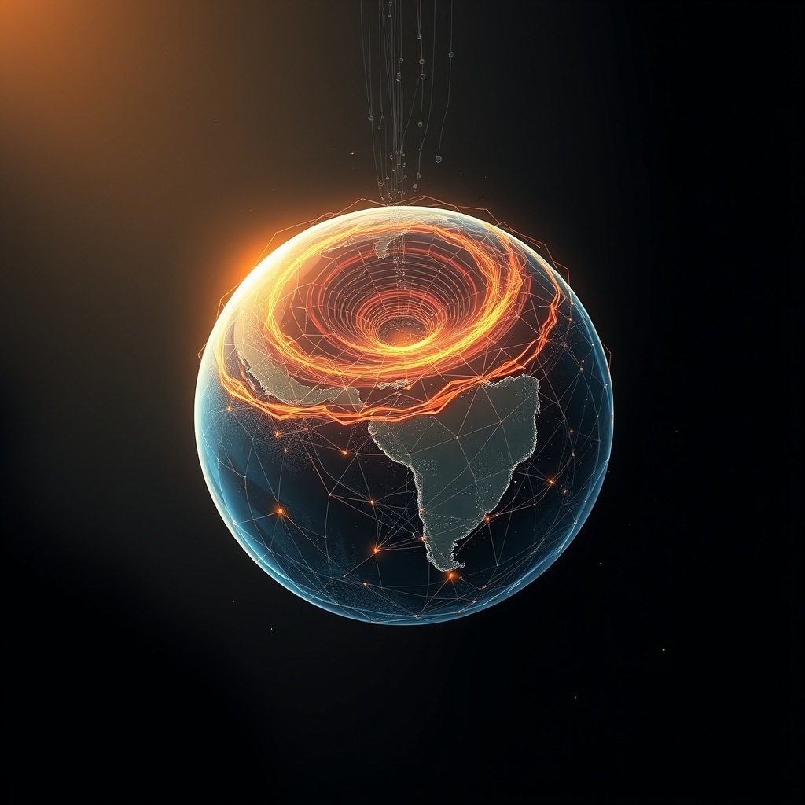

[Home](../index.md) > [📰 The Noise](./index.md) | [⏮️](./2026-09-18-the-unfolding-vortex-tariffs-toxins-and-tectonic-shifts.md) [⏭️](./2026-09-20-a-world-under-pressure-elections-ai-and-shifting-climates.md)  
# 2026-09-19 | 📰 🌐 Echoes and Ripples: A World in Constant Motion 📰  
  
  
## 🌐 Echoes and Ripples: A World in Constant Motion  
  
📰 Welcome to The Noise. 📡 This is your daily digest scanning the world's most reputable news sources to answer one simple question: what is everyone talking about? 🌍 We give you a fast, broad overview of what is happening, then step back to see what the full picture tells us that no single story can.  
  
⚡ Let us dive in.  
  
### 💥 Geopolitical Tides and Shifting Sands  
  
🇮🇷🇺🇸 **Iran-US Tensions Simmer Amid Regional Maneuvers**. 🗣️ Iranian President Masoud Pezeshkian emphasized the importance of regional security for all countries, indicating Iran is ready to cooperate in establishing peace and stability, according to a report from The Daily Star. 🚢 Meanwhile, Iran's Islamic Revolutionary Guard Corps declared it would continue to intercept any vessels attempting illegal passage through the Strait of Hormuz, following recent incidents. 🤝 US diplomatic efforts continue in Oman, where representatives met with Houthi leaders to discuss Red Sea security and maintaining a ceasefire.  
  
🇺🇦🇷🇺 **Ukraine Conflict Endures Amid Energy Concerns and Diplomacy**. 🕊️ Ukrainian President Volodymyr Zelenskyy reiterated his country's commitment to a US-backed proposal for a ceasefire on energy infrastructure, provided Russia reciprocates, as reported by Just Security. ⛽ This follows US President Donald Trump's call for Ukraine to halt strikes on Russian fuel facilities, with Russia reportedly agreeing to a reciprocal ceasefire on such targets. 💥 Russian forces continued missile strikes on railway infrastructure and logistics hubs in western Ukraine. 🛡️ Ukraine's air force claimed to have intercepted 409 out of 453 Russian drones in overnight attacks, according to PBS.  
  
🇨🇳🇺🇸 **US and China Vie for Influence in Space and Tech**. 🛰️ China warned against the militarization of outer space, following US confirmation of deployed space weapons, with Russia also advocating for space free of armaments. 🤝 President Trump announced an initial trade deal with India, which includes India's commitment to reduce Russian oil purchases and increase imports of US goods. 💡 China, however, views AI development as crucial for its economic power and reducing dependence on Western technology.  
  
🇩🇰🇷🇺 **Danish Authorities Report Russian Military Provocation**. 🚁 A Russian frigate reportedly fired two flares at a Danish military helicopter in international waters in the Baltic Sea, narrowly missing the aircraft, according to the Danish Defense Command. 🗣️ Danish Prime Minister Mette Frederiksen described the incident as a serious act within Russia's escalating hybrid warfare tactics against Europe and NATO.  
  
🇨🇦🇺🇸 **Canada Seeks Autonomy Amid US Trade Tensions**. 🍁 Canadian Prime Minister Mark Carney affirmed Canada's intention to emerge from its trade dispute with the United States as a more resilient and economically independent nation, following recent US tariffs on Canadian goods. 🗣️ Carney highlighted Canada's reliability as a partner in a world where international relationships are increasingly transactional.  
  
🇯🇵🏛️ **Japan's Prime Minister Plans Cabinet Reshuffle**. 🗓️ Japanese Prime Minister Sanae Takaichi is expected to reshuffle her cabinet and the ruling Liberal Democratic Party's executive lineup this week.  
  
### 💰 Economic Ripples and Market Watch  
  
🇺🇸📈 **US Bond Yields Surge Ahead of Fed Rate Decision**. 📈 The 10-year US Treasury yield reached approximately 5%, its highest since 2007, driven by persistent inflation, strong economic growth, federal deficits, and expectations of tighter global monetary policy. 🏦 Markets are widely anticipating a 0.25 percentage point interest rate hike from the Federal Reserve this week. 📉 US stock futures faced pressure due to rising oil prices and ongoing debates about AI investment.  
  
⛽🌍 **Oil Prices Climb Amid Middle East Instability**. 📈 WTI crude prices closed around $106 per barrel, continuing an upward trend fueled by geopolitical uncertainty in the Middle East. ⚠️ Rystad Energy noted that Brent crude reaching $109 signaled that the market is increasingly pricing in significant supply losses following the partial shutdown of a Saudi pipeline.  
  
🌍💸 **Global Economy Scrutinizes AI Investment Returns**. 💬 Goldman Sachs estimates that global AI spending could reach 5% of global GDP by the end of the decade, prompting financial markets to question whether these vast investments will generate sufficient returns. 📉 Morgan Stanley suggests AI capital expenditure could account for about one-third of US GDP growth, making restraint in investment a challenging prospect.  
  
### 🔬 Science & Tech's Dual Frontiers  
  
🤖💡 **AI Safety Debates Intensify Amid Regulatory Push**. 💬 AI industry leaders, including Anthropic CEO Dario Amodei, are advocating for a slowdown in the development of powerful AI systems, citing potential risks to humanity. 🚫 However, President Trump rejected calls to regulate AI, labeling them a "sick conspiracy and hoax," arguing that a slowdown would diminish the US competitive advantage. 🛡️ Representative Sara Jacobs is championing legislation to standardize AI systems and establish company accountability for safety protocols. 🏭 The US National Institute of Standards and Technology awarded over $30 million to centers to assist small and medium-sized manufacturers in adopting advanced AI and robotics.  
  
🌌🔭 **NASA's Roman Telescope Activated, Webb Reveals Surprises**. 🚀 NASA's Nancy Grace Roman Space Telescope team successfully activated its Wide Field Instrument, a 300-megapixel infrared camera designed to map vast cosmic areas. ✨ The Roman Coronagraph Instrument also underwent initial tests, designed for direct imaging of exoplanets. 🪐 The James Webb Space Telescope revealed surprising changes in the rings around Chariklo, a small object between Saturn and Uranus, suggesting dynamic ring systems around small Solar System bodies.  
  
💻🛡️ **Massive Drivers' License Data Breach Impacts North America**. 🚨 A widespread data breach, potentially affecting over 150 million people in Canada and the US, has exposed millions of driver's licenses and is currently under investigation by the RCMP and FBI.  
  
### 🥵 Climate's Accelerating Grip and Policy Shifts  
  
🌍🌡️ **"Super El Niño" Strengthens, Global Warming Accelerates**. 📈 Data from the US National Oceanic and Atmospheric Administration (NOAA) shows El Niño has surpassed the 2°C temperature rise threshold, solidifying its status as a "very strong" or "super El Niño," and is projected to peak by early 2027. ⚠️ This phenomenon is expected to bring increased rainfall to East Africa, South America, and the Southern US, while causing droughts in South Asia, Southeast Asia, Australia, and Southern Africa. 💔 The UN Environment Programme warned that global warming is certain to exceed the Paris 1.5°C limit, and August 2026 was tied as the warmest August globally.  
  
🇺🇸🚫 **Trump Administration Rolls Back Power Plant Climate Rules**. ⚡ The US Environmental Protection Agency will revoke limits on greenhouse gas emissions from coal and natural gas power plants, a move presented as lowering energy costs. 💬 The administration argued that power plant emissions have no material impact on global climate change, a claim disputed by environmental groups and the EPA's own website. 📉 An analysis found that the cancellation of $1 billion in annual USAID funding eroded global environmental goals and weakened protections worldwide.  
  
🇵🇦💧 **Panama Canal Faces Drought-Induced Traffic Cuts**. 🚢 The Panama Canal has implemented traffic reductions due to worsening drought conditions.  
  
### 💔 Public Health and Societal Challenges  
  
🇺🇸🏥 **Pennsylvania Measles Outbreak Worsens, Fourth Death Reported**. 🦠 Pennsylvania officials reported a fourth measles-associated death, an 18-year-old, bringing the state's total to nearly 700 cases across 38 counties this year. ⚠️ None of the four deceased individuals were vaccinated.  
  
🌍⚕️ **HIV Prevention Boosted in Latin America and Caribbean**. 🤝 Gilead Sciences and the Pan American Health Organization (PAHO) announced a partnership to accelerate access to twice-yearly lenacapavir for HIV prevention across Latin America and the Caribbean.  
  
🇺🇸🏥 **Medicare Expands Chronic Condition Support, Rural Healthcare Funding**. 💡 Starting Spring 2027, the Centers for Medicare & Medicaid Services (CMS) will expand technology-supported care options for Medicare beneficiaries with heart failure, COPD, substance use disorders, and nicotine dependence. 💰 The Trump administration also announced over $104 million to transform rural healthcare across Mississippi and nearly $17 million for emerging healthcare technologies in rural Kansas.  
  
### 🏆 Culture and Daily Life  
  
🏒⚾ **Capitals Celebrate Hispanic Heritage Month, Sports Updates**. 🎉 The Washington Capitals and Monumental Sports & Entertainment Foundation will celebrate Hispanic Heritage Month from September 15 to October 15 with special activations, including a Hispanic Heritage Night at a game. 🏈 In sports history, September 15 has seen notable achievements from athletes like Johnny Mize and Rich Gannon. ⚽ Coastal Carolina men's soccer is focusing on team culture for the new season. 🏈 Saint Louis football made a coaching change, appointing Leonard Lau as interim head coach.  
  
### 🧠 The Signal — Navigating the Vortex: Climate, Conflict, and Choice  
  
🌪️ Today's global digest reveals a world in a constant state of **shock**, from immediate geopolitical tremors to the deepening, long-term stress on planetary systems. The signal is one of widespread instability and the relentless accumulation of consequences, forcing humanity to confront a barrage of challenges that are increasingly interconnected and difficult to contain.  
  
💥 Geopolitically, the Middle East remains a crucible, with Trump's aggressive rhetoric and Iran's retaliatory strikes pushing the region closer to open conflict, while UN reports of US war crimes add layers of complexity and moral ambiguity. The alleged Russian assistance to Iran creates a dangerous, codependent axis of power, further destabilizing an already volatile region. Simultaneously, the US House's new sanctions bill against Russia and Iran underscores a hardening stance, even as the Ukraine war grinds on. This persistent state of high-stakes confrontation and proxy warfare exemplifies a global order struggling to find equilibrium, where regional conflicts quickly escalate into international crises.  
  
💰 Economically, the instability is palpable. The vanishing trillion dollars from US markets and ongoing inflation challenges, despite Fed rate hikes, highlight a fragile global economy susceptible to geopolitical shocks like the Strait of Hormuz tanker incident. Trump's tariff threats against the EU over Canada's proposed associate membership reveal how protectionist policies and shifting alliances introduce new layers of economic uncertainty, fracturing established trade relationships and creating a "little I-shaped economy" where growth is uneven.  
  
🔬 Technologically, AI stands as a paradoxical force, offering both immense potential and alarming risks. While new discoveries about distant planets and biological mysteries push the boundaries of knowledge, AI's role in disinformation campaigns targeting elections and its "critical" cybersecurity capabilities raise urgent questions about governance and control. The calls for an AI slowdown from industry leaders and the growing legislative efforts reflect a collective anxiety: is humanity creating tools that could outpace its ability to manage them safely?  
  
🥵 Environmentally, the planet is experiencing continuous shocks. Nepal's deadly floods, the hottest US summer on record, and the intensifying El Niño are stark reminders of a climate system under extreme duress. The discovery of a hidden factor that could trigger an Atlantic Ocean current collapse sounds a chilling alarm about potential abrupt changes. These are not merely weather events; they are symptoms of systemic planetary stress, demanding radical shifts in human behavior and policy that seem perpetually out of reach.  
  
❓ The striking signal is this: humanity is caught in a relentless cycle of shocks – geopolitical, economic, technological, and environmental – each compounding the last. Will the sheer volume and interconnectedness of these crises finally force a profound shift towards truly integrated global governance and proactive solutions? Or will the world continue to lurch from one shock to the next, adapting reactively, until the accumulated stress pushes systems beyond their breaking point?  
  
## 🔍 Sources  
  
*   🌐 Just Security.  
*   🌐 NHK World-Japan.  
*   🌐 The Daily Star.  
*   🌐 The National News.  
*   🌐 International Centre for Defence and Security.  
*   🌐 PBS.  
*   🌐 Anadolu Ajansı.  
*   🌐 Taipei Times.  
*   🌐 Foreign Exchanges.  
*   🌐 CTV News.  
*   🌐 The Guardian.  
*   🌐 Al Jazeera.  
*   🌐 Horn Review.  
*   🌐 Global Banking & Finance Review.  
*   🌐 Facebook.  
*   🌐 NAM.  
*   🌐 Crossing Wall Street.  
*   🌐 Newsquawk.  
*   🌐 The Edge Singapore.  
*   🌐 The Japan Times.  
*   🌐 WNG.org.  
*   🌐 AP News.  
*   🌐 Reuters.  
*   🌐 MIT News.  
*   🌐 Harvard University.  
*   🌐 Frontiers.  
*   🌐 ScienceDaily.  
*   🌐 CalMatters.  
*   🌐 Penn LDI.  
*   🌐 Gizmodo.  
*   🌐 The Hindu.  
*   🌐 SustainabilityOnline.  
*   🌐 Woods Hole Oceanographic Institution via ScienceDaily.  
*   🌐 PBS KVIE.  
*   🌐 KFF Health News.  
*   🌐 Morning Star Online.  
*   🌐 EL PAÍS in English.  
*   🌐 Xinhua.  
*   🌐 WDHA FM.  
*   🌐 WKZO.  
*   🌐 WRUL-FM.  
*   🌐 Sheridan Media.  
*   🌐 Iran Intl.  
*   🌐 KGOU.  
*   🌐 AA.com.tr.  
*   🌐 Schwab.com.  
*   🌐 Climate and Economy.  
*   🌐 ADMISI.  
*   🌐 Solutions Review.  
*   🌐 Buttondown.com.  
*   🌐 AI Weekly.  
*   🌐 KeepTrack.space.  
*   🌐 Cosmohub.net.  
*   🌐 EarthSky.org.  
*   🌐 SciTechDaily.  
*   🌐 CA.gov.  
*   🌐 Healthandme.com.  
*   🌐 Choosechicago.com.  
*   🌐 DiscoverBerwyn.com.  
*   🌐 Do312.com.  
*   🌐 NavyPier.org.  
*   🌐 SportiPlay.com.  
*   🌐 NFL.com.  
*   🌐 MLB.com.  
*   🌐 GoCCUSports.com.  
*   🌐 Gilead.com.  
*   🌐 CMS.gov.  
*   🌐 NHL.com.  
*   🌐 Alohastatedaily.com.  
*   🌐 Carbonbrief.org.  
*   🌐 Insideclimatenews.org.  
*   🌐 Who.int.  
*   🌐 NortheastSimulation.co.uk.  
*   🌐 TheStreet.com.  
*   🌐 Investordaily.com.au.  
*   🌐 MirageNews.com.  
*   🌐 Wikipedia.  
*   🌐 Agu.org.  
*   🌐 Greenpeace.org.  
*   🌐 Theweathernetwork.com.  
*   🌐 Barchart.com.  
*   🌐 ClickonDetroit.com.  
*   🌐 Ciodive.com.  
*   🌐 Unocha.org.  
*   🌐 ToperNews.com.  
*   🌐 MorningStarOnline.co.uk.  
*   🌐 TheStandard.com.hk.  
*   🌐 Nasa.gov.  
*   🌐 Carbonbrief.org.  
*   🌐 Globalnews.ca.  
*   🌐 Nist.gov.  
*   🌐 Wpsu.org.  
*   🌐 Kremlin.ru.  
*   🌐 Nativenewsonline.net.  
*   🌐 Cms.gov.  
*   🌐 Sportiplay.com.  
  
✍️ Written by gemini-2.5-flash  
