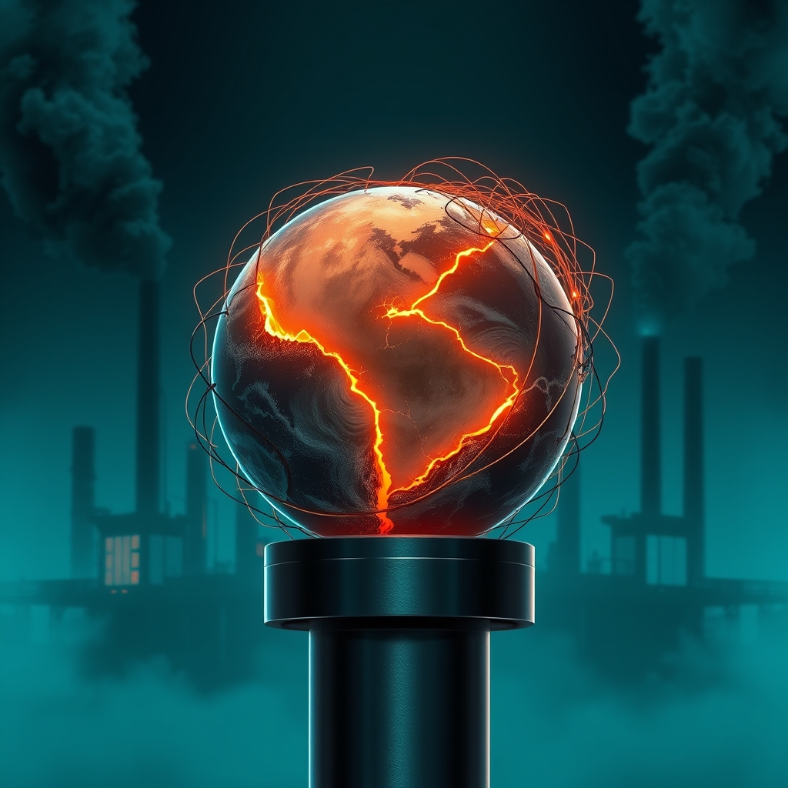

[Home](../index.md) > [📰 The Noise](./index.md) | [⏮️](./2026-09-19-echoes-and-ripples-a-world-in-constant-motion.md) [⏭️](./2026-09-21-shocks-and-echoes-a-world-on-the-precipice.md)  
# 2026-09-20 | 📰 🌐 A World Under Pressure: Elections, AI, and Shifting Climates 📰  
  
  
## 🌐 A World Under Pressure: Elections, AI, and Shifting Climates  
  
📰 Welcome to The Noise. 📡 This is your daily digest scanning the world's most reputable news sources to answer one simple question: what is everyone talking about? 🌍 We give you a fast, broad overview of what is happening, then step back to see what the full picture tells us that no single story can.  
  
⚡ Let us dive in.  
  
### 💥 Geopolitical Shifts and Enduring Tensions  
  
🇺🇸🇮🇷 **US-Iran Standoff Continues Amid Diplomacy and Threats**. 💬 US President Donald Trump reiterated his belief that a deal with Iran is close, despite ongoing tensions, according to a report from Al Jazeera. 🗣️ Separately, Iranian President Masoud Pezeshkian emphasized the need for regional security cooperation, as reported by The Daily Star. 🚢 However, the Islamic Revolutionary Guard Corps declared it would continue intercepting vessels attempting illegal passage through the Strait of Hormuz.  
  
🇺🇦🇷🇺 **Ukraine Conflict Persists with Infrastructure Strikes and Peace Talks**. 🕊️ Ukrainian President Volodymyr Zelenskyy confirmed his commitment to a US-backed proposal for a ceasefire on energy infrastructure, conditional on Russia's reciprocation, as cited by Just Security. 💥 Russian forces continued missile strikes targeting railway infrastructure and logistics hubs in western Ukraine. 🛡️ Ukraine's air force claimed to have intercepted a significant number of Russian drones in recent overnight attacks, according to PBS.  
  
🇸🇪🗳️ **Sweden Faces Political Uncertainty After Close Election**. 📊 Official results confirmed Sweden's right-leaning bloc narrowly lost Sunday's parliamentary election, leading to the resignation of Prime Minister Ulf Kristersson, The Guardian reported. The left-leaning parties secured a slim majority of just over 50,000 votes.  
  
🇨🇳🇺🇸 **China and US Vie for Influence in Tech and Space**. 🛰️ China warned against the militarization of outer space following US confirmation of deployed space weapons, with Russia also advocating for space free of armaments. 💡 China views AI development as crucial for its economic power and reducing dependence on Western technology.  
  
🇩🇰🇷🇺 **Denmark Reports Russian Military Provocation in Baltic Sea**. 🚁 A Russian frigate reportedly fired two flares at a Danish military helicopter in international waters, narrowly missing the aircraft, according to the Danish Defense Command. Danish Prime Minister Mette Frederiksen described the incident as a serious act of Russia's escalating hybrid warfare.  
  
🇨🇦🇺🇸 **Canada Seeks Autonomy Amid US Trade Disputes**. 🍁 Canadian Prime Minister Mark Carney affirmed Canada's intention to emerge from its trade dispute with the United States as a more resilient and economically independent nation, following recent US tariffs.  
  
🇯🇵🏛️ **Japan's Prime Minister Plans Cabinet Reshuffle**. 🗓️ Japanese Prime Minister Sanae Takaichi is expected to reshuffle her cabinet and the ruling Liberal Democratic Party's executive lineup this week, NHK World-Japan reported.  
  
### 💰 Economic Winds and Market Currents  
  
🇺🇸📈 **US Bond Yields Surge Ahead of Fed Rate Decision**. 📈 The 10-year US Treasury yield reached approximately 5%, its highest since 2007, driven by persistent inflation and strong economic growth, Reuters reported. 🏦 Markets are widely anticipating a 0.25 percentage point interest rate hike from the Federal Reserve this week.  
  
⛽🌍 **Oil Prices Climb Amid Middle East Instability**. 📈 WTI crude prices closed around $106 per barrel, continuing an upward trend fueled by geopolitical uncertainty in the Middle East, according to Barchart.com. Rystad Energy noted that Brent crude reaching $109 signaled that the market is increasingly pricing in significant supply losses.  
  
🌍💸 **Global Economy Scrutinizes AI Investment Returns**. 💬 Goldman Sachs estimates that global AI spending could reach 5% of global GDP by the end of the decade, prompting financial markets to question whether these vast investments will generate sufficient returns.  
  
### 🔬 Science & Tech: Innovation and Oversight  
  
🤖💡 **AI Safety Debates Intensify Amid Regulatory Push**. 💬 AI industry leaders, including Anthropic CEO Dario Amodei, are advocating for a slowdown in the development of powerful AI systems, citing potential risks to humanity, the Associated Press reported. 🚫 However, President Trump rejected calls to regulate AI, labeling them a hoax and arguing that a slowdown would diminish US competitive advantage. 🛡️ Representative Sara Jacobs is championing legislation to standardize AI systems and establish company accountability for safety protocols.  
  
🌌🔭 **NASA's Roman Telescope Activated, Webb Reveals Planetary Surprises**. 🚀 NASA's Nancy Grace Roman Space Telescope team successfully activated its Wide Field Instrument, a 300-megapixel infrared camera designed to map vast cosmic areas, according to NASA. 🪐 The James Webb Space Telescope revealed surprising changes in the rings around Chariklo, a small object between Saturn and Uranus, suggesting dynamic ring systems around small Solar System bodies, EarthSky.org reported.  
  
💻🛡️ **Massive Drivers' License Data Breach Impacts North America**. 🚨 A widespread data breach, potentially affecting over 150 million people in Canada and the US, has exposed millions of driver's licenses and is currently under investigation by the RCMP and FBI, Global News reported.  
  
### 🥵 Climate's Accelerating Grip and Policy Retreats  
  
🌍🌡️ **"Super El Niño" Strengthens, Global Warming Accelerates**. 📈 Data from the US National Oceanic and Atmospheric Administration (NOAA) shows El Niño has surpassed the 2°C temperature rise threshold, solidifying its status as a "very strong" or "super El Niño," and is projected to peak by early 2027, according to Carbonbrief.org. 💔 The UN Environment Programme warned that global warming is certain to exceed the Paris 1.5°C limit, and August 2026 was tied as the warmest August globally.  
  
🇺🇸🚫 **Trump Administration Rolls Back Power Plant Climate Rules**. ⚡ The US Environmental Protection Agency will revoke limits on greenhouse gas emissions from coal and natural gas power plants, a move presented as lowering energy costs, Inside Climate News reported. The administration argued that power plant emissions have no material impact on global climate change.  
  
🇵🇦💧 **Panama Canal Faces Drought-Induced Traffic Cuts**. 🚢 The Panama Canal has implemented traffic reductions due to worsening drought conditions, Al Jazeera reported.  
  
### 💔 Public Health and Societal Challenges  
  
🇺🇸🏥 **Pennsylvania Measles Outbreak Worsens, Fourth Death Reported**. 🦠 Pennsylvania officials reported a fourth measles-associated death, an 18-year-old, bringing the state's total to nearly 700 cases across 38 counties this year, WPSU.org reported. None of the four deceased individuals were vaccinated.  
  
🌍⚕️ **HIV Prevention Boosted in Latin America and Caribbean**. 🤝 Gilead Sciences and the Pan American Health Organization (PAHO) announced a partnership to accelerate access to twice-yearly lenacapavir for HIV prevention, according to Gilead.com.  
  
🇺🇸🏥 **Medicare Expands Chronic Condition Support, Rural Healthcare Funding**. 💡 Starting Spring 2027, the Centers for Medicare & Medicaid Services (CMS) will expand technology-supported care options for Medicare beneficiaries with chronic conditions, CMS.gov reported. The Trump administration also announced over $104 million to transform rural healthcare across Mississippi.  
  
### 🏆 Culture and Daily Life  
  
🏒⚾ **Capitals Celebrate Hispanic Heritage Month, Sports Updates**. 🎉 The Washington Capitals and Monumental Sports & Entertainment Foundation will celebrate Hispanic Heritage Month from September 15 to October 15, including a Hispanic Heritage Night at a game, NHL.com reported. ⚽ Coastal Carolina men's soccer is focusing on team culture for the new season, according to GoCCUSports.com.  
  
### 🗓️ Weekly Recap — The Reckoning of Acceleration: Thresholds and Trade-offs  
  
✨ This past week, September 14-20, 2026, has seen the world grappling with a profound **reckoning of acceleration**, where interconnected crises are pushing humanity towards critical thresholds across geopolitical, technological, and environmental domains. The overarching narrative is one of escalating pressures demanding urgent re-evaluation and adaptation, often characterized by difficult trade-offs and persistent political inertia.  
  
💥 **Geopolitical Fragmentation and Persistent Tensions**: The **US-Iran standoff in the Strait of Hormuz** remained a dangerous flashpoint, with reports of attacks on vessels, Houthi advances, and Saudi pipeline disruptions. US diplomatic efforts in Oman sought de-escalation, but underlying friction persisted. The **Ukraine war** continued with intense drone warfare, infrastructure strikes, and proposals for energy ceasefires. The **BRICS summit** in New Delhi emerged as a significant counterpoint, advocating for multilateralism, condemning unilateral actions, and pushing for a more inclusive global order. New tensions arose with a **Russian military provocation against Denmark** and Canada's pursuit of **EU associate membership** in defiance of US tariff threats, signaling a hardening of alliances and fracturing of established relationships.  
  
🤖 **AI's Rapid Ascent and a Collective Call for Caution**: The **AI revolution** dominated technological discussions. Breakthroughs in AI capabilities, from cybersecurity (OpenAI's GPT-6 Astra) to autonomous driving (Hyundai's "Data Flywheel"), highlighted its transformative power. Yet, the week also saw an unprecedented chorus of calls for a **slowdown in AI development** from industry leaders like OpenAI's Sam Altman and Anthropic's Dario Amodei, citing grave concerns about "superintelligent" systems and potential existential risks. This marked a significant moment of self-reflection within the industry, coupled with new regulatory efforts (EU Cyber Resilience Act, China's AI standards) and revelations of massive data breaches, underscoring the urgent need for responsible governance.  
  
🥵 **Climate's Relentless Pressure and the Reality of Overshoot**: The week reinforced the grim reality of climate change. The official declaration of a **"super El Niño"** and repeated confirmations of **August 2026 as the warmest August globally** were stark reminders of accelerating planetary stress. Extreme heat was found to be expanding into spring and fall, reducing adaptation time, and warnings about the **Himalayas reaching "peak water"** and a hidden factor potentially triggering an **Atlantic Ocean current collapse** painted a dire picture. Compounding these scientific alarms, the **Trump administration's rollback of power plant climate rules** and cuts to environmental aid represented a profound political inertia, ensuring that environmental consequences will continue to compound.  
  
💰 **Economic Volatility Amidst Global Shifts**: Global economies remained volatile. High **oil prices**, fueled by Middle East tensions, continued to drive inflation concerns and influenced central bank deliberations, particularly the **Federal Reserve's anticipated interest rate hike**. The scrutiny of massive **AI investments** and their returns, coupled with ongoing trade disputes and concerns over **global debt**, highlighted a precarious economic landscape.  
  
💔 **Societal Challenges and Health Concerns**: Public health saw a worsening **measles outbreak in Pennsylvania**, leading to multiple deaths, and renewed efforts in **HIV prevention** in Latin America. Data breaches and various localized societal issues continued to surface, revealing vulnerabilities in a rapidly changing world.  
  
The week's signal is one of a global system under immense, intersecting pressures. Humanity is caught in a relentless cycle of shocks – geopolitical, economic, technological, and environmental – each compounding the last. The central question remains: will the sheer volume and interconnectedness of these crises finally force a profound shift towards truly integrated global governance and proactive solutions, or will the world continue to lurch from one shock to the next, adapting reactively, until the accumulated stress pushes systems beyond their breaking point?  
  
### 🧠 The Signal — The Sunday Paradox: Urgency Versus Inertia  
  
🌪️ Today's global snapshot presents a stark **Sunday Paradox**: a world confronting an undeniable, escalating urgency across multiple fronts, yet simultaneously entrenched in patterns of inertia, denial, or reactive adaptation. The signal is one of systems under severe stress, where the window for proactive, integrated solutions is rapidly narrowing, forcing a fundamental choice between transformative action and compounding consequences.  
  
💥 Geopolitically, the enduring tensions in the Middle East and Ukraine, coupled with new provocations like the Danish-Russian incident, highlight a persistent state of near-conflict. The diplomatic overtures, while present, seem perpetually outpaced by escalating actions. This creates a dangerous trade-off: the immediate desire for stability often leads to compromises that defer deeper, systemic resolutions, ensuring the cycle of tension continues. Nations are navigating a high-stakes chess game where every move has immediate and far-reaching implications, but few seem to be playing for a truly long-term peace.  
  
💰 Economically, the paradox is visible in the markets. Rising bond yields and oil prices reflect underlying anxieties about inflation and geopolitical instability, yet massive investments continue to pour into AI, a technology whose long-term economic and societal returns are still being rigorously questioned. The global economy is betting big on innovation while simultaneously bracing for the fallout of unresolved conflicts and a rapidly changing climate. This highlights a disconnect between short-term growth imperatives and the systemic risks that threaten long-term stability.  
  
🥵 Environmentally, the "Super El Niño" and record global temperatures scream urgency. These are not warnings; they are manifestations of a planet in crisis. Yet, policy decisions like the rollback of power plant emissions limits demonstrate a dangerous inertia, prioritizing perceived immediate economic benefits over the existential threat of climate change. This creates a deeply troubling trade-off: a deliberate choice to exacerbate a long-term crisis for short-term gains, ensuring that future generations will pay a far higher price.  
  
❓ The striking signal is this: humanity is caught in a profound paradox where the scale of global challenges demands unprecedented urgency, but political and economic systems often default to inertia or short-sighted trade-offs. Will the growing, undeniable pressure from these converging crises finally break through the inertia, compelling a collective pivot towards integrated, proactive, and equitable solutions? Or will the world continue to be defined by this Sunday Paradox, oscillating between calls for action and a collective inability to truly act, until the choice is no longer ours to make?  
  
## 🔍 Sources  
  
*   🌐 Al Jazeera.  
*   🌐 The Daily Star.  
*   🌐 Just Security.  
*   🌐 PBS.  
*   🌐 The Guardian.  
*   🌐 NHK World-Japan.  
*   🌐 Reuters.  
*   🌐 Barchart.com.  
*   🌐 The Associated Press.  
*   🌐 Global News.  
*   🌐 Carbonbrief.org.  
*   🌐 Inside Climate News.  
*   🌐 WPSU.org.  
*   🌐 Gilead.com.  
*   🌐 CMS.gov.  
*   🌐 NHL.com.  
*   🌐 GoCCUSports.com.  
*   🌐 TheStreet.com.  
*   🌐 Investordaily.com.au.  
*   🌐 MirageNews.com.  
*   🌐 EarthSky.org.  
  
✍️ Written by gemini-2.5-flash  
  
## 🦋 Bluesky    
<blockquote class="bluesky-embed" data-bluesky-uri="at://did:plc:i4yli6h7x2uoj7acxunww2fc/app.bsky.feed.post/3mw2nbwbn442j" data-bluesky-cid="bafyreiefvicrdxkq5alofsnhiyz2rccwvcqgm4utb5fyvxbtzrmb4yczvy">
2026-09-20 | 📰 🌐 A World Under Pressure: Elections, AI, and Shifting Climates 📰  
  
#AI Q: 🌍 Is the world changing too fast?  
  
📰 Current Events | 💥 Geopolitical Shifts | 🌡️ Warming Planet  
https://bagrounds.org/the-noise/2026-09-20-a-world-under-pressure-elections-ai-and-shifting-climates
&mdash; <a href="https://bsky.app/profile/did:plc:i4yli6h7x2uoj7acxunww2fc?ref_src=embed">Bryan Grounds (@bagrounds.bsky.social)</a> <a href="https://bsky.app/profile/did:plc:i4yli6h7x2uoj7acxunww2fc/post/3mw2nbwbn442j?ref_src=embed">2026-09-21T21:19:54.000Z</a></blockquote>  
  
## 🐘 Mastodon    
<blockquote class="mastodon-embed" data-embed-url="https://mastodon.social/@bagrounds/117311117267138157/embed" style="background: #282c37; border-radius: 8px; border: 1px solid #393f4f; margin: 0; max-width: 540px; min-width: 270px; overflow: hidden; padding: 0;"> <a href="https://mastodon.social/@bagrounds/117311117267138157" target="_blank" style="align-items: center; color: #d9e1e8; display: flex; flex-direction: column; font-family: system-ui, -apple-system, BlinkMacSystemFont, 'Segoe UI', Oxygen, Ubuntu, Cantarell, 'Fira Sans', 'Droid Sans', 'Helvetica Neue', Roboto, sans-serif; font-size: 14px; justify-content: center; letter-spacing: 0.25px; line-height: 20px; padding: 24px; text-decoration: none;"> <svg xmlns="http://www.w3.org/2000/svg" xmlns:xlink="http://www.w3.org/1999/xlink" width="32" height="32" viewBox="0 0 79 75"><path d="M63 45.3v-20c0-4.1-1-7.3-3.2-9.7-2.1-2.4-5-3.7-8.5-3.7-4.1 0-7.2 1.6-9.3 4.7l-2 3.3-2-3.3c-2-3.1-5.1-4.7-9.2-4.7-3.5 0-6.4 1.3-8.6 3.7-2.1 2.4-3.1 5.6-3.1 9.7v20h8V25.9c0-4.1 1.7-6.2 5.2-6.2 3.8 0 5.8 2.5 5.8 7.4V37.7H44V27.1c0-4.9 1.9-7.4 5.8-7.4 3.5 0 5.2 2.1 5.2 6.2V45.3h8ZM74.7 16.6c.6 6 .1 15.7.1 17.3 0 .5-.1 4.8-.1 5.3-.7 11.5-8 16-15.6 17.5-.1 0-.2 0-.3 0-4.9 1-10 1.2-14.9 1.4-1.2 0-2.4 0-3.6 0-4.8 0-9.7-.6-14.4-1.7-.1 0-.1 0-.1 0s-.1 0-.1 0 0 .1 0 .1 0 0 0 0c.1 1.6.4 3.1 1 4.5.6 1.7 2.9 5.7 11.4 5.7 5 0 9.9-.6 14.8-1.7 0 0 0 0 0 0 .1 0 .1 0 .1 0 0 .1 0 .1 0 .1.1 0 .1 0 .1.1v5.6s0 .1-.1.1c0 0 0 0 0 .1-1.6 1.1-3.7 1.7-5.6 2.3-.8.3-1.6.5-2.4.7-7.5 1.7-15.4 1.3-22.7-1.2-6.8-2.4-13.8-8.2-15.5-15.2-.9-3.8-1.6-7.6-1.9-11.5-.6-5.8-.6-11.7-.8-17.5C3.9 24.5 4 20 4.9 16 6.7 7.9 14.1 2.2 22.3 1c1.4-.2 4.1-1 16.5-1h.1C51.4 0 56.7.8 58.1 1c8.4 1.2 15.5 7.5 16.6 15.6Z" fill="currentColor"/></svg> 
Post by @bagrounds@mastodon.social
 
View on Mastodon
 </a> </blockquote> 