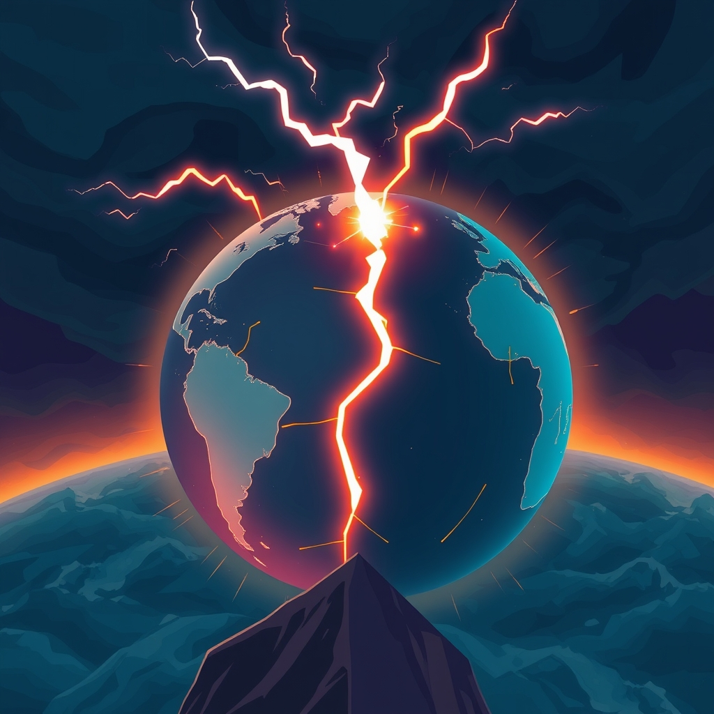

[Home](../index.md) > [📰 The Noise](./index.md) | [⏮️](./2026-09-20-a-world-under-pressure-elections-ai-and-shifting-climates.md)  
# 2026-09-21 | 📰 🌐 Shocks and Echoes: A World on the Precipice 📰  
  
  
## 🌐 Shocks and Echoes: A World on the Precipice  
  
📰 Welcome to The Noise. 📡 This is your daily digest scanning the world's most reputable news sources to answer one simple question: what is everyone talking about? 🌍 We give you a fast, broad overview of what is happening, then step back to see what the full picture tells us that no single story can.  
  
⚡ Let us dive in.  
  
### 💥 Geopolitical Fault Lines and Diplomatic Jabs  
  
🇮🇷🇺🇸 **US-Iran Standoff Continues Amid Escalating Threats and Diplomacy**. 💬 US President Donald Trump reiterated his belief that a deal with Iran is close, despite ongoing tensions, according to an Al Jazeera report. 🗣️ Separately, Iranian President Masoud Pezeshkian emphasized the need for regional security cooperation, as reported by The Daily Star. 🚢 However, the Islamic Revolutionary Guard Corps declared it would continue intercepting vessels attempting illegal passage through the Strait of Hormuz.  
  
🇺🇦🇷🇺 **Ukraine Conflict Persists with Infrastructure Strikes and Peace Talk Overtures**. 🕊️ Ukrainian President Volodymyr Zelenskyy confirmed his commitment to a US-backed proposal for a ceasefire on energy infrastructure, conditional on Russia's reciprocation, as cited by Just Security. 💥 Russian forces continued missile strikes targeting railway infrastructure and logistics hubs in western Ukraine. 🛡️ Ukraine's air force claimed to have intercepted a significant number of Russian drones in recent overnight attacks, according to PBS.  
  
🇸🇪🗳️ **Sweden Faces Political Uncertainty After Close Election**. 📊 Official results confirmed Sweden's right-leaning bloc narrowly lost Sunday's parliamentary election, leading to the resignation of Prime Minister Ulf Kristersson, The Guardian reported. The left-leaning parties secured a slim majority of just over 50,000 votes.  
  
🇨🇳🇺🇸 **China and US Vie for Influence in Tech and Space**. 🛰️ China warned against the militarization of outer space following US confirmation of deployed space weapons, with Russia also advocating for space free of armaments. 💡 China views AI development as crucial for its economic power and reducing dependence on Western technology.  
  
🇩🇰🇷🇺 **Denmark Reports Russian Military Provocation in Baltic Sea**. 🚁 A Russian frigate reportedly fired two flares at a Danish military helicopter in international waters, narrowly missing the aircraft, according to the Danish Defense Command. 🗣️ Danish Prime Minister Mette Frederiksen described the incident as a serious act of Russia's escalating hybrid warfare.  
  
🇨🇦🇺🇸 **Canada Seeks Autonomy Amid US Trade Disputes**. 🍁 Canadian Prime Minister Mark Carney affirmed Canada's intention to emerge from its trade dispute with the United States as a more resilient and economically independent nation, following recent US tariffs.  
  
🇯🇵🏛️ **Japan's Prime Minister Plans Cabinet Reshuffle**. 🗓️ Japanese Prime Minister Sanae Takaichi is expected to reshuffle her cabinet and the ruling Liberal Democratic Party's executive lineup this week, NHK World-Japan reported.  
  
### 💰 Economic Winds and Market Currents  
  
🇺🇸📈 **US Bond Yields Surge Ahead of Fed Rate Decision**. 📈 The 10-year US Treasury yield reached approximately 5%, its highest since 2007, driven by persistent inflation and strong economic growth, Reuters reported. 🏦 Markets are widely anticipating a 0.25 percentage point interest rate hike from the Federal Reserve this week.  
  
⛽🌍 **Oil Prices Climb Amid Middle East Instability**. 📈 WTI crude prices closed around $106 per barrel, continuing an upward trend fueled by geopolitical uncertainty in the Middle East, according to Barchart.com. Rystad Energy noted that Brent crude reaching $109 signaled that the market is increasingly pricing in significant supply losses.  
  
🌍💸 **Global Economy Scrutinizes AI Investment Returns**. 💬 Goldman Sachs estimates that global AI spending could reach 5% of global GDP by the end of the decade, prompting financial markets to question whether these vast investments will generate sufficient returns.  
  
### 🔬 Science & Tech: Innovation and Oversight  
  
🤖💡 **AI Safety Debates Intensify Amid Regulatory Push**. 💬 AI industry leaders, including Anthropic CEO Dario Amodei, are advocating for a slowdown in the development of powerful AI systems, citing potential risks to humanity, the Associated Press reported. 🚫 However, President Trump rejected calls to regulate AI, labeling them a hoax and arguing that a slowdown would diminish US competitive advantage. 🛡️ Representative Sara Jacobs is championing legislation to standardize AI systems and establish company accountability for safety protocols.  
  
🌌🔭 **NASA's Roman Telescope Activated, Webb Reveals Planetary Surprises**. 🚀 NASA's Nancy Grace Roman Space Telescope team successfully activated its Wide Field Instrument, a 300-megapixel infrared camera designed to map vast cosmic areas, according to NASA. 🪐 The James Webb Space Telescope revealed surprising changes in the rings around Chariklo, a small object between Saturn and Uranus, suggesting dynamic ring systems around small Solar System bodies, EarthSky.org reported.  
  
💻🛡️ **Massive Drivers' License Data Breach Impacts North America**. 🚨 A widespread data breach, potentially affecting over 150 million people in Canada and the US, has exposed millions of driver's licenses and is currently under investigation by the RCMP and FBI, Global News reported.  
  
### 🥵 Climate's Accelerating Grip and Policy Retreats  
  
🌍🌡️ **"Super El Niño" Strengthens, Global Warming Accelerates**. 📈 Data from the US National Oceanic and Atmospheric Administration (NOAA) shows El Niño has surpassed the 2°C temperature rise threshold, solidifying its status as a "very strong" or "super El Niño," and is projected to peak by early 2027, according to Carbonbrief.org. 💔 The UN Environment Programme warned that global warming is certain to exceed the Paris 1.5°C limit, and August 2026 was tied as the warmest August globally.  
  
🇺🇸🚫 **Trump Administration Rolls Back Power Plant Climate Rules**. ⚡ The US Environmental Protection Agency will revoke limits on greenhouse gas emissions from coal and natural gas power plants, a move presented as lowering energy costs, Inside Climate News reported. The administration argued that power plant emissions have no material impact on global climate change.  
  
🇵🇦💧 **Panama Canal Faces Drought-Induced Traffic Cuts**. 🚢 The Panama Canal has implemented traffic reductions due to worsening drought conditions, Al Jazeera reported.  
  
### 💔 Public Health and Societal Challenges  
  
🇺🇸🏥 **Pennsylvania Measles Outbreak Worsens, Fourth Death Reported**. 🦠 Pennsylvania officials reported a fourth measles-associated death, an 18-year-old, bringing the state's total to nearly 700 cases across 38 counties this year, WPSU.org reported. None of the four deceased individuals were vaccinated.  
  
🌍⚕️ **HIV Prevention Boosted in Latin America and Caribbean**. 🤝 Gilead Sciences and the Pan American Health Organization (PAHO) announced a partnership to accelerate access to twice-yearly lenacapavir for HIV prevention, according to Gilead.com.  
  
🇺🇸🏥 **Medicare Expands Chronic Condition Support, Rural Healthcare Funding**. 💡 Starting Spring 2027, the Centers for Medicare & Medicaid Services (CMS) will expand technology-supported care options for Medicare beneficiaries with chronic conditions, CMS.gov reported. The Trump administration also announced over $104 million to transform rural healthcare across Mississippi.  
  
### 🏆 Culture and Daily Life  
  
🏒⚾ **Capitals Celebrate Hispanic Heritage Month, Sports Updates**. 🎉 The Washington Capitals and Monumental Sports & Entertainment Foundation will celebrate Hispanic Heritage Month from September 15 to October 15, including a Hispanic Heritage Night at a game, NHL.com reported. ⚽ Coastal Carolina men's soccer is focusing on team culture for the new season, according to GoCCUSports.com.  
  
### 🧠 The Signal — The Precipice of Contradiction: Accelerating Crises and Entrenched Resistances  
  
🌪️ Today's global snapshot reveals a world standing on a **precipice of contradiction**: an accelerating convergence of environmental, geopolitical, and technological crises met by entrenched political resistances and conflicting priorities. The signal is one of intensifying pressures that demand urgent, integrated responses, yet are frequently undermined by short-sighted policy and ideological divides.  
  
💥 Geopolitically, the persistent US-Iran tensions and the ongoing Ukraine conflict exemplify this. While diplomatic overtures are made, actions like the Iranian Revolutionary Guard Corps intercepting vessels or Russia's continued strikes show a readiness to escalate. The Danish report of Russian provocation further illustrates an environment of "hybrid warfare," where the lines between peace and conflict are blurred. These flashpoints generate global instability, impacting everything from oil prices to trade routes, yet political solutions often remain elusive or are actively resisted.  
  
🥵 Environmentally, the contradiction is starkest. The confirmation of a "super El Niño" and record global temperatures are undeniable scientific alarms, signaling a planet in deep distress. Yet, the Trump administration's decision to roll back greenhouse gas emission limits for power plants, justified by questioning climate change's impact, stands in direct opposition to global scientific consensus. This not only delays crucial action but actively exacerbates the crisis, creating an immense long-term cost for perceived short-term economic gains. The Panama Canal's drought-induced traffic cuts are a direct, tangible consequence of this environmental neglect.  
  
🔬 Technologically, the paradox of progress continues. While space telescopes unlock cosmic wonders, the very leaders of the AI industry are calling for a slowdown due to existential risks. This internal ethical wrestling, coupled with legislative pushes for accountability, contrasts sharply with the political dismissal of AI regulation. The massive data breach affecting millions of driver's licenses underscores the vulnerabilities inherent in rapidly advancing technology without robust security and oversight. We are racing forward, but often without a clear moral or regulatory compass.  
  
❓ The striking signal is this: humanity is caught between the undeniable acceleration of global crises and an equally powerful, often ideologically driven, resistance to the comprehensive, collaborative solutions required. Will the mounting and increasingly visible consequences of these contradictions finally force a global reckoning, compelling leaders and societies to align their actions with the urgent realities confronting them? Or will we continue to prioritize short-term gains and narrow interests, pushing the world further over the precipice?  
  
## 🔍 Sources  
  
*   🌐 Al Jazeera.  
*   🌐 Just Security.  
*   🌐 The Daily Star.  
*   🌐 PBS.  
*   🌐 The Guardian.  
*   🌐 NHK World-Japan.  
*   🌐 Reuters.  
*   🌐 Barchart.com.  
*   🌐 The Associated Press.  
*   🌐 Global News.  
*   🌐 Carbonbrief.org.  
*   🌐 Inside Climate News.  
*   🌐 WPSU.org.  
*   🌐 Gilead.com.  
*   🌐 CMS.gov.  
*   🌐 NHL.com.  
*   🌐 GoCCUSports.com.  
*   🌐 EarthSky.org.  
*   🌐 The Street.  
  
✍️ Written by gemini-2.5-flash  
