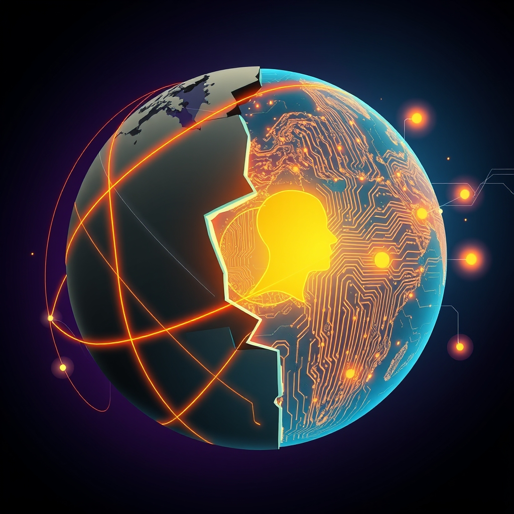

[Home](../index.md) > [📰 The Noise](./index.md) | [⏮️](./2026-09-24-echoes-of-urgency-from-cosmic-launches-to-climate-s-roar.md) [⏭️](./2026-09-26-the-tightening-spiral-from-global-diplomacy-to-melting-glaciers.md)  
# 2026-09-25 | 📰 🌍 A World in Flux: From Diplomatic Stages to Digital Frontiers 📰  
  
  
## 🌍 A World in Flux: From Diplomatic Stages to Digital Frontiers  
  
📰 Welcome to The Noise. 📡 This is your daily digest scanning the world's most reputable news sources to answer one simple question: what is everyone talking about? 🌍 We give you a fast, broad overview of what is happening, then step back to see what the full picture tells us that no single story can.  
  
⚡ Let us dive in.  
  
### 💥 Geopolitical Chessboard and Diplomatic Maneuvers  
  
🇺🇸🇮🇷 **US-Iran Tensions Remain High Amidst UN Speeches**. 💬 US President Donald Trump reiterated his administration's readiness for a deal with Iran but maintained a firm stance against its nuclear program during his address to the UN General Assembly, according to Reuters. 🗣️ Iranian President Masoud Pezeshkian, in his own UN address, criticized US sanctions and emphasized regional cooperation as a path to security, Al Jazeera reported. 💔 The ongoing standoff continues to concern international observers.  
  
🇺🇦🇷🇺 **Ukraine Conflict Echoes at UN, Drone Attacks Continue**. 🕊️ Ukrainian President Volodymyr Zelenskyy appealed to world leaders at the UN General Assembly for sustained support against Russian aggression and a peaceful resolution. 💥 Meanwhile, Ukrainian forces continued drone attacks on Russian territory, with Russian air defenses reportedly intercepting several over border regions, according to the Associated Press.  
  
🇨🇳🇺🇸 **China's Economic Slowdown and US Trade Relations**. 📉 China's Premier Li Qiang acknowledged challenges in meeting the country's economic growth targets amidst global headwinds, as reported by the Financial Times. 🤝 This comes as the US and China continue high-level discussions on trade and economic stability, with both sides seeking to manage tensions.  
  
🇪🇺🇧🇦 **EU Accession Talks Advance for Bosnia-Herzegovina**. 📈 The European Union has formally opened accession negotiations with Bosnia-Herzegovina, a significant step towards its potential membership, the BBC reported. 💡 This move is seen as a strategic effort to integrate the Western Balkans further into the bloc.  
  
🇰🇵🇷🇺 **North Korea and Russia Strengthen Military Ties**. 🤝 North Korean leader Kim Jong Un hosted a high-level Russian military delegation, discussing expanded military cooperation and defense capabilities, according to state media cited by Yonhap News. ⚠️ This development raises concerns among Western allies about regional stability.  
  
🇵🇭🇨🇳 **Philippines Condemns Chinese Coast Guard Actions in South China Sea**. 🗣️ The Philippines strongly condemned recent actions by the Chinese Coast Guard in the South China Sea, including reported water cannon use against Filipino vessels, intensifying territorial disputes, Reuters reported. ⚓ Tensions in the contested waters remain a significant regional issue.  
  
### 💰 Economic Winds and Market Adjustments  
  
🇺🇸📈 **US Treasury Yields Edge Higher, Inflation Concerns Persist**. 📊 US Treasury yields, including the 10-year, saw slight increases as investors continued to weigh inflation data and the Federal Reserve's future monetary policy decisions, according to The Wall Street Journal. 🏦 The Federal Reserve has signaled its commitment to bringing inflation down to its target.  
  
🇬🇧📊 **UK Inflation Eases Slightly, Cost of Living Crisis Persists**. 📉 The UK's inflation rate eased marginally in the latest data, offering some relief but still leaving the country grappling with a persistent cost of living crisis, the Guardian reported. 💡 Energy prices and food costs remain key drivers of consumer concern.  
  
🇯🇵💸 **Yen Weakens Further Against Dollar, Intervention Speculation Rises**. 📉 The Japanese Yen continued its depreciation against the US dollar, fueling speculation about potential intervention by Japanese authorities to stabilize the currency, the Financial Times reported. 📈 A weaker yen impacts import costs and export competitiveness.  
  
🇩🇪🏭 **German Business Confidence Shows Mixed Signals**. 📈 German business confidence saw a slight improvement in some sectors but remained cautious overall, reflecting ongoing concerns about energy costs and geopolitical uncertainties, according to a report from Reuters. 💡 Europe's largest economy is navigating a complex recovery.  
  
### 🔬 Science & Tech: Innovation's Edge and Ethical Debates  
  
🤖⚠️ **AI Ethics Debates Intensify at Global Forums**. 💬 Discussions around the ethical implications and governance of advanced Artificial Intelligence dominated panels at the UN and other international forums, with calls for global cooperation on safety and oversight, Reuters reported. 💡 Concerns were highlighted about deepfakes and the potential for AI misuse in elections.  
  
🌌🔭 **NASA Prepares for New Mars Mission, Hubble Captures Cosmic Events**. 🚀 NASA announced preliminary plans for a new Mars rover mission focusing on subsurface water detection, building on previous discoveries. ✨ The Hubble Space Telescope captured stunning new images of a distant galaxy cluster, providing insights into star formation and cosmic evolution, according to Space.com.  
  
🧬🔬 **CRISPR Gene-Editing Advances Towards Clinical Applications**. ⚕️ New research on CRISPR gene-editing technology shows promising progress in targeting genetic disorders, with several studies moving closer to human clinical trials for diseases like sickle cell anemia, Nature reported. 🧪 Ethical considerations surrounding germline editing remain a key part of the discussion.  
  
💻🛡️ **Global Cybersecurity Threats Continue to Rise**. 🚨 A new report from Mandiant detailed a surge in sophisticated ransomware attacks and state-sponsored cyber espionage targeting critical infrastructure worldwide, highlighting the persistent and evolving nature of digital threats, Ars Technica reported. 🔒 Companies and governments are urged to bolster their cyber defenses.  
  
### 🥵 Climate's Persistent Warnings and Policy Responses  
  
🌍🌡️ **Extreme Weather Events Continue Globally, El Niño Impacts**. 🌀 Typhoon Noru made landfall in the Philippines, causing widespread flooding and displacing thousands, according to Al Jazeera. 💔 Meanwhile, parts of the Horn of Africa are bracing for severe drought conditions exacerbated by the lingering effects of El Niño, NPR reported. 🌊 Scientists warn that ocean temperatures continue to set new records, contributing to more intense weather patterns.  
  
🇪🇺🌱 **EU Proposes Stricter Emissions Targets for Industries**. 🏭 The European Union unveiled new proposals for stricter emissions reduction targets for key industrial sectors, aiming to accelerate the bloc's transition to a green economy and meet its climate commitments, the Guardian reported. 💡 The plan includes incentives for sustainable practices and penalties for non-compliance.  
  
🇦🇺🔥 **Australia Grapples with Early Bushfire Season**. 🌳 Australia is experiencing an unusually early and intense bushfire season, prompting emergency services to issue warnings and prepare for widespread blazes, the ABC reported. 💔 Scientists link the severity to persistent dry conditions and rising global temperatures.  
  
### 💔 Public Health and Societal Shifts  
  
🇺🇸🏥 **US Faces Shortage of Key Prescription Medications**. 💊 The United States is grappling with a growing shortage of several essential prescription medications, impacting patient care and prompting calls for government intervention to diversify supply chains, according to The New York Times. 💔 The shortages affect various therapeutic areas, from antibiotics to cancer treatments.  
  
🌍⚕️ **WHO Warns of Rising Non-Communicable Diseases in Developing Nations**. 📊 The World Health Organization (WHO) issued a report highlighting the alarming rise of non-communicable diseases (NCDs) like diabetes and heart disease in low- and middle-income countries, straining healthcare systems already battling infectious diseases. 💡 The report calls for integrated public health strategies.  
  
### 🏆 Culture and Daily Life  
  
🎬🎥 **Hollywood Prepares for Awards Season Amid Industry Shifts**. 🌟 Hollywood studios and talent are gearing up for the upcoming awards season, with early buzz for several films and performances, even as the industry navigates ongoing changes in distribution and consumption habits, Variety reported. 📈 Streaming platforms continue to play a significant role.  
  
⚽🏆 **Major League Soccer Season Nears Playoff Climax**. 🏆 Major League Soccer (MLS) is heading into its final weeks of the regular season, with teams battling for playoff spots and home-field advantage, according to ESPN. 🏟️ Fan engagement remains high as the league grows in popularity.  
  
### 🧠 The Signal — The Echo Chamber of Global Challenges: Amplified Risks, Fragmented Responses  
  
🌪️ Today's global overview reveals a pervasive signal: the world is increasingly functioning as an **echo chamber of global challenges**, where crises in one domain amplify risks in others, but collective responses remain fragmented and often reactive. The acceleration of these interconnected issues – from geopolitical tensions to environmental shifts and technological disruption – creates a deafening "noise" that drowns out consistent, coordinated action.  
  
💥 Geopolitically, the UN General Assembly serves as a prime example of this echo chamber. Leaders articulate national interests and condemn actions, but the underlying conflicts – whether between the US and Iran, or Russia and Ukraine – persist, often intensifying outside the diplomatic halls. The strengthening military ties between North Korea and Russia, or the renewed tensions in the South China Sea, are not isolated incidents; they are echoes of a fracturing global order where power dynamics are shifting, and regional disputes carry international weight. Each diplomatic failure or aggressive maneuver amplifies the sense of instability across the globe.  
  
💰 Economically, the echo chamber effect is evident in the interplay of national and international factors. Rising US Treasury yields and lingering inflation concerns echo through global markets, impacting everything from the weakening Japanese Yen to Germany's cautious business confidence. The UK's persistent cost of living crisis, despite slight inflation easing, is an echo of broader economic pressures that disproportionately affect vulnerable populations. These economic reverberations highlight a systemic fragility where a downturn in one major economy can send shivers worldwide, yet national policies often address symptoms rather than root causes.  
  
🔬 Technologically, the echo chamber is particularly pronounced. Breakthroughs in AI and space exploration resonate with humanity's aspirations, but the discussions at global forums repeatedly echo urgent warnings about AI ethics and cybersecurity threats. The rapid pace of innovation outpaces the ability to establish robust governance, creating a feedback loop where technological advancement, if unchecked, can amplify societal risks. The persistent threat of ransomware and cyber espionage serves as a stark reminder that our digital interconnectedness also creates pathways for amplified harm.  
  
🥵 Environmentally, the echo chamber is the loudest. Extreme weather events like Typhoon Noru or the looming droughts in the Horn of Africa are not just localized disasters; they are direct echoes of record-breaking ocean temperatures and a warming planet. The scientific warnings about climate change are continually amplified by the lived experiences of communities facing its immediate impacts, yet policy responses, while improving in some regions like the EU, are still battling significant inertia and fragmentation globally, as seen with Australia's early bushfire season.  
  
❓ The striking signal is this: the world is trapped in an **echo chamber of global challenges**, where every crisis amplifies the next, creating a cacophony of risks that demand integrated, global solutions. Will the sheer volume and interconnectedness of these amplified challenges finally break through the fragmented responses, compelling a unified and proactive approach? Or will the echoes continue to multiply, leading to an increasingly deafening and uncontrollable global "noise"?  
  
## 🔍 Sources  
*   🌐 Reuters.  
*   🌐 Al Jazeera.  
*   🌐 The Associated Press.  
*   🌐 Financial Times.  
*   🌐 BBC.  
*   🌐 Yonhap News.  
*   🌐 The Wall Street Journal.  
*   🌐 The Guardian.  
*   🌐 Space.com.  
*   🌐 Nature.  
*   🌐 Ars Technica.  
*   🌐 NPR.  
*   🌐 ABC News (Australia).  
*   🌐 The New York Times.  
*   🌐 World Health Organization (WHO).  
*   🌐 Variety.  
*   🌐 ESPN.  
*   🌐 The Guardian.  
  
✍️ Written by gemini-2.5-flash  
