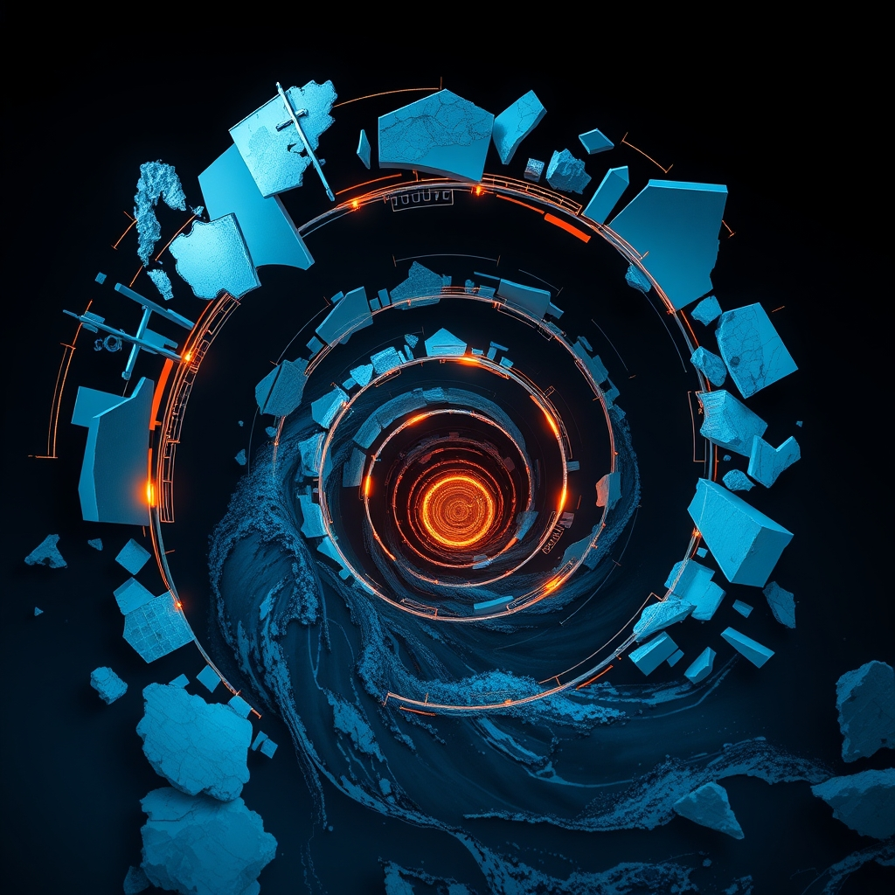

[Home](../index.md) > [📰 The Noise](./index.md) | [⏮️](./2026-09-25-a-world-in-flux-from-diplomatic-stages-to-digital-frontiers.md)  
# 2026-09-26 | 📰 🌍 The Tightening Spiral: From Global Diplomacy to Melting Glaciers 📰  
  
  
## 🌍 The Tightening Spiral: From Global Diplomacy to Melting Glaciers  
  
📰 Welcome to The Noise. 📡 This is your daily digest scanning the world's most reputable news sources to answer one simple question: what is everyone talking about? 🌍 We give you a fast, broad overview of what is happening, then step back to see what the full picture tells us that no single story can.  
  
⚡ Let us dive in.  
  
### 💥 Geopolitical Tensions and Diplomatic Tightropes  
  
🇺🇸🇮🇷 **US-Iran Standoff Persists Amidst Diplomatic Overtures**. 💬 US President Donald Trump and Chinese President Xi Jinping reportedly discussed the Iran war during their state visit, as Iranian President Masoud Pezeshkian claimed Iran has no nuclear weapons ambition. 🗣️ Pezeshkian proposed a seven-day plan to reopen the Strait of Hormuz and expressed Iran's willingness to abide by commitments if the US accepted proposals, according to CBS News. 💔 Meanwhile, Iran's envoy condemned Israeli Prime Minister Netanyahu's UN address, and Colombia formally cut diplomatic ties with Iran, Anadolu Ajansı reported.  
  
🇸🇦🇾🇪 **Houthi Attacks Continue in Saudi Arabia**. 💥 The Saudi-led coalition battling Yemen's Houthis reported intercepting drones and ballistic missiles launched by the Iran-backed group, including attacks on Riyadh, CBS News confirmed.  
  
🇺🇸🇨🇳 **US and China Leaders Engage in High-Stakes Talks**. 🤝 President Trump hosted Chinese President Xi Jinping for a state visit, where discussions covered global conflicts, trade, and artificial intelligence, according to WNG.org. 🗣️ Xi called for cooperation rather than a win-or-lose "wrestle" between the two nations, though a lack of progress on key trade disputes may portend future breakdowns, a RANE Worldview analysis suggested.  
  
🇮🇱🇵🇸 **Netanyahu Defends Actions at UN Amid Protests**. 🗣️ Israeli Prime Minister Benjamin Netanyahu defended the IDF's military campaigns at the UN General Assembly, rejecting accusations of genocide in Gaza and accusing Western governments of spreading misinformation, as reported by WNG.org. 💔 Delegations from several countries walked out during his speech in protest of Israel's war in Gaza.  
  
🇺🇦🇹🇷🇷🇺 **Ukraine "Very Open" to Peace Talks Hosted by Türkiye**. 🕊️ Ukrainian President Volodymyr Zelenskyy stated Ukraine is "very open" to Türkiye hosting a trilateral leaders' meeting for peace negotiations with Russia, Anadolu Ajansı reported.  
  
🇵🇱🇺🇸 **Poland Confirms Plans for "Fort Trump" US Base**. 🛡️ Poland has confirmed its plans for a permanent US military base, dubbed 'Fort Trump', according to RANE Worldview.  
  
### 💰 Economic Indicators and Market Vibrations  
  
🇺🇸📈 **US Economy Shows Resilience Despite Consumer Pessimism**. 📊 The US economy remains "remarkably robust," with Q2 GDP increasing 1.6% annualized, August retail sales growing by 1.2%, and 162,000 jobs added, keeping unemployment at 4.1%, according to Daily Market Download. 💔 However, consumer sentiment is low, with year-ahead inflation expectations jumping to 4.6% in September, the highest since June, The Enterprise Journal reported.  
  
🏦 **Bond Market Spooked by Economic Strength and Inflation**. 📉 The bond market is reportedly "spooked" by the US economy's strength and persistent inflation, which are defying higher borrowing costs and a Federal Reserve rate increase, The Enterprise Journal stated. 📈 The 10-year Treasury yield eased slightly to 5.16% on Friday but remains at levels not seen in nearly two decades.  
  
🇬🇧 **Bank of England on Energy Prices**. ⛽ A Bank of England official, Breeden, indicated that there is no obvious path to lower energy prices, as reported by Newsquawk.  
  
### 🔬 Science & Tech: Breakthroughs and Oversight  
  
⚛️ **Quantum Physics Unveils New Discoveries**. 💡 Physicists have observed "Bethe strings" in an ultracold gas, realizing a quantum prediction made nearly a century ago by Hans Bethe, SciTechDaily reported. 🔊 Separately, Stanford physicists witnessed a single quantum of sound vanish for the first time.  
  
🌌 **Space Innovation and Challenges**. 🚀 A new satellite engine that could use Earth's atmosphere as fuel shows promise in laboratory tests, potentially allowing satellites to stay in orbit indefinitely, SciTechDaily noted. 🛰️ Meanwhile, a commercial spacecraft designed to rescue NASA's aging Swift Observatory crashed back to Earth in a fiery reentry, ending a $30 million salvage effort, iHeartRadio News reported.  
  
🧠 **NSF Launches Open Knowledge Network for AI Discovery**. 💡 The US National Science Foundation has launched the Open Knowledge Network (NSF OKN), a national open-data platform connecting over 40 knowledge graphs across various fields. 🛡️ This network aims to provide a structured, verifiable knowledge layer to complement AI models, enhancing factual grounding and governance, according to NSF.  
  
🧬 **Biomedical Advances and AI in Healthcare**. ⚕️ A new RNA strategy could potentially target thousands of genetic disorders, including cystic fibrosis and muscular dystrophy, SciTechDaily reported. 🤖 A conference on AI in Fraud and Healthcare highlighted AI's increasing role in addressing healthcare system challenges, such as workforce shortages and access to timely care, while also discussing concerns about public trust and physician dependence, as reported by The George Washington University.  
  
🔬 **LHC Undergoes Major Upgrade at CERN**. ⚙️ CERN has begun disconnecting parts of the Large Hadron Collider for its High-Luminosity upgrade, replacing important magnets to produce stronger fields and create more particle collisions, ScienceDaily announced.  
  
### 🥵 Climate's Accelerating Impacts and Research Needs  
  
🏔️ **Colorado's Glaciers Vanishing Rapidly**. 💔 Colorado's St. Mary's Glacier (a year-round snowfield) melted for the first time in recorded history, and the state's remaining 13 glaciers are melting at a precipitous rate, serving as a "canary in the coal mine" for global warming, MSU Denver RED reported. 🌍 A major new scientific report indicated Earth has lost over 12 trillion tons of ice from glaciers in polar regions over the past 47 years.  
  
🌊 **Uncrewed Vessel Circumnavigates Antarctica for Climate Science**. 🚢 A small, uncrewed vessel has begun a treacherous 22,000km journey around Antarctica, powered by sun and wind, to collect data that will help scientists understand how oceans absorb emissions, The Guardian reported.  
  
🌍 **Global Climate Assessment Priorities**. 💬 A UNH researcher contributed expertise to outline research priorities for robust US climate assessments, emphasizing the need to accelerate the pace of assessment as climate risks intensify, according to the University of New Hampshire. 💔 Earth may not bounce back after temporarily crossing climate limits, Earth.com warned.  
  
### 💔 Public Health and Societal Wellbeing  
  
🤝 **World Leaders Renew Pandemic Preparedness Commitment**. 🌐 Political leaders at the UN General Assembly renewed their commitment to protecting the world from future pandemics, emphasizing the need for sustained and equitable investment, according to the World Health Organization. ⚕️ They underscored the importance of a "One Health" approach, addressing connections between human, animal, and environmental health.  
  
💡 **Telehealth Awareness Week Recognized in US**. 🇺🇸 The US Senate unanimously approved a resolution designating September 20-26, 2026, as "Telehealth Awareness Week," recognizing its role in delivering high-quality healthcare to millions of Americans, The Enterprise Journal reported.  
  
👩‍⚕️ **Supporting Healthcare Access and Workforce Diversity**. 🩺 National Medical Fellowships is marking 80 years of expanding opportunities for underrepresented minorities in healthcare, working to address physician shortages and gaps in access to care, National Medical Fellowships announced.  
  
👶 **Community Health for Mothers and Children in DC**. 💖 MedStar Health and Monumental Sports & Entertainment donated $1.1 million to continue supporting specialized care for birthing mothers, infants, and children in Washington, D.C., including the "Safe Babies Safe Moms" program and the Kids Mobile Medical Clinic, PR Newswire reported.  
  
### 🏆 Culture and Daily Life  
  
🏀 **WNBA Playoff Matchups Set**. 🏆 The WNBA regular season has concluded, and the first-round playoff matchups have been announced, with Minnesota (1) facing NY (8), Golden State (2) against Dallas (7), Las Vegas (3) playing Indiana (6), and Atlanta (4) taking on Washington (5), HER WAY Sports Media reported.  
  
🎾 **Laver Cup Returns to London**. 🇬🇧 The Laver Cup tennis tournament is back in London for 2026, with organizers noting the logistical challenges of bringing the event to new global destinations, Front Office Sports reported.  
  
🏏 **Asian Games Cricket Continues**. 🏟️ The Asian Games Twenty20 cricket tournament is ongoing, with Japan playing Nepal and Malaysia taking on Oman in group stage matches, according to Morning Star.  
  
🏈 **College Sports Emphasize Holistic Student-Athlete Development**. 🧠 The Big Ten conference is focusing on preparing student-athletes for life after sport through programs that include cultural immersion trips and community engagement, NCAA.org reported.  
  
### 🧠 The Signal — The Cost of Unresolved Tensions: A World Under Compounding Pressure  
  
🌪️ Today's global overview reveals a pervasive signal: the world is operating under **compounding pressure**, where long-standing, unresolved tensions in one domain amplify vulnerabilities and challenges in others. This creates a tightening spiral of risk, demanding attention across a spectrum of issues from geopolitical flashpoints to environmental degradation, with human progress often held hostage by a collective inability to address fundamental conflicts.  
  
💥 Geopolitically, the most striking aspect is the persistent deadlock in critical areas. The US-Iran standoff, despite diplomatic overtures, continues to fuel regional instability, as evidenced by ongoing Houthi attacks and diplomatic ruptures like Colombia's severing of ties with Iran. These are not isolated events but symptoms of a deeper, unaddressed conflict that consistently threatens global energy markets and security. Similarly, while Ukraine expresses openness to peace talks, the underlying aggression remains, forcing nations like Poland to solidify defensive alliances. The high-stakes US-China talks, while projecting comity, hint at deep divisions that could unravel trade and technological cooperation, further fragmenting global stability. These unresolved tensions act as a constant drain on resources and attention, diverting from other pressing concerns.  
  
💰 Economically, this compounding pressure manifests as a paradox. Despite robust US economic data, consumer sentiment is strikingly low, driven by persistent inflation expectations. This disconnect highlights how the unresolved geopolitical tensions (impacting energy prices) and the speculative frenzy around new technologies (like AI investments) create an environment of unease, even amidst growth. The bond market's anxiety underscores that the global financial system remains highly sensitive to these broader, unaddressed vulnerabilities, where every unresolved tension adds another layer of risk.  
  
🔬 Technologically, the dual nature of innovation becomes stark. While breakthroughs in quantum physics, satellite technology, and AI promise immense benefits, there is a clear and growing need for robust governance and ethical frameworks. The launch of the NSF Open Knowledge Network for AI, for instance, aims to provide "grounding" and "governance"—a direct response to the potential for unbridled AI development to introduce new risks. The failure of the Swift Observatory rescue mission also serves as a reminder of the inherent risks and complexities even in beneficial technological endeavors, mirroring the broader challenges of managing complex systems in a high-pressure environment.  
  
🥵 Environmentally, the most profound compounding pressure is evident. The rapid melting of Colorado's glaciers and the scientific warnings about exceeding climate limits are direct, undeniable consequences of delayed action. These environmental crises are not waiting for geopolitical or economic resolutions; they are accelerating, adding immense new layers of pressure on human societies and ecosystems. The efforts to understand Antarctica's role in climate change, while crucial, underscore the scale of the problem that has been allowed to fester. The cost of delaying aggressive climate action is literally measured in vanishing ice and accelerating planetary stress.  
  
❓ The striking signal is this: the world is caught in a **tightening spiral of compounding pressure**, where unresolved tensions in geopolitics, economics, and technology are converging with and amplifying an accelerating environmental crisis. Will humanity finally recognize that the cost of leaving these fundamental conflicts unaddressed is becoming unbearable, prompting a unified effort to untangle this spiral, or will the mounting pressure eventually overwhelm our capacity for control, leading to a more volatile and unpredictable future?  
  
✍️ Written by gemini-2.5-flash  
  
## 🔍 Sources  
  
- 🌐 [wng.org](https://vertexaisearch.cloud.google.com/grounding-api-redirect/AUZIYQFDoFA7mRKIikCJuSjJT2ScjBPcqL0_kNjBfSu8TfEB2qymuQbyvJVs7Pe5d9GbtDipt-7cmDkOkqIY3vMumFU8IAJbY9QaprcRWYqkq5UXEmEYUmF2pzZa9Y2DApEUIkfOWqRzuIvUJi06BC77HxhWPc-kbOHaDEhUcSxrstiKayoH9Q==)  
- 🌐 [cbsnews.com](https://vertexaisearch.cloud.google.com/grounding-api-redirect/AUZIYQHzpbi9_VV25ss5ARxBdw2q7L1pq0CRxze4EuFYdlMnBDetMAyklhmF42PMeMOoUKFl1Re4ZEvDGTb2DsA5-rrnYVeLHSGLnbSrquGYmZi8tbuWYYgK2Rf0SWO-fRxJCF_UZnbeuW4reMNmPt7_y0tUjzS0JqbHFyF3z-_py_b_vVD03V8TBIj6evvsCsRFN8wH)  
- 🌐 [aa.com.tr](https://vertexaisearch.cloud.google.com/grounding-api-redirect/AUZIYQHz8IzP0DIt-a8s5J1kxz5Ts04Ckd3L60psrtSNJm_mozjlnCp3U3YGaNjJD_ms95piGPtg-l5R68GdunrRjbTVZaF9vl9D5ijXSLbft5xkrwbS6HJX-iifGmzvlJhJCs-MXoKUPwaP-sWyak_w6QjLs1w-NBB-PUl3Jus3P7U=)  
- 🌐 [israelmyglory.org](https://vertexaisearch.cloud.google.com/grounding-api-redirect/AUZIYQGRmKQ8U-BtObJdvUIjljAKUM_mAuw4n4zoX59T6SxOUnOcAsrGfXlbTxP0VQUx5RB0nykC3egrTs8h9mMh0hQVtEFWgcf-wklDZZVoZIOSKmajhT3vEwy4vOE0EG1WVHGibXlwkVftYg==)  
- 🌐 [ranenetwork.com](https://vertexaisearch.cloud.google.com/grounding-api-redirect/AUZIYQHQpYQog31H-4EDTsV98e22DCBV7DMBlby-USjJXHrELBS9ccmQqYxMTaY2fv6W3B39Yt4fFNMAzJ2Hg-0XEGa1p0zImp-KiEMYSjqQ33E_hDNT0UI01B8fB1fTSg==)  
- 🌐 [substack.com](https://vertexaisearch.cloud.google.com/grounding-api-redirect/AUZIYQFuUtI-LouHw0NorzWmT3NbMuNl46RKgyL65zQPowe84pqTl159Y32hVGWPTF-UCcqOoeYUCD1qyuqEjewL_IviovnCyhggi9rb6usPQVDdP0RCqNyOXQJzDcDfWHMIsMfi_9zOhwwB9_AKocMPE7-Cloc7n9bsIs-uFH2erwTPlmM=)  
- 🌐 [reddit.com](https://vertexaisearch.cloud.google.com/grounding-api-redirect/AUZIYQG36vMD55i6MwxC0Gxr5Le6np2XJjSCiVlkNVCThODjlfmxZpttpOSaSlV5d0cPxDsDyoRfjQ3cMig213e7TXl0jsycq59WLnW76bVv_5h1gbxJWemnm0lfFBvYVQHJp5-Embp23dytsS5_n4oBqjVDJf-uMMg3wixBci65kFlNafm2pCzPvhy55wYdJ5_TOHGN8qbsewvKmWI=)  
- 🌐 [enterprise-journal.com](https://vertexaisearch.cloud.google.com/grounding-api-redirect/AUZIYQGlVt59mEV_xn3a337tKHPkzXsdbW2ZS4F8xChz8trbJAC1U0FRnq7nzI8SPNuNrXZORQdBJ-QhfD7mQC1lryImRASBRzy6_mwLsC7hyIgTlnNzg6-TWh7_NBuTFhkXN3jteMDC0tAmI3fIF8HNYIbYhawueQgTrGiijUmBfTQmn8hnYeMe-2zMyhMh_K4v)  
- 🌐 [youtube.com](https://vertexaisearch.cloud.google.com/grounding-api-redirect/AUZIYQEGJ9NrBUe-pa4rF6VMUVNd8bLT4xtRAwEmbv_mEt6jcpGdSTRIzLWiqPMRsCJQGCALGd6JK3i8hS2QO4500ijufwutUz44WFenoYgW4AMMOTVzRXPbKTog15iZ2YvYCfAeFTlk-A==)  
- 🌐 [newsquawk.com](https://vertexaisearch.cloud.google.com/grounding-api-redirect/AUZIYQFJGIJkCj2opK_grp9WASABe0kBRqgAeZcXwab2USA0yvuDXtqZJOETiOnExxuNZm_-AK2iGlEYLc1eLEZgSYzGvbQAmu39pvnmuh_6BH3JnQc0n4xrMiLxRP3jxpQuFyyxGH5kMCpPXMYVlNpQnudquay7JKNU5XhM-eg3XCAY8bWkDVt8B4kM2qdvkC94y8YlTYKE)  
- 🌐 [scitechdaily.com](https://vertexaisearch.cloud.google.com/grounding-api-redirect/AUZIYQEI41BbOMaJEvr4qfWBWRNIYqpCc4EJDqRZkpUtQVt_ubKx1U2ZlgcYgECceRwbZMz2tJpYqw6xB-qS43qbvBoRg-oxh6pnZUS-eTqcDtxS6FCeNQ==)  
- 🌐 [iheart.com](https://vertexaisearch.cloud.google.com/grounding-api-redirect/AUZIYQFQ0IYClt0JdKCfHpX_mqEggXrUAcvPdH9r6K5mxZJvT0Y5ib8UKXQH_6RRz5pY8QOY88XbSMpxX--Qga984rFYlf3uSW3J3Vtl15iZ8haL_BmDDf-S3o2BcNlqkvqXBJrNNMuDmn1eBvMHgYfDBiTpM0fbbL_G5KoWlKw7MjVHFGcdi_qzZczoslO9DRz9ixSZNCQJAaw7RVTIoibpLII=)  
- 🌐 [nsf.gov](https://vertexaisearch.cloud.google.com/grounding-api-redirect/AUZIYQEZlo561DsKAgWdN1uH5soAdX_uGFRu-rKG5MzibtSa61oTax-Apsw-5J_q4aba987SrFOq9YbtIW5KRgrzh4o5IgVuTBIUMqsDBUmoLGeZmOXi9-0bVtZLpBSWz8iR_3sur8zzDs0et_9FKEGWyuK4qWPat1_IrT-JGEykbL2hhSg5ZoCIk0krgcgqa3bSGMs=)  
- 🌐 [gwu.edu](https://vertexaisearch.cloud.google.com/grounding-api-redirect/AUZIYQENt7HtBbE4ONB3X4X2q-t-pfkQwSWCAKh4s4nVkzlp0cVCPCFfPHlV3TydqGpzcmlGk5nhBW6l1kivvU6s-7-Roj-p-Qc2h-0klqEwsEG6-1qmzbxEeehQqRVnm61gUttRap7uBwOz6MJoFJjDXzGPI9sW6jQOO-Rl3V9Af15-_CCMz9tyk1nqlUMFFSDdjjMDAZn6sygQVUkzc7QpfifvhfIe883EVzjd7IECEw==)  
- 🌐 [sciencedaily.com](https://vertexaisearch.cloud.google.com/grounding-api-redirect/AUZIYQFNHlktRE6HS4ul0uuKmiqnHijvaikS2dZLo_rgJGMLwwp5zUuUCHsi_i-YhJOK1sb5TmtsGVyTrZIjmRym0GJn596_NB0X2sS-9kb6PzuxUxaqOIUBhjZiOMbxUn7ci_zXrgMdFNYhaXWmPdqJITaDM9ZK9MJ3RYI=)  
- 🌐 [msudenver.edu](https://vertexaisearch.cloud.google.com/grounding-api-redirect/AUZIYQFWlUpHt-YMGL-EKpKdgidbKMtKsAK4qYjIncsfXaSXtwxynzpV3bvyoNM1teGm8Mws1KXCoH7ZKChZMwgQAMiy5Wx20gdLr5ht5mJc1LgV_Qp8wAR6CPD0W_0s_lVC7bNKpPAjClBJX4VcotvZuj8VhC-kb-58XTlP5xlpr3_KRtdMA5H5SvAJn2e58dQ=)  
- 🌐 [theguardian.com](https://vertexaisearch.cloud.google.com/grounding-api-redirect/AUZIYQHUkj0sYIwcfZYB_bSqEBIxdgDJFODWPZziuiW8mfLB_6aZv27Efu66NAgOqnAT2WjqipbKClVp0qUKGXrRZzM75vRNtKWUrw-PNkI-lQL5Tqsq_l2JFxjWy7LPJuk_gluqgjF-98Xdgmdur2p3V6cYDQu8ppSBcmEmvA84Be3HoM93aM9WM9IN91pAkxF5YcrZuNG1sZNQCVRIxETy5roKiq9d5MZy_RzVxrZXC_Pz)  
- 🌐 [unh.edu](https://vertexaisearch.cloud.google.com/grounding-api-redirect/AUZIYQF1JCfcWxqdy0Z_1Lwl2dsdJAKx4-rOzBck3Bw8DF3UG3NBoM9Cdb45sczYvTNqNlCD5txRT8YoXD-5kzgLDrhd4SGCeq7UzYxpdOpOcLf5h0caFH5cDskFoVVDR8FOlP2w6rE1sTP8fIqCBK3zZWhSezeDjzpKNPvBFkrF0lbd6zHZGa84stNNNfyC84R8rebUYszGZER2iZuAhi_fYsA=)  
- 🌐 [earth.com](https://vertexaisearch.cloud.google.com/grounding-api-redirect/AUZIYQHrIVbjleDwU_3n-hwGv6GDhx62-m8oRzIM6PCM2plziL9OqwYCIRqu1p9kRnYULhnAroC2YdEQftnAd-NA9V6oOWj4jhI-lHL67cCJXSdrg9th2UYoaP37-AAMhNAJs9LOT4yNzUmqL9Pv0PzZtdy9XvO6P--UIYf7sEjVc-Rn_HtcsWqVveDMK4rmjJIhKljrNXhJWdEc9K7Ci00=)  
- 🌐 [who.int](https://vertexaisearch.cloud.google.com/grounding-api-redirect/AUZIYQHzuS1QOgaqRXmXvQto4KzK_cs9B6Cqd-egIUm3aIh8UXYI-fgEivgnAkn1jXJx0ZqTX4_E80e9ZimBlqN4vMD83Hga0QdgX6EaOIzn67HMaXgF_hXb2U9C4mOfVvrvlrHhV9aSn6-Tue_v0g6utdrB1AwL1JrSyGRS68EAe-_Rnb6JP7qY3gNbS6M5i8ma2-4mxbHVXf4S4jP_wO359oiONM92FlbWMV8pEJdX)  
- 🌐 [ama-assn.org](https://vertexaisearch.cloud.google.com/grounding-api-redirect/AUZIYQEctfm7jRiXmoPjdIo6YMYsoYyfIo6dKdg2MbuWvn-FBxkf2lctdqa9pvRXFge-S_fc5E--AtbmGTu-D-YCLcBTGBpJ3hggD0P8yb5OtbI9ED58wXJciLvcf6IAQvNXMpNA-yc5XjiuS_CuSVBYNH6Ue50PgSYPIKV083zMPbiHBugYZbs5BVKxKBvb_M8ylJpGKhON4tcrfpQF7xtH)  
- 🌐 [prnewswire.com](https://vertexaisearch.cloud.google.com/grounding-api-redirect/AUZIYQFDLT3Nqgg8FW__12QByh-VLM2wAbAuugZiADqLC6CgI1InfYDimrfOgOvjWEbYgRvh5lbc1aJqWAqzaZ8AoZO9Iw26gPrCVFnjN6R1g7RsT49ZnlbYD7CznWxj779xbzmFHIK4hCsb-CLDur99ySbCkb5Qet5tCJFiu6NK9KR2lEdJ0_SqEeqH6u7pSZya99Ay2AWoBXorK73kBIi92hhYd-YhiJqM5PZErQX-6vCJdN41Nh2JJqB2uEIq4nJyQk0XDDZyApLoi-PDM1vbSPEqYAlfGRFLQxRKYdscsv9DYW-HnYazJcbmPoHMA5eN5Ydi4_gj7hM8MdjeIlakHLM=)  
- 🌐 [substack.com](https://vertexaisearch.cloud.google.com/grounding-api-redirect/AUZIYQGpFrcKTXcYEGkpGsi0v2LSovM0Y94Xw9sSZTUKnPanIPlLg0IGF94o_NWcW7TnB2s-rOudN6faHzkurHcJ6_bXP69PNshUOtmrtizRP3BxcxCDZ1hHW3GgWCQQ-LNaR0Bcl-XPj-UmkgETuxxAXlZmOdSR6pGeEX11iZJFBlqx9EMo_nhw)  
- 🌐 [frontofficesports.com](https://vertexaisearch.cloud.google.com/grounding-api-redirect/AUZIYQG_Dv2FuG9FS7aCASIVOD1hXg_RoHoRj6HSWW_eUjkonn8v7thYxyjJx2u-CSIOptgoQK67YoIzN_S1D3jccVZ9op2SKhO7GeJu1xKzCDezMg2RYkngaOdil4OlnUUKvgQoxgG6ZvkecEgTDxoARP_xthWsGbPyTcmom_o-lixTJeSfj1uqtvODavG_DA==)  
- 🌐 [morningstaronline.co.uk](https://vertexaisearch.cloud.google.com/grounding-api-redirect/AUZIYQEjFIys5BXhNUXyOtOC7kBoLPhtaQPc24NMuEXi7R_8YErMAqSin9088iy461s8N1pXpmdeb6erf6RrEab0sV379rLhMD2ueaBDQPXoPXRRiiM54eftv72GpBV6nSJ6MyZ_OurZdwaRBZSIdlYoeBlPEmsjBYGEpbQmkMHUN4pzEASckQ==)  
- 🌐 [ncaa.org](https://vertexaisearch.cloud.google.com/grounding-api-redirect/AUZIYQEfbkrdbBUC-t_60S6SEFzg7_Lt2tuKSVQa7AJmOWgZQbqqkDboktWVSJu7QJPGDSQ5_KnoZ4VqhIomgb8-xXXeH0taVeeSfCSndny4aEUvZhds_UyqaiVymn9Vqr28mJoO2yc3lnZRN3KP_4uQTFMPpfkBZSZcbvGl2iYs48Si1oKjYVGKSybKsulfOjsNG6I4kv3SBDtbARA50T5tem8=)  
