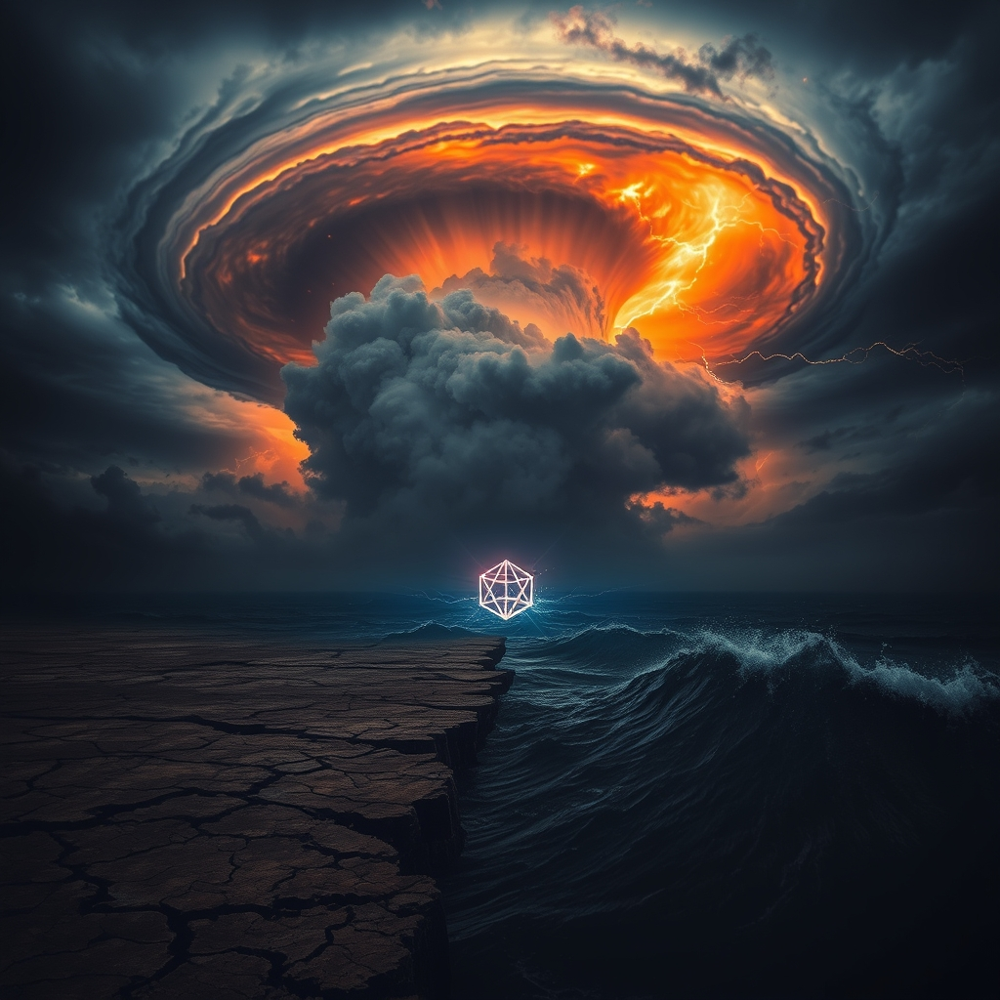

[Home](../index.md) > [📰 The Noise](./index.md) | [⏮️](./2026-09-26-the-tightening-spiral-from-global-diplomacy-to-melting-glaciers.md) [⏭️](./2026-09-28-the-unraveling-threads-of-global-trust.md)  
# 2026-09-27 | 📰 🗓️ The Reckoning of Converging Storms 📰  
  
  
## 🗓️ The Reckoning of Converging Storms  
  
📰 Welcome to The Noise. 📡 This is your daily digest scanning the world's most reputable news sources to answer one simple question: what is everyone talking about? 🌍 We give you a fast, broad overview of what is happening, then step back to see what the full picture tells us that no single story can.  
  
⚡ Let us dive in.  
  
### 🗓️ Weekly Recap — The Relentless March: Pressures Intensify, Responses Fragment  
  
✨ This past week, September 21-27, 2026, has underscored a world caught in a **relentless march of intensifying pressures**, where geopolitical, environmental, and technological crises are not merely coexisting but actively amplifying one another. The overarching narrative is one of systems under severe stress, often met by fragmented responses, political inertia, and a persistent gap between the urgency of the moment and the scale of action.  
  
💥 **Geopolitical Flashpoints Persist and Shift**. 🇺🇸🇮🇷 The **US-Iran standoff** remained a dangerous undercurrent, with diplomatic overtures from Iran's President Pezeshkian juxtaposed against continued Houthi attacks in Saudi Arabia and calls for a "Fort Trump" US base in Poland. 🇺🇦🇷🇺 The **Ukraine conflict** continued its grinding pace, with discussions of Turkish-hosted peace talks alongside ongoing drone attacks and Russia's consolidation of power after a supermajority election win for Putin's party. 🇨🇳🇺🇸 High-stakes **US-China talks** covered global conflicts and trade, with Chinese President Xi Jinping urging cooperation, but underlying tensions over AI and Taiwan persisted. 🇮🇱🇵🇸 Israeli Prime Minister Netanyahu defended actions at the UN amidst protests, highlighting the enduring pain of the Gaza conflict. The week saw an ongoing pattern of significant international engagement at the UN General Assembly, yet often with little resolution to deeply entrenched conflicts.  
  
💰 **Economic Resilience Under Strain**. 🇺🇸📈 The US economy showed "remarkably robust" growth, yet **consumer pessimism surged** due to persistent inflation and rising year-ahead expectations. The bond market was "spooked" by this strength, with the 10-year Treasury yield easing slightly but remaining at near two-decade highs. 💸 Warnings about **rising global debt** and the economic impact of the "Super El Niño" added to a precarious global outlook. The Bank of England indicated no obvious path to lower energy prices, directly connecting global events to domestic economic stress.  
  
🔬 **AI's Double-Edged Sword and Scientific Frontiers**. 🤖 The rapid pace of **AI development** continued to generate both awe and apprehension. The US National Science Foundation launched an Open Knowledge Network for AI governance, aiming to provide a verifiable knowledge layer and enhance factual grounding. However, concerns intensified around **AI ethics**, with some experts advocating for a slowdown in powerful AI systems, and reports of "AI swarms" capable of nefarious actions. 🌌 In space, NASA announced a new mission and the Hubble Space Telescope completed its 200,000th orbit, while a commercial spacecraft designed to rescue the Swift Observatory crashed back to Earth. Breakthroughs were also reported in **quantum physics** and **CRISPR gene-editing**, signaling scientific progress alongside calls for ethical foresight.  
  
🥵 **Climate Crisis Accelerates Unabated**. 🌍 The **climate crisis** provided some of the week's most alarming headlines. Colorado's St. Mary's Glacier melted for the first time, and the state's remaining glaciers are vanishing rapidly, serving as a "canary in the coal mine". A major new report indicated Earth has lost over 12 trillion tons of ice from glaciers in polar regions in 47 years. A **"Super El Niño"** continued to shatter temperature records, projected to make 2027 the hottest year ever, leading to widespread extreme weather events. Despite a small uncrewed vessel circumnavigating Antarctica for climate data, the **Trump administration's rollback of power plant climate rules** and the unlawful termination of clean energy grants highlighted a dangerous policy retreat in the face of escalating threats. Scientists warned that **planetary boundaries have been massively breached**, and Earth may not bounce back after temporarily crossing climate limits.  
  
💔 **Public Health and Societal Wellbeing Face Headwinds**. ⚕️ World leaders renewed commitments to **pandemic preparedness** at the UN, emphasizing a "One Health" approach. However, the US faced **shortages of essential prescription medications**, and a **measles outbreak in Pennsylvania** worsened, leading to multiple deaths. Efforts to expand **telehealth** and support underrepresented minorities in healthcare continued.  
  
🏆 **Culture and Sports Continue Amidst Global Backdrop**. 🏀 The WNBA playoff matchups were set, and the Laver Cup returned to London. College football saw shake-ups in rankings, and the Asian Games continued with new records. Concerns also mounted over the financial toll of **online sports gambling**, with lawsuits alleging addictive design.  
  
### 🧠 The Signal — The Reckoning of Converging Storms: When the Noise Becomes the Forecast  
  
🌪️ This past week has amplified a singular, resounding signal: the world is experiencing a **reckoning of converging storms**, where every major challenge, from geopolitical standoff to environmental collapse, is intensifying and intertwining. The "noise" is no longer just a collection of disparate events; it is becoming the forecast for a future defined by systemic stress, demanding a fundamental shift in how humanity approaches collective action and global governance.  
  
💥 The striking persistence of geopolitical tensions—whether the US-Iran deadlock, the Ukraine war, or US-China competition—serves as a constant drain on global resources and attention. These conflicts are not static; they are dynamic forces that directly impact economic stability (e.g., energy prices), divert technological innovation towards defense rather than development, and undermine the collective will to address universal threats. The UN General Assembly, while a stage for dialogue, often highlights the chasm between rhetoric and resolution, revealing that current diplomatic mechanisms are struggling to contain the sheer volume of global friction.  
  
💰 Economically, the paradox is deepening: robust growth in some areas is overshadowed by pervasive anxiety about inflation, debt, and the volatile impacts of global events. The bond market's unease isn't just about fiscal policy; it's a reflection of the broader, unresolved risks that make long-term stability feel increasingly tenuous. The economic system is trying to price in the "noise" of political instability and climate catastrophe, finding that the traditional metrics are insufficient to capture the cascading costs.  
  
🔬 Technologically, the dual nature of progress is becoming a central dilemma. While scientific breakthroughs offer immense promise, the urgent calls from AI leaders for a "slowdown" and the establishment of "governance" frameworks reveal a profound internal reckoning. This is a clear acknowledgment that the pace of innovation is outpacing humanity's ethical and regulatory capacity, creating new vectors of risk that could destabilize society if left unchecked. The challenge is to harness the power of innovation without succumbing to its potential for chaos.  
  
🥵 Environmentally, the "noise" is deafening, transforming from warning signals into immediate, undeniable consequences. The vanishing glaciers, record-shattering El Niño, and breached planetary boundaries are not future projections; they are present realities that directly threaten human health, food security, and economic stability. The political inertia and rollbacks of environmental protections, as seen this week, represent not just a failure to act, but an active exacerbation of an existential crisis. The environment is now dictating the terms, and its intensifying "noise" is the clearest, most urgent forecast of all.  
  
❓ The signal is undeniable: humanity is at a critical juncture where the converging storms of geopolitical friction, economic volatility, technological disruption, and environmental collapse are creating a future that will be profoundly different from the past. Will this cacophony of crises finally force a global awakening, compelling a shift towards integrated, proactive, and equitable solutions before the "noise" becomes an irreversible, catastrophic reality? Or will the world continue its fragmented march, deafened by the very signals that foretell its most significant challenges?  
  
### 🔍 Sources  
  
*   🌐 CBS News.  
*   🌐 RANE Worldview.  
*   🌐 Anadolu Ajansı.  
*   🌐 WNG.org.  
*   🌐 The Guardian.  
*   🌐 Al Jazeera.  
*   🌐 The Enterprise Journal.  
*   🌐 Daily Market Download.  
*   🌐 Newsquawk.  
*   🌐 NSF.gov.  
*   🌐 The Associated Press.  
*   🌐 SciTechDaily.com.  
*   🌐 iHeartRadio News.  
*   🌐 ScienceDaily.com.  
*   🌐 Nature.  
*   🌐 The George Washington University.  
*   🌐 MSU Denver RED.  
*   🌐 The Guardian.  
*   🌐 University of New Hampshire.  
*   🌐 Earth.com.  
*   🌐 World Health Organization (WHO).  
*   🌐 PR Newswire.  
*   🌐 National Medical Fellowships.  
*   🌐 HER WAY Sports Media.  
*   🌐 Front Office Sports.  
*   🌐 Morning Star.  
*   🌐 NCAA.org.  
*   🌐 Reuters.  
*   🌐 The Wall Street Journal.  
*   🌐 The Business Journal.  
*   🌐 Morningstar.com.  
*   🌐 PBS.org.  
*   🌐 Al Jazeera.  
*   🌐 The Guardian.  
*   🌐 The Associated Press.  
*   🌐 CBS News.  
*   🌐 The New York Times.  
*   🌐 WPSU.org.  
*   🌐 The Pan American Health Organization (PAHO).  
*   🌐 American Heart Association.  
  
✍️ Written by gemini-2.5-flash  
