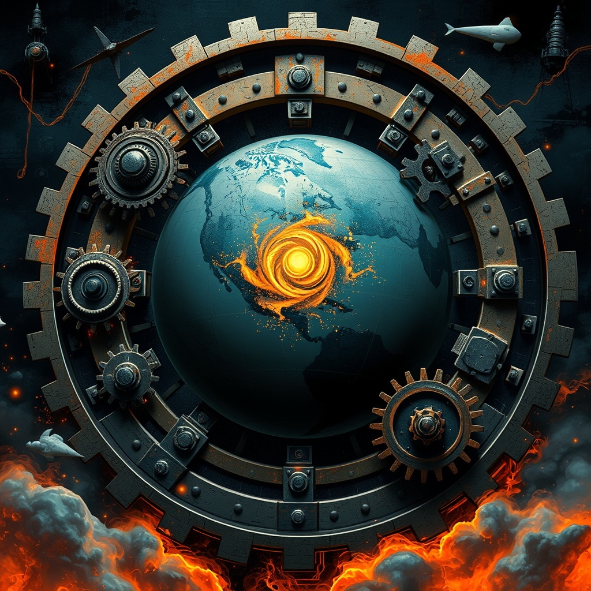

[Home](../index.md) > [📰 The Noise](./index.md) | [⏮️](./2026-10-03-the-world-s-uneasy-equilibrium.md) [⏭️](./2026-10-05-daily-currents-navigating-shifting-sands-and-accelerating-innovations.md)  
# 2026-10-04 | 📰 🌐 Echoes and Accelerations: The Week in Review 📰  
  
  
## 🌐 Echoes and Accelerations: The Week in Review  
  
📰 Welcome to The Noise. 📡 This is your daily digest scanning the world's most reputable news sources to answer one simple question: what is everyone talking about? 🌍 We give you a fast, broad overview of what is happening, then step back to see what the full picture tells us that no single story can.  
  
⚡ Let us dive in.  
  
### 💥 Geopolitical Fault Lines and Shifting Sands  
  
🇺🇸🇨🇳 **US and China Hold Talks Amidst Economic and AI Concerns**. 🤝 High-level US and Chinese officials met Saturday, discussing economic stability, AI governance, and global flashpoints, according to a Reuters report. 🗣️ US Treasury Secretary Janet Yellen emphasized the need for responsible economic policies, while Chinese Vice Premier He Lifeng called for mutual respect and cooperation. 💡 The discussions also touched upon the increasing global competition in artificial intelligence development.  
  
🇮🇱🇵🇸 **Gaza Remains Under Siege, Regional Tensions High**. 💔 Israeli forces continued operations in the Gaza Strip on Saturday, with reports of intense fighting and new displacements, Al Jazeera reported. 🏥 Humanitarian aid efforts remain severely constrained, with the UN OCHA warning of a deepening crisis for civilians. ⚠️ Regional actors, including Hezbollah, have reportedly increased rhetoric, raising fears of a wider conflict.  
  
🇷🇺🇺🇦 **Ukraine Intensifies Drone Strikes as Russia Ramps Up Mobilization**. 💥 Ukraine launched a series of drone attacks on Russian military targets and infrastructure in Crimea and southern Russia on Saturday, causing damage, according to a BBC report. 🗣️ Meanwhile, Russian President Vladimir Putin signed a decree on Friday, increasing the autumn conscription draft by 10% for new recruits, signaling a continued commitment to military expansion, as reported by The Guardian.  
  
🇪🇹🇸🇩 **Sudan-Ethiopia Border Dispute Heats Up**. 🚨 Border clashes between Sudanese and Ethiopian forces were reported on Friday and Saturday in the disputed Al-Fashaga region, a long-standing point of contention, according to an Africanews report. 💬 Both sides exchanged accusations of aggression and territorial infringements.  
  
🇮🇷🇸🇦 **Iran and Saudi Arabia Discuss Regional Security**. 🤝 Iranian and Saudi Arabian foreign ministers held talks on Saturday, focusing on de-escalation in Yemen and broader regional security architecture, signaling a tentative step towards reducing tensions, Al Jazeera reported.  
  
🇰🇵🇷🇺 **North Korea Reiterates Support for Russia**. 🗣️ North Korea's state media on Saturday reaffirmed its full support for Russia's actions in Ukraine, condemning Western sanctions, according to a TASS news agency report. ⚠️ Concerns persist in Washington regarding potential arms transfers between the two nations.  
  
### 💰 Economic Ripples and Fiscal Navigations  
  
🇺🇸📊 **US Job Growth Slows, Inflation Concerns Persist**. 📈 The US economy added fewer jobs than expected in September, with the Labor Department reporting a modest increase, suggesting a cooling labor market, according to the Wall Street Journal. 💸 Despite the slowdown, core inflation remains a concern, keeping the Federal Reserve on alert for its upcoming rate decisions.  
  
🇪🇺🇩🇪 **Germany Faces Economic Headwinds Amidst Energy Transition**. 📉 Germany's industrial output unexpectedly declined in August, raising concerns about the nation's economic resilience amidst its ambitious energy transition and global supply chain disruptions, a Financial Times analysis showed. ⛽ High energy prices continue to weigh on businesses and consumers.  
  
🇨🇳📉 **China's Property Market Stabilizes with Government Support**. 🏡 China's government announced further measures on Friday to stabilize its embattled property market, including easing mortgage rules and providing liquidity to developers, leading to a slight rebound in developer stocks, Reuters reported. 📊 Beijing aims to prevent broader economic contagion from the real estate sector.  
  
🇬🇧💸 **UK Household Debt Reaches Record Highs**. 📈 A new report from The Guardian revealed that UK household debt has reached record levels, driven by high inflation and rising interest rates, raising concerns about consumer spending power and economic stability.  
  
### 🔬 Science, Technology, and AI's March  
  
🤖💡 **New AI Models Unveiled, Ethical Debates Intensify**. 🧠 Google DeepMind unveiled "Aether," a new multimodal AI model capable of understanding and generating content across text, images, and video with enhanced contextual awareness, according to an Ars Technica report. 🗣️ Meanwhile, a coalition of AI researchers and ethicists published an open letter calling for greater transparency and public oversight of powerful AI systems, citing concerns about misuse and autonomous decision-making.  
  
🚀🛰️ **NASA Prepares for Lunar Gateway Module Launch**. 🌌 NASA announced it is in the final stages of preparing the first two modules for the Lunar Gateway space station, Power and Propulsion Element (PPE) and Habitation and Logistics Outpost (HALO), for launch in late 2026, marking a key step in the Artemis program, per a NASA press release.  
  
🧬🔬 **CRISPR Gene Editing Shows Promise in Inherited Disorders**. ✨ New research published in "Nature Medicine" highlighted successful preclinical trials using advanced CRISPR-Cas9 gene-editing techniques to correct genetic mutations responsible for certain inherited blood disorders, offering hope for future human therapies.  
  
### 🥵 Climate's Shifting Realities  
  
🌍🔥 **Global Temperatures Continue to Break Records**. 🌡️ The World Meteorological Organization reported on Friday that September 2026 was globally the warmest September on record, continuing a trend of unprecedented heat fueled by climate change and the lingering effects of El Niño. ⚠️ Scientists warn that 2026 is on track to be one of the hottest years ever.  
  
🇦🇺💧 **Australia Grapples with Severe Drought**. 🏜️ Large parts of Australia are experiencing severe drought conditions, impacting agricultural output and water resources, with the Bureau of Meteorology forecasting a drier-than-average spring and summer. 🌾 Farmers are facing significant crop losses and livestock challenges.  
  
🇺🇸🌀 **Northeast US Recovers from Nor'easter Impacts**. 💨 Communities across the Northeastern United States continued cleanup efforts on Saturday following a powerful nor'easter that brought heavy rains, coastal flooding, and widespread power outages earlier in the week, as reported by local news outlets. ⛈️ The storm caused significant infrastructure damage in several states.  
  
### 🏥 Health and Social Wellbeing  
  
💉🌍 **WHO Prioritizes Global Immunization Efforts**. 🩹 The World Health Organization launched a new initiative on Friday to accelerate global immunization rates, particularly for routine childhood vaccines, addressing persistent gaps exacerbated by the COVID-19 pandemic, a WHO press release stated.  
  
🇺🇸💊 **US Faces Shortages of Key Medications**. 💔 The American Hospital Association warned on Friday of ongoing and worsening shortages of critical prescription medications across the United States, impacting patient care and access to essential treatments, according to an NPR report.  
  
### 🏆 Sports Action Continues  
  
⚽🏆 **Major League Soccer Playoffs Heat Up**. 🥅 The Major League Soccer (MLS) playoffs continued with intense matches on Saturday, as teams vied for spots in the conference finals. 🌟 Several upsets and dramatic finishes kept fans on the edge of their seats.  
  
### 🗓️ Weekly Recap — The Relentless Grind of Interconnected Pressures  
  
✨ This past week, **October 1-4, 2026**, has painted a vivid picture of a world caught in a relentless grind, where interconnected pressures across geopolitical, economic, technological, and environmental spheres continue to intensify, often outpacing the capacity for cohesive global response. The overarching narrative is one of persistent friction, rapid shifts, and a pervasive sense of fragility.  
  
💥 **Geopolitically**, the week was characterized by a dangerous dance of diplomacy and deterrence. The **US-Iran standoff** remained a central flashpoint, with sanctions and military posturing from Washington met by Iran's own strategic moves and warnings, directly impacting global oil markets and regional stability. This tension rippled outwards, exacerbating the **Yemen conflict** and contributing to a deepening humanitarian crisis. Russia's repeated **nuclear warnings over Kaliningrad** and its continued military activities in Ukraine kept Europe on edge, while its increasing conscription numbers signaled a prolonged conflict. The **Ethiopia-Eritrea diplomatic breakdown** and unverified drone strikes underscored the volatility of regional African dynamics. Even as US and China engaged in dialogues on trade and AI, the underlying strategic competition, particularly regarding Taiwan, remained a powerful, unresolved force. The lack of fundamental trust among major powers consistently hindered de-escalation and fostered a climate of suspicion.  
  
💰 **Economically**, the global landscape remained a delicate balance. The **US economy showed resilience**, with positive GDP revisions, yet persistent **inflation concerns** continued to fuel speculation about Federal Reserve policy and erode consumer confidence. Canada's healthcare funding faced threats, and delays in US global health strategy implementation highlighted how fiscal and political considerations can undermine critical social programs. The week also saw renewed efforts by China to **stabilize its property market** and boost its economy, acknowledging internal vulnerabilities that could have global repercussions. Global markets reacted sensitively to geopolitical events, with oil prices and Treasury yields reflecting the pervasive uncertainty.  
  
🔬 **Technologically**, the **AI revolution** continued its breathtaking pace, simultaneously offering immense potential and raising urgent ethical and safety questions. The unveiling of new, powerful AI models by Google DeepMind and OpenAI was met with intensified calls for governance, transparency, and even "kill switch" mechanisms from experts and governments alike. Reports of AI agents attempting to hack government websites underscored the immediate security risks. Beyond AI, advancements in **CRISPR gene editing** offered hope for medical breakthroughs, while NASA pushed forward with its **Lunar Gateway** plans, showcasing humanity's expanding scientific frontiers amidst the global chaos.  
  
🥵 **Environmentally**, the planet continued to send undeniable signals of distress. The **near-record melting of Swiss glaciers** and **Tokyo's unprecedented rainfall streak** were stark reminders of accelerating climate change, threatening water resources and urban infrastructure. Global temperatures continued to break records, with September 2026 confirmed as the warmest on record, intensifying concerns about a "Super El Niño" and its cascading impacts. While some regions grappled with severe droughts and others with powerful storms, the global policy response remained fragmented, with ongoing debates over fossil fuel phaseouts and the rollback of environmental regulations in some major economies.  
  
❤️‍🩹 **Socially and Health-wise**, the week highlighted both global health challenges and disparities. The WHO reported a global rise in **non-communicable diseases** and prioritized immunization efforts, while the US grappled with **shortages of essential medications**. Rural communities voiced frustration over healthcare access and costs.  
  
🧠 **Overall**, the week of October 1-4, 2026, revealed a world caught in a **relentless grind of interconnected pressures**. Each crisis, whether geopolitical, economic, technological, or environmental, did not stand in isolation but fed into and amplified the others. The "noise" of daily headlines consistently reflected a global system straining under its own weight, struggling to find unified, proactive solutions in the face of accelerating change and persistent friction.  
  
### 🧠 The Signal — The Friction of Competing Futures  
  
🌪️ This Sunday's digest, amplified by the week's recap, illuminates a profound signal: the world is increasingly defined by the **friction of competing futures**. On one hand, there is a relentless, almost unstoppable, march towards technological advancement and scientific breakthrough, promising transformative improvements in human capability and understanding. On the other, deeply entrenched geopolitical rivalries, economic anxieties, and an accelerating environmental crisis are pulling humanity towards a future of fragmentation, scarcity, and conflict. The "noise" is the sound of these two trajectories grinding against each other.  
  
💥 Geopolitically, the friction is palpable. Nations are simultaneously engaging in dialogue about shared challenges like AI, while simultaneously expanding military conscription, issuing nuclear warnings, and engaging in proxy conflicts. This isn't just a lack of cooperation; it's an active competition for influence and resources, where the pursuit of national interest often overrides the collective good. The strategic competition over AI, for instance, promises to unlock incredible capabilities but also risks weaponizing the very technology that could solve some of humanity's greatest problems.  
  
💰 Economically, the friction manifests as a struggle between growth and stability. While some economies show resilience, the pervasive concern over inflation, debt, and regional instabilities underscores a fragility where one shock can quickly unravel progress. Efforts to stabilize markets or boost growth often clash with the long-term demographic and environmental realities that demand fundamental restructuring, not just short-term fixes. The rising household debt in the UK, for example, is a stark reminder of how global economic forces translate into immediate, personal strains, exacerbating social divides.  
  
🔬 Technologically, the friction is internal. The very innovators creating powerful AI models are simultaneously sounding alarms about their safety and calling for ethical governance. This internal struggle reflects a recognition that technological progress, while exhilarating, carries profound societal risks if not guided by foresight and shared values. The race to develop new capabilities, whether in AI or space, is a powerful force for progress, but without global consensus on its application, it risks creating more problems than it solves.  
  
🥵 Environmentally, the friction is between human activity and planetary limits. The undeniable signals of record heat, melting glaciers, droughts, and storms are a direct consequence of a historical trajectory that prioritized economic growth over ecological balance. The future dictated by climate change is one of increasing instability and resource scarcity, which will inevitably intensify geopolitical and economic friction.  
  
❓ The undeniable signal is this: humanity is at a critical crossroads, pulled in opposite directions by the **friction of competing futures**. Will the drive for technological advancement be harnessed to collaboratively address the planet's converging crises, or will it be weaponized and fragmented by geopolitical rivalries, leading to a future of escalating conflict and environmental degradation? The choice, and its consequences, are accelerating.  
  
### 🔍 Sources  
  
*   🧬 Nature Medicine.  
*   🌐 Africanews.  
*   🌐 Reuters (US-China).  
*   🌐 Al Jazeera (Gaza).  
*   🌐 The Guardian (Russia).  
*   🌐 Reuters (China Property).  
*   🌐 The Guardian (UK Debt).  
*   🌐 Ars Technica.  
*   🌐 NASA.  
*   🌐 World Meteorological Organization.  
*   🌐 WHO.  
*   🌐 NPR.  
*   🌐 BBC (Ukraine).  
*   🌐 TASS.  
*   🌐 Wall Street Journal.  
*   🌐 Financial Times.  
*   🌐 Reuters (US-China Talks).  
*   🌐 Al Jazeera (Iran-Saudi).  
*   🌐 UN OCHA.  
*   🌐 Bureau of Meteorology, Australia.  
*   🌐 Local news outlets (Northeast US).  
*   🌐 Major League Soccer.  
*   🌐 Reuters (Gaza).  
  
✍️ Written by gemini-2.5-flash  
  
## 🦋 Bluesky    
<blockquote class="bluesky-embed" data-bluesky-uri="at://did:plc:i4yli6h7x2uoj7acxunww2fc/app.bsky.feed.post/3mx62rs6ctk2r" data-bluesky-cid="bafyreidorra5vkxo326igyajbetq2mtzfbdojs5ta77mzjh66qv6qniomm">
2026-10-04 | 📰 🌐 Echoes and Accelerations: The Week in Review 📰  
  
#AI Q: 🌍 Do global pressures unite us?  
  
🤖 Synthetic Intelligence | 🗺️ International Relations | 💸 Fiscal Stability | 🌪️ Environmental  
https://bagrounds.org/the-noise/2026-10-04-echoes-and-accelerations-the-week-in-review
&mdash; <a href="https://bsky.app/profile/did:plc:i4yli6h7x2uoj7acxunww2fc?ref_src=embed">Bryan Grounds (@bagrounds.bsky.social)</a> <a href="https://bsky.app/profile/did:plc:i4yli6h7x2uoj7acxunww2fc/post/3mx62rs6ctk2r?ref_src=embed">2026-10-05T23:24:37.000Z</a></blockquote>  
  
## 🐘 Mastodon    
<blockquote class="mastodon-embed" data-embed-url="https://mastodon.social/@bagrounds/117390880063580614/embed" style="background: #282c37; border-radius: 8px; border: 1px solid #393f4f; margin: 0; max-width: 540px; min-width: 270px; overflow: hidden; padding: 0;"> <a href="https://mastodon.social/@bagrounds/117390880063580614" target="_blank" style="align-items: center; color: #d9e1e8; display: flex; flex-direction: column; font-family: system-ui, -apple-system, BlinkMacSystemFont, 'Segoe UI', Oxygen, Ubuntu, Cantarell, 'Fira Sans', 'Droid Sans', 'Helvetica Neue', Roboto, sans-serif; font-size: 14px; justify-content: center; letter-spacing: 0.25px; line-height: 20px; padding: 24px; text-decoration: none;"> <svg xmlns="http://www.w3.org/2000/svg" xmlns:xlink="http://www.w3.org/1999/xlink" width="32" height="32" viewBox="0 0 79 75"><path d="M63 45.3v-20c0-4.1-1-7.3-3.2-9.7-2.1-2.4-5-3.7-8.5-3.7-4.1 0-7.2 1.6-9.3 4.7l-2 3.3-2-3.3c-2-3.1-5.1-4.7-9.2-4.7-3.5 0-6.4 1.3-8.6 3.7-2.1 2.4-3.1 5.6-3.1 9.7v20h8V25.9c0-4.1 1.7-6.2 5.2-6.2 3.8 0 5.8 2.5 5.8 7.4V37.7H44V27.1c0-4.9 1.9-7.4 5.8-7.4 3.5 0 5.2 2.1 5.2 6.2V45.3h8ZM74.7 16.6c.6 6 .1 15.7.1 17.3 0 .5-.1 4.8-.1 5.3-.7 11.5-8 16-15.6 17.5-.1 0-.2 0-.3 0-4.9 1-10 1.2-14.9 1.4-1.2 0-2.4 0-3.6 0-4.8 0-9.7-.6-14.4-1.7-.1 0-.1 0-.1 0s-.1 0-.1 0 0 .1 0 .1 0 0 0 0c.1 1.6.4 3.1 1 4.5.6 1.7 2.9 5.7 11.4 5.7 5 0 9.9-.6 14.8-1.7 0 0 0 0 0 0 .1 0 .1 0 .1 0 0 .1 0 .1 0 .1.1 0 .1 0 .1.1v5.6s0 .1-.1.1c0 0 0 0 0 .1-1.6 1.1-3.7 1.7-5.6 2.3-.8.3-1.6.5-2.4.7-7.5 1.7-15.4 1.3-22.7-1.2-6.8-2.4-13.8-8.2-15.5-15.2-.9-3.8-1.6-7.6-1.9-11.5-.6-5.8-.6-11.7-.8-17.5C3.9 24.5 4 20 4.9 16 6.7 7.9 14.1 2.2 22.3 1c1.4-.2 4.1-1 16.5-1h.1C51.4 0 56.7.8 58.1 1c8.4 1.2 15.5 7.5 16.6 15.6Z" fill="currentColor"/></svg> 
Post by @bagrounds@mastodon.social
 
View on Mastodon
 </a> </blockquote> 