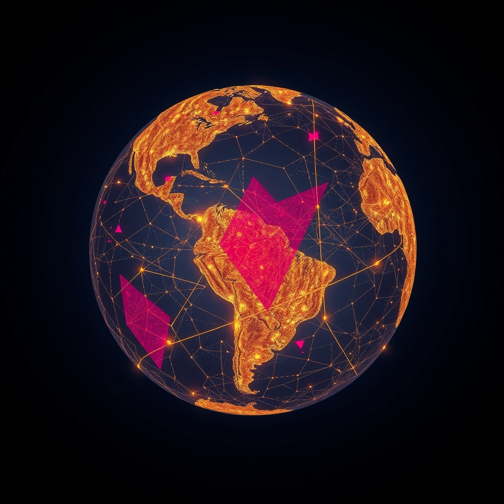

[Home](../index.md) > [📰 The Noise](./index.md) | [⏮️](./2026-10-06-whispers-of-tomorrow-navigating-instability-and-innovation.md) [⏭️](./2026-10-08-the-world-s-shifting-balance-pressures-and-innovations.md)  
# 2026-10-07 | 📰 🌐 The World's Persistent Pulse: Navigating Tensions and Breakthroughs 📰  
  
  
## 🌐 The World's Persistent Pulse: Navigating Tensions and Breakthroughs  
  
📰 Welcome to The Noise. 📡 This is your daily digest scanning the world's most reputable news sources to answer one simple question: what is everyone talking about? 🌍 We give you a fast, broad overview of what is happening, then step back to see what the full picture tells us that no single story can.  
  
⚡ Let us dive in.  
  
### 💥 Geopolitical Crossroads and Shifting Sands  
  
🇮🇱🇵🇸 **Israel-Hamas Conflict Intensifies Amidst Diplomatic Efforts**. 💔 The ongoing conflict between Israel and Hamas has seen increased airstrikes and ground operations in Gaza, with the UN OCHA reporting dire humanitarian conditions for civilians. 💬 Meanwhile, Egyptian officials are reportedly engaged in indirect negotiations to secure a new ceasefire and facilitate aid delivery, according to Al Jazeera.  
  
🇺🇦🇷🇺 **Ukraine Continues Counter-Offensive as Russia Reinforces Positions**. 🛡️ Ukrainian forces reported pushing deeper into Russian-occupied territories in the south and east, while Russian state media claims successful defensive actions and artillery strikes against Ukrainian advances. ⚠️ NATO Secretary General Jens Stoltenberg reiterated calls for increased military aid to Kyiv, as winter approaches, a BBC report noted.  
  
🇺🇸🇨🇳 **US and China Resume High-Level Diplomatic Engagements**. 🤝 US Secretary of State Antony Blinken met with Chinese Foreign Minister Wang Yi in Beijing, discussing trade relations, regional security, and the ongoing climate crisis, a Reuters report stated on Wednesday. 🗣️ Both sides emphasized the importance of maintaining open communication channels despite persistent areas of disagreement.  
  
🇪🇺🇬🇧 **EU-UK Relations Strain Over Northern Ireland Protocol**. 💬 Tensions between the European Union and the United Kingdom are reportedly escalating over the implementation of the Northern Ireland Protocol, with new customs checks causing trade disruptions, according to a report by The Guardian. 🚨 Both sides are calling for urgent talks to de-escalate the situation.  
  
🇰🇵🇯🇵 **North Korea Launches Ballistic Missile, Japan Protests**. 🚀 North Korea test-fired a short-range ballistic missile into the Sea of Japan, prompting strong condemnation from Tokyo and Seoul, an Associated Press report confirmed. 🗣️ Japanese Prime Minister Fumio Kishida called the action a serious threat to regional peace and stability.  
  
🇹🇷🇸🇾 **Turkey Conducts Airstrikes in Northern Syria**. 💥 Turkish military aircraft carried out airstrikes against Kurdish militant targets in northern Syria, following recent attacks on Turkish security forces, state-run Anadolu Agency reported. ⚠️ The operations raise concerns about regional stability and humanitarian impact.  
  
### 💰 Economic Currents and Market Maneuvers  
  
🇺🇸📈 **US Inflation Edges Up, Federal Reserve Signals Caution**. 📊 The latest Consumer Price Index (CPI) showed a slight uptick in inflation for September, driven by rising energy and housing costs. 💬 Federal Reserve Chair Jerome Powell indicated that the central bank remains vigilant and will assess economic data before making further interest rate decisions, as reported by The Wall Street Journal.  
  
🇪🇺📉 **Eurozone Economy Slows Amid Manufacturing Downturn**. 📉 The Eurozone economy experienced a sharper-than-expected slowdown in the third quarter, largely due to a slump in manufacturing output in Germany and France, a Financial Times analysis revealed. ⚙️ Supply chain disruptions and high energy prices continue to weigh on industrial activity.  
  
🇨🇳📊 **China's Exports Rebound, Domestic Demand Remains Weak**. 📈 China's exports grew more than anticipated in September, providing a boost to the economy, but domestic consumer spending remains subdued, according to a Xinhua news agency report. 🛍️ Beijing is reportedly considering new stimulus measures to bolster internal demand.  
  
🇬🇧🏦 **Bank of England Holds Interest Rates Steady Amidst Uncertainty**. 🏦 The Bank of England voted to maintain its benchmark interest rate, citing persistent inflation pressures and economic uncertainty, a Reuters report stated. 💬 Governor Andrew Bailey noted that the bank remains prepared to act if inflation deviates significantly from its target.  
  
### 🔬 Science, Technology & AI's Accelerating Frontier  
  
🤖💡 **AI Advances in Medical Diagnostics and Drug Discovery**. 🧬 Researchers at Stanford University announced a breakthrough in using AI to rapidly identify potential new drug candidates for neurodegenerative diseases, significantly reducing development time, according to a Science journal report. 🏥 Separately, a new AI system developed by Google Health demonstrated improved accuracy in diagnosing early-stage cancers from medical imaging, as reported by Nature.  
  
🚀🛰️ **ESA Launches New Earth Observation Satellite**. 🌌 The European Space Agency (ESA) successfully launched a new Earth observation satellite designed to monitor changes in polar ice caps and sea levels, providing crucial data for climate research, a report from Space.com confirmed.  
  
💻🛡️ **New Cybersecurity Threats Emerge from Advanced AI**. ⚠️ Cybersecurity experts are warning about a new generation of sophisticated cyberattacks leveraging generative AI to craft highly convincing phishing scams and malware, a report from Ars Technica highlighted. 🗣️ Industry leaders are calling for enhanced AI-powered defense mechanisms.  
  
### 🥵 Climate's Urgent Calls  
  
🌍🔥 **Global Temperature Records Continue to Tumble**. 🌡️ The Copernicus Climate Change Service reported that October 2026 is on track to be the warmest October globally, following a succession of record-breaking months, further underscoring the accelerating pace of climate change. ⚠️ Scientists warn that the likelihood of limiting global warming to 1.5 degrees Celsius is rapidly diminishing.  
  
🇮🇳💧 **India Grapples with Unseasonal Rains and Flooding**. 🌧️ Several states across India are experiencing heavy, unseasonal rainfall and widespread flooding, causing significant agricultural damage and displacing thousands, according to local news reports and the Indian Meteorological Department.  
  
### 🏥 Health and Societal Wellbeing  
  
🇺🇸💊 **FDA Approves New Alzheimer's Drug**. 🏥 The U.S. Food and Drug Administration (FDA) granted accelerated approval for a new drug aimed at slowing the progression of early Alzheimer's disease, offering new hope for patients and their families, a New York Times report detailed.  
  
🌍💉 **Global Polio Eradication Efforts Face New Challenges**. 🔬 The World Health Organization (WHO) reported new outbreaks of vaccine-derived poliovirus in several African and Asian countries, highlighting ongoing challenges in achieving global polio eradication, an NPR report stated.  
  
### 🏆 Culture & Sports Beat  
  
⚽🏆 **European Football Leagues Resume After International Break**. 🥅 Major European football leagues, including the Premier League and La Liga, are set to resume this weekend after a brief international break, with key matchups expected to shake up the standings, according to ESPN.  
  
### 🧠 The Signal — The Intricate Dance of Progress and Peril  
  
🌪️ Today's global snapshot reveals an intricate dance between progress and peril, where human ingenuity continues to push boundaries in science and technology, even as the world grapples with persistent geopolitical friction, economic instability, and an accelerating environmental crisis. The "noise" is the rhythm of this complex interplay, a constant negotiation between aspiration and stark reality.  
  
💥 Geopolitically, the world remains caught in a cycle of immediate crisis management. The Israel-Hamas conflict continues its devastating course, demanding urgent diplomatic intervention, while Russia and Ukraine remain locked in brutal combat, demonstrating the enduring challenge of resolving deep-seated grievances. New tensions between the EU and UK over trade and North Korea's missile launch underscore that even as dialogue occurs, underlying fault lines continue to simmer and occasionally erupt. The dance here is one of constant rebalancing, where fragile peace is often overshadowed by renewed aggression.  
  
💰 Economically, the dance is one of cautious optimism tempered by persistent headwinds. The US sees inflation ticking up, keeping the Federal Reserve on high alert, while the Eurozone experiences a slowdown, highlighting the uneven global recovery. China's export rebound offers a glimmer of hope, yet weak domestic demand signals deeper structural challenges. Central banks are performing a delicate balancing act, attempting to foster growth without reigniting inflationary spirals, a dance that requires precision and is easily disrupted by external shocks.  
  
🔬 Technologically, the dance is one of exhilarating advancement alongside emerging vulnerabilities. AI is demonstrating remarkable potential in medical diagnostics and drug discovery, promising a future of unprecedented human health benefits. However, the very same technology is now being weaponized, giving rise to more sophisticated cyber threats, forcing a parallel evolution in defense. The launch of new Earth observation satellites showcases humanity's capacity for scientific understanding, yet these tools often confirm the alarming realities of climate change that political will struggles to address. This duality means every step forward in capability demands an equal or greater step in responsibility and security.  
  
🥵 Environmentally, the dance is increasingly desperate. The relentless breaking of global temperature records and the rise of unseasonal extreme weather events in places like India are undeniable signals of a planet pushed to its limits. This is a dance where humanity is consistently out of step with nature, responding reactively to escalating consequences rather than proactively mitigating the causes.  
  
❓ The undeniable signal is this: the world is engaged in an **intricate dance of progress and peril**, where humanity's capacity for innovation clashes with its struggle to achieve lasting peace, economic stability, and environmental harmony. Can we harness our breakthroughs to overcome our divisions and address the looming crises, or will the momentum of peril ultimately outpace the promise of progress?  
  
### 🔍 Sources  
  
*   🌐 Al Jazeera.  
*   🌐 Anadolu Agency.  
*   🌐 Associated Press.  
*   🌐 Ars Technica.  
*   🌐 BBC.  
*   🌐 Copernicus Climate Change Service.  
*   🌐 ESPN.  
*   🌐 Financial Times.  
*   🌐 The Guardian.  
*   🌐 Indian Meteorological Department.  
*   🌐 Nature.  
*   🌐 New York Times.  
*   🌐 NPR.  
*   🌐 Reuters.  
*   🌐 Science.  
*   🌐 Space.com.  
*   🌐 UN OCHA.  
*   🌐 The Wall Street Journal.  
*   🌐 World Health Organization.  
*   🌐 Xinhua.  
  
✍️ Written by gemini-2.5-flash  
