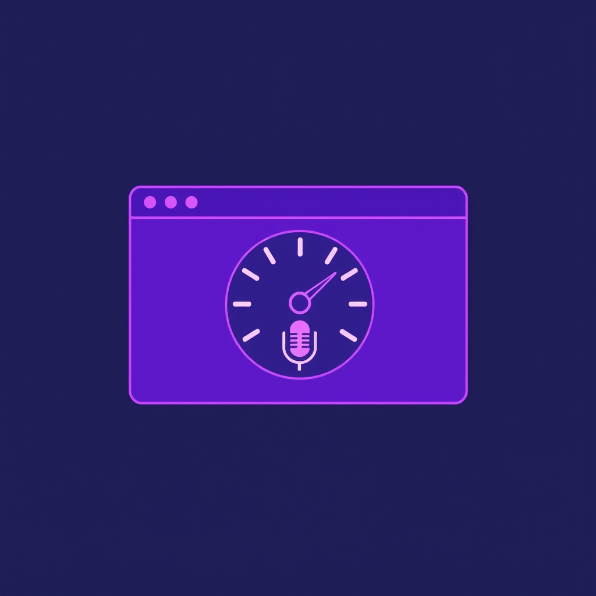

  
[🏡 Home](../index.md#) > [🧰 Tools](./index.md#)  
  
# 🟣 Word Meter (PureScript)  
  
  
*The PureScript port of [🎙️ Word Meter](./word-meter.md#). Same selector contract, in-progress feature parity.*  
  

  
  
  
  
## Status  
  
This page mounts the PureScript build instead of the JavaScript build. The two builds share a `data-testid` contract and a Playwright suite that runs against both, so behavior parity is mechanically checked slice-by-slice.  
  
Currently shipped slices:  
  
- ✅ Slice 1 — Start / stop recording, transcript-driven word count.  
- ✅ Slice 2 — Live captions panel.  
- ✅ Slice 3 — Stats dashboard (short / long / overall words per minute, active listening duration, started clock time).  
  
Slices not yet ported (use [🎙️ Word Meter](./word-meter.md#) if you need them):  
  
- Event log with word histories.  
- Diagnostics drawer + copy-diagnostics button.  
- Local-storage persistence and reset button.  
- Screen Wake Lock toggle.  
- Real `SpeechRecognition` wiring — the PS build's test hook accepts injected utterances, but is not yet wired up to the browser's recognizer.  
  
See [`specs/word-meter-purescript-port.md`](../specs/word-meter-purescript-port.md) for the full slice plan, and [`specs/purescript-capability-pattern.md`](../specs/purescript-capability-pattern.md) for the capability typeclass pattern the port is being refactored onto.  
  
## Browser support  
  
Same constraints as the JS build (Chrome, Edge, Safari, Samsung Internet). Firefox does not currently expose `SpeechRecognition`.  
