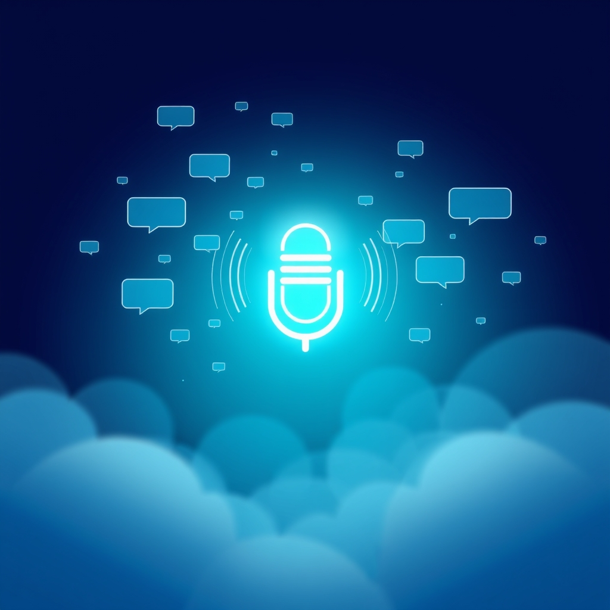

  
[🏡 Home](../index.md#) > [🧰 Tools](./index.md#)  
# 🎙️ Word Meter  
  
  
*One button. Counts every word spoken around you. Lives entirely in your browser.*  
  

  
  
  
  
## How it works  
  
Tap **Start counting** and grant microphone access. The big number is the total words spoken since you started. The metrics row shows your words-per-minute over the last 1 minute, last 10 minutes, and overall. The captions panel shows the last 30 seconds of recognized speech. The timeline logs every start/stop interval. Stats are saved to your browser's local storage and survive reloads — only the **Reset** button clears them.  
  
For a long walk with the phone in your pocket, leave **🔋 Keep counting with screen on** checked. The page uses the [Screen Wake Lock API](https://developer.mozilla.org/docs/Web/API/Screen_Wake_Lock_API) to keep the screen lit so the browser does not suspend microphone capture — that is the closest a pure-web tool can get to background audio.  
  
If something looks wrong, expand the **🔧 Diagnostics** panel at the bottom of the meter and tap **📋 Copy diagnostics** to grab a paste-ready report.  
  
## Browser support  
  
Works on Chrome, Edge, Safari, and Samsung Internet. Firefox does not currently expose `SpeechRecognition`. The Screen Wake Lock API requires a recent Chromium build or Safari 16.4+.  
  
## 📚 Book Recommendations  
  
### 📖 Similar  
* Thirty Million Words by Dana Suskind is the direct inspiration for this tool. It documents the research showing that the sheer volume of words a child hears in the first years of life is a strong predictor of later language and academic outcomes, and it argues that simply being aware of that volume changes parents' behavior. Word Meter is a tiny instrument for exactly that awareness.  
* The Scientist In The Crib by Alison Gopnik, Andrew N. Meltzoff, and Patricia K. Kuhl is relevant because it grounds the case for talking richly to babies in the cognitive science of how infants extract structure from speech.  
  
### ↔️ Contrasting  
* Beyond Words: What Animals Think And Feel by Carl Safina is relevant because it pushes back on the idea that human linguistic input is the only kind of communication that shapes cognition, and reminds us that the count is not the whole story.  
  
### 🔗 Related  
* The Language Instinct by Steven Pinker is relevant because it argues that language acquisition is a biological capacity, not a count of inputs — useful counterweight to taking a word-counting meter too seriously.  
