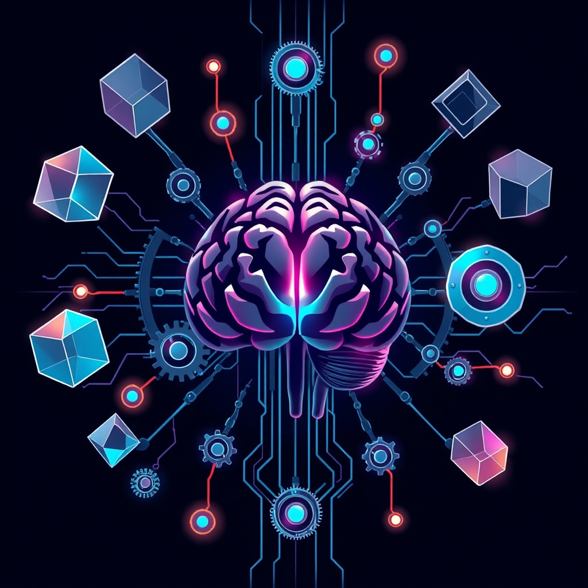

[Home](../index.md) > [Topics](./index.md) > [Knowledge](./a-hierarchical-view-of-human-knowledge.md) > [Engineering](./engineering.md) > [Electrical Engineering](./electrical-engineering.md) > [Control Systems](./control-systems.md)  
# ⚙️🧠🔄 Adaptive Control  
  
## 🤖 AI Summary  
**High-Level Summary:**  
  
Adaptive Control is a branch of control theory that deals with systems whose parameters are uncertain or vary with time. ⏳ It's like teaching a robot to learn and adjust its behavior in real-time, even when the environment or the robot itself changes! 🧠 The core goal is to maintain desired system performance (stability, tracking, etc.) despite these uncertainties. 🎯 Adaptive controllers continuously monitor the system's behavior and adjust their control parameters accordingly, "adapting" to the changes. This is crucial in applications where precise models are difficult to obtain or when systems operate in dynamic environments. 🚀  
  
**Subcategories:**  
  
Here are some major subcategories of Adaptive Control:  
  
* **Model Reference Adaptive Control (MRAC):** 📝 This approach aims to make the closed-loop system behave like a predefined "reference model." 📖 The controller adjusts its parameters to minimize the difference between the actual system output and the desired output of the reference model. It's like having a template for perfect behavior and constantly tweaking the system to match it. 📐  
* **Self-Tuning Regulators (STR):** 🔧 These controllers estimate the unknown system parameters online and use these estimates to design or tune the controller. ⚙️ It's like having a self-adjusting wrench that automatically fits the right size. 🔩  
* **Gain Scheduling:** 📈 This technique uses pre-computed control parameters for different operating conditions. 📊 When the system moves from one condition to another, the controller switches to the appropriate set of parameters. It's like having a set of pre-programmed maps for different terrains. 🗺️  
* **Dual Adaptive Control:** 🧐 This method considers both the control objective and the need to improve the parameter estimates. 🔍 It balances the exploration of unknown parameters with the exploitation of current knowledge. It's like a smart explorer who both tries to find the right path and learns about the terrain along the way. 🧭  
* **[Reinforcement Learning based Adaptive Control](./reinforcement-learning-based-adaptive-control.md):** 🎮 This method uses reinforcement learning algorithms to learn optimal control policies in uncertain environments. 🕹️ The controller learns through trial and error, receiving rewards for good actions and penalties for bad ones. It is very useful for very complex and non-linear systems. 🏆  
  
**Book Recommendations:**  
  
Here are some influential and accessible books on Adaptive Control:  
  
1.  **[🧬🕹️ Adaptive Control](../books/adaptive-control.md) by Karl J. Åström and Björn Wittenmark:** 📚 This is a classic and comprehensive text that covers the theoretical foundations and practical aspects of adaptive control. It's a go-to resource for researchers and practitioners. 🌟  
2.  **"Adaptive Control" by Gang Tao:** 📘 This book provides a clear and concise introduction to the main concepts and techniques of adaptive control, with a focus on practical applications. It is a good option for people who are new to the field. 🎓  
3.  **"Adaptive Control Systems: Techniques and Applications" by Chih-Tsong Chen:** 📖 This book covers a wide range of adaptive control techniques and their applications in various engineering fields. It offers a balanced treatment of theory and practice. 🛠️  
4.  **"Reinforcement Learning, second edition" by Richard S. Sutton and Andrew G. Barto:** 🤖 While not exclusively about adaptive control, this book is essential for understanding reinforcement learning-based adaptive control. It provides a comprehensive introduction to the fundamental concepts and algorithms of reinforcement learning. 🧠  
5.  **"Nonlinear and Adaptive Control Design" by Miroslav Krstic, Ioannis Kanellakopoulos, and Petar Kokotovic:** 💡 This book delves into the more advanced aspects of nonlinear and adaptive control, providing in-depth coverage of techniques like backstepping and feedback linearization. It is for those who already have a strong grasp of control theory. 📈  
  
## 💬 [Gemini](https://gemini.google.com/app) Prompt  
> For the category of Adaptive Control, please provide:  
A High-Level Summary: A concise overview of the core principles, goals, and significance of this category.  
Subcategories: A list of the major subcategories or branches within this category, with a brief description of each.  
Book Recommendations: A selection of 3-5 influential or accessible books that provide a good introduction to this category or its key subcategories.  
Use lots of emojis.