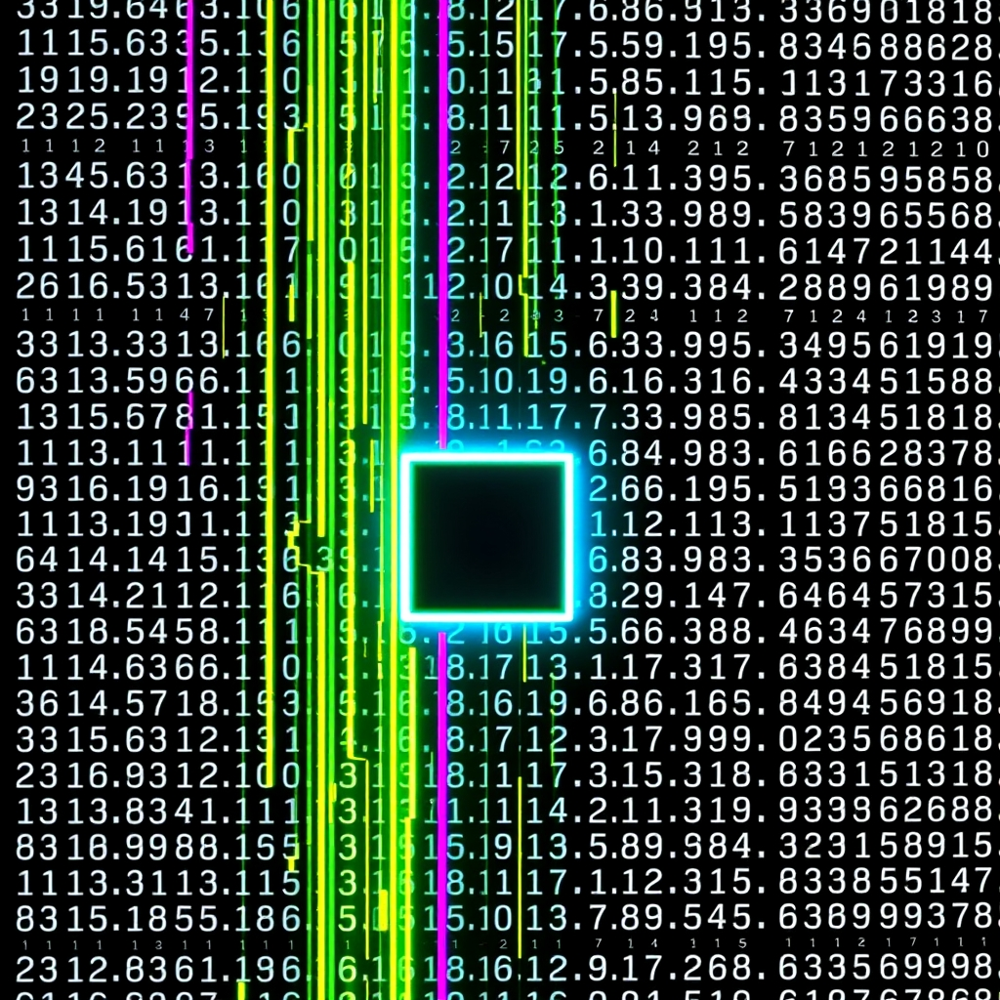

[Home](../index.md) > [Topics](./index.md)  
# 💻🎨⚙️ ANSI escape codes  
  
## 🤖 AI Summary  
### 👉 What Is It?  
  
* ANSI escape codes are sequences of characters that control cursor position, color, and other options on video text terminals and terminal emulators. 🖥️ They're a standard way to add formatting and interactivity to text-based interfaces. 🌈  
  
### ☁️ A High Level, Conceptual Overview  
  
* **🍼 For A Child:** Imagine you have a magic pen that can tell your computer screen to change colors, move the cursor around, or make text blink! ✨ ANSI escape codes are like those magic pen instructions. 🖍️  
* **🏁 For A Beginner:** ANSI escape codes are special text sequences that allow you to control the appearance and behavior of text in a terminal. They're used to add colors, move the cursor, and do other cool things. 🤩 Think of them as formatting instructions for your command line! 📝  
* **🧙‍♂️ For A World Expert:** ANSI escape codes, specifically those defined by the ANSI X3.64 standard, provide a device-independent method for controlling terminal display attributes. They leverage control sequence introducers (CSI) and select graphic rendition (SGR) parameters to manipulate character presentation, cursor positioning, and terminal modes, enabling sophisticated text-based user interfaces. 🤯  
  
### 🌟 High-Level Qualities  
  
* **Cross-platform compatibility:** Mostly supported across various terminal emulators. 🌐  
* **Text-based control:** Manipulates text appearance and behavior. ✍️  
* **Lightweight:** Requires minimal overhead. 💨  
* **Extensible:** Offers a wide range of control sequences. 🛠️  
* **Ubiquitous:** Found in many command-line environments. 🌍  
  
### 🚀 Notable Capabilities  
  
* **Color manipulation:** Changing foreground and background colors. 🎨  
* **Cursor positioning:** Moving the cursor to specific locations. 📍  
* **Text formatting:** Bold, italic, underline, and other styles. ✒️  
* **Screen clearing:** Erasing parts or all of the screen. 🧹  
* **Scrolling control:** Manipulating the terminal's scroll region. 📜  
  
### 📊 Typical Performance Characteristics  
  
* **Near-instantaneous execution:** Commands are processed very quickly. ⚡  
* **Minimal resource usage:** Requires very little CPU or memory. 🧠  
* **Bandwidth efficient:** Command sequences are short and compact. 📦  
* **Latency:** The effect of the ANSI escape code is typically seen without any noticeable delay. ⏱️  
  
### 💡 Examples Of Prominent Products, Applications, Or Services That Use It Or Hypothetical, Well Suited Use Cases  
  
* **Command-line applications:** `ls --color`, `grep --color`, `git status` use ANSI escape codes for color-coded output. 🖥️  
* **Text-based games:** MUDs (Multi-User Dungeons) use ANSI escape codes for interactive displays. 🕹️  
* **Log file highlighting:** Color-coding log messages for easier readability. 📝  
* **Progress bars:** Displaying progress in command-line tools. 📈  
* **Hypothetical Use Case:** A command line based text editor that highlights syntax with color, and allows for cursor based navigation of the document. ✍️  
  
### 📚 A List Of Relevant Theoretical Concepts Or Disciplines  
  
* **Computer graphics:** Text-based rendering. 🖼️  
* **Terminal emulation:** Interpreting control sequences. 💻  
* **Character encoding:** Representing text characters. 🔤  
* **Operating systems:** Terminal I/O. ⚙️  
* **Human-computer interaction:** Designing text-based interfaces. 🤝  
  
### 🌲 Topics:  
  
* **👶 Parent:** Text-based user interfaces. ⌨️  
* **👩‍👧‍👦 Children:**  
    * Terminal emulators 🖥️  
    * Command-line interfaces (CLIs) ⌨️  
    * Text formatting 📝  
    * Cursor control 📍  
* **🧙‍♂️ Advanced topics:**  
    * Control Sequence Introducers (CSIs) 🤯  
    * Select Graphic Rendition (SGR) parameters 🤯  
    * Terminal modes and capabilities 🤯  
    * Virtual Terminals 🤯  
  
### 🔬 A Technical Deep Dive  
  
* ANSI escape codes begin with the escape character `\x1B` or `\033` (in octal). 🔑  
* The CSI (Control Sequence Introducer) `\x1B[` initiates most commands. 🚀  
* SGR (Select Graphic Rendition) parameters control text attributes like color and style. 🌈  
* Example: `\x1B[31m` sets the foreground color to red, and `\x1B[0m` resets all attributes. 🔴  
* Cursor positioning: `\x1B[<row>;<column>H` moves the cursor. 📍  
* Screen Clearing: `\x1B[2J` clears the entire screen. 🧹  
  
### 🧩 The Problem(s) It Solves:  
  
* **Abstract:** Provides a standardized way to control terminal output, enabling richer text-based interfaces. 💡  
* **Common Examples:**  
    * Colorizing log files for easier debugging. 🐛➡️🦋  
    * Creating visually appealing command-line tools. ✨  
    * Improving the readability of terminal output. 📖➡️🌈  
* **Surprising Example:** Using ANSI escape codes to create simple animations in the terminal. 🎬  
  
### 👍 How To Recognize When It's Well Suited To A Problem  
  
* When you need to enhance the visual presentation of text in a terminal. 🎨  
* When you want to create interactive command-line applications. 🎮  
* When you need to display dynamic content in a text-based environment. 📈  
* When you need to provide feedback to a user in a command line context. 🤝  
  
### 👎 How To Recognize When It's Not Well Suited To A Problem (And What Alternatives To Consider)  
  
* When you need a graphical user interface (GUI). Consider using GUI libraries like Qt or GTK. 🖼️  
* When you need high-performance graphics or complex animations. Consider using OpenGL or Vulkan. 🎮  
* When you need to display rich media content. Consider using web technologies or multimedia libraries. 🎥  
* When working with systems that do not support ANSI escape codes. 💻  
  
### 🩺 How To Recognize When It's Not Being Used Optimally (And How To Improve)  
  
* Excessive use of escape codes can make output difficult to read. Simplify formatting. 📖  
* Using hardcoded escape sequences can make code less portable. Use libraries or abstractions. 📦  
* Not resetting attributes can lead to unexpected formatting. Always reset after use. 🧹  
* Using long sequences for simple tasks. Use shorter sequences, or combine sequences. 🛠️  
  
### 🔄 Comparisons To Similar Alternatives (Especially If Better In Some Way)  
  
* **Terminfo/Termcap:** More portable across different terminal types, but more complex. ANSI codes are generally simpler. 📦  
* **HTML/CSS:** Better for rich web-based interfaces, but not suitable for terminal environments. 🌐  
* **GUI Libraries:** Offer more advanced graphical capabilities, but require more resources. 🖼️  
* **Rich Text Format (RTF):** Better for document formatting, but not for terminal output. 📄  
  
### 🤯 A Surprising Perspective  
  
* ANSI escape codes are a form of low-level, text-based art, enabling creative expression in a constrained environment. 🎨  
  
### 📜 Some Notes On Its History, How It Came To Be, And What Problems It Was Designed To Solve  
  
* ANSI escape codes were standardized by the American National Standards Institute (ANSI) in the X3.64 standard. 📜  
* They were designed to provide a device-independent way to control terminal displays. 🖥️  
* They solved the problem of inconsistent terminal behavior across different hardware. 🤝  
* They were a massive step forward in the ease of use of text based interfaces. 🚀  
  
### 📝 A Dictionary-Like Example Using The Term In Natural Language  
  
* "The command-line tool used ANSI escape codes to color-code the output, making it easier to read." 📖  
  
### 😂 A Joke:  
  
* "I tried to explain ANSI escape codes to my cat, but he just kept trying to chase the cursor. I guess he thought it was a laser pointer." 😹  
  
### 📖 Book Recommendations  
  
- **Topical:**  
    - "[Linux](../software/linux.md) Command Line and Shell Scripting Bible" by Richard Blum and Christine Bresnahan. 📖💻 (Comprehensive guide to command-line mastery!)  
- **Tangentially Related:**  
    - "The Art of Unix Programming" by Eric S. Raymond. 💻🧙‍♂️ (Philosophical and practical insights into Unix and command-line culture.)  
- **Topically Opposed:**  
    - "Designing Interfaces" by Jenifer Tidwell. 🖼️🤝 (Focuses on GUI design, a contrast to text-based interfaces.)  
- **More General:**  
    - "Operating System Concepts" by Abraham Silberschatz, Peter B. Galvin, and Greg Gagne. ⚙️🧠 (A foundational text on how operating systems work.)  
- **More Specific:**  
    - "Advanced Linux Programming" by Mark Mitchell, Jeffrey Oldham, and Alex Samuel. 🖥️🚀 (In-depth exploration of Linux system programming.)  
- **Fictional:**  
    - Neuromancer by William Gibson. 🌐👾 (A cyberpunk classic showcasing the power of text-based interfaces in a futuristic world.)  
- **Rigorous:**  
    - "Computer Graphics: Principles and Practice" by Foley, van Dam, Feiner, and Hughes. 🖥️📐 (A comprehensive and mathematically rigorous guide to computer graphics.)  
- **Accessible:**  
    - "Learn Linux Quickly: A Friendly Guide to the Linux Operating System and Linux Commands" by William Norton. 🐧👍 (A user-friendly introduction to Linux and the command line.)  
  
### 📺 Links To Relevant YouTube Channels Or Videos  
  
- **Computerphile:** https://www.youtube.com/@computerphile 🧠💻 (Explains computer science concepts in an easy to understand way, some of which are related to terminals and text processing.)  
- **Learn Linux TV:** https://www.youtube.com/@LearnLinuxTV 📺🐧 (A channel dedicated to linux tutorials, and command line usage.)  
  
## 🦋 Bluesky    
<blockquote class="bluesky-embed" data-bluesky-uri="at://did:plc:i4yli6h7x2uoj7acxunww2fc/app.bsky.feed.post/3mkpqr6msxj2n" data-bluesky-cid="bafyreidh6acdme6qg33xbdahg5waclpzd6yz4hkcguymuldjaygskxrfau">
💻🎨⚙️ ANSI escape codes  
  
#AI Q: ✨ What command line visual effect most improves experience?  
  
🎨 Text Formatting | 💻 Terminal Control | 🌈 Color Manipulation | ⌨️ Command Line  
https://bagrounds.org/topics/ansi-escape-codes
&mdash; <a href="https://bsky.app/profile/did:plc:i4yli6h7x2uoj7acxunww2fc?ref_src=embed">Bryan Grounds (@bagrounds.bsky.social)</a> <a href="https://bsky.app/profile/did:plc:i4yli6h7x2uoj7acxunww2fc/post/3mkpqr6msxj2n?ref_src=embed">2026-04-30T13:45:43.000Z</a></blockquote>  
  
## 🐘 Mastodon    
<blockquote class="mastodon-embed" data-embed-url="https://mastodon.social/@bagrounds/116507568302579844/embed" style="background: #282c37; border-radius: 8px; border: 1px solid #393f4f; margin: 0; max-width: 540px; min-width: 270px; overflow: hidden; padding: 0;"> <a href="https://mastodon.social/@bagrounds/116507568302579844" target="_blank" style="align-items: center; color: #d9e1e8; display: flex; flex-direction: column; font-family: system-ui, -apple-system, BlinkMacSystemFont, 'Segoe UI', Oxygen, Ubuntu, Cantarell, 'Fira Sans', 'Droid Sans', 'Helvetica Neue', Roboto, sans-serif; font-size: 14px; justify-content: center; letter-spacing: 0.25px; line-height: 20px; padding: 24px; text-decoration: none;"> <svg xmlns="http://www.w3.org/2000/svg" xmlns:xlink="http://www.w3.org/1999/xlink" width="32" height="32" viewBox="0 0 79 75"><path d="M63 45.3v-20c0-4.1-1-7.3-3.2-9.7-2.1-2.4-5-3.7-8.5-3.7-4.1 0-7.2 1.6-9.3 4.7l-2 3.3-2-3.3c-2-3.1-5.1-4.7-9.2-4.7-3.5 0-6.4 1.3-8.6 3.7-2.1 2.4-3.1 5.6-3.1 9.7v20h8V25.9c0-4.1 1.7-6.2 5.2-6.2 3.8 0 5.8 2.5 5.8 7.4V37.7H44V27.1c0-4.9 1.9-7.4 5.8-7.4 3.5 0 5.2 2.1 5.2 6.2V45.3h8ZM74.7 16.6c.6 6 .1 15.7.1 17.3 0 .5-.1 4.8-.1 5.3-.7 11.5-8 16-15.6 17.5-.1 0-.2 0-.3 0-4.9 1-10 1.2-14.9 1.4-1.2 0-2.4 0-3.6 0-4.8 0-9.7-.6-14.4-1.7-.1 0-.1 0-.1 0s-.1 0-.1 0 0 .1 0 .1 0 0 0 0c.1 1.6.4 3.1 1 4.5.6 1.7 2.9 5.7 11.4 5.7 5 0 9.9-.6 14.8-1.7 0 0 0 0 0 0 .1 0 .1 0 .1 0 0 .1 0 .1 0 .1.1 0 .1 0 .1.1v5.6s0 .1-.1.1c0 0 0 0 0 .1-1.6 1.1-3.7 1.7-5.6 2.3-.8.3-1.6.5-2.4.7-7.5 1.7-15.4 1.3-22.7-1.2-6.8-2.4-13.8-8.2-15.5-15.2-.9-3.8-1.6-7.6-1.9-11.5-.6-5.8-.6-11.7-.8-17.5C3.9 24.5 4 20 4.9 16 6.7 7.9 14.1 2.2 22.3 1c1.4-.2 4.1-1 16.5-1h.1C51.4 0 56.7.8 58.1 1c8.4 1.2 15.5 7.5 16.6 15.6Z" fill="currentColor"/></svg> 
Post by @bagrounds@mastodon.social
 
View on Mastodon
 </a> </blockquote> 