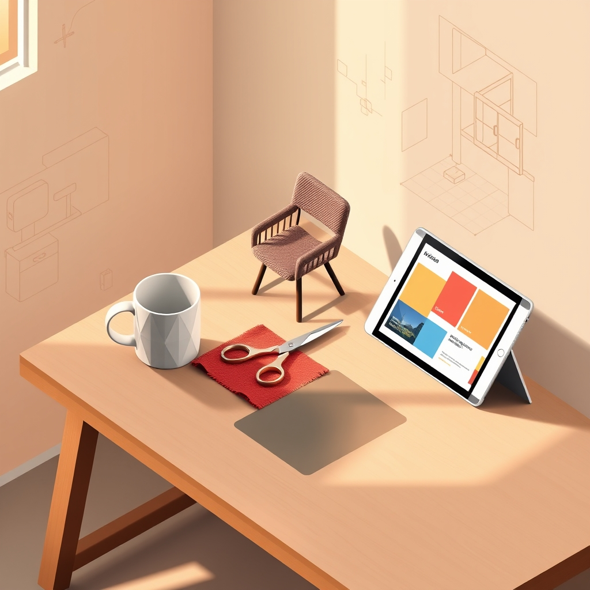

[Home](../index.md) > [Topics](./index.md) > [Knowledge](./a-hierarchical-view-of-human-knowledge.md) > [Arts](./arts.md)  
# 🎨🛠️ Applied Arts  
  
## 🤖 AI Summary  
**🎨 High-Level Summary:**  
  
Applied Arts encompasses all artistic disciplines that apply design and aesthetic principles to functional objects and environments. It's about blending beauty with utility, transforming everyday items into visually appealing and thoughtfully crafted pieces. The goal is to enhance the quality of life by making practical things aesthetically pleasing and culturally meaningful. Applied Arts bridges the gap between pure art and practical design, making art accessible and integrated into daily living. 🏠🖌️💖 Imagine turning a simple mug into a work of art! ☕🌟  
  
**✨ Subcategories:**  
  
Here's a breakdown of the major subcategories within Applied Arts:  
  
* **🖥️ [Graphic Design](./graphic-design.md):**  
    * Focuses on visual communication and problem-solving using typography, imagery, and layout. Includes branding, advertising, web design, and print media. Think logos that pop! 💥 And websites that wow! 🌐  
* **⚙️ Industrial Design:**  
    * Deals with the design of mass-produced products, considering both aesthetics and functionality. This encompasses everything from furniture and appliances to vehicles and electronics. Making everyday items extraordinary! 🚗🛋️💡  
* **👗 Fashion Design:**  
    * Involves the creation of clothing and accessories, reflecting trends, personal style, and cultural influences. It includes pattern making, textile design, and garment construction. Express yourself through style! 👠🕶️👑  
* **🛋️ Interior Design:**  
    * Focuses on the creation of functional and aesthetically pleasing interior spaces, considering factors like layout, furniture, lighting, and color schemes. Turn your house into a home! 🏡✨🖼️  
* **🏺 Ceramics and Glassware:**  
    * The art of creating functional and decorative objects from clay and glass. It includes pottery, sculpture, and stained glass. Crafting beauty from earth and fire! 🔥🌿💎  
* **🧵 Textile Design:**  
    * Creation of patterned or structured surfaces for weaving, knitting, printing, or other textile processes. Feeling the fabric of design! 🌈🧶  
* **💍 Jewelry Design:**  
    * The art of designing and creating decorative items worn as personal adornment. Sparkle and shine! 💎✨💖  
  
**📚 Book Recommendations:**  
  
Here are some influential and accessible books that provide a great introduction to Applied Arts:  
  
1.  **📚 "[The Design of Everyday Things](../books/the-design-of-everyday-things.md)" by Don Norman:**  
    * This book delves into the principles of good design, focusing on usability and functionality. It's a must-read for anyone interested in industrial design and how design impacts our daily lives. This book really opens your eyes to how we interact with objects. 💡🧐  
2.  **📖 "Thinking with Type" by Ellen Lupton:**  
    * A comprehensive guide to typography, covering everything from the history of typefaces to practical applications in graphic design. It's an essential resource for anyone working with text. This book is a staple for Graphic Designers. 🅰️📝🎉  
3.  **🧵 "Fashion Design: Process, Innovation, and Practice" by Kathryn McKelvey and Jan Teunissen:**  
    * This book provides a thorough overview of the fashion design process, from concept development to production. It explores the creative and technical aspects of fashion design. This book goes into the entire process. 👗✂️💖  
4.  **🏠 "Interior Design Illustrated" by Francis D.K. Ching:**  
    * Known for his clear and detailed illustrations, Ching provides a visual guide to the principles of interior design, covering topics like spatial planning, lighting, and materials. An excellent resource for visualizing interior spaces. This book is great for understanding the basics. 📐📏🛋️  
5.  **🏺 "Crafting a Continuum: Rethinking Contemporary Craft" by Glenn Adamson:**  
    * This book explores the evolving landscape of contemporary craft, examining its relationship to art, design, and technology. It provides a thought-provoking perspective on the role of craft in modern society. This book is great for a more academic understanding of applied arts. 🔍💭🌟  
  
## 💬 [Gemini](https://gemini.google.com/app) Prompt  
> For the category of Applied Arts, please provide:  
A High-Level Summary: A concise overview of the core principles, goals, and significance of this category.  
Subcategories: A list of the major subcategories or branches within this category, with a brief description of each.  
Book Recommendations: A selection of 3-5 influential or accessible books that provide a good introduction to this category or its key subcategories.  
Use lots of emojis.  
  
## 🦋 Bluesky    
<blockquote class="bluesky-embed" data-bluesky-uri="at://did:plc:i4yli6h7x2uoj7acxunww2fc/app.bsky.feed.post/3mmtfhx2zil2m" data-bluesky-cid="bafyreid3bgkdwd4rnbit3rgp6fqoskf4bba7puoqd6c4o4g2druhnrh75m">
🎨🛠️ Applied Arts  
  
#AI Q: ✨ Which everyday object best blends beauty and utility?  
  
🛠️ Industrial Design | 👗 Fashion &amp; Textiles | 🛋️ Spatial Planning |  
https://bagrounds.org/topics/applied-arts
&mdash; <a href="https://bsky.app/profile/did:plc:i4yli6h7x2uoj7acxunww2fc?ref_src=embed">Bryan Grounds (@bagrounds.bsky.social)</a> <a href="https://bsky.app/profile/did:plc:i4yli6h7x2uoj7acxunww2fc/post/3mmtfhx2zil2m?ref_src=embed">2026-05-27T11:24:44.000Z</a></blockquote>  
  
## 🐘 Mastodon    
<blockquote class="mastodon-embed" data-embed-url="https://mastodon.social/@bagrounds/116654872282924560/embed" style="background: #282c37; border-radius: 8px; border: 1px solid #393f4f; margin: 0; max-width: 540px; min-width: 270px; overflow: hidden; padding: 0;"> <a href="https://mastodon.social/@bagrounds/116654872282924560" target="_blank" style="align-items: center; color: #d9e1e8; display: flex; flex-direction: column; font-family: system-ui, -apple-system, BlinkMacSystemFont, 'Segoe UI', Oxygen, Ubuntu, Cantarell, 'Fira Sans', 'Droid Sans', 'Helvetica Neue', Roboto, sans-serif; font-size: 14px; justify-content: center; letter-spacing: 0.25px; line-height: 20px; padding: 24px; text-decoration: none;"> <svg xmlns="http://www.w3.org/2000/svg" xmlns:xlink="http://www.w3.org/1999/xlink" width="32" height="32" viewBox="0 0 79 75"><path d="M63 45.3v-20c0-4.1-1-7.3-3.2-9.7-2.1-2.4-5-3.7-8.5-3.7-4.1 0-7.2 1.6-9.3 4.7l-2 3.3-2-3.3c-2-3.1-5.1-4.7-9.2-4.7-3.5 0-6.4 1.3-8.6 3.7-2.1 2.4-3.1 5.6-3.1 9.7v20h8V25.9c0-4.1 1.7-6.2 5.2-6.2 3.8 0 5.8 2.5 5.8 7.4V37.7H44V27.1c0-4.9 1.9-7.4 5.8-7.4 3.5 0 5.2 2.1 5.2 6.2V45.3h8ZM74.7 16.6c.6 6 .1 15.7.1 17.3 0 .5-.1 4.8-.1 5.3-.7 11.5-8 16-15.6 17.5-.1 0-.2 0-.3 0-4.9 1-10 1.2-14.9 1.4-1.2 0-2.4 0-3.6 0-4.8 0-9.7-.6-14.4-1.7-.1 0-.1 0-.1 0s-.1 0-.1 0 0 .1 0 .1 0 0 0 0c.1 1.6.4 3.1 1 4.5.6 1.7 2.9 5.7 11.4 5.7 5 0 9.9-.6 14.8-1.7 0 0 0 0 0 0 .1 0 .1 0 .1 0 0 .1 0 .1 0 .1.1 0 .1 0 .1.1v5.6s0 .1-.1.1c0 0 0 0 0 .1-1.6 1.1-3.7 1.7-5.6 2.3-.8.3-1.6.5-2.4.7-7.5 1.7-15.4 1.3-22.7-1.2-6.8-2.4-13.8-8.2-15.5-15.2-.9-3.8-1.6-7.6-1.9-11.5-.6-5.8-.6-11.7-.8-17.5C3.9 24.5 4 20 4.9 16 6.7 7.9 14.1 2.2 22.3 1c1.4-.2 4.1-1 16.5-1h.1C51.4 0 56.7.8 58.1 1c8.4 1.2 15.5 7.5 16.6 15.6Z" fill="currentColor"/></svg> 
Post by @bagrounds@mastodon.social
 
View on Mastodon
 </a> </blockquote> 