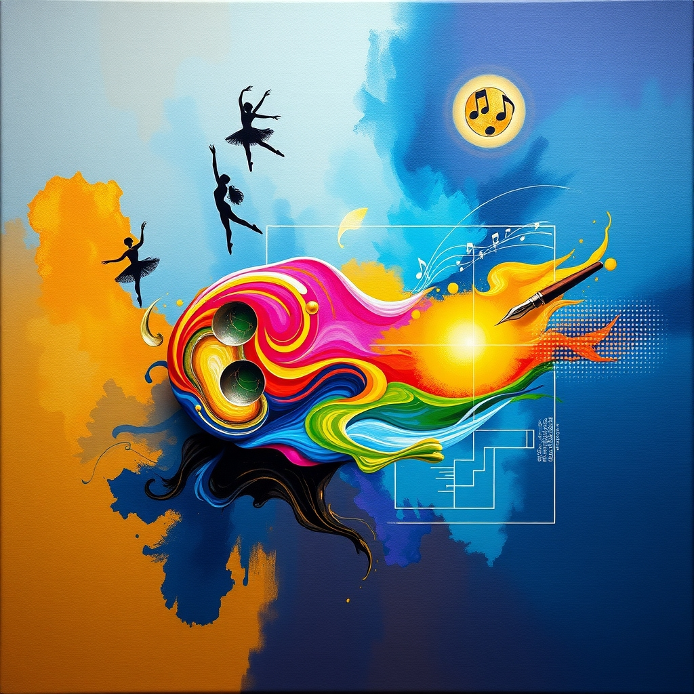

[Home](../index.md) > [Topics](./index.md) > [Knowledge](./a-hierarchical-view-of-human-knowledge.md)  
# 🎨🖼️ Arts  
  
## 🤖 AI Summary  
**🎨 High-Level Summary:**  
  
The Arts encompass a vast array of human activities and creations involving imagination, skill, and expression. Their core principles revolve around aesthetics 💖, communication 🗣️, and the exploration of human experience 🌍. The goals of the Arts are diverse: to evoke emotions 😭😂, stimulate thought 🤔💡, provide entertainment 🍿🎬, preserve cultural heritage 🏛️📜, and challenge societal norms ✊🌈. Ultimately, the Arts are significant because they enrich our lives 🥳, foster creativity 🌟🧠, and offer unique perspectives on the world around us 👁️‍🗨️. They are a fundamental aspect of human culture and civilization 🏛️🌍.  
  
**🎭 Subcategories:**  
  
Here are some major subcategories within the Arts:  
  
* **🖼️ Visual Arts:**  
    * This includes painting 🖌️, sculpture 🗿, drawing ✏️, photography 📸, printmaking 🖨️, and other forms of visual expression. It focuses on creating works that are primarily visual in nature 🌈✨.  
* **💃 Performing Arts:**  
    * This covers disciplines like theater 🎭, dance 🩰, music 🎶, and opera 🎤, where artists perform for an audience. It emphasizes live performance and dynamic expression 🌟👏.  
* **📖 [Literary Arts](./literary-arts.md):**  
    * This encompasses writing ✍️, including poetry 📜, fiction 📚, drama 🎭, and non-fiction 📝. It focuses on the use of language to create artistic works 🖋️💭.  
* **🎬 Media Arts:**  
    * This includes film 🎥, television 📺, digital art 💻, and video games 🎮. It uses technology to create and distribute artistic content 🌐🚀.  
* **🏠 [Applied Arts](./applied-arts.md):**  
    * This includes fields like architecture 🏗️, design (graphic 🎨, fashion 👗, interior 🛋️), and crafts 🧶. It focuses on the application of artistic principles to functional objects and spaces 🏡🛠️.  
  
**📚 Book Recommendations:**  
  
Here are some books that offer insightful introductions to the Arts and their subcategories:  
  
1.  **👁️‍🗨️ "Ways of Seeing" by John Berger:**  
    * This book explores how we perceive and interpret visual art 🖼️, challenging traditional notions of art appreciation. It is a very influential look at how context changes understanding of visual art 🧐💡.  
2.  **🎁 "The Gift: Creativity and the Artist in the Modern World" by Lewis Hyde:**  
    * This book delves into the nature of creativity 🧠✨ and the role of the artist in society 🌍, exploring the concept of art as a gift 💖. It is a deep dive into the creative process 💭🌟.  
3.  **📜 "A Little History of Poetry" by John Carey:**  
    * This book provides a wonderful over view of poetry through out the ages. A very easy to read and understand book for those who wish to learn more about poetry. 🖋️❤️🎉  
4.  **💥 "Understanding Comics: The Invisible Art" by Scott McCloud:**  
    * This book is a comic book that explains the art of making comics. It is a fantastic look into visual storytelling, and how the reader interacts with visual art. 📖🤩💡  
5.  **🧬 "The Art Instinct: Beauty, Pleasure, and Human Evolution" by Denis Dutton:**  
    * This book explores the evolutionary origins of our aesthetic preferences, arguing that art is a fundamental human instinct. It is an interesting scientific look at art. 🎨🤔🌍  
  
## 💬 [Gemini](https://gemini.google.com/app) Prompt  
> For the category of Arts, please provide:  
A High-Level Summary: A concise overview of the core principles, goals, and significance of this category.  
Subcategories: A list of the major subcategories or branches within this category, with a brief description of each.  
Book Recommendations: A selection of 3-5 influential or accessible books that provide a good introduction to this category or its key subcategories.  
Use lots of emojis.