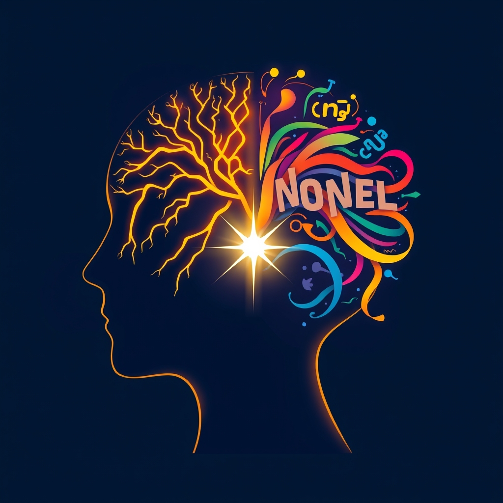

[Home](../index.md) > [Topics](./index.md)  
# 🗣️🗣️ Bilingualism  
  
## 🤖 AI Summary  
🗣️ Bilingualism refers to the ability to communicate effectively in more than one language. While traditionally implying proficiency in two languages, the term is now often extended to include 🌐 **multilingualism**, where an individual knows three or more languages. The study of bilingualism is interdisciplinary, drawing from 🗣️ linguistics, 🧠 psycholinguistics, and 👥 sociolinguistics.  
  
### ℹ️ Defining Bilingualism  
  
The definition of bilingualism can vary widely, from a minimal proficiency in two languages to a native-like control in both. 📊 It encompasses a range of proficiencies and contexts:  
  
* 👶 **Simultaneous Bilingualism:** When two languages are acquired at the same time from early childhood.  
* ⏳ **Sequential Bilingualism:** When a second language is learned sometime after the first language.  
* 👯 **Coordinate Bilingualism:** A person has parallel but separate systems for each language. This is common in individuals raised in two-language households from infancy.  
* 🔗 **Compound Bilingualism:** The person does not completely separate the two languages, often having a unified concept expressed by two different words.  
* 🎓 **Subordinate Bilingualism:** The second language is learned later in life, often in formal settings, with less proficiency than the first.  
* 👂 **Receptive Bilingualism:** The ability to understand two languages but express oneself fluently in only one (common in heritage language learners).  
* 💬 **Productive Bilingualism:** The ability to speak, write, and understand two languages fluently.  
  
### ➕ Benefits of Bilingualism  
  
Extensive research highlights numerous advantages associated with bilingualism, impacting cognitive, social, and professional aspects of life:  
  
* 🧠 **Cognitive Benefits:**  
    * 🧠 **Enhanced Executive Functions:** Improved attention control, multitasking, problem-solving 💡, and cognitive flexibility due to the brain's need to manage two language systems.  
    * 👴 **Delayed Cognitive Decline:** Studies suggest bilingualism can delay the onset of dementia and Alzheimer's symptoms.  
    * 🗄️ **Improved Memory:** The brain is actively engaged in managing multiple languages, which can boost memory and concentration.  
    * ✍️ **Increased Metalinguistic Awareness:** A better understanding of language structure and grammar.  
* 🌍 **Social and Cultural Benefits:**  
    * 🤝 **Greater Cultural Awareness:** Exposure to diverse customs, ideas, and perspectives.  
    * 👨‍👩‍👧‍👦 **Stronger Family Ties:** Maintaining connections with family, culture, and community.  
    * ❤️ **Increased Empathy:** Navigating different linguistic and social contexts can foster a greater understanding of others.  
    * ✈️ **Easier Travel:** Enhanced ability to communicate and experience other cultures.  
* 💼 **Academic and Professional Benefits:**  
    * 🏫 **Academic Advantage:** Bilingual students often show improved performance in various subject areas, including math.  
    * 🎓 **Easier to Learn Additional Languages:** The cognitive processes involved in managing two languages can make learning a third (or more) easier.  
    * 📈 **Increased Career Opportunities:** Many companies prioritize candidates who can communicate in multiple languages, leading to better job prospects and earning potential.  
  
### ⚠️ Challenges of Bilingualism  
  
While the benefits are significant, bilingualism can also present some challenges:  
  
* 😵‍💫 **Language Interference:** Using the grammar of one language while speaking another, or mistakenly using a word from a different language. This is a common and normal part of bilingual development.  
* 🏚️ **Maintaining Minority Languages:** In environments dominated by one language (e.g., school), the minority or home language may fall behind without sufficient support.  
* 🎯 **Setting Realistic Goals:** Parents may find it challenging to determine the level of proficiency to aim for in each language, especially with limited time and resources.  
* 🤔 **Societal Misconceptions:** Facing skepticism or outdated beliefs about potential confusion or speech delays in bilingual children. Research consistently debunks these myths.  
* 🗓️ **Consistency in Language Use:** Ensuring consistent exposure and engagement in both languages is crucial for developing fluency in both.  
  
🌍 Overall, bilingualism is a dynamic and multifaceted phenomenon with profound impacts on individuals and societies. The growing recognition of its benefits continues to encourage bilingual education and support for multilingual development worldwide. 🚀  
  
## 📚 Books   
  
### 👨‍👩‍👧‍👦 For Parents and Families Raising Bilingual Children  
  
* **[👨‍👩‍👧‍👦🗣️🗣️ A Parents' and Teachers' Guide to Bilingualism](../books/a-parents-and-teachers-guide-to-bilingualism.md) by Colin Baker:** 💯 This is a highly recommended and well-regarded book that covers a wide range of topics related to bilingualism in children, from language acquisition theories to practical strategies for parents and educators. 🔬 It's guided by research and is now in its fourth edition.  
* 💡 **"Maximize Your Child's Bilingual Ability: Ideas and Inspiration for Even Greater Success and Joy Raising Bilingual Kids" by Adam Beck:**🗣️ Adam Beck is a popular voice in the bilingual parenting community, and this book is praised for its practical, hands-on approaches and entertaining style.😄  
* 🧠 **"Raising a Bilingual Child" by Barbara Zurer Pearson:**👩‍🎓 Written by a scholar in the field, this book offers a comprehensive and knowledge-packed look at childhood bilingualism. 🤓 It's a bit more academic but highly informative.  
* ❓ **"The Bilingual Edge: Why, When, and How to Teach Your Child a Second Language" by Kendall King and Alison Mackey:** 📝 This book is well-written and grounded in research, providing answers to common questions about why, when, and how to teach a second language, particularly in the U.S. context. 🇺🇸  
* 👨‍👩‍👧‍👦 **"The Bilingual Family: A Handbook for Parents" by Edith Harding and Philip Riley:** 📖 As the name suggests, this is a practical handbook focusing specifically on families raising bilingual children, covering the basics of what bilingualism means in this context.  
* 🪜 **"7 Steps to Raising a Bilingual Child" by Naomi Steiner:** ✨ This book aims to guide and inspire parents with a step-by-step approach to bilingual parenting.  
* 🧭 **"Growing Up with Two Languages: A Practical Guide" by Una Cunningham-Andersson:** 👪 Another practical guide for families navigating the experience of raising children with two languages.  
  
### 🌍 For General Interest / Understanding Bilingualism  
  
* 🗣️ **"Bilingual: Life and Reality" by François Grosjean:** 🤩 This book offers a comprehensive look at the realities of being bilingual, extending beyond just parenting. Grosjean is a renowned expert in the field.  
* 🧠 **"The Bilingual Brain: And What It Tells Us about the Science of Language" by Albert Costa:** 🔬 If you're interested in the neuroscience behind bilingualism, this book delves into what happens in the brain when you speak more than one language, exploring the cognitive advantages.  
* 🗣️🧠 **"The Psycholinguistics of Bilingualism" by François Grosjean and Ping Li:** 📝 This provides a more in-depth, psychological perspective on how bilinguals process language.  
* 💬 **"Multilingualism: Understanding Linguistic Diversity" by John Edwards:** 📖 A good general interest book for anyone wanting to understand linguistic diversity and the broader aspects of multilingualism.  
  
### 🎓 For Academic Study / Language Acquisition  
  
* 🍎 **"Foundations of Bilingual Education and Bilingualism" by Colin Baker:** 📚 This is a key textbook in the field of bilingual education, offering a thorough academic overview.  
* 👶 **"An Introduction to Bilingual Development" by Annick De Houwer:** 📖 An introductory textbook that focuses specifically on bilingual development.  
* 📝 **"How Languages are Learned" by Patsy M. Lightbown and Nina Spada:** 💯 A widely used and highly regarded textbook on second language acquisition, offering a solid foundation for understanding how people learn new languages.  
* **[🗣️🧠 The Language Instinct: How the Mind Creates Language](../books/the-language-instinct-how-the-mind-creates-language.md) by Steven Pinker:** 💡 While not exclusively about bilingualism, this classic book explores the innate human capacity for language, which is foundational to understanding language acquisition in any context.  
* 📖 **"Introducing Second Language Acquisition" by Muriel Saville-Troike:** 🚀 A strong introduction to the field of Second Language Acquisition (SLA).  
  
### 🧒👧 Children's Bilingual Books  
  
* 🖼️ **Bilingual picture dictionaries:** 📖 Many publishers offer "First 100 Words" or similar books in various language pairs (e.g., "First 100 Words in English and Spanish").  
* 📚 **Storybooks that feature bilingual characters or themes:** 🌟 Books like "Mango, Abuela, and Me" by Meg Medina or "Spanish Is My Superpower!" by Maria Correa celebrate the experience of navigating multiple languages and cultures.🌍 Websites like Language Lizard are great resources for finding bilingual children's books in a wide variety of languages.  
  
## 🦋 Bluesky    
<blockquote class="bluesky-embed" data-bluesky-uri="at://did:plc:i4yli6h7x2uoj7acxunww2fc/app.bsky.feed.post/3mlfxbb3s2a2n" data-bluesky-cid="bafyreicyijnfb2pbwniobsljnbga6lb6rzlqnvj2meskqcevs4qrnvpnqy">
🗣️🗣️ Bilingualism  
  
#AI Q: 🌍 What is the biggest advantage of speaking more than one language?  
  
🌐 Multilingualism | 🧠 Executive Function | 👶 Language Acquisition  
https://bagrounds.org/topics/bilingualism
&mdash; <a href="https://bsky.app/profile/did:plc:i4yli6h7x2uoj7acxunww2fc?ref_src=embed">Bryan Grounds (@bagrounds.bsky.social)</a> <a href="https://bsky.app/profile/did:plc:i4yli6h7x2uoj7acxunww2fc/post/3mlfxbb3s2a2n?ref_src=embed">2026-05-09T09:40:39.000Z</a></blockquote>  
  
## 🐘 Mastodon    
<blockquote class="mastodon-embed" data-embed-url="https://mastodon.social/@bagrounds/116550048810406523/embed" style="background: #282c37; border-radius: 8px; border: 1px solid #393f4f; margin: 0; max-width: 540px; min-width: 270px; overflow: hidden; padding: 0;"> <a href="https://mastodon.social/@bagrounds/116550048810406523" target="_blank" style="align-items: center; color: #d9e1e8; display: flex; flex-direction: column; font-family: system-ui, -apple-system, BlinkMacSystemFont, 'Segoe UI', Oxygen, Ubuntu, Cantarell, 'Fira Sans', 'Droid Sans', 'Helvetica Neue', Roboto, sans-serif; font-size: 14px; justify-content: center; letter-spacing: 0.25px; line-height: 20px; padding: 24px; text-decoration: none;"> <svg xmlns="http://www.w3.org/2000/svg" xmlns:xlink="http://www.w3.org/1999/xlink" width="32" height="32" viewBox="0 0 79 75"><path d="M63 45.3v-20c0-4.1-1-7.3-3.2-9.7-2.1-2.4-5-3.7-8.5-3.7-4.1 0-7.2 1.6-9.3 4.7l-2 3.3-2-3.3c-2-3.1-5.1-4.7-9.2-4.7-3.5 0-6.4 1.3-8.6 3.7-2.1 2.4-3.1 5.6-3.1 9.7v20h8V25.9c0-4.1 1.7-6.2 5.2-6.2 3.8 0 5.8 2.5 5.8 7.4V37.7H44V27.1c0-4.9 1.9-7.4 5.8-7.4 3.5 0 5.2 2.1 5.2 6.2V45.3h8ZM74.7 16.6c.6 6 .1 15.7.1 17.3 0 .5-.1 4.8-.1 5.3-.7 11.5-8 16-15.6 17.5-.1 0-.2 0-.3 0-4.9 1-10 1.2-14.9 1.4-1.2 0-2.4 0-3.6 0-4.8 0-9.7-.6-14.4-1.7-.1 0-.1 0-.1 0s-.1 0-.1 0 0 .1 0 .1 0 0 0 0c.1 1.6.4 3.1 1 4.5.6 1.7 2.9 5.7 11.4 5.7 5 0 9.9-.6 14.8-1.7 0 0 0 0 0 0 .1 0 .1 0 .1 0 0 .1 0 .1 0 .1.1 0 .1 0 .1.1v5.6s0 .1-.1.1c0 0 0 0 0 .1-1.6 1.1-3.7 1.7-5.6 2.3-.8.3-1.6.5-2.4.7-7.5 1.7-15.4 1.3-22.7-1.2-6.8-2.4-13.8-8.2-15.5-15.2-.9-3.8-1.6-7.6-1.9-11.5-.6-5.8-.6-11.7-.8-17.5C3.9 24.5 4 20 4.9 16 6.7 7.9 14.1 2.2 22.3 1c1.4-.2 4.1-1 16.5-1h.1C51.4 0 56.7.8 58.1 1c8.4 1.2 15.5 7.5 16.6 15.6Z" fill="currentColor"/></svg> 
Post by @bagrounds@mastodon.social
 
View on Mastodon
 </a> </blockquote> 