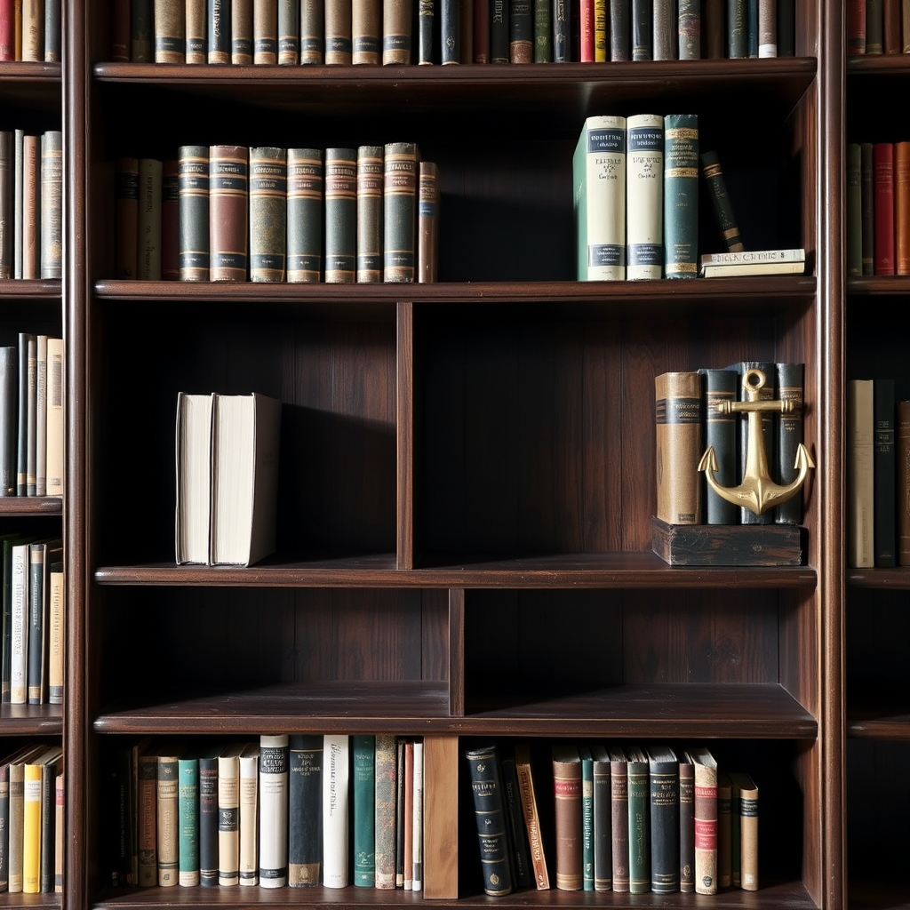

[Home](../index.md) > [Topics](./index.md)  
# 📚⚓ Books Removed From Naval Academy Library  
  
- https://www.navy.mil/Press-Office/Press-Releases/display-pressreleases/Article/4146516/list-of-books-removed-from-usna-library  
  
## Page 1 of 19  
1. [✊🏿 How To Be An Antiracist](../books/how-to-be-an-antiracist.md) by Ibram X. Kendi  
2. [😬👨🏿 Uncomfortable Conversations With A Black Man](../books/uncomfortable-conversations-with-a-black-man.md) by Emmanuel Acho  
3. [✍🏿🇺🇸💔 Why Didn't We Riot?: A Black Man In Trumpland](../books/why-didnt-we-riot.md) by Issac J. Bailey  
4. [🧑🏿⚖️🧑🏻 Long Time Coming: Reckoning With Race In America](../books/long-time-coming-reckoning-with-race-in-america.md) by Michael Eric Dyson  
5. "State Of Emergency: How We Win In The Country We Built" by Tamika D. Mallory as told to Ashley A. Coleman  
6. "How We Can Win Race, History And Changing The Money Game That's Rigged" by Kimberly Jones  
7. "My Vanishing Country A Memoir" by Bakari Sellers  
8. "The Gangs Of Zion: A Black Cop's Crusade In Mormon Country" by Ron Stallworth, with Sofia Quintero  
9. "American Hate: Survivors Speak Out" edited by Arjun Singh Sethi  
10. "The Rage Of Innocence: How America Criminalizes Black Youth" by Kristin Henning  
11. "Our Time Is Now Power, Purpose, And The Fight For A Fair America" by Stacey Abrams  
12. "What's Your Pronoun?: Beyond He & She" by Dennis Baron  
13. "Rainbow Milk A Novel" by Paul Mendez  
14. "The Genesis Of Misery" by Neon Yang  
15. "The Last White Man" by Mohsin Hamid  
16. "Light From Uncommon Stars" by Ryka Aoki  
17. "Everywhere You Don't Belong: A Novel" by Gabriel Bump  
18. "Evil Eye: A Novel" by Etaf Rum  
19. "Lies My Teacher Told Me Everything Your American History Textbook Got Wrong" by James W. Loewen  
20. "Gender Queer A Memoir" by Maia Kobabe; colors by Phoebe Kobabe  
21. "The Third Person" by Emma Grove  
