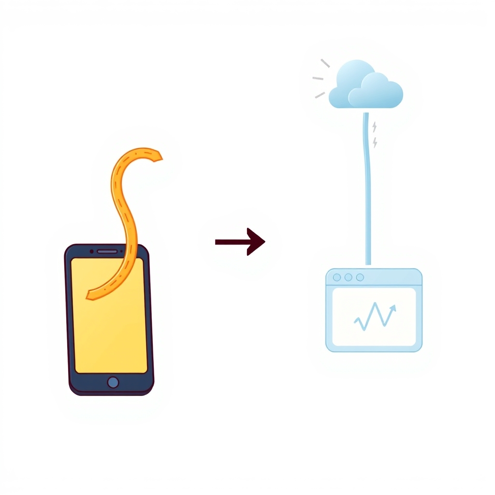

[Home](../index.md) > [Topics](./index.md)  
  
# 🚀 CI-Driven Publishing  
  
  
## 🤖 AI Summary  
  
* 📝 High-Level Summary: A proposed architecture shift that moves all content transformation from mobile (Enveloppe plugin) to CI, enabling faster mobile sync and simpler workflow. 🎯  
  
* 🔑 Key Concepts: The goal is to replace heavy on-device processing with a lightweight git sync, then let CI do the transformation work. This should dramatically reduce the time spent waiting on the phone! ⚡📱  
  
---  
  
## 📜 Research: Current System Analysis  
  
### 🏠 Current Architecture  
  
```  
┌─────────────────────────────────────────────────────────────────────────┐  
│                         CURRENT SYSTEM                                   │  
├─────────────────────────────────────────────────────────────────────────┤  
│                                                                          │  
│  📱 MOBILE (Enveloppe Plugin)              ☁️  GITHUB CI (Quartz)       │  
│  ┌─────────────────────────────┐          ┌───────────────────────────┐ │  
│  │ 1. Scan vault for files     │          │ 1. Checkout code          │ │  
│  │ 2. Parse frontmatter       │          │ 2. Build Quartz           │ │  
│  │ 3. Convert wikilinks → md  │          │ 3. Generate HTML          │ │  
│  │ 4. Process embeddings       │          │ 4. Deploy to Pages        │ │  
│  │ 5. Handle dataview queries │          │                           │ │  
│  │ 6. Commit to GitHub        │          │                           │ │  
│  │                             │          │                           │ │  
│  ⚡ SLOW - lots of CPU work    │          │ ⚡ FAST - already optimized│ │  
│  🔋 Battery drain              │          │ 🔌 Unlimited resources    │ │  
│  📶 Network heavy              │          │ 📶 Just fetches code      │ │  
│  └─────────────────────────────┘          └───────────────────────────┘ │  
│                                                                          │  
└─────────────────────────────────────────────────────────────────────────┘  
```  
  
### 🔧 What Enveloppe Currently Does (on mobile)  
  
Based on [Enveloppe documentation](https://github.com/Enveloppe/obsidian-enveloppe):  
  
* 🔗 **Link Conversion**: `[[wikilinks]]` → markdown links  
* 📄 **Frontmatter Processing**: Parses and transforms metadata  
* 🖼️ **Embed Processing**: Handles `![[embed]]` syntax  
* 📊 **Dataview Support**: Processes `dataviewjs`, inline DQL  
* 📁 **Folder Notes**: Renames to `index.md` as needed  
* 🔀 **Repo Management**: Creates branches, PRs, auto-merges  
* 🧹 **File Cleanup**: Removes depublished/deleted files  
  
### 😩 Pain Points  
  
* ⚡ **Mobile is slow**: All transformation happens on phone CPU  
* 🔋 **Battery drain**: Intensive processing on mobile  
* 🐛 **Link bugs**: Has caused broken links (see [2025-06-07](../reflections/2025-06-07.md) - video path issue)  
* 🔧 **Complex config**: Enveloppe settings are extensive  
* 📱 **Platform-specific**: Obsidian-only solution  
  
---  
  
## 🏗️ Proposed Architecture  
  
```  
┌─────────────────────────────────────────────────────────────────────────┐  
│                      PROPOSED SYSTEM                                     │  
├─────────────────────────────────────────────────────────────────────────┤  
│                                                                          │  
│  📱 MOBILE (Simple Git Sync)              ☁️  GITHUB CI               │  
│  ┌─────────────────────────────┐          ┌───────────────────────────┐ │  
│  │ 1. Write/edit note          │          │ 1. Checkout raw content   │ │  
│  │ 2. Save (Obsidian auto-save)│          │ 2. Run Enveloppe CLI      │ │  
│  │ 3. Commit & push raw .md   │          │    (or custom transformer)│ │  
│  │                             │          │ 3. Build Quartz           │ │  
│  │                             │          │ 4. Deploy to Pages        │ │  
│  │                             │          │                           │ │  
│  ⚡ INSTANT - just git push    │          │ ⚡ FAST - optimized CI    │ │  
│  🔋 Minimal battery            │          │ 🔌 Unlimited resources    │ │  
│  📶 Small payload (.md only)   │          │ 📶 Downloads content     │ │  
│  └─────────────────────────────┘          └───────────────────────────┘ │  
│                                                                          │  
└─────────────────────────────────────────────────────────────────────────┘  
```  
  
### ✨ Key Changes  
  
* 📱 **Mobile**: Use simple git sync (Working Copy on iOS, or other git apps)  
    * 🚫 No plugin needed for publishing  
    * 📝 Just push raw Obsidian vault files  
  
* ☁️ **CI**: Add content transformation step before Quartz build  
    * Option A: Run Enveloppe CLI in CI  
    * Option B: Write custom Node.js transformer  
    * Option C: Extend Quartz with link conversion plugin  
  
* 🔗 **Link Strategy**:  
    * Keep wikilinks in Obsidian (`[[note]]`)  
    * Convert to markdown links in CI (`[note](./note.md)`)  
    * This preserves Obsidian usability! 🧡  
  
---  
  
## 📊 Benefits  
  
| Aspect | Current (Enveloppe) | Proposed (CI-Driven) |  
|--------|---------------------|---------------------|  
| Mobile sync time | 30-60s+ | 5-10s |  
| Battery impact | High | Minimal |  
| Link conversion | On-device | In CI |  
| Quartz build | Pre-optimized | Same |  
| Failure mode | Mobile crash | CI failure (retryable) |  
| Offline work | Limited | Full git workflow |  
| Platform coupling | Obsidian-only | Any git-synced content |  
  
---  
  
## 🎯 Implementation Options  
  
### Option A: Enveloppe CLI in CI  
* 👍 **Pros**: Proven transformation logic  
* 👎 **Cons**: May need Docker or Node setup in CI  
  
### Option B: Custom Link Transformer  
* 👍 **Pros**: Full control, minimal deps  
* 👎 **Cons**: Must maintain ourselves  
  
### Option C: Quartz Native + Custom Plugin  
* 👍 **Pros**: Single build pipeline  
* 👎 **Cons**: More Quartz-specific  
  
**Recommended**: Start with Option A or B, preserve Quartz optimization work 🚀  
  
---  
  
## 🛡️ Risk Mitigation  
  
### 🟢 Phase 1: Parallel Run (Low Risk)  
1. Set up CI to process raw content  
2. Keep Enveloppe running on mobile  
3. Compare outputs before switching  
4. Deploy both versions temporarily  
  
### 🟡 Phase 2: Shadow Mode  
1. CI processes content but doesn't deploy  
2. Validate output matches Enveloppe  
3. Fix any discrepancies  
  
### 🔴 Phase 3: Switch  
1. Disable Enveloppe on mobile  
2. Enable CI transformation  
3. Monitor for 1 week  
4. Rollback plan ready  
  
### 🔙 Rollback Plan  
* Re-enable Enveloppe on mobile  
* Revert CI changes  
* No data loss (content in git)! 💾  
  
---  
  
## 📝 Spec for Implementation (For Opus 4.6)  
  
### 📋 Context  
* Repository: `bagrounds/obsidian-github-publisher-sync`  
* Current: Enveloppe plugin does content transformation on mobile  
* Goal: Move transformation to CI for faster mobile workflow  
  
### 📝 Requirements  
  
1. **CI Pipeline Enhancement**  
   * Add a new job or step before Quartz build  
   * Process raw markdown files from `content/` directory  
   * Convert wikilinks (`[[note]]`) to markdown links (`[note](./note.md)`)  
   * Handle internal links with folder paths correctly  
  
2. **Link Conversion Logic**  
   ```javascript  
   // Pseudocode for link conversion  
   const convertWikilinks = (content) => {  
     // [[note]] → [note](./note.md)  
     // [[folder/note]] → [note](./folder/note.md)  
     // [[note|alias]] → [alias](./note.md)  
   }  
   ```  
  
3. **Frontmatter Handling**  
   * Pass through `share: true` files only  
   * Ensure `share: false` files remain unpublished  
  
4. **Compatibility**  
   * Must work with existing Quartz build  
   * Preserve all existing Quartz optimizations (content-hash cache, etc.)  
   * No regression in build time  
  
5. **Testing**  
   * Create test cases for link conversion  
   * Verify output matches Enveloppe's current output  
   * Test with real content from vault  
  
### 🎁 Deliverables  
  
1. Modified `.github/workflows/deploy.yml` with transformation step  
2. New transformation script (either Enveloppe CLI wrapper or custom)  
3. Test file proving correctness  
4. Documentation of the change  
  
### ⚠️ Constraints  
* Keep build time under 2 minutes  
* Don't break existing functionality  
* Maintain backward compatibility with existing content  
  
### ✅ Success Criteria  
* Mobile sync time reduced by 50%+  
* Build output identical to current system  
* No regressions in published site  
  
---  
  
## 🔗 Related  
  
### 📝 Reflections on Blogging & Publishing  
  
* [2024-04-19 | 🎉 I Start Blogging Today!](../reflections/2024-04-19.md) - When it all began  
* [2024-04-21 | ✍️ Blog | 🌋 Obsidian | 🤖 Automation | 🌓 Solarized | 💬 Comments 🪞](../reflections/2024-04-21.md) - Original setup with GitHub Publisher (now Enveloppe) and Quartz  
* [2024-11-20 | 🪄 Let There Be Comments 💬](../reflections/2024-11-20.md) - First commits to the repo  
* [2024-11-21 | 🧱 Refactor RSS & Search](../reflections/2024-11-21.md) - Quartz features exploration  
* [2024-11-23 | 🧑‍🚀 Exploring Quartz Features](../reflections/2024-11-23.md) - Graph, video embeds, build time optimization  
* [2024-11-24 | 💬 Quartz Giscus Comments](../reflections/2024-11-24.md) - Adding comments  
* [2025-03-22 | 🗓️ Blog Anniversary + Quartz Upgrades](../reflections/2025-03-22.md) - Almost a year of blogging, Quartz updates  
* [2025-04-20 | 📈 Graduated to Quartz v4](../reflections/2025-04-20.md) - Major Quartz upgrade  
* [2025-04-22 | 🔗 Graph & Backlinks](../reflections/2025-04-22.md) - More Quartz improvements  
* [2025-06-07 | 🚜 Farm | 💾 Software | 🤕 Trauma | 🤖🐦 AutoTweet ⌨️](../reflections/2025-06-07.md) - Enveloppe link bug (video path issue)  
* [2026-01-03 | 📅 Auto-Updating Index Timestamps](../reflections/2026-01-03.md) - Script to automate index updates  
  
### 🔗 Other Links  
  
* [Today's Reflection](../reflections/2026-03-02.md)  
* [Bug Report: Enveloppe Link Issue](../reflections/2025-06-07.md)  
* [Obsidian](../software/obsidian.md)  
* [Quartz SSG](../software/quartz.md)  
* [Enveloppe Plugin](https://github.com/Enveloppe/obsidian-enveloppe)  
* [Agentic Software Engineering](./agentic-software-engineering.md) (for CI automation ideas)  
  
## 🦋 Bluesky    
<blockquote class="bluesky-embed" data-bluesky-uri="at://did:plc:i4yli6h7x2uoj7acxunww2fc/app.bsky.feed.post/3mmxz6eyeji2d" data-bluesky-cid="bafyreifo65mpe6gke2ko4js5guv5tyywq6z736d5xlpj2c6uabwy346hhu"><p>🚀 CI-Driven Publishing  
  
#AI Q: 🚀 Does moving heavy lifting from your phone to the cloud change how you approach mobile workflows?  
  
&#34;  
https://bagrounds.org/topics/ci-driven-publishing</p>&mdash; <a href="https://bsky.app/profile/did:plc:i4yli6h7x2uoj7acxunww2fc?ref_src=embed">Bryan Grounds (@bagrounds.bsky.social)</a> <a href="https://bsky.app/profile/did:plc:i4yli6h7x2uoj7acxunww2fc/post/3mmxz6eyeji2d?ref_src=embed">2026-05-29T07:27:57.000Z</a></blockquote><script async src="https://embed.bsky.app/static/embed.js" charset="utf-8"></script>  
  
## 🐘 Mastodon    
<blockquote class="mastodon-embed" data-embed-url="https://mastodon.social/@bagrounds/116657116917830142/embed" style="background: #282c37; border-radius: 8px; border: 1px solid #393f4f; margin: 0; max-width: 540px; min-width: 270px; overflow: hidden; padding: 0;"> <a href="https://mastodon.social/@bagrounds/116657116917830142" target="_blank" style="align-items: center; color: #d9e1e8; display: flex; flex-direction: column; font-family: system-ui, -apple-system, BlinkMacSystemFont, 'Segoe UI', Oxygen, Ubuntu, Cantarell, 'Fira Sans', 'Droid Sans', 'Helvetica Neue', Roboto, sans-serif; font-size: 14px; justify-content: center; letter-spacing: 0.25px; line-height: 20px; padding: 24px; text-decoration: none;"> <svg xmlns="http://www.w3.org/2000/svg" xmlns:xlink="http://www.w3.org/1999/xlink" width="32" height="32" viewBox="0 0 79 75"><path d="M63 45.3v-20c0-4.1-1-7.3-3.2-9.7-2.1-2.4-5-3.7-8.5-3.7-4.1 0-7.2 1.6-9.3 4.7l-2 3.3-2-3.3c-2-3.1-5.1-4.7-9.2-4.7-3.5 0-6.4 1.3-8.6 3.7-2.1 2.4-3.1 5.6-3.1 9.7v20h8V25.9c0-4.1 1.7-6.2 5.2-6.2 3.8 0 5.8 2.5 5.8 7.4V37.7H44V27.1c0-4.9 1.9-7.4 5.8-7.4 3.5 0 5.2 2.1 5.2 6.2V45.3h8ZM74.7 16.6c.6 6 .1 15.7.1 17.3 0 .5-.1 4.8-.1 5.3-.7 11.5-8 16-15.6 17.5-.1 0-.2 0-.3 0-4.9 1-10 1.2-14.9 1.4-1.2 0-2.4 0-3.6 0-4.8 0-9.7-.6-14.4-1.7-.1 0-.1 0-.1 0s-.1 0-.1 0 0 .1 0 .1 0 0 0 0c.1 1.6.4 3.1 1 4.5.6 1.7 2.9 5.7 11.4 5.7 5 0 9.9-.6 14.8-1.7 0 0 0 0 0 0 .1 0 .1 0 .1 0 0 .1 0 .1 0 .1.1 0 .1 0 .1.1v5.6s0 .1-.1.1c0 0 0 0 0 .1-1.6 1.1-3.7 1.7-5.6 2.3-.8.3-1.6.5-2.4.7-7.5 1.7-15.4 1.3-22.7-1.2-6.8-2.4-13.8-8.2-15.5-15.2-.9-3.8-1.6-7.6-1.9-11.5-.6-5.8-.6-11.7-.8-17.5C3.9 24.5 4 20 4.9 16 6.7 7.9 14.1 2.2 22.3 1c1.4-.2 4.1-1 16.5-1h.1C51.4 0 56.7.8 58.1 1c8.4 1.2 15.5 7.5 16.6 15.6Z" fill="currentColor"/></svg> <div style="color: #9baec8; margin-top: 16px;">Post by @bagrounds@mastodon.social</div> <div style="font-weight: 500;">View on Mastodon</div> </a> </blockquote> <script data-allowed-prefixes="https://mastodon.social/" async src="https://mastodon.social/embed.js"></script>