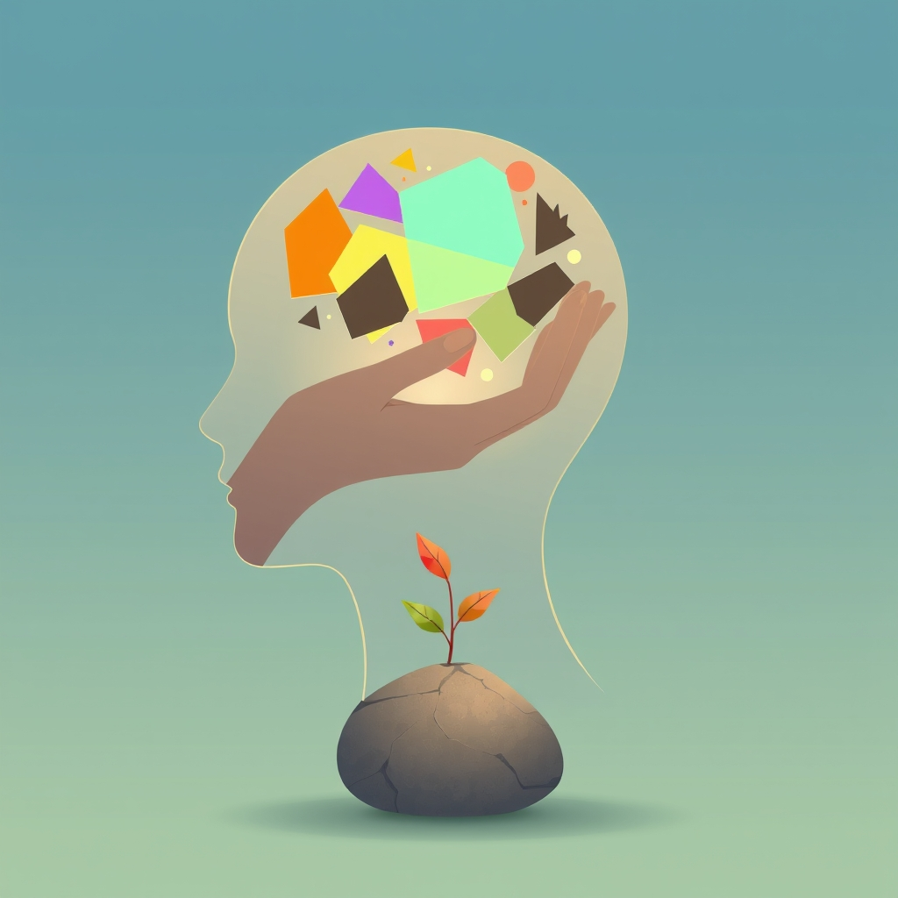

[Home](../index.md) > [Topics](./index.md)  
# ♻️🫀🧠💪 Cognitive Behavioral Therapy  
  
## 🤖 AI Summary  
### 👉 What Is It?  
  
- 🧠 **Cognitive Behavioral Therapy (CBT)** is a type of **psychotherapy** (talk therapy) 🗣️.  
- 🤝 It belongs to the broader class of **behavioral and cognitive therapies**.  
- acronym stands for **C**ognitive **B**ehavioral **T**herapy 🤔🚶‍♀️.  
- ✨ It helps people identify and change unhelpful thinking 🤔 patterns and behaviors 🚶‍♀️ to improve their emotional state 😊 and overall well-being 💖.  
  
### ☁️ A High Level, Conceptual Overview  
  
- 🍼 **For A Child**: Imagine your thoughts 🤔, feelings 😟😊, and actions 🤸‍♀️ are like three best friends playing together 🤝. Sometimes, one friend (like a grumpy thought 😠) makes the others feel bad or act strangely 😟🚶‍♀️. CBT is like learning tricks ✨ to help the grumpy thought become friendlier 🤔➡️🙂, which makes your feelings feel better 😊 and helps you do fun things again! 🤸‍♀️🎉  
- 🏁 **For A Beginner**: CBT is a practical therapy approach 🛠️ focusing on the here-and-now 🕒. It operates on the idea that your thoughts 💭, feelings ❤️, and behaviors 🏃‍♀️ are interconnected 🔄. By learning to recognize and challenge negative or unrealistic thoughts 🤔❓ and changing problematic behaviors 🚶‍♀️➡️👍, you can directly improve how you feel and cope with life's challenges 💪. It involves active participation and practicing skills outside of sessions.  
- 🧙‍♂️ **For A World Expert**: CBT is a structured 🏗️, empirically supported psychotherapeutic modality grounded in the **cognitive model** 🧠, which posits that dysfunctional appraisals and information processing biases (mediated by core beliefs and schemas) significantly contribute to psychopathology 😟. Treatment focuses on modifying these cognitive processes (e.g., via cognitive restructuring 🧠🔧, Socratic dialogue ❓) and maladaptive behaviors (e.g., through behavioral activation 🏃‍♀️, exposure hierarchies 🪜, skills training 🛠️) using collaborative empiricism 🤝🧪. It is typically time-limited ⏳ and emphasizes relapse prevention strategies 📉.  
  
### 🌟 High-Level Qualities  
  
- 🏗️ **Structured**: Sessions follow a predictable format and overall treatment plan.  
- 🎯 **Goal-Oriented**: Focuses on specific problems and agreed-upon goals 🥅.  
- 🕒 **Present-Focused**: Primarily deals with current problems and situations 📅, though past experiences are explored for context 👶.  
- 🤝 **Collaborative**: Therapist and client work together as a team 🧑‍⚕️🙋‍♀️.  
- 🔬 **Evidence-Based**: Effectiveness is supported by extensive scientific research 📊📈.  
- 📚 **Psychoeducational**: Teaches clients about their conditions and the CBT model 📖.  
- ⏳ **Time-Limited**: Often involves a set number of sessions (e.g., 5-20) 🗓️.  
- 🛠️ **Skills-Based**: Equips clients with practical coping tools 💪 for long-term use.  
  
### 🚀 Notable Capabilities  
  
- 🤔 **Identifying Automatic Negative Thoughts (ANTs)**: Recognizing those quick, habitual thoughts that pop up 🐜.  
- ❓ **Cognitive Restructuring**: Learning to evaluate, challenge, and modify unhelpful thoughts 🧠➡️💡.  
- ⚖️ **Developing Balanced Thinking**: Moving away from distorted views towards more realistic perspectives 🤔💯.  
- 🏃‍♀️ **Behavioral Activation**: Increasing engagement in positive or meaningful activities, especially for depression ☀️🚶‍♀️.  
- 👻 **Exposure Therapy**: Gradually facing feared objects or situations in a safe way to reduce anxiety (used for anxiety disorders, OCD, PTSD) 🪜😌.  
- 🧘‍♀️ **Relaxation Techniques**: Learning skills like deep breathing 🌬️ or progressive muscle relaxation 💪😌.  
- 🧩 **Problem-Solving Skills Training**: Developing structured ways to tackle difficult situations 🤔💡✅.  
- 🗣️ **Communication Skills Training**: Improving interpersonal effectiveness 🤝💬.  
- 📝 **Developing Coping Strategies**: Building a toolkit 🛠️ for managing stress and difficult emotions 💪.  
  
### 📊 Typical Performance Characteristics  
  
- 📈 **High Effectiveness**: Considered a 'gold standard' treatment for many conditions🥇. Research shows significant improvement for **75%** of people with depression and anxiety disorders who complete CBT treatment 📊.  
- ⏳ **Short-Term**: Often effective within **12 to 20 weekly sessions** 🗓️, though duration varies based on the individual and problem complexity.  
- 📉 **Relapse Prevention**: Skills learned in CBT can help reduce the likelihood of symptoms returning after treatment ends 💪🛡️.  
- 📏 **Effect Sizes**: Typically demonstrates moderate to large effect sizes (e.g., Cohen's d > 0.5 or 0.8) for target conditions like anxiety and depression in numerous meta-analyses 🔬💯.  
- 🤝 **Homework Compliance**: Successful outcomes often correlate with client engagement in assigned practices between sessions ✅.  
  
### 💡 Examples Of Prominent Products, Applications, Or Services  
  
- 😔 **Depression**: Challenging negative self-beliefs and increasing activity levels 🚶‍♀️☀️.  
- 😨 **Anxiety Disorders**: (GAD, Panic Disorder, Social Anxiety, Phobias) Facing fears 👻, managing worry thoughts 🤔❌.  
- 🎖️ **Post-Traumatic Stress Disorder (PTSD)**: Processing traumatic memories safely 🧠🛡️, managing avoidance behaviors.  
- ✨ **Obsessive-Compulsive Disorder (OCD)**: Using Exposure and Response Prevention (ERP), a specific type of CBT 🚫✋🧼.  
- 🍎 **Eating Disorders**: Modifying distorted thoughts about body image and food 🍽️❤️, regulating eating behaviors.  
- 😴 **Insomnia (CBT-I)**: Changing sleep-related thoughts and behaviors 🛌💤.  
- 🍺 **Substance Use Disorders**: Identifying triggers 🤔, developing coping skills 💪🚫, changing lifestyle.  
- 🤕 **Chronic Pain Management**: Changing unhelpful thoughts about pain 🤔💥, improving coping and functioning 💪🚶‍♀️.  
- 😠 **Anger Management**: Identifying triggers 🤔😡, learning relaxation and communication skills 🗣️😌.  
- **Hypothetical/Broader Use Cases**:  
    - 💼 Improving workplace performance by managing stress and procrastination.  
    - 🗣️ Enhancing relationship satisfaction through better communication and problem-solving skills ❤️🤝.  
    - 🏆 Boosting sports performance by managing performance anxiety and negative self-talk 🏅🧠.  
    - 📚 Improving study habits and managing academic stress for students 🎓💪.  
  
### 📚 A List Of Relevant Theoretical Concepts Or Disciplines  
  
- 🧠 **Cognitive Psychology**: Study of mental processes like attention, memory, perception, language use, problem solving, decision making, and thinking 🤔💡.  
- 🐕 **Behavioral Psychology (Behaviorism)**: Focuses on observable behaviors and how they are learned through conditioning (classical and operant) 🔔🚶‍♀️.  
- 📖 **Learning Theory**: Principles explaining how behavior is acquired, changed, or maintained (e.g., reinforcement, punishment, modeling) 🧑‍🏫📝.  
- 💻 **Information Processing Model**: Views the mind as a system that processes information, similar to a computer 🧠💾➡️📤.  
- 🧑‍🤝‍🧑 **Social Learning Theory (Albert Bandura)**: Emphasizes learning through observation, imitation, and modeling 👀➡️🚶‍♀️.  
- 🏛️ **Philosophy (esp. Stoicism)**: Ancient Greek philosophy emphasizing that our perception of events, not the events themselves, causes distress – a core CBT concept 🤔➡️😌.  
  
### 🌲 Topics  
  
- 👶 **Parent**: Psychotherapy 🛋️, Psychology 🧑‍🔬, Mental Health Treatment ❤️‍🩹.  
- 👩‍👧‍👦 **Children (Specific CBT Techniques/Approaches)**:  
    - 🤔 **Cognitive Restructuring**: Techniques for identifying and changing thought patterns.  
    - 🚶‍♀️ **Behavioral Activation**: Strategies to increase engagement in rewarding activities.  
    - 👻 **Exposure Therapy**: Methods for confronting feared stimuli safely.  
    - ☯️ **Dialectical Behavior Therapy (DBT)**: An adaptation focusing on emotion regulation, distress tolerance, mindfulness, and interpersonal skills 🙏🌊🗣️.  
    - 🙏 **Acceptance and Commitment Therapy (ACT)**: A 'third-wave' therapy emphasizing acceptance, mindfulness, and values-based living 🤗🧭.  
    - 😴 **CBT for Insomnia (CBT-I)**: Specialized protocols for sleep issues.  
- 🧙‍♂️ **Advanced topics**:  
    - 🏗️ **Schema Therapy**: Integrates CBT with other approaches to address deeply ingrained life patterns (schemas) originating in childhood 👶➡️🧔.  
    - 🤔🤔 **Metacognitive Therapy (MCT)**: Focuses on changing beliefs _about_ thinking (metacognitions), rather than the content of thoughts themselves 🧠💭.  
    - 🌊 **Third-Wave CBT Approaches**: Newer therapies (like DBT, ACT, MCT) that incorporate mindfulness and acceptance principles 🙏🧘‍♀️.  
    - 🧠 **Neuroscience of CBT**: Understanding the brain changes associated with CBT 🔬💡.  
    - 🎭 **CBT for Complex Cases**: Adapting CBT for psychosis, personality disorders, complex trauma, or comorbidities 😵‍💫🧩.  
  
### 🔬 A Technical Deep Dive  
  
- 🔄 **The Cognitive Model**: The core concept is that a **Situation** (trigger event) leads to **Automatic Thoughts** (interpretations), which influence **Emotions**, **Behaviors**, and **Physiological Responses**. These components interact and can create feedback loops 🔁. For example: Situation (Job Interview) ➡️ Thought ("I'll definitely fail") 🤔😨 ➡️ Emotion (Anxiety) 😥 ➡️ Behavior (Avoid preparing, perform poorly) 🙅‍♀️📉 ➡️ Consequence (Confirms negative thought) ✅😔.  
- 🧩 **Core Techniques**:  
    - ❓ **Socratic Questioning**: Guided discovery where the therapist asks questions to help clients examine their thoughts, assumptions, and evidence 🤔🕵️‍♂️. ("What's the evidence for that thought? Is there another way to look at this? What's the worst/best/most realistic outcome? 🤔").  
    - 📝 **Thought Records (Dysfunctional Thought Record - DTR)**: A structured worksheet to identify a situation, automatic thoughts, emotions, evidence for/against the thought, alternative/balanced thoughts, and resulting emotions 📊✍️.  
    - 🧪 **Behavioral Experiments**: Designing real-world activities to test the validity of specific beliefs or assumptions 🤔🔬➡️🌍. ("If I go to the party, everyone will ignore me." Experiment: Go to the party, initiate three conversations, observe results 🗣️🧐).  
    - 🗓️ **Activity Scheduling/Behavioral Activation**: Planning and engaging in specific activities, often starting small, to increase positive experiences, mastery, or counteract avoidance 🚶‍♀️🎉✅.  
    - 🪜 **Exposure Hierarchies**: Creating a list of feared situations ranked from least to most anxiety-provoking, then gradually confronting them (in imagination or reality) while using coping skills or allowing habituation to occur 👻📈😌. Used in exposure therapy.  
    - 🌬️ **Relaxation and Mindfulness Skills**: Teaching techniques like deep breathing, progressive muscle relaxation (PMR), grounding, or mindfulness meditation to manage physiological arousal and emotional distress 🧘‍♀️⚓️😌.  
- 🤝 **Therapeutic Alliance**: A strong, collaborative relationship between therapist and client is crucial for effective CBT 🧑‍⚕️❤️🙋‍♀️.  
- ✍️ **Homework (Action Plans)**: Assignments to practice skills or gather information between sessions are integral to generalizing learning and promoting change 📝🚶‍♀️🏡.  
  
### 🧩 The Problem(s) It Solves  
  
- 🤯 **Abstract**: CBT addresses the dysfunctional cycle 🔄 where maladaptive cognitive appraisals (biased thinking 🤔💥) and unhelpful behavioral patterns (like avoidance 🏃‍♀️💨 or safety behaviors 🛡️) maintain and exacerbate negative emotional states (like anxiety 😨, depression 😔) and psychological distress.  
- 😥 **Specific Common Examples**:  
    - **Depression**: Helps individuals challenge core beliefs of worthlessness ("I'm a failure" 🤔❌) and hopelessness ("Things will never get better" 😔❌) and increase engagement in rewarding activities (behavioral activation) ☀️🚶‍♀️.  
    - **Panic Disorder**: Helps individuals reinterpret physical sensations (e.g., rapid heartbeat ❤️) as non-catastrophic 🤔💨 vs. ("I'm having a heart attack" 😱) and reduce avoidance of situations where panic might occur 🚫➡️🚶‍♀️.  
    - **Social Anxiety**: Helps challenge fears of negative evaluation ("Everyone is judging me" 🤔👀) and encourages gradual exposure to feared social situations 🗣️🤝.  
- 💊 **Surprising Example**: Improving **adherence to medical regimens** 🩺💉. CBT can help patients challenge unhelpful beliefs about their illness or treatment ("This medication won't work anyway," "The side effects are unbearable" 🤔💊❌), develop problem-solving skills for managing side effects 💪🧩, and use behavioral strategies (like reminders ⏰) to stick to their treatment plan ✅.  
  
### 👍 How To Recognize When It's Well Suited To A Problem  
  
- 💪 Client is **motivated** to change and willing to be an **active participant** 🙋‍♀️.  
- 🎯 Client can identify **specific problems or goals** they want to work on 🥅.  
- 🤔🚶‍♀️ Problems seem clearly linked to **thought patterns or behaviors**.  
- 🏗️ Client prefers a **structured, logical, and practical** approach 🛠️.  
- 📚 Client wants to learn **concrete skills and strategies** to manage symptoms 💪.  
- 🕒 Client is looking for **short-term, present-focused** therapy ⏳.  
- ✅ Client is generally **capable of introspection** and examining their own thoughts 🤔.  
  
### 👎 How To Recognize When It's Not Well Suited (And Alternatives)  
  
- 🧭 Client prefers **unstructured, exploratory therapy** focused on insight or self-discovery without specific goals 🗺️. (Alternative: **Psychodynamic Therapy** Sigmund Freud, **Humanistic Therapy** ❤️).  
- 👶 Client's primary issues stem from **deep-seated, complex personality structures** or severe early trauma requiring longer-term, depth-oriented work 🕰️👻. (Alternative: **Psychodynamic Therapy**, **Schema Therapy** 🏗️).  
- 🏘️ Problems are primarily caused by **severe, ongoing environmental stressors** (e.g., homelessness, abuse, discrimination) requiring systemic intervention or advocacy 🆘. (Alternative: **Social Work Support**, **Community Resources** 🤝, **Advocacy Groups**).  
- 🧠 Client has significant **cognitive impairment** limiting their ability to engage with thought monitoring and restructuring tasks 🤔❓❌. (Alternative: More **behaviorally focused approaches**, **Supportive Therapy** 🤗, **Medication** 💊).  
- 😴 Client has **very low motivation** or is unwilling to participate actively or do homework 📝❌. (Motivational interviewing might be needed first, or another approach).  
- 👁️ Client has experienced **specific single-incident trauma** and prefers a trauma-processing focused approach. (Alternative: **EMDR - Eye Movement Desensitization and Reprocessing** 👀).  
- 👨‍👩‍👧‍👦 Problems are deeply embedded in **family dynamics**. (Alternative: **Family Systems Therapy** 👨‍👩‍👧‍👦).  
  
### 🩺 How To Recognize When It's Not Being Used Optimally (And How To Improve)  
  
- 🤖 **Too Formulaic**: Therapy feels like a rigid checklist rather than tailored to the individual. (Improvement: **Flexibility** 🤸‍♀️, **personalize** case formulation and techniques 🧵).  
- 🧑‍🏫 **Not Collaborative**: Therapist acts as an expert simply telling the client what to do 🤔➡️🗣️, rather than working together 🤝❌. (Improvement: Emphasize **teamwork** 🧑‍⚕️🤝🙋‍♀️, use guided discovery/Socratic questioning ❓).  
- 🤷‍♂️ **Poor Integration**: Focusing excessively on _either_ thoughts _or_ behaviors, without linking them 🔗❌. (Improvement: Explicitly connect thoughts, feelings, and behaviors using the **cognitive model** 🔄).  
- 📝❌ **Homework Neglected**: Homework isn't assigned, isn't relevant, or isn't reviewed/utilized effectively 🧐❌. (Improvement: **Collaboratively design** relevant homework 🎯, troubleshoot barriers, review consistently ✅).  
- 📊❌ **Lack of Progress Monitoring**: No regular check-ins on goals or symptom changes 📈📉❓. (Improvement: Use **session rating scales**, track **goal progress** 🥅, administer symptom measures periodically 📝).  
- 🥶 **Weak Therapeutic Alliance**: Client doesn't feel understood, respected, or safe with the therapist ❤️‍🩹❌. (Improvement: Focus on **empathy** 🤗, **validation** ✅, build rapport ❤️).  
  
### 🔄 Comparisons To Similar Alternatives  
  
- 🧐 **Psychodynamic Therapy**:  
    - **Focus**: Unconscious conflicts 👻, past experiences (childhood) 👶, insight 🤔.  
    - **Style**: Less structured 🗺️, exploratory, therapist often less directive.  
    - **Duration**: Often longer-term ⏳⏳.  
    - **CBT Contrast**: Present-focused 🕒, structured 🏗️, skill-building 🛠️, directive, typically shorter-term ⏳.  
- ❤️ **Humanistic Therapy (e.g., Person-Centered)**:  
    - **Focus**: Self-actualization 🌱, congruence, therapist empathy 🤗, unconditional positive regard ✅.  
    - **Style**: Non-directive 🧭, emphasizes therapeutic relationship ❤️.  
    - **CBT Contrast**: Directive 🧭, structured 🏗️, focuses on specific symptom reduction 🎯, relationship important but secondary to techniques 🛠️.  
- ☯️ **Dialectical Behavior Therapy (DBT)**:  
    - **Focus**: Builds on CBT; adds mindfulness 🧘‍♀️, distress tolerance 🙏, emotion regulation 🌊, interpersonal effectiveness 🗣️. Specifically designed for Borderline Personality Disorder 🎭, intense emotional dysregulation.  
    - **Style**: Highly structured 🏗️, includes skills groups 🧑‍🤝‍🧑, phone coaching 📞.  
    - **CBT Comparison**: A type of CBT, but with additional modules and different emphasis, especially on acceptance + change dialectic ☯️.  
- 🙏 **Acceptance and Commitment Therapy (ACT)**:  
    - **Focus**: Accepting difficult thoughts/feelings rather than changing them 🤗🧠, psychological flexibility 🤸‍♀️, values-based action 🧭.  
    - **Style**: Uses metaphors 📖, mindfulness exercises 🧘‍♀️, values clarification work.  
    - **CBT Contrast**: Less emphasis on directly challenging thought content 🤔❌, more on changing the _relationship_ to thoughts and committing to valued actions ❤️➡️🚶‍♀️. Considered 'third-wave' behavioral therapy 🌊.  
  
### 🤯 A Surprising Perspective  
  
🤯 CBT isn't about forcing yourself to think happy thoughts 😊 or ignoring real problems 🙈. It's actually about becoming a better **mental detective** 🕵️‍♂️ for your own mind! 🤔 It teaches you to examine the _evidence_ for your thoughts, check if they're _accurate_ and _helpful_ ✅❓, and develop more balanced ⚖️ and flexible thinking 🤸‍♀️. Sometimes, negative thoughts are realistic, but CBT helps you cope with them constructively 💪 rather than letting them paralyze you 🥶 or lead to unhelpful actions 🙅‍♀️. It’s about **realistic optimism** grounded in evidence, not blind positivity ✨.  
  
### 📜 Some Notes On Its History  
  
- ⏳ **Origins in the 1960s**: Primarily developed by psychiatrist **Dr. Aaron T. Beck** 👨‍⚕️ at the University of Pennsylvania 🏛️.  
- 😔 **Initial Focus on Depression**: Beck, trained in psychoanalysis 👻, observed that his depressed patients consistently reported negative thoughts about themselves, the world, and the future (the "negative cognitive triad") 🤔🌍🔮. He found challenging these thoughts led to improvement 😊.  
- 🗣️ **Influence of Albert Ellis**: CBT was also significantly influenced by psychologist **Albert Ellis** and his Rational Emotive Behavior Therapy (REBT), which started earlier (1950s) and emphasized identifying and disputing irrational beliefs 🤔💥➡️👍.  
- 🐕 **Behavioral Roots**: CBT integrated cognitive concepts with existing **behavioral therapy** techniques (derived from Pavlov 🔔, Watson 👶, Skinner 🐀, Wolpe 👻) like exposure and behavioral activation 🚶‍♀️✅.  
- ✅ **Goal**: To create a **shorter-term** ⏳, **structured** 🏗️, **present-focused** 🕒, and **empirically testable** 🔬 alternative to traditional psychoanalysis, focusing directly on symptom reduction and skill-building 💪.  
- 📈 **Growth**: Its evidence base grew rapidly 📊, leading to its widespread adoption and adaptation for numerous mental health conditions globally 🌍.  
  
### 📝 A Dictionary-Like Example Using The Term In Natural Language  
  
After struggling with social anxiety for years 😨😰, she started weekly sessions of **cognitive behavioral therapy** 🛋️, where she learned practical techniques 🤔🚶‍♀️ like challenging her fears of judgment 🧠❓ and gradually attending social events 🥳, which significantly improved her confidence and quality of life 😊💖.  
  
### 😂 A Joke  
My therapist told me to challenge my negative thoughts 🤔. So now, when I think 'I'm useless', I just shout 'Prove it!' 🗣️... It's surprisingly confrontational for therapy. 😂  
  
### 📖 Book Recommendations  
  
* **Topical (Classic Guide)**:  
    * 📘 Burns, David D. [😊👍 Feeling Good: The New Mood Therapy](../books/feeling-good-the-new-mood-therapy.md)  
* **Tangentially Related (Cognitive Biases)**:  
    * 🤔 Kahneman, Daniel. [🤔🐇🐢 Thinking, Fast and Slow](../books/thinking-fast-and-slow.md)  
* **Topically Opposed (Psychodynamic View)**:  
    * 👻 McWilliams, Nancy. *Psychoanalytic Diagnosis: Understanding Personality Structure in the Clinical Process*. 🧐👶  
* **More General (Psychotherapy Overview)**:  
    * 🛋️ McLeod, John. *An Introduction to Counselling and Psychotherapy: Theory, Research and Practice*. 🌍📚  
* **More Specific (Clinical Text)**:  
    * 😔 Beck, Aaron T., Rush, A. John, Shaw, Brian F., & Emery, Gary. *Cognitive Therapy of Depression*. 🔬📉  
* **Fictional (Character Transformation/Therapy Implied)**:  
    * 🤔 Honeyman, Gail. *Eleanor Oliphant Is Completely Fine*. 📚❤️‍🩹  
* **Rigorous (Therapist Guide)**:  
    * 🎓 Beck, Judith S. *Cognitive Behavior Therapy: Basics and Beyond*. 👩‍🏫🛠️  
* **Accessible (Workbook)**:  
    * 🧠 Greenberger, Dennis, & Padesky, Christine A. *Mind Over Mood: Change How You Feel by Changing the Way You Think*. 😊✍️  
  
### 📺 Links To Relevant YouTube Channels Or Videos  
- 🏛️ [Beck Institute for Cognitive Behavior Therapy](https://www.youtube.com/@BeckInstitute): Often shares insights, training clips, and discussions from experts.  
- 🗣️ [Therapist Explanations](https://www.youtube.com/@KatiMorton) (e.g., Kati Morton): Licensed therapists often explain CBT concepts accessibly.  
- 💡 [What is CBT?](https://www.youtube.com/watch?v=9c_Bv_FBE-c) (Video Example from NHS): Simple explanation from a health service.  
