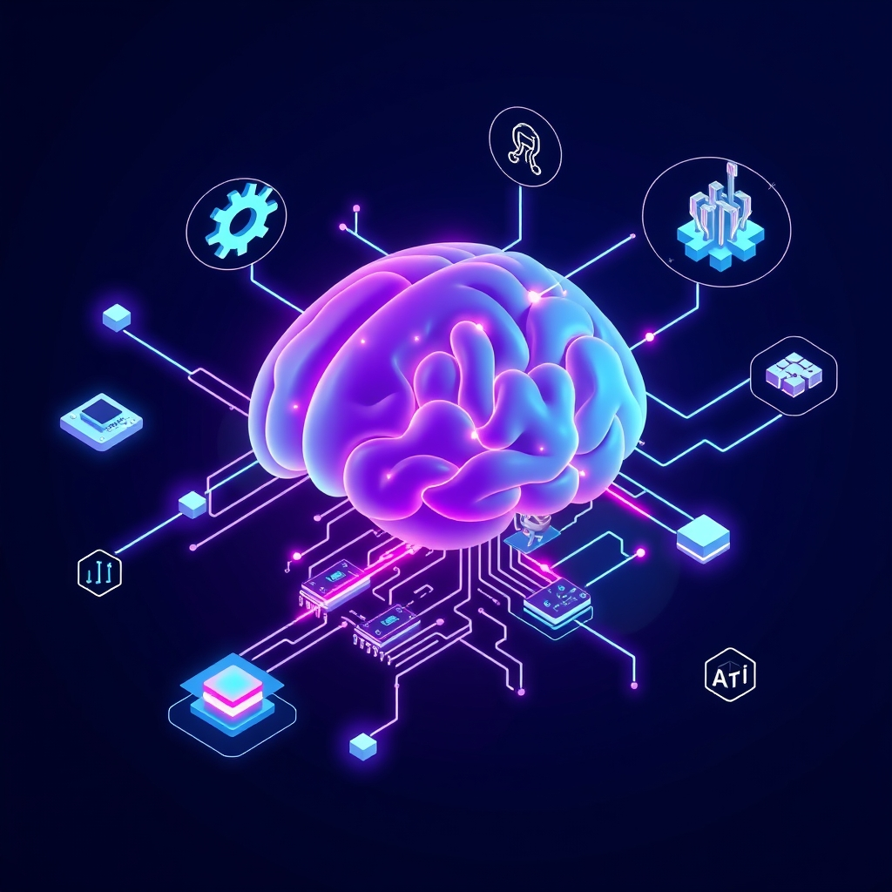

[Home](../index.md) > [Topics](./index.md) > [Knowledge](./a-hierarchical-view-of-human-knowledge.md) > [Engineering](./engineering.md) > [Software Engineering](./software-engineering.md)  
# 💻🔬 Computer Science  
  
## 🤖 AI Summary  
**High-Level Summary:**  
Computer Science is the study of computation, automation, and information. It encompasses both theoretical and practical aspects, focusing on the design, development, and analysis of algorithms, data structures, and computer systems. Its core goals are to understand the nature of computation, create efficient and reliable software and hardware, and solve complex problems using computational methods. Computer Science is fundamental to modern society, driving innovation in virtually every field, from medicine and finance to entertainment and communication. 🚀🌐💡  
  
**Subcategories:**  
Here are some major subcategories within Computer Science:  
  
* **Algorithms and Data Structures:** 📊🔍 This area focuses on designing and analyzing efficient methods (algorithms) for solving problems and organizing data (data structures). It's the foundation of effective software development.  
* **[Programming Languages](./programming-languages.md):** ⌨️🐍 This subcategory deals with the design, implementation, and application of languages used to instruct computers. It explores different programming paradigms (e.g., object-oriented, functional) and their strengths.  
* **Artificial Intelligence (AI) and Machine Learning (ML):** 🤖🧠 This field aims to create intelligent systems that can learn, reason, and solve problems like humans. It includes areas like neural networks, natural language processing, and computer vision.  
* **Computer Architecture and Organization:** 🖥️⚙️ This focuses on the design and organization of computer hardware, including processors, memory, and input/output devices. It explores how these components work together to execute instructions.  
* **Operating Systems:** 🚦💾 This area deals with the software that manages computer hardware and software resources, providing a platform for applications to run. It ensures efficient and reliable system operation.  
* **Database Systems:** 📦📊 This subcategory focuses on the design, implementation, and management of systems for storing, retrieving, and managing large amounts of data. It's crucial for data-driven applications.  
* **Computer Networks and Security:** 🌐🔒 This field explores the communication between computers and the protection of computer systems from unauthorized access and attacks. It covers topics like network protocols, cryptography, and cybersecurity.  
* **[Software Engineering](./software-engineering.md):** 🛠️🏗️ This focuses on the systematic design, development, and maintenance of software systems. It emphasizes principles and practices for creating reliable and efficient software.  
* **Theory of Computation:** 📝💡 This subcategory explores the fundamental capabilities and limitations of computation, including topics like automata theory, computability, and complexity theory.  
* **Human-Computer Interaction (HCI):** 🧑‍💻🤝 This area focuses on the design of user-friendly interfaces and systems that enable effective interaction between humans and computers.  
  
**Book Recommendations:**  
Here are some excellent books to get you started in Computer Science:  
  
1.  **"Introduction to Algorithms" by Thomas H. Cormen, Charles E. Leiserson, Ronald L. Rivest, and Clifford Stein:**  
    * This is a classic and comprehensive textbook on algorithms and data structures. It's often referred to as "CLRS" and is considered a must-have for any serious computer science student. 📚📈  
2.  **"Code: The Hidden Language of Computer Hardware and Software" by Charles Petzold:**  
    * This book provides a fascinating and accessible explanation of how computers work, starting from the basics of electricity and logic gates to the creation of software. It's a great way to understand the fundamental concepts of computer science. 💡🔌  
3.  **[🤖🧠 Artificial Intelligence: A Modern Approach](../books/artificial-intelligence-a-modern-approach.md) by Stuart Russell and Peter Norvig:**  
    * This is a leading textbook on artificial intelligence, covering a wide range of topics from search and planning to machine learning and robotics. It's a comprehensive and authoritative resource for anyone interested in AI. 🤖🧠  
4.  **[🧼💾 Clean Code: A Handbook of Agile Software Craftsmanship](../books/clean-code.md) by Robert C. Martin:**  
    * This book is a must read for anyone that wants to write better code. It focuses on the practices and principles of writing maintainable code. 🧑‍💻✨  
5.  **"Database System Concepts" by Abraham Silberschatz, Henry F. Korth, and S. Sudarshan:**  
    * This book provides a solid foundation for database systems. It covers a large amount of information, and is very well organized. 📦📊  
  
## 💬 [Gemini](https://gemini.google.com/app) Prompt  
> For the category of Computer Science, please provide:  
A High-Level Summary: A concise overview of the core principles, goals, and significance of this category.  
Subcategories: A list of the major subcategories or branches within this category, with a brief description of each.  
Book Recommendations: A selection of 3-5 influential or accessible books that provide a good introduction to this category or its key subcategories.  
Use lots of emojis.  
  
## 🦋 Bluesky    
<blockquote class="bluesky-embed" data-bluesky-uri="at://did:plc:i4yli6h7x2uoj7acxunww2fc/app.bsky.feed.post/3mmiin2onom2u" data-bluesky-cid="bafyreifstf7l6exnw5e3athwraoovvllfnr255jc6enwlcr3tjl7m5liim">
💻🔬 Computer Science  
  
#AI Q: 💻 Which area of computer science will shape the future the most?  
  
🤖 AI | 📊 Algorithms | ⌨️ Programming  
https://bagrounds.org/topics/computer-science
&mdash; <a href="https://bsky.app/profile/did:plc:i4yli6h7x2uoj7acxunww2fc?ref_src=embed">Bryan Grounds (@bagrounds.bsky.social)</a> <a href="https://bsky.app/profile/did:plc:i4yli6h7x2uoj7acxunww2fc/post/3mmiin2onom2u?ref_src=embed">2026-05-23T03:22:00.000Z</a></blockquote>  
  
## 🐘 Mastodon    
<blockquote class="mastodon-embed" data-embed-url="https://mastodon.social/@bagrounds/116632185223307879/embed" style="background: #282c37; border-radius: 8px; border: 1px solid #393f4f; margin: 0; max-width: 540px; min-width: 270px; overflow: hidden; padding: 0;"> <a href="https://mastodon.social/@bagrounds/116632185223307879" target="_blank" style="align-items: center; color: #d9e1e8; display: flex; flex-direction: column; font-family: system-ui, -apple-system, BlinkMacSystemFont, 'Segoe UI', Oxygen, Ubuntu, Cantarell, 'Fira Sans', 'Droid Sans', 'Helvetica Neue', Roboto, sans-serif; font-size: 14px; justify-content: center; letter-spacing: 0.25px; line-height: 20px; padding: 24px; text-decoration: none;"> <svg xmlns="http://www.w3.org/2000/svg" xmlns:xlink="http://www.w3.org/1999/xlink" width="32" height="32" viewBox="0 0 79 75"><path d="M63 45.3v-20c0-4.1-1-7.3-3.2-9.7-2.1-2.4-5-3.7-8.5-3.7-4.1 0-7.2 1.6-9.3 4.7l-2 3.3-2-3.3c-2-3.1-5.1-4.7-9.2-4.7-3.5 0-6.4 1.3-8.6 3.7-2.1 2.4-3.1 5.6-3.1 9.7v20h8V25.9c0-4.1 1.7-6.2 5.2-6.2 3.8 0 5.8 2.5 5.8 7.4V37.7H44V27.1c0-4.9 1.9-7.4 5.8-7.4 3.5 0 5.2 2.1 5.2 6.2V45.3h8ZM74.7 16.6c.6 6 .1 15.7.1 17.3 0 .5-.1 4.8-.1 5.3-.7 11.5-8 16-15.6 17.5-.1 0-.2 0-.3 0-4.9 1-10 1.2-14.9 1.4-1.2 0-2.4 0-3.6 0-4.8 0-9.7-.6-14.4-1.7-.1 0-.1 0-.1 0s-.1 0-.1 0 0 .1 0 .1 0 0 0 0c.1 1.6.4 3.1 1 4.5.6 1.7 2.9 5.7 11.4 5.7 5 0 9.9-.6 14.8-1.7 0 0 0 0 0 0 .1 0 .1 0 .1 0 0 .1 0 .1 0 .1.1 0 .1 0 .1.1v5.6s0 .1-.1.1c0 0 0 0 0 .1-1.6 1.1-3.7 1.7-5.6 2.3-.8.3-1.6.5-2.4.7-7.5 1.7-15.4 1.3-22.7-1.2-6.8-2.4-13.8-8.2-15.5-15.2-.9-3.8-1.6-7.6-1.9-11.5-.6-5.8-.6-11.7-.8-17.5C3.9 24.5 4 20 4.9 16 6.7 7.9 14.1 2.2 22.3 1c1.4-.2 4.1-1 16.5-1h.1C51.4 0 56.7.8 58.1 1c8.4 1.2 15.5 7.5 16.6 15.6Z" fill="currentColor"/></svg> 
Post by @bagrounds@mastodon.social
 
View on Mastodon
 </a> </blockquote> 