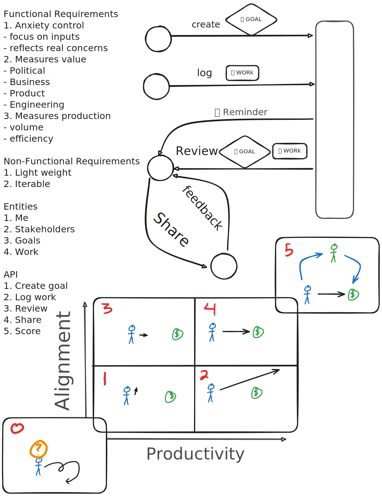

[Home](../index.md) > [Topics](./index.md)  
# Design a Performance Self-Evaluation System  
  
  
---  
_If you're here for the performance self-evaluation system, you can ignore everything below_  
## 🦟🔍 Bug Investigation  
🤔 Why doesn't my embedded Excalidraw get converted to svg when I publish this note?  
  
### 👀 Observations  
- there is an image element embedded in the page, but it doesn't render  
- when I view the image at its url directly, I see the following error and a blank page  
```  
This page contains the following errors:  
error on line 1 at column 1: Start tag expected, '<' not found  
Below is a rendering of the page up to the first error.  
```  
- I sometimes see the following error in an obsidian popup after publishing this note:  
```  
❌ Errors  
📤 Cannot be published  
🗒️Drawing 2024-12-12 17.20.04.excalidraw.md  
```  
- I also see this error popup when publishing this note: `ReferenceError: Buffer is not defined`  
- I've pulled the corresponding log line out of my logstravaganza plugin log file ([chat gpt cleaned it up](../bot-chats/special-characters-in-logs.md))  
```  
FATAL    Enveloppe  
    ReferenceError: Buffer is not defined  
```  
- my current Enveloppe config:  
```json  
{  
  "github": {  
    "branch": "main",  
    "automaticallyMergePR": true,  
    "dryRun": {  
      "enable": false,  
      "folderName": "github-publisher"  
    },  
    "tokenPath": "%configDir%/plugins/%pluginID%/env",  
    "api": {  
      "tiersForApi": "Github Free/Pro/Team (default)",  
      "hostname": ""  
    },  
    "workflow": {  
      "commitMessage": "[PUBLISHER] Merge",  
      "name": ""  
    },  
    "verifiedRepo": true  
  },  
  "upload": {  
    "behavior": "obsidian",  
    "defaultName": "content",  
    "rootFolder": "",  
    "yamlFolderKey": "",  
    "frontmatterTitle": {  
      "enable": false,  
      "key": "title"  
    },  
    "replaceTitle": [],  
    "replacePath": [],  
    "autoclean": {  
      "includeAttachments": true,  
      "enable": true,  
      "excluded": [  
        "/\\.pdf$/"  
      ]  
    },  
    "folderNote": {  
      "enable": false,  
      "rename": "index.md",  
      "addTitle": {  
        "enable": false,  
        "key": "title"  
      }  
    },  
    "metadataExtractorPath": ""  
  },  
  "conversion": {  
    "hardbreak": true,  
    "dataview": true,  
    "censorText": [],  
    "tags": {  
      "inline": false,  
      "exclude": [],  
      "fields": []  
    },  
    "links": {  
      "internal": true,  
      "unshared": true,  
      "wiki": true,  
      "slugify": "disable",  
      "unlink": false  
    }  
  },  
  "embed": {  
    "attachments": true,  
    "overrideAttachments": [],  
    "keySendFile": [],  
    "notes": true,  
    "folder": "",  
    "convertEmbedToLinks": "keep",  
    "charConvert": "->",  
    "unHandledObsidianExt": [],  
    "sendSimpleLinks": true,  
    "forcePush": true,  
    "useObsidianFolder": false,  
    "bake": {  
      "textBefore": "",  
      "textAfter": ""  
    }  
  },  
  "plugin": {  
    "shareKey": "share",  
    "excludedFolder": [  
      "templates",  
      "home",  
      "js",  
      "customjs",  
      "attachments"  
    ],  
    "copyLink": {  
      "enable": true,  
      "links": "bagrounds.org",  
      "removePart": [],  
      "transform": {  
        "toUri": true,  
        "slugify": "strict",  
        "applyRegex": []  
      }  
    },  
    "setFrontmatterKey": "Set"  
  },  
  "tabsId": "plugin-settings"  
}  
```  
  
### 🧑‍🔬 Attempts  
- I've updated my GitHub publisher (now [Enveloppe](https://enveloppe.github.io)) Obsidian plugin to the latest version  
- I've updated my [Obsidian Excalidraw Plugin](https://github.com/zsviczian/obsidian-excalidraw-plugin) to the latest version  
- I've tried toggling a bunch of settings in my Envelope plugin related to links and conversions  
- I've looked through Enveloppe's GitHub issue tracker for similar problems  
  - This [issue](https://github.com/Enveloppe/obsidian-enveloppe/issues/331#issuecomment-2049061420) looks close, but not quite the same  
  
###  🤔 Hypotheses  
- The Excalidraw file is being sent over as markdown instead of directly being converted to svg  
- Maybe that Buffer not defined error comes up while trying to convert the file to svg  
  - If so, the JavaScript runtime used by my mobile obsidian app may differ from the developer's test environment. But I'm already on the latest version of Obsidian.  
  
### 📎 Workaround  
In the meantime, I've exported the excalidraw to svg and embedded that directly.  
This gives the same end result, but requires a suboptimal workflow: re-export the file on every change, delete the old one, and rename the new export.  
  
### 🦟 The Bug  
  
