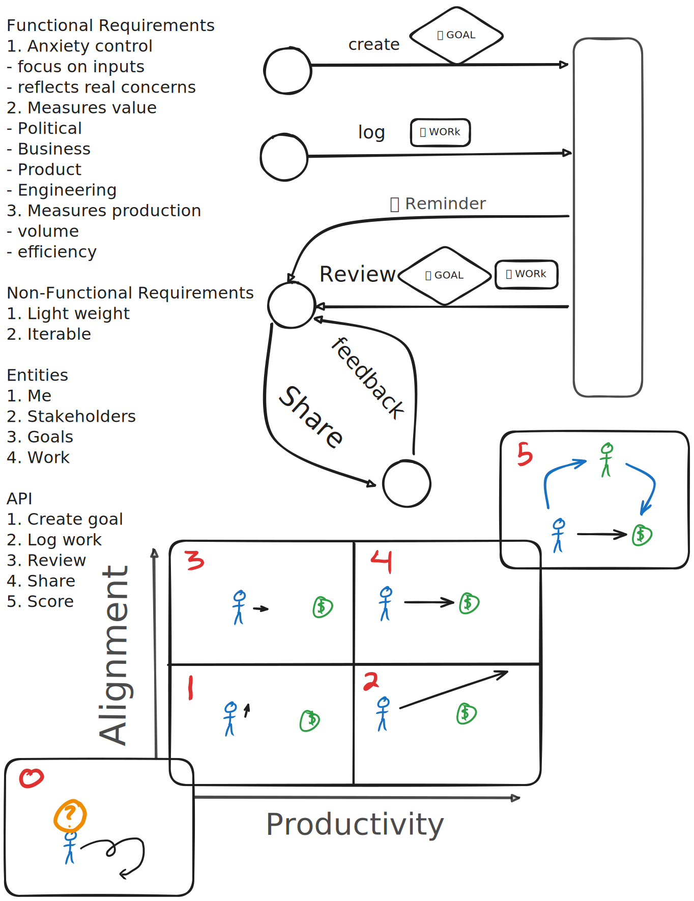

[Home](../index.md) > [Topics](./index.md)  
# 📊🧐📝⚙️ Design a Performance Self-Evaluation System  
  
  
%%[🖋 Edit in Excalidraw](../../design-a-performance-self-evaluation-system.md)%%  
  
---  
_If you're here for the performance self-evaluation system, you can ignore everything below_  
## 🦟🔍 Bug Investigation  
🤔 Why doesn't my embedded Excalidraw get converted to svg when I publish this note?  
  
### 👀 Observations  
- there is an image element embedded in the page, but it doesn't render  
- when I view the image at its url directly, I see the following error and a blank page  
```  
This page contains the following errors:  
error on line 1 at column 1: Start tag expected, '<' not found  
Below is a rendering of the page up to the first error.  
```  
- I sometimes see the following error in an obsidian popup after publishing this note:  
```  
❌ Errors  
📤 Cannot be published  
🗒️Drawing 2024-12-12 17.20.04.excalidraw.md  
```  
- I also see this error popup when publishing this note: `ReferenceError: Buffer is not defined`  
- I've pulled the corresponding log line out of my logstravaganza plugin log file ([chat gpt cleaned it up](../bot-chats/special-characters-in-logs.md))  
```  
FATAL    Enveloppe  
    ReferenceError: Buffer is not defined  
```  
- my current Enveloppe config:  
```json  
{  
  "github": {  
    "branch": "main",  
    "automaticallyMergePR": true,  
    "dryRun": {  
      "enable": false,  
      "folderName": "github-publisher"  
    },  
    "tokenPath": "%configDir%/plugins/%pluginID%/env",  
    "api": {  
      "tiersForApi": "Github Free/Pro/Team (default)",  
      "hostname": ""  
    },  
    "workflow": {  
      "commitMessage": "[PUBLISHER] Merge",  
      "name": ""  
    },  
    "verifiedRepo": true  
  },  
  "upload": {  
    "behavior": "obsidian",  
    "defaultName": "content",  
    "rootFolder": "",  
    "yamlFolderKey": "",  
    "frontmatterTitle": {  
      "enable": false,  
      "key": "title"  
    },  
    "replaceTitle": [],  
    "replacePath": [],  
    "autoclean": {  
      "includeAttachments": true,  
      "enable": true,  
      "excluded": [  
        "/\\.pdf$/"  
      ]  
    },  
    "folderNote": {  
      "enable": false,  
      "rename": "index.md",  
      "addTitle": {  
        "enable": false,  
        "key": "title"  
      }  
    },  
    "metadataExtractorPath": ""  
  },  
  "conversion": {  
    "hardbreak": true,  
    "dataview": true,  
    "censorText": [],  
    "tags": {  
      "inline": false,  
      "exclude": [],  
      "fields": []  
    },  
    "links": {  
      "internal": true,  
      "unshared": true,  
      "wiki": true,  
      "slugify": "disable",  
      "unlink": false  
    }  
  },  
  "embed": {  
    "attachments": true,  
    "overrideAttachments": [],  
    "keySendFile": [],  
    "notes": true,  
    "folder": "",  
    "convertEmbedToLinks": "keep",  
    "charConvert": "->",  
    "unHandledObsidianExt": [],  
    "sendSimpleLinks": true,  
    "forcePush": true,  
    "useObsidianFolder": false,  
    "bake": {  
      "textBefore": "",  
      "textAfter": ""  
    }  
  },  
  "plugin": {  
    "shareKey": "share",  
    "excludedFolder": [  
      "templates",  
      "home",  
      "js",  
      "customjs",  
      "attachments"  
    ],  
    "copyLink": {  
      "enable": true,  
      "links": "bagrounds.org",  
      "removePart": [],  
      "transform": {  
        "toUri": true,  
        "slugify": "strict",  
        "applyRegex": []  
      }  
    },  
    "setFrontmatterKey": "Set"  
  },  
  "tabsId": "plugin-settings"  
}  
```  
  
### 🧑‍🔬 Attempts  
- I've updated my GitHub publisher (now [Enveloppe](https://enveloppe.github.io)) Obsidian plugin to the latest version  
- I've updated my [Obsidian Excalidraw Plugin](https://github.com/zsviczian/obsidian-excalidraw-plugin) to the latest version  
- I've tried toggling a bunch of settings in my Envelope plugin related to links and conversions  
- I've looked through Enveloppe's GitHub issue tracker for similar problems  
  - This [issue](https://github.com/Enveloppe/obsidian-enveloppe/issues/331#issuecomment-2049061420) looks close, but not quite the same  
  
###  🤔 Hypotheses  
- The Excalidraw file is being sent over as markdown instead of directly being converted to svg  
- Maybe that Buffer not defined error comes up while trying to convert the file to svg  
  - If so, the JavaScript runtime used by my mobile obsidian app may differ from the developer's test environment. But I'm already on the latest version of Obsidian.  
  
### 📎 Workaround  
- In the meantime, I've exported the excalidraw to svg and embedded that directly.  
- This gives the same end result, but requires a suboptimal workflow: re-export the file on every change, delete the old one, and rename the new export.  
- ooh, looks like a [better workaround](https://forum.obsidian.md/t/has-anyone-succeeded-in-publishing-excalidraw-drawings/55587/9) may exist  
  
### 🦟 The Bug  
  
  
## 🦋 Bluesky    
<blockquote class="bluesky-embed" data-bluesky-uri="at://did:plc:i4yli6h7x2uoj7acxunww2fc/app.bsky.feed.post/3mmzpppoc5z2g" data-bluesky-cid="bafyreifh5sdcisxckcenqf2zpqvkdwtyto2icmpx23ivonfdghk45zoivm"><p>📊🧐📝⚙️ Design a Performance Self-Evaluation System  
  
#AI Q: 📈 How often do you find performance reviews actually helpful?  
  
🦟 Bug Investigation | 🛠️ Obsidian Plugins | ⚙️ Workflow Automation | 💻  
https://bagrounds.org/topics/design-a-performance-self-evaluation-system</p>&mdash; <a href="https://bsky.app/profile/did:plc:i4yli6h7x2uoj7acxunww2fc?ref_src=embed">Bryan Grounds (@bagrounds.bsky.social)</a> <a href="https://bsky.app/profile/did:plc:i4yli6h7x2uoj7acxunww2fc/post/3mmzpppoc5z2g?ref_src=embed">2026-05-29T23:44:00.000Z</a></blockquote><script async src="https://embed.bsky.app/static/embed.js" charset="utf-8"></script>  
  
## 🐘 Mastodon    
<blockquote class="mastodon-embed" data-embed-url="https://mastodon.social/@bagrounds/116661896550923520/embed" style="background: #282c37; border-radius: 8px; border: 1px solid #393f4f; margin: 0; max-width: 540px; min-width: 270px; overflow: hidden; padding: 0;"> <a href="https://mastodon.social/@bagrounds/116661896550923520" target="_blank" style="align-items: center; color: #d9e1e8; display: flex; flex-direction: column; font-family: system-ui, -apple-system, BlinkMacSystemFont, 'Segoe UI', Oxygen, Ubuntu, Cantarell, 'Fira Sans', 'Droid Sans', 'Helvetica Neue', Roboto, sans-serif; font-size: 14px; justify-content: center; letter-spacing: 0.25px; line-height: 20px; padding: 24px; text-decoration: none;"> <svg xmlns="http://www.w3.org/2000/svg" xmlns:xlink="http://www.w3.org/1999/xlink" width="32" height="32" viewBox="0 0 79 75"><path d="M63 45.3v-20c0-4.1-1-7.3-3.2-9.7-2.1-2.4-5-3.7-8.5-3.7-4.1 0-7.2 1.6-9.3 4.7l-2 3.3-2-3.3c-2-3.1-5.1-4.7-9.2-4.7-3.5 0-6.4 1.3-8.6 3.7-2.1 2.4-3.1 5.6-3.1 9.7v20h8V25.9c0-4.1 1.7-6.2 5.2-6.2 3.8 0 5.8 2.5 5.8 7.4V37.7H44V27.1c0-4.9 1.9-7.4 5.8-7.4 3.5 0 5.2 2.1 5.2 6.2V45.3h8ZM74.7 16.6c.6 6 .1 15.7.1 17.3 0 .5-.1 4.8-.1 5.3-.7 11.5-8 16-15.6 17.5-.1 0-.2 0-.3 0-4.9 1-10 1.2-14.9 1.4-1.2 0-2.4 0-3.6 0-4.8 0-9.7-.6-14.4-1.7-.1 0-.1 0-.1 0s-.1 0-.1 0 0 .1 0 .1 0 0 0 0c.1 1.6.4 3.1 1 4.5.6 1.7 2.9 5.7 11.4 5.7 5 0 9.9-.6 14.8-1.7 0 0 0 0 0 0 .1 0 .1 0 .1 0 0 .1 0 .1 0 .1.1 0 .1 0 .1.1v5.6s0 .1-.1.1c0 0 0 0 0 .1-1.6 1.1-3.7 1.7-5.6 2.3-.8.3-1.6.5-2.4.7-7.5 1.7-15.4 1.3-22.7-1.2-6.8-2.4-13.8-8.2-15.5-15.2-.9-3.8-1.6-7.6-1.9-11.5-.6-5.8-.6-11.7-.8-17.5C3.9 24.5 4 20 4.9 16 6.7 7.9 14.1 2.2 22.3 1c1.4-.2 4.1-1 16.5-1h.1C51.4 0 56.7.8 58.1 1c8.4 1.2 15.5 7.5 16.6 15.6Z" fill="currentColor"/></svg> <div style="color: #9baec8; margin-top: 16px;">Post by @bagrounds@mastodon.social</div> <div style="font-weight: 500;">View on Mastodon</div> </a> </blockquote> <script data-allowed-prefixes="https://mastodon.social/" async src="https://mastodon.social/embed.js"></script>