---  
share: true  
aliases:  
  - Digital Twin  
title: Digital Twin  
URL: https://bagrounds.org/topics/digital-twin  
---  
[Home](../index.md) > [Topics](./index.md)  
# Digital Twin  
## An Operational Definition  
Digital twin - a digital representation of the recent state of a subject; a means of observation  

```mermaid  
graph LR  
R[🕑 Subject] -->|🌐| D[2️⃣ Digital Twin]  
```  
  

  
## Essentials  
1. A subject to observe  
2. A sensor to measure the subject  
3. A means of capturing sensor measurements in a digital form  
4. A data schema to represent the measured state  
5. Transmission of measurements to storage  
6. Digital storage for the state of the subject  

```mermaid  
graph  
S[🌡️ Subject]  
M[👁️ Sensor]  
X[💾 Storage]  
M -->|📏 Measure| S  
M -->|📷 Capture\n➡️ Convert\n📡 Transmit| X  
```  
  

  
## Why?  
👁️ Observe -> 🧑‍🔬 Experiment -> 🧠 Understand -> 🔮 Predict -> 💭 Simulate -> 🗺️ Plan -> 🎮 Control  
  
## Extensions  
- saving multiple states with timestamps yields a historical record for study  
- synthesizing and filtering multiple measurements allows for error correction and improved accuracy  
- mathematical models allow simulation and prediction  
- frequent updates allow for rapid response to real-time events and high fidelity historical records  
- digital twins with networked effector interfaces allow closed loop control systems to be built  
  
## Examples  
- ⌚ Smartwatches  
  - measure physiology, movement, and position  
  - to understand and improve behavior and health  
- 📦 shipment tracking  
  - measures the position of packages  
  - to understand and improve delivery performance  
- ✈️ instrumented machines  
  - measure operating parameters  
  - to understand and improve performance and maintenance  
- 🌐 instrumented software systems  
  - measure resources, performance, and usage metrics  
  - to understand and improve product performance, operations, and maintenance  
  
## 🔗 References  
1. https://wikipedia.org/wiki/Digital_twin  
2. https://azure.microsoft.com/en-us/products/digital-twins  
3. https://aws.amazon.com/iot-twinmaker/  
4. https://www.lowesinnovationlabs.com/projects/store-digital-twin  
5.   
6.   
    1. https://blogs.sw.siemens.com/simcenter/apollo-13-the-first-digital-twin/  
    2. Mathematical and computational foundations  
        1. Physics based modeling  
            1. Partial differential equations  
        2. Reduced order modeling  
            1. Machine learning  
            2. Principal component analysis  
        3. Probabilistic graphical models  
            1. Robotics  
            2. Mathematical abstraction  
                1. Digital state -   
                2. Reward - cost & performance  
                3. Quantities of interest - prediction targets  
                4. Observational data - sparse, noisy  
                5. Physical state - inobservable  
                6. Control inputs  
            3. Dynamic Bayesian network  
                1. Random variables  
                2. Conditional probabilities  
        4. Creating and evolving a structural digital twin  
            1. Simplified model with inadequacy parameters  
            2. Bayesian prior probabilities  
            3. Measurements  
            4. Sampling  
            5. Density estimation  
            6. Particle filters  
            7. Calibration  
        5. Rapid adaptation  
            1. Training optimal classification trees  
    3. Examples  
        1. Unmanned aerial vehicles (UAV)  
        2. Cancer patient  
    4. Challenges  
        1. Predictive modeling  
        2. Validation, verification, and uncertainty quantification  
        3. Data models & decisions across multiple scales  
        4. Scalable algorithms for updating, prediction, and control  
        5. Optional sensing strategies  
        6. Data sharing and decomposition across organizations & stakeholders  
7.   
8.   
9.   
10.   
