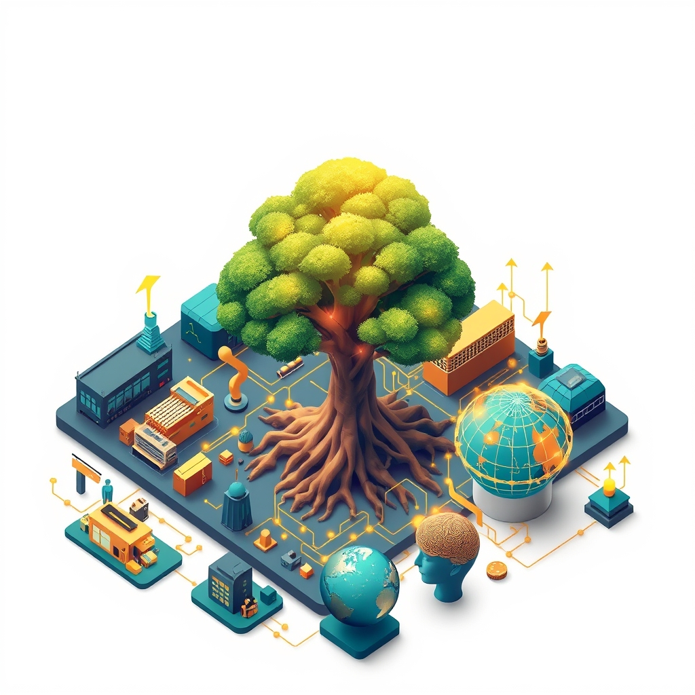

[Home](../index.md) > [Topics](./index.md) > [Knowledge](./a-hierarchical-view-of-human-knowledge.md) > [Social Sciences](./social-sciences.md)  
# 💰📈 Economics  
  
## 🤖 AI Summary  
**High-Level Summary:**  
Economics is the social science that studies the production, distribution, and consumption of goods and services. It seeks to understand how individuals, businesses, and governments make choices to allocate scarce resources to satisfy unlimited wants. Essentially, it's about how we manage our stuff! 🌍💸 The core principles revolve around supply and demand, efficiency, and the impact of various factors on economic well-being. The ultimate goal is to improve living standards and foster sustainable growth. It's significant because it shapes policy decisions, business strategies, and our daily lives. 📊💡  
  
**Subcategories:**  
* **Microeconomics:** Focuses on the behavior of individual consumers and firms. 🔍👤💼  
* **Macroeconomics:** Examines the economy as a whole, including factors such as inflation, unemployment, economic growth, and government policies. 📈🌐📊  
* **International Economics:** Studies the economic interactions between countries, including trade, finance, and investment. ✈️🌍🤝  
* **Development Economics:** Focuses on improving economic conditions in developing countries, addressing issues like poverty, inequality, and sustainable growth. 🌱🏘️📈  
* **Behavioral Economics:** Integrates psychological insights into economic analysis, exploring how cognitive biases and emotional factors influence decision-making. 🧠🤔💸  
* **Econometrics:** Applies statistical methods to analyze economic data, test economic theories, and forecast economic trends. 📊💻📈  
* **Public Finance:** Studies the role of government in the economy, including taxation, government spending, and public debt. 🏛️💰📜  
* **[Heterodox Economics](./heterodox-economics.md):** Encompasses a range of economic schools of thought that challenge mainstream neoclassical economics. 🧐🔄💡  
  
**Book Recommendations:**  
1. **"Freakonomics: A Rogue Economist Explores the Hidden Side of Everything" by Steven D. Levitt and Stephen J. Dubner:** This book offers a fun and accessible introduction to economic thinking by applying economic principles to everyday situations. It explores unconventional topics and challenges conventional wisdom. 🤯🎉📚  
2. **"Principles of Economics" by N. Gregory Mankiw:** A widely used textbook that provides a comprehensive overview of both microeconomics and macroeconomics. It's a great starting point for anyone looking to gain a solid foundation in the field. 📖🎓📊  
3. **"[Thinking, Fast and Slow](../books/thinking-fast-and-slow.md)" by Daniel Kahneman:** While not strictly an economics book, it provides crucial insights into behavioral economics, exploring the two systems of thinking that drive our decisions. It helps us understand why we often make irrational choices. 🧠💡🤔  
4. **"Poor Economics: A Radical Rethinking of the Way to Fight Global Poverty" by Abhijit V. Banerjee and Esther Duflo:** This book delves into the complexities of poverty and development economics, using rigorous research to challenge conventional approaches to poverty reduction. It offers practical insights and evidence-based solutions. 🌍🤝🌱  
5. **[🍩🌍 Doughnut Economics: Seven Ways to Think Like a 21st-Century Economist](../books/doughnut-economics-seven-ways-to-think-like-a-21st-century-economist.md) by Kate Raworth:** This book discusses the need for a new economic model that balances human well-being with environmental sustainability. It presents a framework for creating an economy that operates within the planet's ecological limits. 🍩🌎💚  
  
## 💬 [Gemini](https://gemini.google.com/app) Prompt  
> For the category of Economics, please provide:  
A High-Level Summary: A concise overview of the core principles, goals, and significance of this category.  
Subcategories: A list of the major subcategories or branches within this category, with a brief description of each.  
Book Recommendations: A selection of 3-5 influential or accessible books that provide a good introduction to this category or its key subcategories.  
Use lots of emojis.