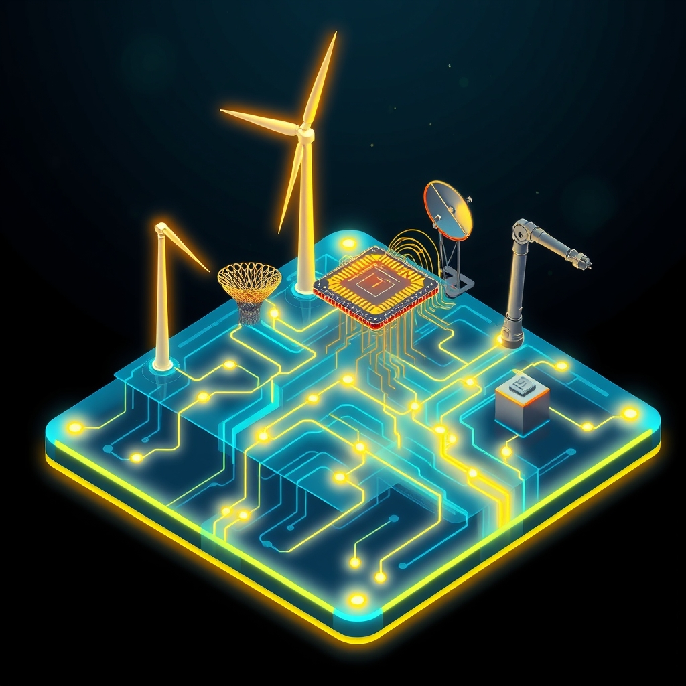

[Home](../index.md) > [Topics](./index.md) > [Knowledge](./a-hierarchical-view-of-human-knowledge.md) > [Engineering](./engineering.md)  
# ⚡🔌 Electrical Engineering  
  
## 🤖 AI Summary  
**High-Level Summary:**  
Electrical Engineering is the branch of engineering concerned with the study, design, and application of electrical systems, devices, and equipment. It encompasses a vast range of technologies, from power generation and distribution to electronics, telecommunications, and control systems. The core principles revolve around understanding and manipulating electrical phenomena to create innovative solutions that improve our lives. The goal is to design, develop, and maintain electrical systems that are efficient, reliable, safe, and sustainable. Essentially, Electrical Engineers power our modern world! 💡🔌  
  
**Subcategories:**  
Here are some major subcategories within Electrical Engineering:  
  
* **Power Systems:** ⚡️ Deals with the generation, transmission, distribution, and utilization of electrical power. This includes designing power plants, grids, and renewable energy systems.  
* **Electronics:** 💻 Focuses on the design and development of electronic circuits and devices, such as transistors, integrated circuits, and microprocessors. This subcategory is crucial for consumer electronics, computers, and embedded systems.  
* **Telecommunications:** 📡 Involves the transmission of information over long distances using electrical signals. This includes technologies like wireless communication, fiber optics, and networking.  
* **[Control Systems](./control-systems.md):** 🤖 Concerned with the design and implementation of systems that regulate and control the behavior of other systems. This is essential for automation, robotics, and aerospace engineering.  
* **Signal Processing:** 🔊 Deals with the analysis, manipulation, and interpretation of signals, such as audio, video, and data. This subcategory is vital for areas like image processing, speech recognition, and medical imaging.  
* **Computer Engineering:** 🖥️ Though often seen as a separate field, it is heavily intertwined with electrical engineering. It focuses on the design of computer hardware and software, including embedded systems and digital circuits.  
* **Electromagnetics:** 🌐 Studies the interaction between electric and magnetic fields. This is fundamental to understanding antennas, microwaves, and electromagnetic compatibility.  
* **Microelectronics:** 🔬 Focuses on the design and fabrication of very small electronic components and circuits, particularly integrated circuits.  
  
**Book Recommendations:**  
Here are some influential and accessible books that provide a good introduction to Electrical Engineering:  
  
1.  **"The Art of Electronics" by Paul Horowitz and Winfield Hill:** 📚 This classic text is a comprehensive and practical guide to electronics, covering a wide range of topics with clear explanations and real-world examples. It's a must-have for anyone interested in electronics design.  
2.  **"Electrical Engineering: Principles and Applications" by Allan R. Hambley:** 📖 A well-regarded textbook that provides a broad overview of electrical engineering principles, covering topics such as circuit analysis, electronics, power systems, and control systems. It's suitable for introductory courses and self-study.  
3.  **"Fundamentals of Electric Circuits" by Charles K. Alexander and Matthew N.O. Sadiku:** 📘 This book is an excellent resource for learning the fundamentals of circuit analysis, which is the foundation of electrical engineering. It provides clear explanations and numerous examples.  
4.  **"Power System Analysis and Design" by J. Duncan Glover, Thomas Overbye, and Mulukutla S. Sarma:** ⚡️ If you are interested in power systems, this is a very good book. It gives a good overview of the power grid, and how it is analysed.  
5.  **"Understanding Digital Signal Processing" by Richard G. Lyons:** 🔊 For those who want to explore signal processing, this book offers a clear and practical introduction to the concepts and techniques used in digital signal processing. It's especially useful for engineers working with audio, video, or communication systems.  
  
## 💬 [Gemini](https://gemini.google.com/app) Prompt  
> For the category of Electrical Engineering, please provide:  
A High-Level Summary: A concise overview of the core principles, goals, and significance of this category.  
Subcategories: A list of the major subcategories or branches within this category, with a brief description of each.  
Book Recommendations: A selection of 3-5 influential or accessible books that provide a good introduction to this category or its key subcategories.  
Use lots of emojis.  
  
## 🦋 Bluesky    
<blockquote class="bluesky-embed" data-bluesky-uri="at://did:plc:i4yli6h7x2uoj7acxunww2fc/app.bsky.feed.post/3mn2dcnccre2p" data-bluesky-cid="bafyreicv7miyq3zdcdlo7p6sbb6mg6dgsnqcelvyuaz6nqhkp4qw5yq6he">
⚡🔌 Electrical Engineering  
  
#AI Q: ⚡ Which electrical invention has changed your daily life the most?  
  
💡 System Design | 🔌 Power Grids | 💻 Electronics | 🤖 Automation  
https://bagrounds.org/topics/electrical-engineering
&mdash; <a href="https://bsky.app/profile/did:plc:i4yli6h7x2uoj7acxunww2fc?ref_src=embed">Bryan Grounds (@bagrounds.bsky.social)</a> <a href="https://bsky.app/profile/did:plc:i4yli6h7x2uoj7acxunww2fc/post/3mn2dcnccre2p?ref_src=embed">2026-05-30T05:34:36.000Z</a></blockquote>  
  
## 🐘 Mastodon    
<blockquote class="mastodon-embed" data-embed-url="https://mastodon.social/@bagrounds/116662918643394992/embed" style="background: #282c37; border-radius: 8px; border: 1px solid #393f4f; margin: 0; max-width: 540px; min-width: 270px; overflow: hidden; padding: 0;"> <a href="https://mastodon.social/@bagrounds/116662918643394992" target="_blank" style="align-items: center; color: #d9e1e8; display: flex; flex-direction: column; font-family: system-ui, -apple-system, BlinkMacSystemFont, 'Segoe UI', Oxygen, Ubuntu, Cantarell, 'Fira Sans', 'Droid Sans', 'Helvetica Neue', Roboto, sans-serif; font-size: 14px; justify-content: center; letter-spacing: 0.25px; line-height: 20px; padding: 24px; text-decoration: none;"> <svg xmlns="http://www.w3.org/2000/svg" xmlns:xlink="http://www.w3.org/1999/xlink" width="32" height="32" viewBox="0 0 79 75"><path d="M63 45.3v-20c0-4.1-1-7.3-3.2-9.7-2.1-2.4-5-3.7-8.5-3.7-4.1 0-7.2 1.6-9.3 4.7l-2 3.3-2-3.3c-2-3.1-5.1-4.7-9.2-4.7-3.5 0-6.4 1.3-8.6 3.7-2.1 2.4-3.1 5.6-3.1 9.7v20h8V25.9c0-4.1 1.7-6.2 5.2-6.2 3.8 0 5.8 2.5 5.8 7.4V37.7H44V27.1c0-4.9 1.9-7.4 5.8-7.4 3.5 0 5.2 2.1 5.2 6.2V45.3h8ZM74.7 16.6c.6 6 .1 15.7.1 17.3 0 .5-.1 4.8-.1 5.3-.7 11.5-8 16-15.6 17.5-.1 0-.2 0-.3 0-4.9 1-10 1.2-14.9 1.4-1.2 0-2.4 0-3.6 0-4.8 0-9.7-.6-14.4-1.7-.1 0-.1 0-.1 0s-.1 0-.1 0 0 .1 0 .1 0 0 0 0c.1 1.6.4 3.1 1 4.5.6 1.7 2.9 5.7 11.4 5.7 5 0 9.9-.6 14.8-1.7 0 0 0 0 0 0 .1 0 .1 0 .1 0 0 .1 0 .1 0 .1.1 0 .1 0 .1.1v5.6s0 .1-.1.1c0 0 0 0 0 .1-1.6 1.1-3.7 1.7-5.6 2.3-.8.3-1.6.5-2.4.7-7.5 1.7-15.4 1.3-22.7-1.2-6.8-2.4-13.8-8.2-15.5-15.2-.9-3.8-1.6-7.6-1.9-11.5-.6-5.8-.6-11.7-.8-17.5C3.9 24.5 4 20 4.9 16 6.7 7.9 14.1 2.2 22.3 1c1.4-.2 4.1-1 16.5-1h.1C51.4 0 56.7.8 58.1 1c8.4 1.2 15.5 7.5 16.6 15.6Z" fill="currentColor"/></svg> 
Post by @bagrounds@mastodon.social
 
View on Mastodon
 </a> </blockquote> 