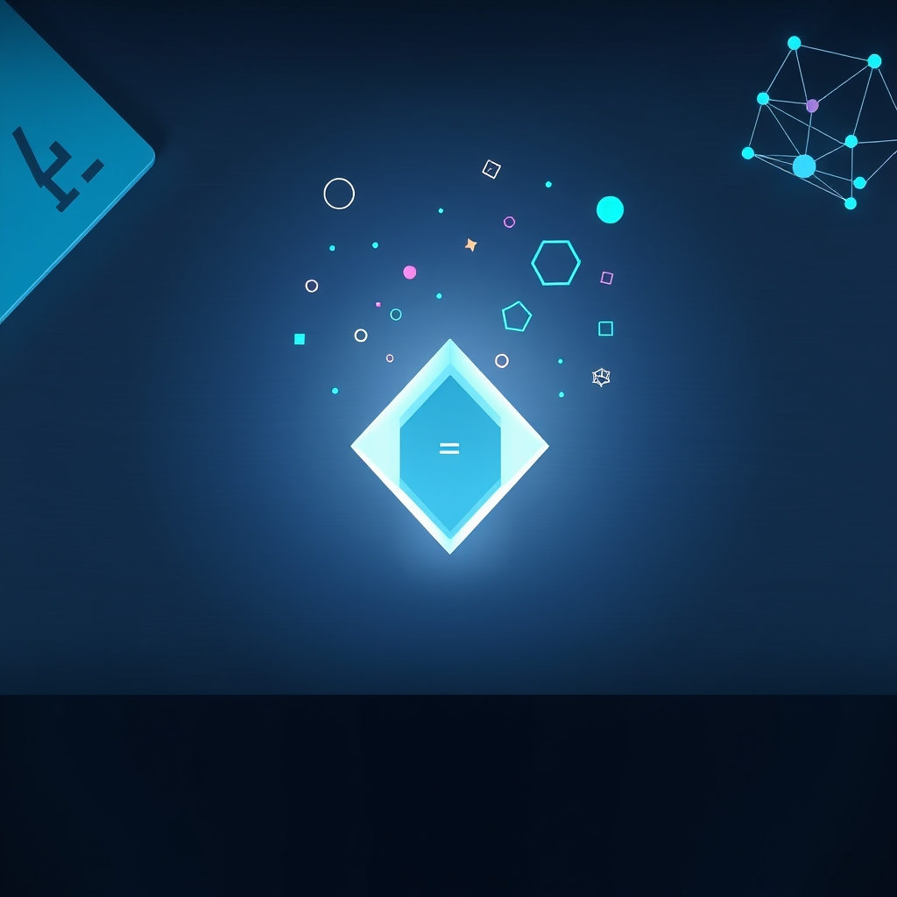

[Home](../index.md) > [Topics](./index.md)  
# 🧮💻 Functional Languages  
  
## 🤖 AI Summary  
**High-Level Summary:**  
Functional programming is a paradigm built around the concept of **functions as first-class citizens**. 🧑‍🏫 It emphasizes immutability (data that cannot be changed after creation), pure functions (functions with no side effects, always producing the same output for the same input), and declarative programming (focusing on *what* to compute rather than *how*). 🌟 The goals are to enhance code clarity, reduce bugs, improve maintainability, and facilitate parallel processing. 💻 Functional languages promote a mathematical approach to programming, making it easier to reason about code and verify its correctness. ✅ They are particularly useful for complex computations, data transformations, and concurrent systems. 🧠  
  
**Subcategories:**  
1.  **Pure Functional Languages:**  
    * These languages strictly adhere to functional principles, enforcing immutability and pure functions.  
    * Examples: Haskell, Clean.  
    * Description: They provide strong guarantees for correctness and are excellent for formal verification and complex mathematical computations. 🧪  
2.  **Impure Functional Languages:**  
    * These languages incorporate some imperative features or allow side effects for practical reasons.  
    * Examples: Scala, OCaml, F#.  
    * Description: They offer a balance between functional purity and real-world applicability, making them suitable for a wide range of applications. ⚖️  
3.  **Lisp-Based Functional Languages:**  
    * These languages are based on the Lisp family, known for their symbolic processing and metaprogramming capabilities.  
    * Examples: Common Lisp (though multi-paradigm), Scheme, Clojure.  
    * Description: They are highly flexible and powerful, often used in artificial intelligence, scripting, and web development. 🔮  
4.  **Lambda Calculus Inspired Languages:**  
    * These languages are strongly inspired by the lambda calculus, the foundation of functional programming.  
    * Examples: Haskell, and languages that use lambda functions heavily.  
    * Description: They often have strong type systems and are used for theoretical and practical programming. 📚  
  
**Book Recommendations:**  
1.  **"[Learn You a Haskell for Great Good!](../books/learn-you-a-haskell-for-great-good.md)" by Miran Lipovača:**  
    * A fun and accessible introduction to Haskell, a pure functional language.  
    * It uses clear explanations and humorous illustrations to teach fundamental concepts. 🌈  
    * Perfect for those who want to learn a pure functional language.  
    * Haskell is a great way to learn functional thinking.  
    * Link to purchase or find it online: You can search for it on any book retailer.  
2.  **"Structure and Interpretation of Computer Programs" (SICP) by Harold Abelson and Gerald Jay Sussman (with Julie Sussman):**  
    * A classic text on computer science that uses Scheme (a Lisp dialect) to teach programming concepts.  
    * It covers a wide range of topics, including functional programming, data abstraction, and interpreters. 💡  
    * This is a must read for anyone serious about computer science.  
    * Link to purchase or find it online: You can search for it on any book retailer or find it online for free.  
3.  **"Programming in Scala" by Martin Odersky, Lex Spoon, and Bill Venners:**  
    * A comprehensive guide to Scala, an impure functional language that runs on the JVM.  
    * It covers both functional and object-oriented programming aspects of Scala. ☕  
    * Scala is a very useful language in the industry.  
    * Link to purchase or find it online: You can search for it on any book retailer.  
4.  **"Real World OCaml" by Yaron Minsky, Anil Madhavapeddy, and Jason Hickey:**  
    * A practical guide to OCaml, an impure functional language used in industry.  
    * This book is very well written, and has many practical examples.  
    * OCaml is used in many financial and scientific applications.  
    * Link to purchase or find it online: You can search for it on any book retailer.  
5.  **"Clojure for the Brave and True" by Daniel Higginbotham:**  
    * A great introduction to Clojure, a Lisp dialect that runs on the JVM.  
    * It is a fun and engaging book that covers the fundamentals of Clojure.  
    * Clojure is very useful for web development and data processing.  
    * Link to purchase or find it online: You can search for it on any book retailer or find it online for free.  
  
## 💬 [Gemini](https://gemini.google.com/app) Prompt  
> For the category of Functional Languages, please provide:  
A High-Level Summary: A concise overview of the core principles, goals, and significance of this category.  
Subcategories: A list of the major subcategories or branches within this category, with a brief description of each.  
Book Recommendations: A selection of 3-5 influential or accessible books that provide a good introduction to this category or its key subcategories.  
Use lots of emojis.  
  
## 🦋 Bluesky    
<blockquote class="bluesky-embed" data-bluesky-uri="at://did:plc:i4yli6h7x2uoj7acxunww2fc/app.bsky.feed.post/3mlg5a54hbg2e" data-bluesky-cid="bafyreidbhblambphs5e3wqjx45c5du5ie33gw2v5mjkyfydytwzalaf3zq">
🧮💻 Functional Languages  
  
#AI Q: 🧩 Does functional programming actually make your code easier to maintain?  
  
🧮 Lambda Calculus | 💎 Immutability | 🏛️ Programming Paradig  
https://bagrounds.org/topics/functional-languages
&mdash; <a href="https://bsky.app/profile/did:plc:i4yli6h7x2uoj7acxunww2fc?ref_src=embed">Bryan Grounds (@bagrounds.bsky.social)</a> <a href="https://bsky.app/profile/did:plc:i4yli6h7x2uoj7acxunww2fc/post/3mlg5a54hbg2e?ref_src=embed">2026-05-09T11:27:24.000Z</a></blockquote>  
  
## 🐘 Mastodon    
<blockquote class="mastodon-embed" data-embed-url="https://mastodon.social/@bagrounds/116560867464389795/embed" style="background: #282c37; border-radius: 8px; border: 1px solid #393f4f; margin: 0; max-width: 540px; min-width: 270px; overflow: hidden; padding: 0;"> <a href="https://mastodon.social/@bagrounds/116560867464389795" target="_blank" style="align-items: center; color: #d9e1e8; display: flex; flex-direction: column; font-family: system-ui, -apple-system, BlinkMacSystemFont, 'Segoe UI', Oxygen, Ubuntu, Cantarell, 'Fira Sans', 'Droid Sans', 'Helvetica Neue', Roboto, sans-serif; font-size: 14px; justify-content: center; letter-spacing: 0.25px; line-height: 20px; padding: 24px; text-decoration: none;"> <svg xmlns="http://www.w3.org/2000/svg" xmlns:xlink="http://www.w3.org/1999/xlink" width="32" height="32" viewBox="0 0 79 75"><path d="M63 45.3v-20c0-4.1-1-7.3-3.2-9.7-2.1-2.4-5-3.7-8.5-3.7-4.1 0-7.2 1.6-9.3 4.7l-2 3.3-2-3.3c-2-3.1-5.1-4.7-9.2-4.7-3.5 0-6.4 1.3-8.6 3.7-2.1 2.4-3.1 5.6-3.1 9.7v20h8V25.9c0-4.1 1.7-6.2 5.2-6.2 3.8 0 5.8 2.5 5.8 7.4V37.7H44V27.1c0-4.9 1.9-7.4 5.8-7.4 3.5 0 5.2 2.1 5.2 6.2V45.3h8ZM74.7 16.6c.6 6 .1 15.7.1 17.3 0 .5-.1 4.8-.1 5.3-.7 11.5-8 16-15.6 17.5-.1 0-.2 0-.3 0-4.9 1-10 1.2-14.9 1.4-1.2 0-2.4 0-3.6 0-4.8 0-9.7-.6-14.4-1.7-.1 0-.1 0-.1 0s-.1 0-.1 0 0 .1 0 .1 0 0 0 0c.1 1.6.4 3.1 1 4.5.6 1.7 2.9 5.7 11.4 5.7 5 0 9.9-.6 14.8-1.7 0 0 0 0 0 0 .1 0 .1 0 .1 0 0 .1 0 .1 0 .1.1 0 .1 0 .1.1v5.6s0 .1-.1.1c0 0 0 0 0 .1-1.6 1.1-3.7 1.7-5.6 2.3-.8.3-1.6.5-2.4.7-7.5 1.7-15.4 1.3-22.7-1.2-6.8-2.4-13.8-8.2-15.5-15.2-.9-3.8-1.6-7.6-1.9-11.5-.6-5.8-.6-11.7-.8-17.5C3.9 24.5 4 20 4.9 16 6.7 7.9 14.1 2.2 22.3 1c1.4-.2 4.1-1 16.5-1h.1C51.4 0 56.7.8 58.1 1c8.4 1.2 15.5 7.5 16.6 15.6Z" fill="currentColor"/></svg> 
Post by @bagrounds@mastodon.social
 
View on Mastodon
 </a> </blockquote> 