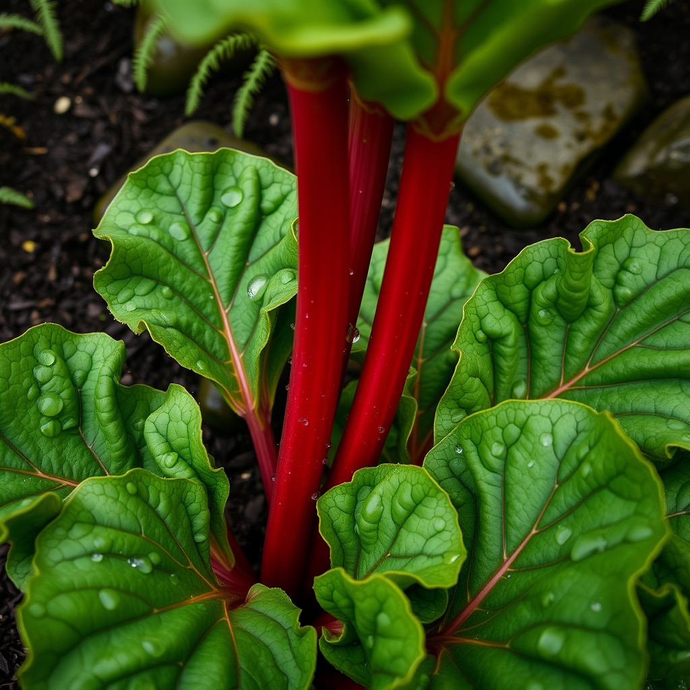

[Home](../index.md) > [Topics](./index.md)  
# 🌿🐚 Growing Centenarian Rhubarb in the PNW  
  
  
## 🤖 AI Summary  
  
🤖 A concise, education-first guide to long-lived rhubarb in the Pacific Northwest based on university extension research.  
  
## 📍 Site Selection  
  
📍 Rhubarb thrives in the PNW maritime climate with its cool springs, natural moisture, and winter chill hours.  
  
- ☀️ Full sun to partial shade (6+ hours ideal)  
- 🏞️ Well-drained soil is critical - crowns rot in standing water  
- 📊 pH 6.0-7.0 (slightly acidic to neutral)  
- 🍃 Space for a 4-foot diameter mature plant  
- 📍 Permanent location - rhubarb dislikes being moved once established  
  
## 🌱 Planting & Establishment  
  
- 🌱 Plant crowns in early spring (February-March in PNW) when dormant  
- 📏 Space 3-4 feet apart  
- ⬇️ Plant crown buds 1-2 inches below soil surface  
- 🚫 Wait 2 years before first harvest to establish roots  
  
## 🔄 Longevity & Renewal  
  
🔄 Rhubarb can live 50-100+ years with proper care.  
  
### 🪓 Dividing Old Plants  
  
🔄 Divide every 5-10 years when productivity declines:  
  
1. 🪓 Dig entire crown in early spring  
2. 🔪 Cut into sections with 2-3 buds each  
3. ✂️ Trim damaged roots  
4. 🌱 Replant immediately at same depth  
5. 💧 Water thoroughly  
  
🔪 Each division needs at least one bud and healthy root tissue. Discard the oldest, woodiest center portions.  
  
## 🪴 Propagation  
  
- 🌱 Crown division is the recommended method  
- 📅 Divide when plant produces 25-30+ small stalks instead of 12-18 large ones (typically year 5-6)  
- 🌿 5-6 year old crowns yield 8-10 good divisions  
- 🏷️ Obtain planting stock from reputable nurseries - avoid bringing diseased crowns from old fields  
  
## 🍓 Varieties for PNW  
  
| 🍓 Variety | 📊 Type | 📝 Notes |  
|------------|---------|----------|  
| 🌹 Crimson (Cherry, Red, Wine) | 🔴 Red | Leading PNW variety, red throughout |  
| 💜 Valentine | 🔴 Red | Vigorous, good color |  
| 🍒 Canada Red | 🔴 Red | Sweet, good color |  
| 💚 Victoria | 🟢 Green/speckled | Reliable, popular for forcing |  
| 🍎 MacDonald | 💗 Pink | Good producer |  
| 🌳 Riverside Giant | 🟢 Green | Cold-hardy, large stalks |  
  
## 🐛 Pests & Diseases  
  
🐛 Rhubarb is remarkably pest-resistant in the PNW.  
  
### 🐛 Main Concerns  
  
- 🐌 Slugs: Use iron phosphate bait in fall/wet season  
- 🦠 Crown rot: Prevent with good drainage - plant in raised beds if needed  
- 🟤 Red leaf bacteria: Remove infected plants promptly  
- 🐛 Rhubarb curculio: Rare in PNW, remove by hand  
  
> ⚠️ Never use pesticides on rhubarb - the stalks absorb chemicals. Use organic methods only.  
  
## ✂️ Harvesting  
  
- ⏳ Wait 2 years after planting before first harvest  
- 📏 Harvest stalks when 12-18 inches long  
- ✋ Grasp at base, twist and pull - avoid cutting to prevent disease entry  
- 🚫 Never harvest more than 1/3 to 1/2 of plant at once  
- 🌱 Always leave 2+ stalks to sustain the crown  
- 📅 Normal harvest lasts 8 weeks (April-June in PNW)  
- 🛑 Stop harvesting by late July to allow energy storage for next year  
  
## 🥄 Storage  
  
- 🧊 Refrigerate in perforated plastic bags  
- ⏰ Keeps 2-4 weeks at 32°F with 95-100% humidity  
- 🧊 Freeze cut pieces for up to one year  
  
## ⚠️ Safety  
  
⚠️ Leaves are toxic - contain high oxalic acid.  
🥄 Only the leaf stalks (petioles) are edible.  
🥶 Frost-damaged stalks may have oxalic acid moved into stems - discard if soft or limp.  
  
## 📅 Seasonal Care (PNW)  
  
### ❄️ Winter (December-February)  
- 🌾 Apply 2-3 inches mulch after ground freezes  
- ❄️ Let natural cold provide dormancy (critical for spring vigor)  
  
### 🌸 Early Spring (February-March)  
- 🌱 Remove mulch gradually  
- 👀 Watch for emergence (often February in western WA/OR)  
- 🪴 Divide and replant as crowns emerge  
  
### ☀️ Peak Season (April-June)  
- ✂️ Harvest regularly - cut outer stalks at base  
- 💧 Water during dry spells (1 inch per week)  
- 🌸 Remove flower stalks to redirect energy to stalks  
  
### 🌞 Late Summer (July-August)  
- 🛑 Reduce harvesting  
- 🌱 Apply side-dressing of compost  
  
### 🍂 Fall (September-November)  
- 🍂 Clean up dead foliage  
- 🐛 Apply slug bait before rains  
- 🌾 Mulch for winter  
  
## 📚 References  
  
📚 OSU Extension: Grow Your Own Rhubarb - https://extension.oregonstate.edu/catalog/ec-797-grow-your-own-rhubarb  
📚 OSU Ohioline: Growing Rhubarb in the Home Garden - https://ohioline.osu.edu/factsheet/hyg-1631  
📚 WSU Extension: Growing Rhubarb in Home Gardens - https://pubs.extension.wsu.edu/growing-rhubarb-in-home-gardens  
📚 MSU Extension: Renewing Old Rhubarb Plants - https://www.canr.msu.edu/news/renewing_old_rhubarb_plants  
📚 OSU Oregon Vegetables: Rhubarb - https://horticulture.oregonstate.edu/oregon-vegetables/rhubarb-0  
  
### 🌱 Master Gardener Programs  
  
🌱 WSU Clark County Master Gardeners - https://extension.wsu.edu/clark/master-gardeners  
🌱 WSU King County Master Gardeners - https://extension.wsu.edu/king/mg-home/join-us