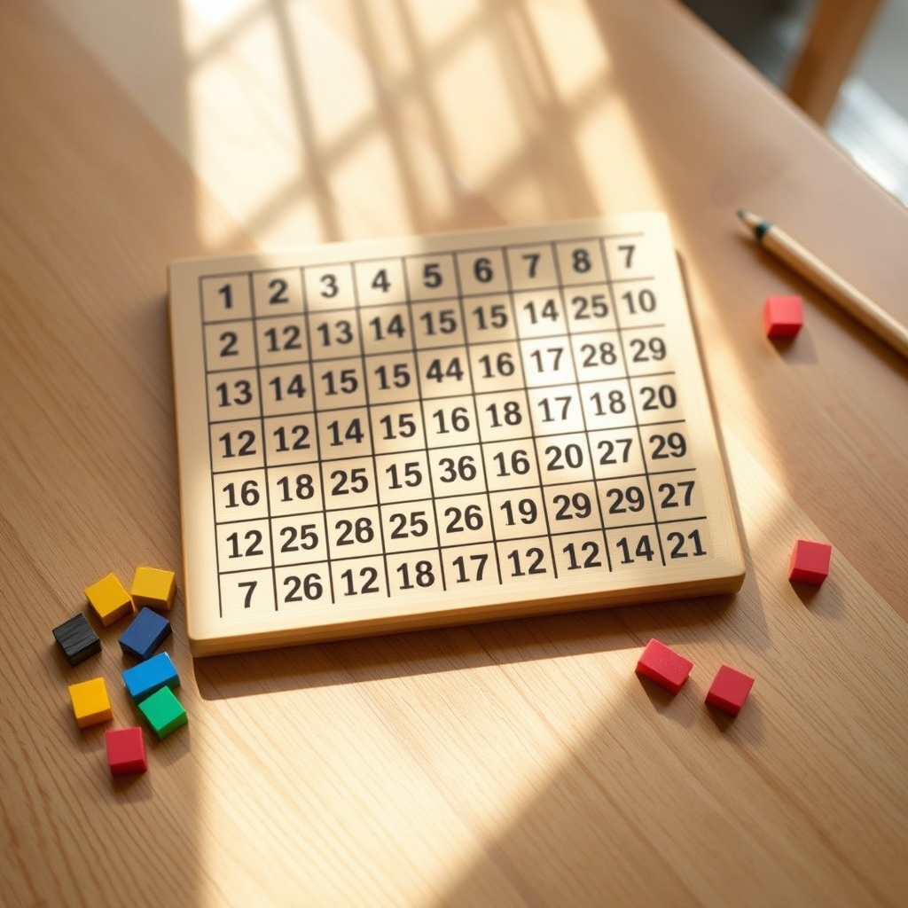

[Home](../index.md) > [Topics](./index.md)  
# 🔢💯 Hundred Board  
  
[🛒 Hundred Board. As an Amazon Associate I earn from qualifying purchases.](https://amzn.to/4njWMGm)  
  
## 🤖 AI Summary  
🔢 A **Hundred Board**, also commonly known as a 💯 **Hundreds Chart** or 🧮 **100 Board**, is a mathematical learning tool designed to help children understand numbers from 1 to 100.  
  
Here's a breakdown of what it is and its uses:  
  
### ❓ What it is  
  
* 🧱 **Grid Format:** It typically consists of a grid with 10 rows and 10 columns, totaling 100 squares.  
* 🔢 **Numbered Squares:** Each square is sequentially numbered from 1 to 100. Some variations may start from 0.  
* 💻 **Physical or Digital:** 🪵 Hundred boards can be physical boards (often made of wood or laminated plastic) with tiles that can be placed in the squares, or they can be interactive digital versions.  
* 🔄 **Double-Sided:** Many physical hundred boards are double-sided, with one side numbered and the other side blank (a plain grid) for more advanced activities.  
  
### 🧑‍🏫 How it's used (Educational Goals and Activities)  
  
The Hundred Board is a versatile tool used in early math education, particularly for children aged 4-8 (PreK to 2nd grade). Its main educational goals include:  
  
* ➕ **Counting and Number Recognition:** Helps children learn to count from 1 to 100 and recognize the numerals.  
* ⏩ **Numerical Sequence:** Reinforces the order of numbers and helps children understand their relative positions.  
* 📐 **Number Patterns:** Excellent for discovering various number patterns, such as:  
    * 🔟 **Counting by 10s:** Children can easily see the vertical pattern of numbers ending in the same digit (e.g., 10, 20, 30...).  
    * 🔢 **Counting by 2s (Even Numbers):** Identifying even numbers by placing markers on every second square.  
    * 🔢 **Counting by 5s:** Identifying multiples of 5.  
    * ✖️ **Multiples:** Exploring multiples of any number (e.g., placing markers on every 3rd square to see multiples of 3).  
* 📍 **Place Value:** Helps to visually grasp the concept of tens and ones.  
* ➕ **Basic Arithmetic:** Can be used for introducing and practicing addition, subtraction, and even laying the groundwork for multiplication and division. For example:  
    * ⬇️ Adding 10: Moving down one row on the board.  
    * ⬆️ Subtracting 10: Moving up one row.  
    * ➡️ Adding 1: Moving one square to the right.  
    * ⬅️ Subtracting 1: Moving one square to the left.  
* 🤔 **Problem-Solving:** Encourages children to think strategically about numbers and their relationships.  
* 💪 **Fine Motor Skills:** Placing tiles or markers on the board can help develop fine motor skills.  
  
### 🧱 Types of Hundred Boards  
  
* 🪵 **Montessori Hundred Board:** Often made of wood with engraved squares and separate numbered tiles that children place on the board. Emphasizes hands-on, self-directed learning.  
* 📃 **Laminated Hundred Boards:** More affordable, often come in sets, and are "write-and-wipe" friendly for use with dry-erase markers.  
* 💻 **Interactive Digital Hundred Charts:** Online versions that allow users to click and color squares, hide numbers, or perform other interactive activities.  
  
💡 In essence, the Hundred Board provides a concrete, visual, and tactile way for children to explore the world of numbers and build a strong foundation in mathematical concepts.  
  
### 🔬 Science  
  
🧬 Scientific studies generally support the use of tools like the hundred board (or hundreds chart) and other numerical board games in early mathematics education for their positive impact on number sense development and foundational math skills. Here's a summary of key findings and areas of research:  
  
#### 1. 🧠 Number Sense Development  
  
* 👁️ **Visualizing Relationships and Patterns:** Research highlights that the hundreds chart is a powerful visual representation of the number system. It helps students see how numbers are connected, identify patterns (like counting by tens, fives, and twos), and understand the structure of the base-ten system. This visual understanding is crucial for developing strong number sense.  
* 📍 **Place Value:** The grid format of the hundred board effectively reinforces place value concepts. Children can visually grasp how numbers are composed of tens and ones, and how they change as they move across or down the board (e.g., adding or subtracting 10 by moving up or down a row).  
* ⚖️ **Numerical Magnitude:** Studies indicate that playing linear numerical board games (which are often similar in concept to a hundred board, or at least a portion of one) improves children's understanding of numerical magnitudes – knowing the relative size of numbers. This is particularly beneficial for children from low-income backgrounds who may start school with less informal numerical experience.  
  
#### 2. ➕ Impact on Basic Math Skills  
  
* 🔢 **Counting and Sequencing:** The primary use of the hundred board, placing numbers in sequential order, is directly supported by research as an effective way to improve counting skills and number recognition.  
* ➕ **Basic Arithmetic (Addition and Subtraction):** The hundreds chart serves as a valuable tool for modeling basic addition and subtraction. Moving right for addition, left for subtraction, down for adding tens, and up for subtracting tens provides a concrete, visual representation of these operations, making abstract concepts more accessible.  
* ✖️ **Skip Counting and Foundation for Multiplication:** By highlighting every second, third, or fifth number, children can easily visualize skip counting patterns, which lays an intuitive groundwork for understanding multiplication.  
  
#### 3. 🌱 Cognitive and Developmental Benefits  
  
* 🖐️ **Hands-on and Multisensory Learning:** Many studies, particularly those focusing on Montessori approaches, emphasize the benefits of hands-on, tactile experiences for young learners. Manipulating tiles on a hundred board engages multiple senses, enhancing understanding and retention.  
* ✅ **Self-Correction and Independence:** The inherent "control of error" in a hundred board (e.g., a misplaced tile will be evident as the sequence doesn't fit) encourages children to self-correct, fostering independence and problem-solving skills.  
* 🤩 **Engagement and Motivation:** Board games, including those that incorporate a hundreds chart layout, are found to be engaging and can increase children's motivation to learn math. This playful approach can make learning more enjoyable and reduce math anxiety.  
* 🤔 **Problem-Solving and Critical Thinking:** Activities like filling in missing numbers or identifying "neighbors" on a partially covered hundreds chart encourage logical reasoning and critical thinking about number relationships.  
  
#### 4. 🎲 Research on Board Games (often directly applicable to hundred boards)  
  
* 📊 A comprehensive review of research published from 2000 onwards found that number-based board games significantly improve math skills in young children (aged 3-9), including counting, addition, and number comparison. The benefits were observed in children who participated in structured game sessions a few times a week.  
* 🏫 One study at Vanderbilt University is currently examining how modifications to traditional board game layouts (specifically, creating a 0-100 numerical board game organized in a 10x10 grid similar to a hundreds chart) can help children recognize and use numerical patterns, aiming to improve place value understanding and two-digit number calculations.  
  
#### 🧐 Considerations and Best Practices from Research  
  
* 👁️ **Visual Scaffolding:** Using the hundred board as a visual scaffold helps bridge the gap between concrete manipulatives and abstract number concepts.  
* 🎯 **Differentiation:** Activities with the hundred board can be easily differentiated to cater to various learning styles and abilities, by adjusting the complexity of tasks (e.g., starting with fully numbered boards, then partially numbered, then blank).  
* 🧑‍🏫 **Teacher Guidance:** While self-correction is valuable, structured activities led by a teacher or trained adult, often with specific learning objectives, tend to yield the most significant improvements.  
* 🔄 **"Bottom-Up" Hundred Charts:** Some research suggests that a "bottom-up" hundred chart (where 1 is in the bottom-left and numbers ascend upwards) might better align with children's mental models of increasing quantity and movements on a number line, potentially supporting reasoning more effectively, especially for concepts like "adding 10" by moving up.  
  
🎉 In conclusion, scientific evidence strongly supports the use of hundred boards and similar numerical grid games as effective tools for developing foundational number sense, basic arithmetic skills, and fostering a positive attitude towards mathematics in young children. Their visual, tactile, and interactive nature makes them a valuable component of early math education.  
  
## 📚 Book Recommendations  
  
### 📚 For Educators and Parents Focused on Using the Hundred Board  
  
1.  🔢 **"It Makes Sense: Using the Hundreds Chart to Build Number Sense" by Melissa Conklin and Stephanie Sheffield (Grades K-2)**  
    * 👩‍🏫 This book is highly recommended for teachers. 📊 It transforms the hundreds chart from a static poster into an interactive tool. ✏️ It offers twenty classroom-tested lessons and games to help students understand the base-ten number system and develop strong number sense. ➕ It also includes strategies for differentiation, assessment rubrics, and reproducible resources.  
  
2.  💯 **"Hundred Board Book, Grades Pre-K-2" by Sandra Clarkson and Vincent Altamuro**  
    * 🏢 Published by Didax, this resource focuses on hands-on activities with the hundred board. 🎲 It features 60 games and activities with accompanying teacher notes, designed to help students explore counting, ordering numbers, place value, number patterns, and basic addition and subtraction. ✅ It aligns with Common Core State Standards.  
  
3.  ➕ **"Hundred Number Board Activities, Grades K-1," "Grades 2-3," and "Grades 4-5" by Carson Dellosa Education**  
    * 🏫 These are activity books that offer games and exercises using the hundred number board, suitable for various early elementary grades. 💻 They are often available as ebooks and provide structured activities for learning centers and group work.  
  
### 🧮 For Broader Early Childhood Math Education and Number Sense  
  
4.  💡 **"Number Sense Routines: Building Numerical Literacy Every Day in Grades K-3" by Jessica F. Shumway**  
    * ❌ While not solely focused on the hundred board, this book is excellent for understanding how to build strong number sense in young children. 🗓️ It provides practical routines and strategies that can be integrated into daily lessons, many of which can be enhanced by tools like the hundreds chart.  
  
5.  🤔 **"What's Math Got to Do with It?: How Teachers and Parents Can Transform Mathematics Learning and Inspire Success" by Jo Boaler**  
    * 🧠 This book offers a broader perspective on how to foster a positive and effective math learning environment. 🎓 Jo Boaler is a renowned mathematics education professor, and her insights are valuable for understanding how children learn math and how to support them effectively.  
  
6.  🍎 **"Preparing Early Childhood Educators to Teach Math" (edited by Herbert P. Ginsburg, Marilou Hyson, and Taniesha A. Woods)**  
    * 📚 This is a more academic but highly informative resource that delves into the research and best practices for preparing educators to teach early childhood mathematics. 👧 It covers key concepts, child development, and effective pedagogical approaches.  
  
### 🎨 Children's Picture Books to Foster Number Sense (Great for Read-Alouds)  
  
7.  **[⚫🔢 Ten Black Dots](../books/ten-black-dots.md) by Donald Crews**  
    * 🔢 A classic for introducing numbers 1-10 and subitizing (instantly recognizing the quantity of a small group of objects).  
  
8.  🚪 **"The Doorbell Rang" by Pat Hutchins**  
    * 🍪 Excellent for exploring concepts of sharing, division, and basic fractions in a relatable context.  
  
9.  🦀 **"One is a Snail, Ten is a Crab" by April Pulley Sayre and Jeff Sayre**  
    * 🐌 A creative book that helps children count by different increments and understand number combinations (e.g., how many legs for various creatures).  
  
10. 🌳 **"Anno's Counting Book" by Mitsumasa Anno**  
    * 🖼️ A beautifully illustrated wordless counting book that encourages observation and numerical understanding.