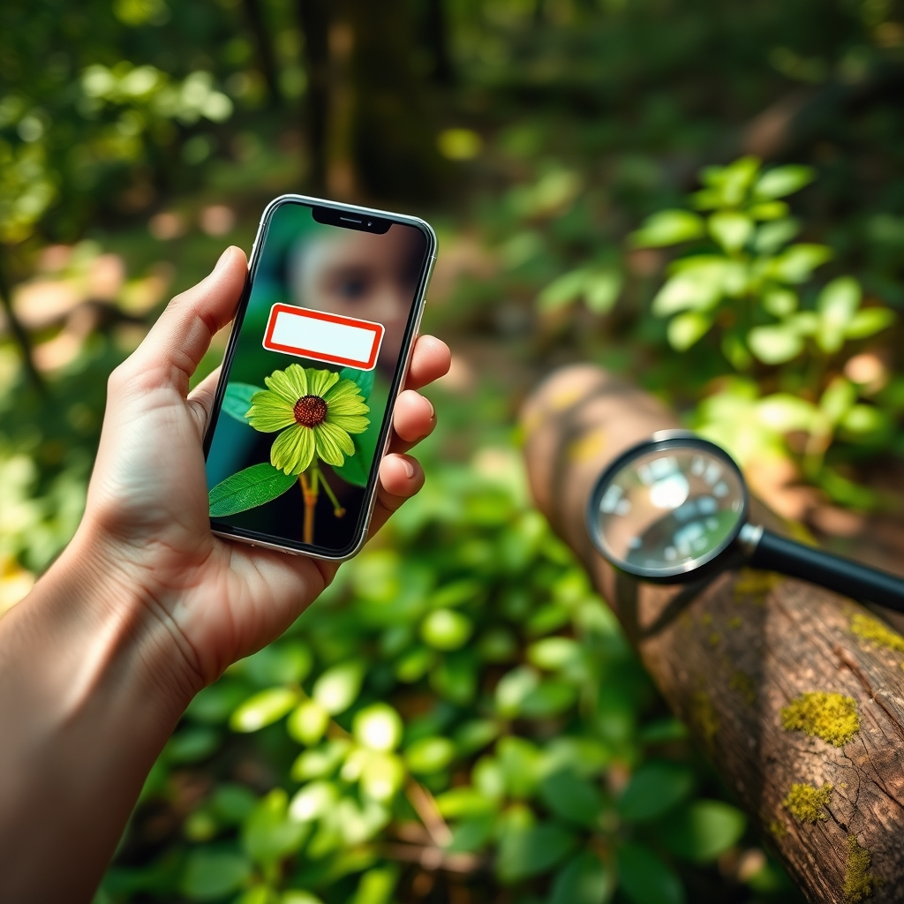

[Home](../index.md) > [Topics](./index.md)  
# 🔭🌿 iNaturalist  
  
## 🔗 Links  
- https://www.inaturalist.org  
- https://github.com/inaturalist/inaturalist  
- https://x.com/inaturalist  
- https://facebook.com/inaturalist  
- https://www.instagram.com/inaturalistorg  
  
## My Observations Widget  
  
  
<a href="https://www.inaturalist.org/observations/bagrounds" style="display: flex; align-items: center; height: 2em;">  
 bagrounds' observations »  
</a>  
