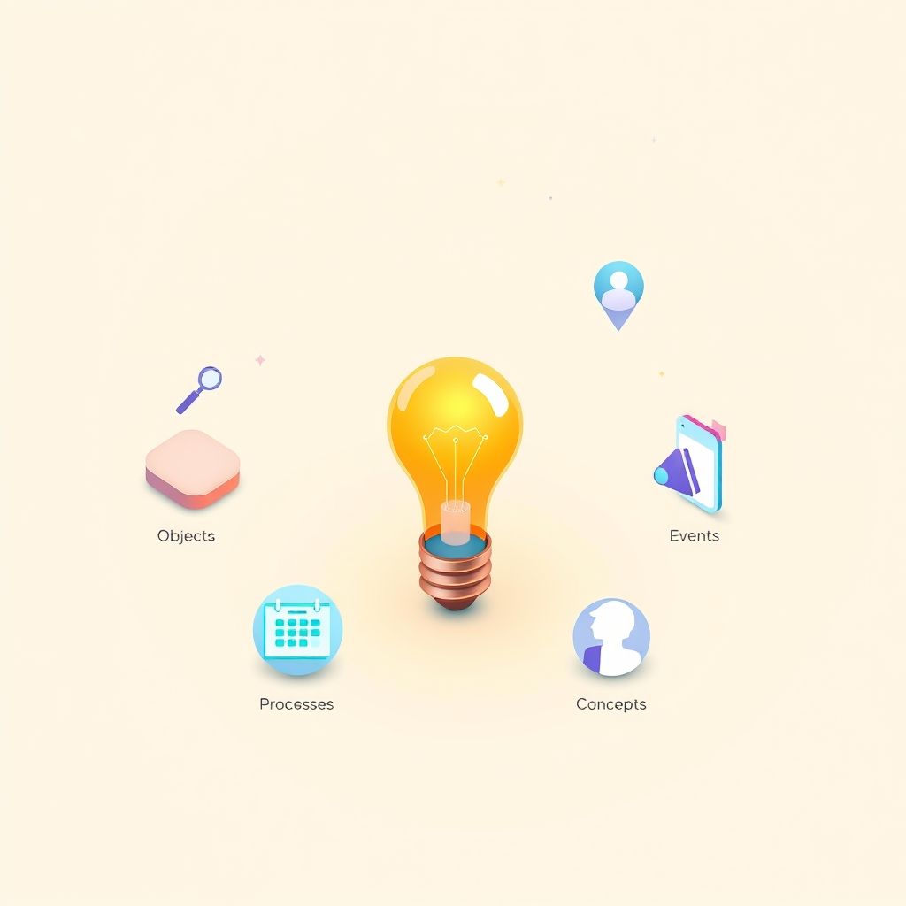

[Home](../index.md) > [Topics](./index.md) > [Knowledge](./a-hierarchical-view-of-human-knowledge.md) > [Social Sciences](./social-sciences.md) > [Communication Studies](./communication-studies.md) > [Public Speaking and Rhetoric](./public-speaking-and-rhetoric.md)  
# 📢🎓 Informative Speaking  
  
## 🤖 AI Summary  
**🌟 High-Level Summary:**  
  
Informative speaking is all about sharing knowledge, facts, and understanding with an audience in a clear, objective, and engaging way! 🤩 The goal is to educate, clarify, and enhance the audience's comprehension of a particular topic, without persuading them to adopt a specific viewpoint. 🧐 It's about empowering listeners with new information and insights. 💡 Informative speeches are crucial for teaching, explaining complex concepts, and fostering intellectual curiosity. 🧠✨ Let's make learning fun! 🥳  
  
**📚 Subcategories:**  
  
1.  **🏺 Speeches about Objects:** These speeches focus on tangible things, whether they're natural (like a specific type of rock ⛰️) or man-made (like a historical artifact 🕰️). The aim is to describe, explain, and provide context about the object. 🔍  
2.  **🍰 Speeches about Processes:** These speeches explain how something is done, made, or works. They often involve step-by-step instructions or explanations of a sequence of events, like how photosynthesis works 🌿🔬 or how to bake a cake 🎂. You'll be a master chef or scientist in no time! 👩‍🍳🧑‍🔬  
3.  **📰 Speeches about Events:** These speeches provide information about significant occurrences, past or present, such as historical events 📜, current affairs 🌍, or personal experiences 💬. The focus is on providing context, details, and analysis. 🧐 Don't miss out on important info! 📢  
4.  **🌌 Speeches about Concepts:** These speeches explore abstract ideas, theories, or principles. They aim to clarify complex concepts and make them accessible to the audience, such as explaining the concept of quantum mechanics ⚛️ or the theory of relativity 🚀. Dive into the world of ideas! 🧠💡  
5.  **👤 Speeches about People:** These speeches focus on biographies, profiles, or analyses of individuals, both living and deceased. The aim is to provide insight into their lives, achievements, and contributions. 🏆🎉 Learn about the greats! 🌟  
  
**📖 Book Recommendations:**  
  
1.  **🧠➡️💡 "[Made to Stick: Why Some Ideas Survive and Others Die](../books/made-to-stick.md)" by Chip Heath and Dan Heath:** This book delves into the principles of making ideas memorable and impactful, essential for effective informative speaking. It's filled with practical advice and engaging examples. You'll be a master of memory! 🤩  
2.  **🗣️🌟 "Talk Like TED: The 9 Public-Speaking Secrets of the World's Top Minds" by Carmine Gallo:** While focusing on TED Talks, this book provides valuable insights into captivating an audience, structuring a speech, and delivering information with passion and clarity. It's a great guide for making informative speeches engaging. 🎤✨  
3.  **🖼️✨ "[Presentation Zen: Simple Ideas on Presentation Design and Delivery](../books/presentation-zen.md)" by Garr Reynolds:** Visually engaging presentations are crucial for informative speaking. This book teaches how to create clean, simple, and effective visuals that enhance the audience's understanding. Make your presentations shine! 🌈  
4.  **[🔊🎞️🌱🤯 Resonate: Present Visual Stories that Transform Audiences](../books/resonate.md) by Nancy Duarte:** This book examines the power of storytelling in presentations and speeches. It helps speakers connect with their audience on an emotional level while delivering informative content. Connect and inspire! 🤝  
5.  **🧑‍🏫👍 "The Art of Explanation: Making Your Everyday Communication Make a Difference" by Lee LeFever:** This book is directly about the skills needed to explain things clearly. It is a very practical guide to making complex information understandable. Become an explanation expert! 🤓  
  
## 💬 [Gemini](https://gemini.google.com/app) Prompt  
> For the category of Informative Speaking, please provide:  
A High-Level Summary: A concise overview of the core principles, goals, and significance of this category.  
Subcategories: A list of the major subcategories or branches within this category, with a brief description of each.  
Book Recommendations: A selection of 3-5 influential or accessible books that provide a good introduction to this category or its key subcategories.  
Use lots of emojis.