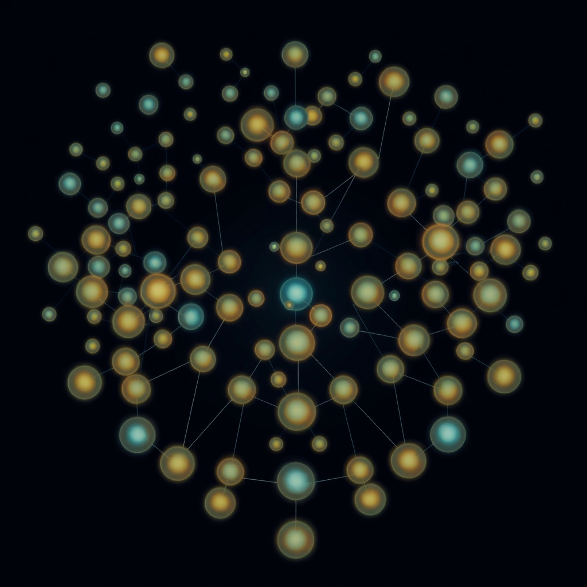

[Home](../index.md) > [Topics](./index.md)  
# 🔄🎯 Kuramoto Model  
  
## 🤖 AI Summary  
Alright, buckle up, buttercup, it's time for the 🔨 Tool Report 🔨 on the fascinating Kuramoto model! 🤩  
  
### 👉 What Is It?  
  
The Kuramoto model is a mathematical model 📝 used to describe the synchronization of coupled oscillators. 🔄 It's a simplified representation of systems where individual components naturally tend to oscillate at their own frequencies but interact and influence each other, leading to collective behavior. 🤝 Think fireflies flashing in unison or neurons firing together! 🧠 It belongs to the broader class of coupled oscillator models. 📈  
  
### ☁️ A High Level, Conceptual Overview  
  
* 🍼 **For A Child:** Imagine a bunch of swings 🎠 all swinging at different speeds. If they could talk to each other and try to swing at the same time, that's kind of like the Kuramoto model! 🎶  
* 🏁 **For A Beginner:** The Kuramoto model is a way to understand how things that naturally wobble or vibrate at different rates can start to wobble together when they're connected. 🔗 It helps us see how order can emerge from chaos. 🤯  
* 🧙‍♂️ **For A World Expert:** The Kuramoto model is a mean-field model that explores the emergence of synchronization in a population of coupled oscillators with distributed natural frequencies. ⚛️ It reveals phase transitions and collective behaviors through a simple yet powerful framework. 💥  
  
### 🌟 High-Level Qualities  
  
* Simplicity: It's mathematically elegant and relatively easy to analyze. 🤓  
* Universality: It applies to a wide range of systems, from biological to physical. 🌍  
* Insightful: It provides fundamental insights into synchronization phenomena. ✨  
  
### 🚀 Notable Capabilities  
  
* Predicting synchronization thresholds. 📊  
* Analyzing the dynamics of collective oscillations. 📈  
* Modeling the emergence of order in complex systems. 🌀  
* Visualizing phase transitions. 🎨  
  
### 📊 Typical Performance Characteristics  
  
* Synchronization occurs above a critical coupling strength. 📏  
* The order parameter quantifies the degree of synchronization, ranging from 0 (incoherent) to 1 (perfectly synchronized). 💯  
* The critical coupling strength depends on the distribution of natural frequencies. 📉  
* The speed of synchronization depends on the coupling strength. ⏱️  
  
### 💡 Examples Of Prominent Products, Applications, Or Services That Use It Or Hypothetical, Well Suited Use Cases  
  
* Modeling firefly synchronization. 💡  
* Analyzing neural oscillations in the brain. 🧠  
* Understanding power grid stability. ⚡️  
* Predicting audience clapping synchronization. 👏  
* Hypothetically, modeling the synchronization of social media trends. 📱  
  
### 📚 A List Of Relevant Theoretical Concepts Or Disciplines  
  
* Nonlinear dynamics. 🌀  
* Statistical mechanics. 📊  
* Complex systems theory. 🤯  
* Oscillator theory. 🎶  
* Graph theory. 🔗  
  
### 🌲 Topics:  
  
* 👶 Parent: Nonlinear Dynamics 🌀  
* 👩‍👧‍👦 Children:  
    * Coupled Oscillators 🔗  
    * Synchronization 🤝  
    * Phase Transitions 💥  
    * Mean-Field Theory 🧑‍🏫  
* 🧙‍♂️ Advanced topics:  
    * Ott-Antonsen Theory ⚛️  
    * Heterogeneous Kuramoto Models 🧩  
    * Network Kuramoto Models 🕸️  
    * Delay-Coupled Kuramoto Models ⏱️  
  
### 🔬 A Technical Deep Dive  
  
The Kuramoto model describes the evolution of the phase $\theta_i$ of each oscillator $i$ as:  
  
$$\frac{d\theta_i}{dt} = \omega_i + K \sum_{j=1}^{N} \sin(\theta_j - \theta_i)$$  
  
Where:  
  
* $\omega_i$ is the natural frequency of oscillator $i$. 🎶  
* $K$ is the coupling strength between oscillators. 🔗  
* $N$ is the total number of oscillators. 🔢  
  
The order parameter $r$ quantifies synchronization:  
  
$$r e^{i\psi} = \frac{1}{N} \sum_{j=1}^{N} e^{i\theta_j}$$  
  
Where $r$ is the magnitude (0 to 1) and $\psi$ is the average phase. 📊  
  
### 🧩 The Problem(s) It Solves: Ideally In The Abstract; Specific Common Examples; And A Surprising Example  
  
* Abstract: Explains how collective order emerges from individual disorder in coupled systems. 🤯  
* Common: Synchronized flashing of fireflies. 💡  
* Surprising: Explains the collective behavior of audiences clapping in unison after a performance. 👏  
  
### 👍 How To Recognize When It's Well Suited To A Problem  
  
* The system involves a large number of interacting oscillators. 🔄  
* The oscillators have a distribution of natural frequencies. 📊  
* The goal is to understand the emergence of synchronization. 🤝  
  
### 👎 How To Recognize When It's Not Well Suited To A Problem (And What Alternatives To Consider)  
  
* The system has few oscillators. 📉 (Consider direct interaction models).  
* The coupling is strongly nonlinear. 🌀 (Consider more complex oscillator models).  
* The system has significant spatial structure. 🕸️ (Consider spatially extended models).  
  
### 🩺 How To Recognize When It's Not Being Used Optimally (And How To Improve)  
  
* Ignoring the distribution of natural frequencies. 📊 (Use accurate frequency distributions).  
* Assuming uniform coupling strength. 🔗 (Consider heterogeneous coupling).  
* Neglecting time delays. ⏱️ (Incorporate delay-coupled models).  
* Not visualizing the order parameter. 🎨 (Visualize the order parameter over time).  
  
### 🔄 Comparisons To Similar Alternatives (Especially If Better In Some Way)  
  
* Stuart-Landau oscillators: More detailed, but less analytically tractable. 🧪  
* Winfree model: Similar, but uses a different coupling function. 🎶  
* Network models: Better for spatially structured systems. 🕸️  
  
### 🤯 A Surprising Perspective  
  
The Kuramoto model shows how even weak coupling can lead to surprisingly strong synchronization in large systems. 💥 It demonstrates the power of collective behavior. 🤝  
  
### 📜 Some Notes On Its History, How It Came To Be, And What Problems It Was Designed To Solve  
  
Yoshiki Kuramoto developed the model in the 1970s to understand self-synchronization phenomena in chemical and biological systems. 🧪 It simplified complex oscillator dynamics to a solvable form, revealing fundamental principles of synchronization. 💡  
  
### 📝 A Dictionary-Like Example Using The Term In Natural Language  
  
"The Kuramoto model helped scientists understand how the fireflies in the swamp synchronized their flashing patterns." 💡  
  
### 😂 A Joke: Tell A Single, Witty One Liner In The Style Of Jimmy Carr Or Mitch Hedberg (Think Carefully To Ensure It Makes Sense And Is Funny)  
  
"Coupled oscillators? They're like a group of friends trying to agree on a time to meet, but with more math and less disappointment... mostly." ⏱️😂  
  
### 📖 Book Recommendations  
  
* Topical: "Synchronization: A Universal Concept in Nonlinear Sciences" by Arkady Pikovsky, Michael Rosenblum, and Jürgen Kurths. 📚  
* Tangentially related: "[Nonlinear Dynamics and Chaos](../books/nonlinear-dynamics-and-chaos.md): With Applications to Physics, Biology, Chemistry, and Engineering" by Steven H. Strogatz. 🌀  
* Topically opposed: "[Chaos: Making a New Science](../books/chaos.md)" by James Gleick. 🤯  
* More general: "Complex Systems" by John H. Holland. 🌐  
* More specific: "Oscillator Death: The Quest for Incoherence in Coupled Systems" by Adilson E. Motter. 💀  
* Fictional: "The Clockwork Universe: Isaac Newton, the Royal Society, and the Birth of the Modern World" by Edward Dolnick. 🕰️  
* Rigorous: "Dynamical Systems" by Kathleen T. Alligood, Tim D. Sauer, and James A. Yorke. ⚛️  
* Accessible: "[Sync](../books/sync.md): The Emerging Science of Spontaneous Order" by Steven Strogatz. 🤝  
  
### 📺 Links To Relevant YouTube Channels Or Videos  
  
* Steven Strogatz: https://www.youtube.com/results?search_query=steven+strogatz+synchronization 📺  
* Veritasium: https://www.youtube.com/results?search_query=veritasium+synchronization 📺  
  
## 🦋 Bluesky    
<blockquote class="bluesky-embed" data-bluesky-uri="at://did:plc:i4yli6h7x2uoj7acxunww2fc/app.bsky.feed.post/3mlnwhezyxj26" data-bluesky-cid="bafyreiaztgznjituxpoflrl2vfoxp72aftfftfpqvqmhbrqzicr57l4z3i">
🔄🎯 Kuramoto Model  
  
#AI Q: 💡 What group behavior most surprises with its synchronicity?  
  
🤝 Synchronization | 🌀 Nonlinear Dynamics | 🔗 Coupled Oscillators | ✨ Spontaneous Order  
https://bagrounds.org/topics/kuramoto-model
&mdash; <a href="https://bsky.app/profile/did:plc:i4yli6h7x2uoj7acxunww2fc?ref_src=embed">Bryan Grounds (@bagrounds.bsky.social)</a> <a href="https://bsky.app/profile/did:plc:i4yli6h7x2uoj7acxunww2fc/post/3mlnwhezyxj26?ref_src=embed">2026-05-12T13:47:28.000Z</a></blockquote>  
  
## 🐘 Mastodon    
<blockquote class="mastodon-embed" data-embed-url="https://mastodon.social/@bagrounds/116577364011350457/embed" style="background: #282c37; border-radius: 8px; border: 1px solid #393f4f; margin: 0; max-width: 540px; min-width: 270px; overflow: hidden; padding: 0;"> <a href="https://mastodon.social/@bagrounds/116577364011350457" target="_blank" style="align-items: center; color: #d9e1e8; display: flex; flex-direction: column; font-family: system-ui, -apple-system, BlinkMacSystemFont, 'Segoe UI', Oxygen, Ubuntu, Cantarell, 'Fira Sans', 'Droid Sans', 'Helvetica Neue', Roboto, sans-serif; font-size: 14px; justify-content: center; letter-spacing: 0.25px; line-height: 20px; padding: 24px; text-decoration: none;"> <svg xmlns="http://www.w3.org/2000/svg" xmlns:xlink="http://www.w3.org/1999/xlink" width="32" height="32" viewBox="0 0 79 75"><path d="M63 45.3v-20c0-4.1-1-7.3-3.2-9.7-2.1-2.4-5-3.7-8.5-3.7-4.1 0-7.2 1.6-9.3 4.7l-2 3.3-2-3.3c-2-3.1-5.1-4.7-9.2-4.7-3.5 0-6.4 1.3-8.6 3.7-2.1 2.4-3.1 5.6-3.1 9.7v20h8V25.9c0-4.1 1.7-6.2 5.2-6.2 3.8 0 5.8 2.5 5.8 7.4V37.7H44V27.1c0-4.9 1.9-7.4 5.8-7.4 3.5 0 5.2 2.1 5.2 6.2V45.3h8ZM74.7 16.6c.6 6 .1 15.7.1 17.3 0 .5-.1 4.8-.1 5.3-.7 11.5-8 16-15.6 17.5-.1 0-.2 0-.3 0-4.9 1-10 1.2-14.9 1.4-1.2 0-2.4 0-3.6 0-4.8 0-9.7-.6-14.4-1.7-.1 0-.1 0-.1 0s-.1 0-.1 0 0 .1 0 .1 0 0 0 0c.1 1.6.4 3.1 1 4.5.6 1.7 2.9 5.7 11.4 5.7 5 0 9.9-.6 14.8-1.7 0 0 0 0 0 0 .1 0 .1 0 .1 0 0 .1 0 .1 0 .1.1 0 .1 0 .1.1v5.6s0 .1-.1.1c0 0 0 0 0 .1-1.6 1.1-3.7 1.7-5.6 2.3-.8.3-1.6.5-2.4.7-7.5 1.7-15.4 1.3-22.7-1.2-6.8-2.4-13.8-8.2-15.5-15.2-.9-3.8-1.6-7.6-1.9-11.5-.6-5.8-.6-11.7-.8-17.5C3.9 24.5 4 20 4.9 16 6.7 7.9 14.1 2.2 22.3 1c1.4-.2 4.1-1 16.5-1h.1C51.4 0 56.7.8 58.1 1c8.4 1.2 15.5 7.5 16.6 15.6Z" fill="currentColor"/></svg> 
Post by @bagrounds@mastodon.social
 
View on Mastodon
 </a> </blockquote> 