---  
share: true  
aliases:  
  - Linear Processes  
title: Linear Processes  
URL: https://bagrounds.org/topics/linear-processes  
---  
[Home](../index.md) > [Topics](./index.md)  
# ➕ Linear Processes  
Some processes have very nice properties.  
  
1. The whole is roughly equal to the sum of the parts.  
2. There's little overhead in completing a step.  
3. It can be paused and resumed without penalty.  
4. Any worker can complete any step at any time without conflict.  
6. Collaboration can be asynchronous and uncoordinated.  
5. There may be buffers between steps that may inform priorities.  
7. Little bits of work aggregate over time to produce a result that is not worse off due to pauses, delays, or handoffs between workers.  
  
## 📈 Linearity  
When each unit of effort yields a corresponding unit of progress, the relationship is linear.  
  
```mermaid  
xychart-beta  
    title "Linear Work"  
    x-axis Effort  
    y-axis Progress  
    line [0, 1]  
```  
  
## 🕳️ Nonlinearity  
Nonlinearities occur when effort does not correspond to progress.  
  
### 🎁 Progress Without Effort  
- automation  
- serendipity  
- reuse  

  
### 🗑️ Effort Without Progress  
- overhead  
- rework  
- misdirection  
- ineffectiveness  
- redundancy  

  
## 🦾 Leverage  
Leverage multiplies effort's progress.  
  

  
## 🔖 Managing Progress  
## 💨 Losing Progress  
Sometimes pausing a task loses progress.  

_🤔 how to make a vertical line segment with mermaidjs..._  
  
## 💾 Saving Progress  
Expensive, ephemeral progress benefits from cheap, durable storage.  
  
```mermaid  
xychart-beta  
    title "Saving Progress"  
    x-axis Effort [0, 1, 2, 3]  
    y-axis Progress  
    line [0, .5, 1]  
```  
_🤔 how to highlight a point on a line with mermaidjs..._  
  
## ✍️🦾 Writing  
When progress is the accumulation of detail, ideas, context, and plans, writing has high leverage.  
  
## 👥 Cooperation  
There is vast potential for non-linear progress in cooperation.  
Discovery and invention are expensive.  
Sharing is cheap.  
Humans make incredible progress over generations by recording and sharing progress.  
Unlike material things, information can be duplicated, broadcast, and shared without limitation.  
This sharing benefits  
- individuals across time when we write for our selves  
- groups close in time when we write for each other  
- groups across time when we write for future generations  
  
## ✍️🎁🦾 Sharing Understanding Has Infinite Leverage  
📜📚🌐 Some ideas are born from centuries of human effort.  
🎁 Sharing ideas is relatively effortless.  
  
♾️ Individually unattainable progress freely shared with an unbounded population.  

```mermaid  
xychart-beta  
    title "🤯 Aggregate Human Understanding"  
    x-axis "⌛ History" -5000 --> 2050  
    y-axis "🧠 Understanding"  
    line [0, 1, 2, 3, 4, 5, 6, 7, 8, 9, 10, 11, 12, 13, 14, 15, 16, 17, 18, 19, 20, 21, 22, 23, 24, 25, 26, 27, 28, 29, 30, 31, 32, 33, 34, 35, 36, 37, 38, 39, 40, 41, 42, 43, 44, 45, 46, 47, 48, 49, 50, 51, 52, 53, 54, 55, 56, 57, 58, 59, 60, 61, 62, 63, 64, 65, 66, 67, 68, 69, 70, 71, 72, 73, 74, 75, 76, 77, 78, 79, 80, 81, 82, 83, 84, 85, 86, 87, 88, 89, 90, 91, 92, 93, 94, 95, 96, 97, 98, 99, 10000]  
```  
  

_It took all of human history to produce Wikipedia_  
  
## 🦾🏦💸 High Leverage Investments  
- Learn  
- Discover  
- Teach  
- Reduce the cost of  
  - recording  
  - sharing  
  - discovering  
  - synthesizing  
  - understanding  
  
## 🤔 Reconsidering Linearity  
- Linear systems do have some nice properties...  
  - When the effort-results curve points up.  
  - But I'd rather not have a linear process with a negative slope...  
    - for every unit of effort expended, we lose another unit of progress  
  - I've also just finished writing about the Holy Grail of high leverage activities and it is extremely non-linear...  
- So I guess the really nice properties are an upward trajectory and as much leverage as we can manage  
- Maybe a more fitting name for this topic would be something like: Monotonically Increasing High Leverage Processes  
  - Perhaps not as catchy, though...  
  
## 🐕🐈🐁 Examples  
### 🍽️ Dishes  
1. Empty the dishwasher, dish by dish  
2. Fill the dishwasher with rinsed dishes one at a time, which are stacked on the right side of the sink  
3. Rinse dishes from the left side of the sink and move the to the right side of the sink  
4. Collect dirty dishes and put them on the left side of the sink  
  

  
#### Nonlinearities  
1. Hand washing. After scrubbing dishes, I wash my hands. Hand washing requires time and effort but does not progress the dish washing process. Switching in and out of the scrubbing task requires hand washing overhead. Scrubbing more dishes in a single session results in a more efficient process due to less hand washing overhead per dish scrubbed.  
2. Dishwasher. After starting the dishwasher, zero effort is required to progress.  
  
### 🧺 Laundry  
1. Carry the empty clean laundry basket downstairs  
2. Fold and hang clean laundry, one article at a time  
3. Remove clean laundry from the basket, one article at a time  
4. Carry basket of clean laundry from laundry room to closet  
5. Move clean laundry from dryer to clean laundry basket  
6. Move wet laundry from washer to dryer, start dryer  
7. Move dirty laundry from basket to washer, start washer  
8. Carry full dirty laundry basket to laundry room  
9. Put dirty laundry in basket, one article at a time  
10. Carry empty dirty laundry basket from laundry room to bedroom  
  
#### Nonlinearities  
1. Washer. Zero effort progress.  
2. Dryer. Zero effort progress.  
  
### 🔮 Kanban Planning  
1. People discuss reflections and think of ideas for improvement.  
2. Someone writes an observation on a completed work item, moving it from done to reflected.  
3. A task is completed and its work item is moved from in progress to done  
4. A work item is self assigned by an available worker, moving it from ready to in progress  
5. A work item is estimated, moving it from detailed to ready.  
6. The steps of a task are written down, moving it from specified to detailed.  
7. The specification is written for a task, moving it from motivated to specified.  
8. The value proposition is written for a task, moving it from sponsored to motivated.  
9. Sponsors write their names on a task, moving it from idea to sponsored.  
10. Someone creates a ticket and writes their idea on it.  
