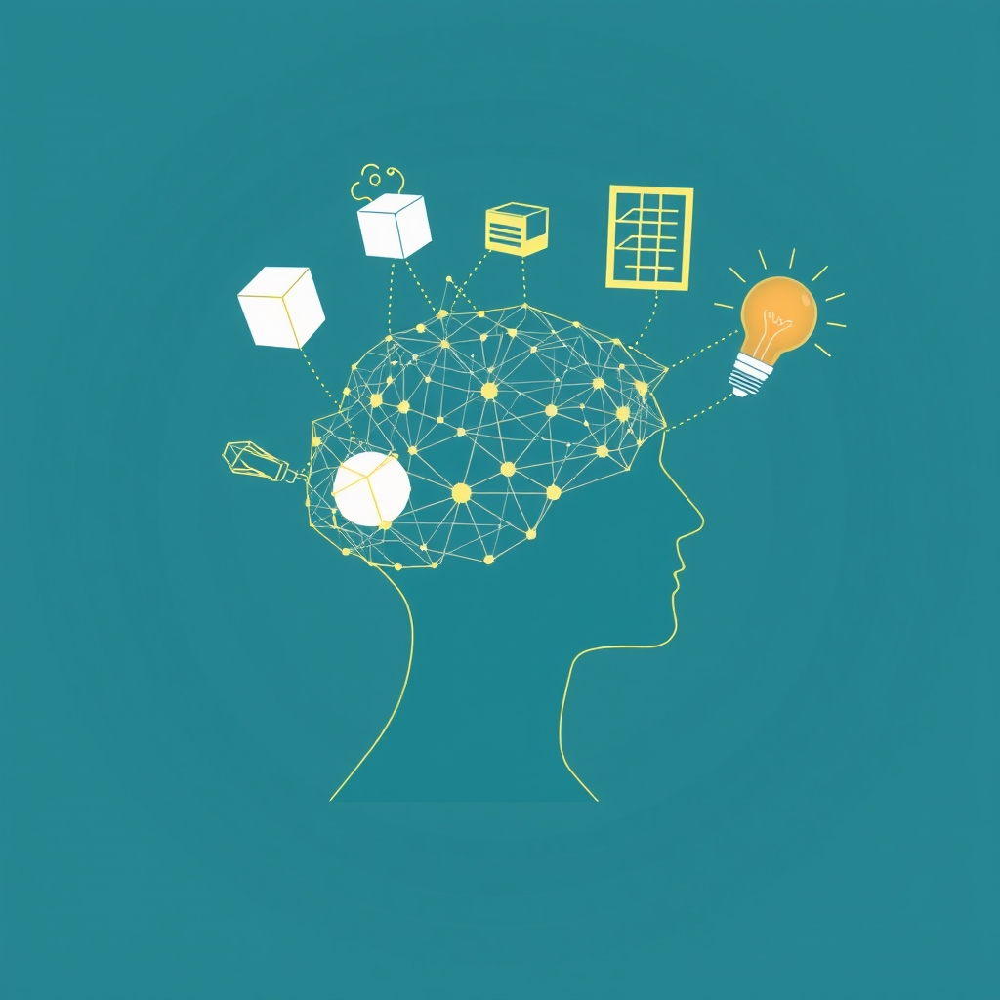

[Home](../index.md) > [Topics](./index.md) > [Knowledge](./a-hierarchical-view-of-human-knowledge.md) > [Humanities](./humanities.md)  
# 🗣️📚🧠 Linguistics  
  
## 🤖 AI Summary  
**High-Level Summary:**  
Linguistics is the scientific study of language. It seeks to understand the nature of language, how it's structured, how it's acquired, how it's used, and how it changes over time. It's not just about learning languages; it's about exploring the underlying principles that govern all human language. The goal is to uncover the universal properties of language and to document the diversity of languages across the globe. Linguistics is crucial for understanding human cognition, communication, and culture. 🧠💬🌐  
  
**Subcategories:**  
Here are some major subcategories of Linguistics:  
  
* **Phonetics:** The study of the physical properties of speech sounds (their production and perception). 🎤👂  
* **Phonology:** The study of how sounds are organized and used in a particular language. 🎵🗣️  
* **Morphology:** The study of word formation and the internal structure of words. 🧩📝  
* **Syntax:** The study of how words combine to form phrases and sentences. 🏗️💬  
* **Semantics:** The study of meaning in language. 💡🤔  
* **Pragmatics:** The study of how context influences meaning and language use. 🎭🗣️  
* **Sociolinguistics:** The study of the relationship between language and society, including variations in language based on social factors. 👥🗣️  
* **Psycholinguistics:** The study of the cognitive processes involved in language acquisition and use. 🧠🗣️  
* **Historical Linguistics:** The study of language change over time and the relationships between languages. ⏳📜  
* **Computational Linguistics:** The use of computers to model and analyze language. 💻🗣️  
* **Applied Linguistics:** The application of linguistic theories and methods to practical problems, such as language teaching and translation. 💼🗣️  
  
**Book Recommendations:**  
1.  **[🗣️🧠 The Language Instinct: How the Mind Creates Language](../books/the-language-instinct-how-the-mind-creates-language.md) by Steven Pinker:** This book provides an engaging introduction to the biological basis of language, arguing that humans have an innate "language instinct." It's accessible and thought-provoking. 🧠🗣️📚  
2.  **"Language: The Basics" by R.L. Trask and Peter Stockwell:** A clear and concise overview of the core concepts in linguistics, covering phonetics, phonology, morphology, syntax, semantics, and pragmatics. Perfect for beginners. 📖✨  
3.  **"Words and Rules: The Ingredients of Language" by Steven Pinker:** This book delves into the mental grammar of language, exploring how we combine words and rules to create and understand sentences. It's a fascinating look at the cognitive mechanisms underlying language. 📝🧠🔍  
4.  **"Sociolinguistics" by Ronald Wardhaugh and Janet M. Fuller:** A comprehensive introduction to the study of language and society, covering topics such as language variation, language attitudes, and language planning. 👥🗣️🌍  
5.  **"Historical Linguistics: An Introduction" by Lyle Campbell:** A very good introduction to how languages change over time, and how to reconstruct those changes. ⏳📜🗺️  
  
## 💬 [Gemini](https://gemini.google.com/app) Prompt  
> For the category of Linguistics, please provide:  
A High-Level Summary: A concise overview of the core principles, goals, and significance of this category.  
Subcategories: A list of the major subcategories or branches within this category, with a brief description of each.  
Book Recommendations: A selection of 3-5 influential or accessible books that provide a good introduction to this category or its key subcategories.  
Use lots of emojis.