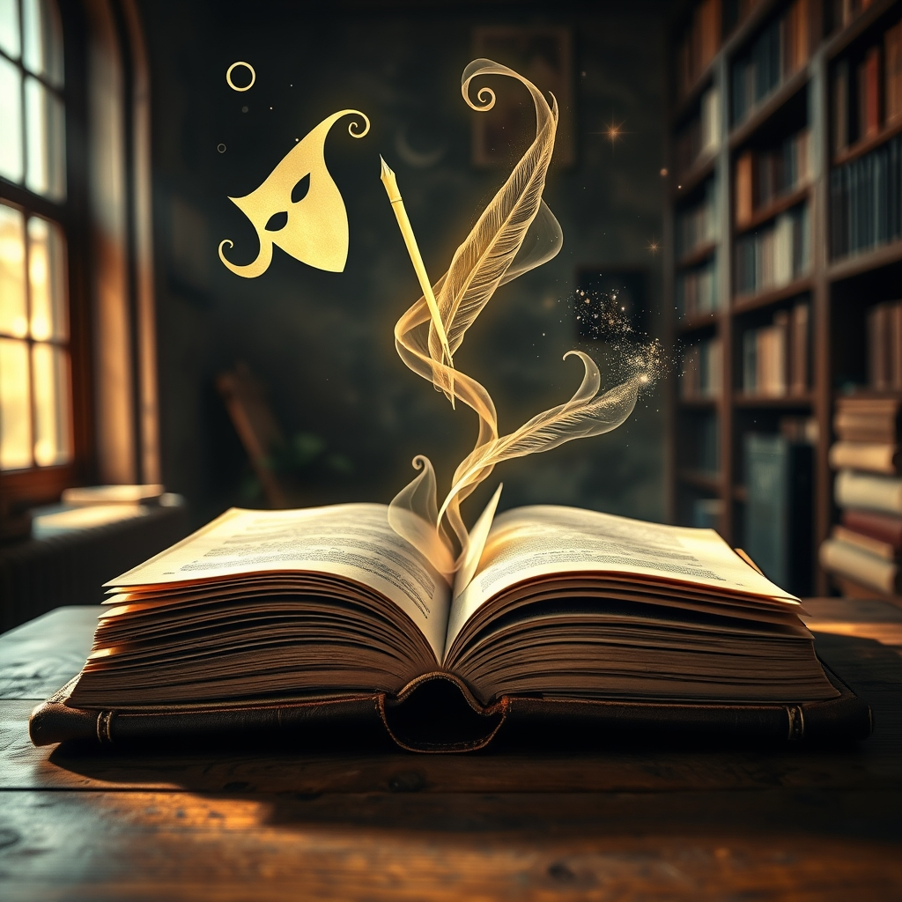

[Home](../index.md) > [Topics](./index.md) > [Knowledge](./a-hierarchical-view-of-human-knowledge.md) > [Arts](./arts.md)  
# 📚✍️ Literary Arts  
  
## 🤖 AI Summary  
**📚 High-Level Summary: The Literary Arts Adventure! 🚀✨**  
  
Literary Arts are all about crafting, exploring, and cherishing the magic of the written word. 📖💖 It's where language transforms into art, sparking emotions, igniting imaginations, and delving into the depths of human experience. 🧠🌟 We're talking about stories that transport you, poems that resonate with your soul, and words that paint vivid pictures in your mind. 🖼️💭 Literary Arts bridge cultures, connect generations, and offer a window into diverse perspectives. 🌍🤝 It's a journey through the power of storytelling and the beauty of language. 🌈✨  
  
**📜 Subcategories: Branching Out in the Literary World! 🌳🖋️**  
  
* **📖 Fiction: Imaginary Worlds and Unforgettable Characters! 🎭🌌**  
    * This subcategory is where imagination takes flight! 🚀 Fiction includes novels, short stories, and novellas, all crafted from the writer's creative mind. 🧠✨ It's about exploring characters, plots, and themes in a narrative format, taking readers on thrilling adventures and emotional journeys. 🎢💖  
* **🎶 Poetry: Expressing Emotions in Verse! 📜✨**  
    * Poetry is the art of condensing powerful emotions and ideas into rhythmic and evocative language. 🌈🎶 It often uses rhyme, meter, and figurative language to create a musical and impactful experience. 🌟💭 Think of it as painting with words! 🎨🖌️  
* **🎭 Drama: Stories Meant for the Stage! 🎬📣**  
    * Drama is all about bringing stories to life through performance. 🎭🎬 Plays and screenplays are written to be acted out, focusing on dialogue, character interactions, and stage directions. 📣✨ It's a collaborative art form that engages both performers and audiences. 👏🌟  
* **📰 Nonfiction: The Power of Truthful Tales! 📝🌍**  
    * Nonfiction explores the world of facts and real-life experiences. 🌍📝 It includes essays, biographies, memoirs, and journalism, all based on verifiable information. 🧐💡 It aims to inform, persuade, or entertain while staying true to reality. 📚✨  
* **🧐 Literary Criticism: Unpacking the Meaning! 📚🔍**  
    * Literary criticism is the scholarly analysis and interpretation of literary works. 🧐📚 It delves into themes, techniques, and cultural contexts, providing deeper insights and understanding. 💡💭 It's like being a literary detective! 🕵️‍♀️🔍  
* **🎥 Screenwriting: Crafting Stories for the Screen! ✍️🎬**  
    * Screenwriting is the art of writing scripts for films, television, and other visual media. 🎥✍️ It involves creating compelling narratives, dialogue, and visual descriptions that can be brought to life on screen. 🌟🎬  
  
**📚 Book Recommendations: Your Literary Starter Pack! 🚀📖**  
  
1.  **🤗🖋️ "[🐦🕊️ Bird by Bird: Some Instructions on Writing and Life](../books/bird-by-bird.md)" by Anne Lamott:** This book is a warm and witty guide to the writing process, offering practical advice and encouragement. It's like having a wise and supportive friend by your side. 💖✨  
2.  **🌈📖 "The Norton Anthology of Poetry" (Various Editions):** This comprehensive collection is a treasure trove of poetic gems, showcasing the diversity and beauty of poetry from around the world. 🌟🎶 It's a must-have for any poetry lover! 💖📚  
3.  **🧐💡 "Reading Like a Writer: A Guide for People Who Love Books and for Those Who Want to Write Them" by Francine Prose:** This book teaches you how to read like a writer, analyzing the techniques used by great authors. 🧐✨ It's a fantastic way to deepen your appreciation for literature. 📚🧠  
4.  **[📜 On Writing: A Memoir of the Craft](../books/on-writing.md) by Stephen King:** Part memoir, part writing guide, this book offers a candid and insightful look into Stephen King's writing process. 🌟📝 It's full of practical advice and entertaining anecdotes. 📚👻  
5.  **👩‍🏫📚 "A Room of One's Own" by Virginia Woolf:** This powerful essay is a feminist classic that explores the challenges faced by women writers. 💖✨ It's a thought-provoking and inspiring read. 📖👩‍🏫  
  
## 💬 [Gemini](https://gemini.google.com/app) Prompt  
> For the category of Literary Arts, please provide:  
A High-Level Summary: A concise overview of the core principles, goals, and significance of this category.  
Subcategories: A list of the major subcategories or branches within this category, with a brief description of each.  
Book Recommendations: A selection of 3-5 influential or accessible books that provide a good introduction to this category or its key subcategories.  
Use lots of emojis.  
  
## 🦋 Bluesky    
<blockquote class="bluesky-embed" data-bluesky-uri="at://did:plc:i4yli6h7x2uoj7acxunww2fc/app.bsky.feed.post/3mlrufn4tsb2s" data-bluesky-cid="bafyreieppgw3reoshziu5rtu6xg7wzf2skqat536ch5wsuipnitvek7vji">
📚✍️ Literary Arts  
  
#AI Q: ✍️ Which genre changes your perspective on the world the most?  
  
✍️ Creative Writing | 📖 Narrative Forms | 📜 Poetic Art  
https://bagrounds.org/topics/literary-arts
&mdash; <a href="https://bsky.app/profile/did:plc:i4yli6h7x2uoj7acxunww2fc?ref_src=embed">Bryan Grounds (@bagrounds.bsky.social)</a> <a href="https://bsky.app/profile/did:plc:i4yli6h7x2uoj7acxunww2fc/post/3mlrufn4tsb2s?ref_src=embed">2026-05-14T03:21:21.000Z</a></blockquote>  
  
## 🐘 Mastodon    
<blockquote class="mastodon-embed" data-embed-url="https://mastodon.social/@bagrounds/116584042805169215/embed" style="background: #282c37; border-radius: 8px; border: 1px solid #393f4f; margin: 0; max-width: 540px; min-width: 270px; overflow: hidden; padding: 0;"> <a href="https://mastodon.social/@bagrounds/116584042805169215" target="_blank" style="align-items: center; color: #d9e1e8; display: flex; flex-direction: column; font-family: system-ui, -apple-system, BlinkMacSystemFont, 'Segoe UI', Oxygen, Ubuntu, Cantarell, 'Fira Sans', 'Droid Sans', 'Helvetica Neue', Roboto, sans-serif; font-size: 14px; justify-content: center; letter-spacing: 0.25px; line-height: 20px; padding: 24px; text-decoration: none;"> <svg xmlns="http://www.w3.org/2000/svg" xmlns:xlink="http://www.w3.org/1999/xlink" width="32" height="32" viewBox="0 0 79 75"><path d="M63 45.3v-20c0-4.1-1-7.3-3.2-9.7-2.1-2.4-5-3.7-8.5-3.7-4.1 0-7.2 1.6-9.3 4.7l-2 3.3-2-3.3c-2-3.1-5.1-4.7-9.2-4.7-3.5 0-6.4 1.3-8.6 3.7-2.1 2.4-3.1 5.6-3.1 9.7v20h8V25.9c0-4.1 1.7-6.2 5.2-6.2 3.8 0 5.8 2.5 5.8 7.4V37.7H44V27.1c0-4.9 1.9-7.4 5.8-7.4 3.5 0 5.2 2.1 5.2 6.2V45.3h8ZM74.7 16.6c.6 6 .1 15.7.1 17.3 0 .5-.1 4.8-.1 5.3-.7 11.5-8 16-15.6 17.5-.1 0-.2 0-.3 0-4.9 1-10 1.2-14.9 1.4-1.2 0-2.4 0-3.6 0-4.8 0-9.7-.6-14.4-1.7-.1 0-.1 0-.1 0s-.1 0-.1 0 0 .1 0 .1 0 0 0 0c.1 1.6.4 3.1 1 4.5.6 1.7 2.9 5.7 11.4 5.7 5 0 9.9-.6 14.8-1.7 0 0 0 0 0 0 .1 0 .1 0 .1 0 0 .1 0 .1 0 .1.1 0 .1 0 .1.1v5.6s0 .1-.1.1c0 0 0 0 0 .1-1.6 1.1-3.7 1.7-5.6 2.3-.8.3-1.6.5-2.4.7-7.5 1.7-15.4 1.3-22.7-1.2-6.8-2.4-13.8-8.2-15.5-15.2-.9-3.8-1.6-7.6-1.9-11.5-.6-5.8-.6-11.7-.8-17.5C3.9 24.5 4 20 4.9 16 6.7 7.9 14.1 2.2 22.3 1c1.4-.2 4.1-1 16.5-1h.1C51.4 0 56.7.8 58.1 1c8.4 1.2 15.5 7.5 16.6 15.6Z" fill="currentColor"/></svg> 
Post by @bagrounds@mastodon.social
 
View on Mastodon
 </a> </blockquote> 