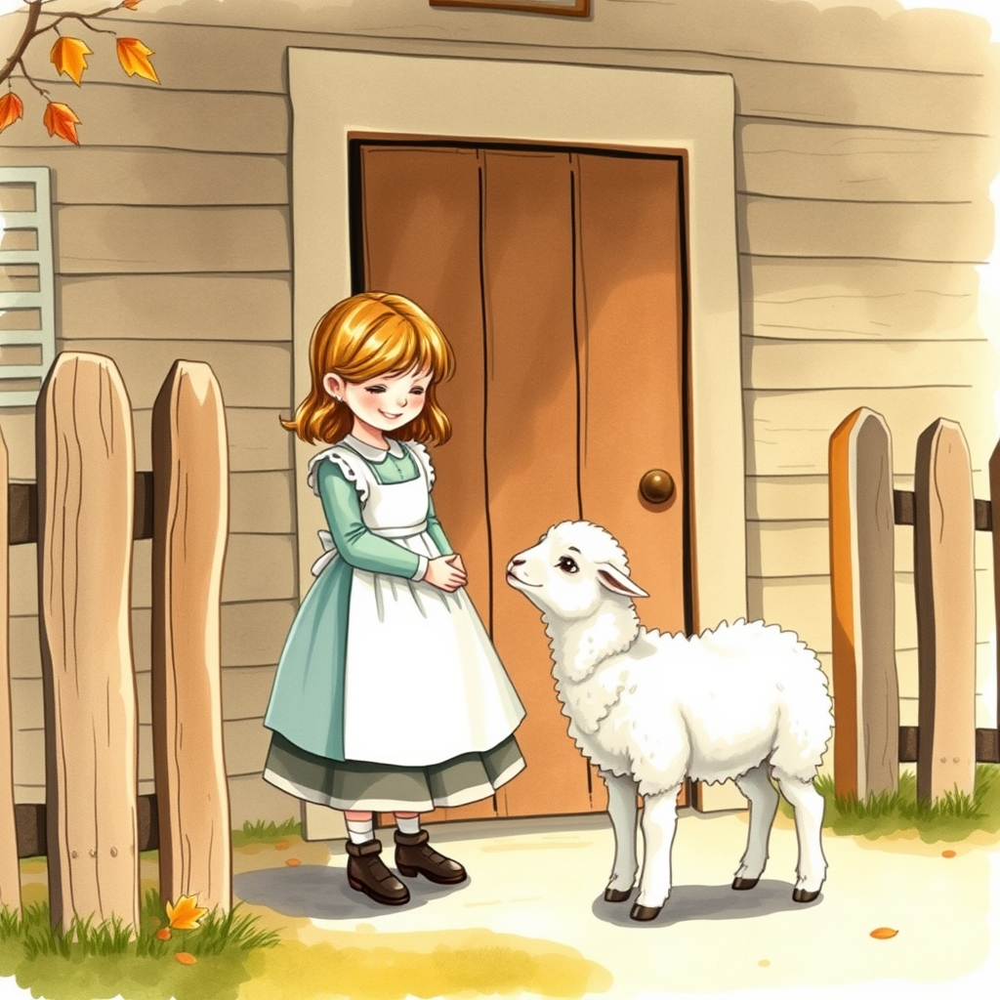

[Home](../index.md) > [Topics](./index.md) > [🧸🎶🧸 Nursery Rhymes](./nursery-rhymes.md)  
# 🐑🎀 Mary Had a Little Lamb  
  
- By Sarah Josepha Hale (1788–1879)  
- First published in 1830 in her book _Poems for Our Children_. It was inspired by a real-life incident involving a young girl named Mary Sawyer and her pet lamb.  
  
## 🎶 Lyrics  
🐑 Mary had a little lamb,  
❄️ Its fleece was white as snow;  
👣 And everywhere that Mary went,  
🐑 The lamb was sure to go.  
  
🏫 It followed her to school one day,  
🚫 That was against the rule;  
😂 It made the children laugh and play,  
🐑 To see a lamb at school.  
  
🚪 And so the teacher turned it out,  
🌳 But still it lingered near;  
⏳ And waited patiently about,  
👧 Till Mary did appear.  
  
🙋‍♂️ Why does the lamb love Mary so?  
🗣️ The eager children cry;  
❤️ Why, Mary loves the lamb, you know,  
👨‍🏫 The teacher did reply.  
  
## 🤔 Evaluation  
- 👶 **Perspective:** The poem captures the innocence of childhood and the bond between humans and animals. It serves as a moral lesson on how kindness and affection are reciprocated.  
- 📜 **Historical Context:** Unlike many folk rhymes, this has a documented origin. Mary Sawyer (the real Mary) took her pet lamb to school in Sterling, Massachusetts, at the suggestion of her brother.  
- 🧬 **Scientific/Behavioral Insight**  
    - 🧠 **Imprinting:** Animal behaviorists note that lambs can imprint on humans if raised by them, leading to the following behavior described in the poem.  
    - 🧶 **Wool Production:** The white as snow fleece refers to the selective breeding of sheep for clean, dyeable wool, a major industry in 19th-century New England.  
- 💡 **Topics to explore**  
    - 📜 **The History of Education:** Why was bringing an animal against the rule in the 1800s? What were District Schools like?  
    - ♀️ **Women in Literature:** Sarah Josepha Hale was a powerhouse; she also campaigned for Thanksgiving to become a national holiday and edited _Godey's Lady's Book_.  
  
## ❓ Frequently Asked Questions (FAQ)  
### 🐑 Q: Was Mary from Mary Had a Little Lamb a real person?  
👤 A: Yes! Mary Sawyer (1806–1889) was the inspiration. As an adult, she even sold pieces of wool from the famous lamb to help raise money to preserve the Old South Meeting House in Boston.  
  
### 🎙️ Q: What is Mary Had a Little Lamb's connection to Thomas Edison?  
💡 A: It was the first thing ever recorded! In 1877, Thomas Edison spoke the first verse of Mary Had a Little Lamb into his newly invented phonograph to test the recording capabilities.  
  
### ✍️ Q: What is the moral of Mary Had a Little Lamb?  
❤️ A: The final stanza explains that the lamb’s loyalty is a direct result of Mary’s gentleness. It teaches children that if they are kind to animals, animals will love and trust them in return.  
  
## 📚 Book Recommendations  
### ↔️ Similar  
- **[🕷️🕸️ Charlotte's Web](../books/charlottes-web.md) by E.B. White:** A classic exploration of the deep bond between a girl (Fern) and a farm animal (Wilbur), emphasizing themes of loyalty and friendship.  
- 🐂🛒 **Ox-Cart Man by Donald Hall:** A beautifully illustrated look at 19th-century New England farm life, capturing the same era in which the poem was written.  
  
### 🆚 Contrasting  
- **Animal Farm by George Orwell:** Uses farm animals to explore complex political and social themes, a sharp departure from the innocent, moralistic world of Hale’s nursery rhyme.  
- **The Secret Life of Sheep by Charles Bowden:** A gritty, non-sentimental look at the realities of sheep ranching and the biology of the animals.  
  
### 🎨 Creatively Related  
- **Sarah Josepha Hale: The Author of Thanksgiving by Anne Colver:** A biography of the remarkable woman who wrote the poem and changed American culture.  
- **The Sound of Innovation by Andrew J. Nelson:** A look at the history of sound recording, starting with that very first Mary Had a Little Lamb playback.  
  
## 🦋 Bluesky    
<blockquote class="bluesky-embed" data-bluesky-uri="at://did:plc:i4yli6h7x2uoj7acxunww2fc/app.bsky.feed.post/3mls3qic3452c" data-bluesky-cid="bafyreie4efomkiin4bvvymi23s2k74mqzbl765euslk3n6qe6uysllmo24">
🐑🎀 Mary Had a Little Lamb  
  
#AI Q: 🐑 What is the one childhood story or rhyme that still resonates today?  
  
🐾 Animal Bonds | 📜 Classic Verse | 🎙️ Sound Recording | ✍️ Women Authors  
https://bagrounds.org/topics/mary-had-a-little-lamb
&mdash; <a href="https://bsky.app/profile/did:plc:i4yli6h7x2uoj7acxunww2fc?ref_src=embed">Bryan Grounds (@bagrounds.bsky.social)</a> <a href="https://bsky.app/profile/did:plc:i4yli6h7x2uoj7acxunww2fc/post/3mls3qic3452c?ref_src=embed">2026-05-14T05:32:42.000Z</a></blockquote>  
  
## 🐘 Mastodon    
<blockquote class="mastodon-embed" data-embed-url="https://mastodon.social/@bagrounds/116601433698865089/embed" style="background: #282c37; border-radius: 8px; border: 1px solid #393f4f; margin: 0; max-width: 540px; min-width: 270px; overflow: hidden; padding: 0;"> <a href="https://mastodon.social/@bagrounds/116601433698865089" target="_blank" style="align-items: center; color: #d9e1e8; display: flex; flex-direction: column; font-family: system-ui, -apple-system, BlinkMacSystemFont, 'Segoe UI', Oxygen, Ubuntu, Cantarell, 'Fira Sans', 'Droid Sans', 'Helvetica Neue', Roboto, sans-serif; font-size: 14px; justify-content: center; letter-spacing: 0.25px; line-height: 20px; padding: 24px; text-decoration: none;"> <svg xmlns="http://www.w3.org/2000/svg" xmlns:xlink="http://www.w3.org/1999/xlink" width="32" height="32" viewBox="0 0 79 75"><path d="M63 45.3v-20c0-4.1-1-7.3-3.2-9.7-2.1-2.4-5-3.7-8.5-3.7-4.1 0-7.2 1.6-9.3 4.7l-2 3.3-2-3.3c-2-3.1-5.1-4.7-9.2-4.7-3.5 0-6.4 1.3-8.6 3.7-2.1 2.4-3.1 5.6-3.1 9.7v20h8V25.9c0-4.1 1.7-6.2 5.2-6.2 3.8 0 5.8 2.5 5.8 7.4V37.7H44V27.1c0-4.9 1.9-7.4 5.8-7.4 3.5 0 5.2 2.1 5.2 6.2V45.3h8ZM74.7 16.6c.6 6 .1 15.7.1 17.3 0 .5-.1 4.8-.1 5.3-.7 11.5-8 16-15.6 17.5-.1 0-.2 0-.3 0-4.9 1-10 1.2-14.9 1.4-1.2 0-2.4 0-3.6 0-4.8 0-9.7-.6-14.4-1.7-.1 0-.1 0-.1 0s-.1 0-.1 0 0 .1 0 .1 0 0 0 0c.1 1.6.4 3.1 1 4.5.6 1.7 2.9 5.7 11.4 5.7 5 0 9.9-.6 14.8-1.7 0 0 0 0 0 0 .1 0 .1 0 .1 0 0 .1 0 .1 0 .1.1 0 .1 0 .1.1v5.6s0 .1-.1.1c0 0 0 0 0 .1-1.6 1.1-3.7 1.7-5.6 2.3-.8.3-1.6.5-2.4.7-7.5 1.7-15.4 1.3-22.7-1.2-6.8-2.4-13.8-8.2-15.5-15.2-.9-3.8-1.6-7.6-1.9-11.5-.6-5.8-.6-11.7-.8-17.5C3.9 24.5 4 20 4.9 16 6.7 7.9 14.1 2.2 22.3 1c1.4-.2 4.1-1 16.5-1h.1C51.4 0 56.7.8 58.1 1c8.4 1.2 15.5 7.5 16.6 15.6Z" fill="currentColor"/></svg> 
Post by @bagrounds@mastodon.social
 
View on Mastodon
 </a> </blockquote> 