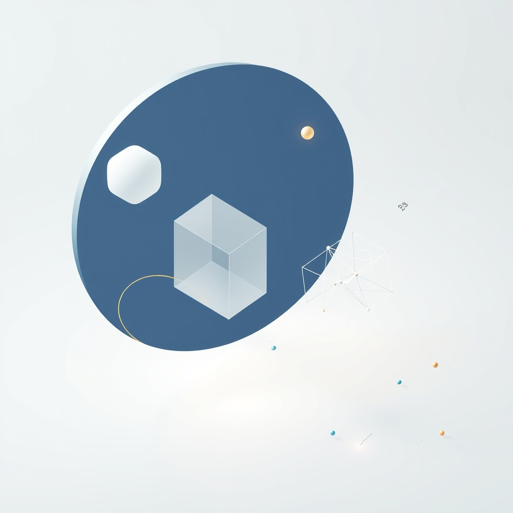

[Home](../index.md) > [Topics](./index.md) > [Knowledge](./a-hierarchical-view-of-human-knowledge.md)  
# ➗📐 Math  
  
## 🤖 AI Summary  
**High-Level Summary:**  
Mathematics is the abstract study of quantity, structure, space, and change. It seeks to discover and prove patterns and relationships through logical reasoning and rigorous proof. Math is the universal language of science, technology, engineering, and many aspects of daily life, providing a framework for understanding and modeling the world around us. Its goals include problem-solving, developing logical thinking, and constructing abstract models to represent real-world phenomena. Math is significant because it provides the foundation for innovation and progress in countless fields, from building bridges to developing algorithms for artificial intelligence. 🚀💡  
  
**Subcategories:**  
* **Algebra:** Deals with symbols and the rules for manipulating those symbols. It includes solving equations, working with polynomials, and understanding abstract structures like groups and rings. ➕➖  
* **Geometry:** Studies shapes, sizes, positions, and properties of space. It encompasses Euclidean geometry, which focuses on points, lines, and planes, as well as non-Euclidean geometries. 📐📏  
* **Calculus:** Focuses on rates of change and accumulation. It includes differential calculus, which deals with derivatives and slopes, and integral calculus, which deals with integrals and areas. 📈📉  
* **Number Theory:** Explores the properties of integers, including prime numbers, divisibility, and modular arithmetic. It has applications in cryptography and computer science. 🔢🔍  
* **Probability and Statistics:** Deals with the analysis of random phenomena and the interpretation of data. It includes probability theory, which studies the likelihood of events, and statistics, which focuses on collecting, analyzing, and interpreting data. 📊🎲  
* **Topology:** Studies the properties of spaces that are preserved under continuous deformations, such as stretching and bending. It focuses on concepts like connectedness and continuity. 🌀🔗  
* **Discrete Mathematics:** Studies mathematical structures that are fundamentally discrete rather than continuous. It includes topics like graph theory, combinatorics, and logic, and is crucial for computer science. 💻🧩  
* **Mathematical Analysis:** Rigorous study of calculus and related concepts, focusing on limits, continuity, differentiation, and integration. ♾️📝  
  
**Book Recommendations:**  
1.  **"What Is Mathematics?" by Richard Courant and Herbert Robbins:**  
    * This classic book offers a comprehensive and accessible introduction to many branches of mathematics, from basic arithmetic to advanced calculus and topology. It emphasizes the unity and beauty of mathematics. 📖✨  
    * It is great for people who want to get a wide overview of many fields.  
2.  **"A Mathematician's Lament" by Paul Lockhart:**  
    * This passionate and thought-provoking essay critiques the way mathematics is often taught in schools, arguing for a more creative and intuitive approach. It highlights the beauty and artistry of mathematics. 🎨🤔  
    * This is a good book for people interested in the philosophy of mathematics.  
3.  **"The Joy of X: A Guided Tour of Mathematics, from One to Infinity" by Steven Strogatz:**  
    * This engaging and accessible book explores various mathematical concepts in a clear and entertaining way. It covers topics from basic arithmetic to calculus and beyond, making mathematics approachable for a wide audience. 🤩🎉  
    * This is a good book for people who want to learn math concepts in everyday context.  
4.  **"Euclid's Elements" by Euclid:**  
    * While this is a very old text, it is the basis for geometry. It is a fantastic example of logical progression. It is a foundational text. 🏛️📐  
    * This is great for people who want to see the roots of geometry.  
5.  **"How to Solve It" by George Pólya:**  
    * This book focuses on problem-solving strategies and techniques, providing valuable insights into the process of mathematical thinking. It is a classic guide for students and anyone interested in improving their problem-solving skills. 🧠💡  
    * This is a great book for people who want to improve their problem solving abilities.  
  
## 💬 [Gemini](https://gemini.google.com/app) Prompt  
> For the category of Math, please provide:  
A High-Level Summary: A concise overview of the core principles, goals, and significance of this category.  
Subcategories: A list of the major subcategories or branches within this category, with a brief description of each.  
Book Recommendations: A selection of 3-5 influential or accessible books that provide a good introduction to this category or its key subcategories.  
Use lots of emojis.  
  
## 🦋 Bluesky    
<blockquote class="bluesky-embed" data-bluesky-uri="at://did:plc:i4yli6h7x2uoj7acxunww2fc/app.bsky.feed.post/3mlsqmcs3ln2s" data-bluesky-cid="bafyreibqq7dsujymkogp5542bw2w6og7ewgaoqskofw6x73howdua47s2y">
➗📐 Math  
  
#AI Q: 🧮 Is math a universal language discovered or a tool invented by humans?  
  
🔢 Quantitative Logic | 📐 Spatial Reasoning | 🧠 Problem Solving | 📊 Statistical Analysis  
https://bagrounds.org/topics/math
&mdash; <a href="https://bsky.app/profile/did:plc:i4yli6h7x2uoj7acxunww2fc?ref_src=embed">Bryan Grounds (@bagrounds.bsky.social)</a> <a href="https://bsky.app/profile/did:plc:i4yli6h7x2uoj7acxunww2fc/post/3mlsqmcs3ln2s?ref_src=embed">2026-05-14T11:46:10.000Z</a></blockquote>  
  
## 🐘 Mastodon    
<blockquote class="mastodon-embed" data-embed-url="https://mastodon.social/@bagrounds/116604746619900657/embed" style="background: #282c37; border-radius: 8px; border: 1px solid #393f4f; margin: 0; max-width: 540px; min-width: 270px; overflow: hidden; padding: 0;"> <a href="https://mastodon.social/@bagrounds/116604746619900657" target="_blank" style="align-items: center; color: #d9e1e8; display: flex; flex-direction: column; font-family: system-ui, -apple-system, BlinkMacSystemFont, 'Segoe UI', Oxygen, Ubuntu, Cantarell, 'Fira Sans', 'Droid Sans', 'Helvetica Neue', Roboto, sans-serif; font-size: 14px; justify-content: center; letter-spacing: 0.25px; line-height: 20px; padding: 24px; text-decoration: none;"> <svg xmlns="http://www.w3.org/2000/svg" xmlns:xlink="http://www.w3.org/1999/xlink" width="32" height="32" viewBox="0 0 79 75"><path d="M63 45.3v-20c0-4.1-1-7.3-3.2-9.7-2.1-2.4-5-3.7-8.5-3.7-4.1 0-7.2 1.6-9.3 4.7l-2 3.3-2-3.3c-2-3.1-5.1-4.7-9.2-4.7-3.5 0-6.4 1.3-8.6 3.7-2.1 2.4-3.1 5.6-3.1 9.7v20h8V25.9c0-4.1 1.7-6.2 5.2-6.2 3.8 0 5.8 2.5 5.8 7.4V37.7H44V27.1c0-4.9 1.9-7.4 5.8-7.4 3.5 0 5.2 2.1 5.2 6.2V45.3h8ZM74.7 16.6c.6 6 .1 15.7.1 17.3 0 .5-.1 4.8-.1 5.3-.7 11.5-8 16-15.6 17.5-.1 0-.2 0-.3 0-4.9 1-10 1.2-14.9 1.4-1.2 0-2.4 0-3.6 0-4.8 0-9.7-.6-14.4-1.7-.1 0-.1 0-.1 0s-.1 0-.1 0 0 .1 0 .1 0 0 0 0c.1 1.6.4 3.1 1 4.5.6 1.7 2.9 5.7 11.4 5.7 5 0 9.9-.6 14.8-1.7 0 0 0 0 0 0 .1 0 .1 0 .1 0 0 .1 0 .1 0 .1.1 0 .1 0 .1.1v5.6s0 .1-.1.1c0 0 0 0 0 .1-1.6 1.1-3.7 1.7-5.6 2.3-.8.3-1.6.5-2.4.7-7.5 1.7-15.4 1.3-22.7-1.2-6.8-2.4-13.8-8.2-15.5-15.2-.9-3.8-1.6-7.6-1.9-11.5-.6-5.8-.6-11.7-.8-17.5C3.9 24.5 4 20 4.9 16 6.7 7.9 14.1 2.2 22.3 1c1.4-.2 4.1-1 16.5-1h.1C51.4 0 56.7.8 58.1 1c8.4 1.2 15.5 7.5 16.6 15.6Z" fill="currentColor"/></svg> 
Post by @bagrounds@mastodon.social
 
View on Mastodon
 </a> </blockquote> 