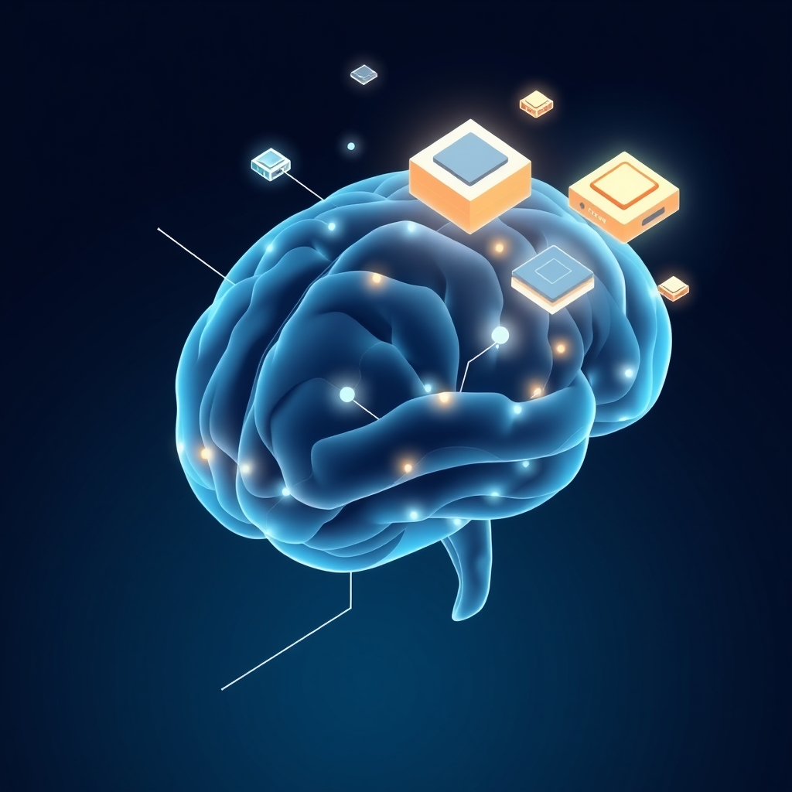

[Home](../index.md) > [Topics](./index.md)  
# 🧠💾 Memory  
  
## Videos  
- [The 10 Minute memory method](../videos/the-10-minute-memory-method.md)  
- [What makes something memorable?](../videos/what-makes-something-memorable.md)  
