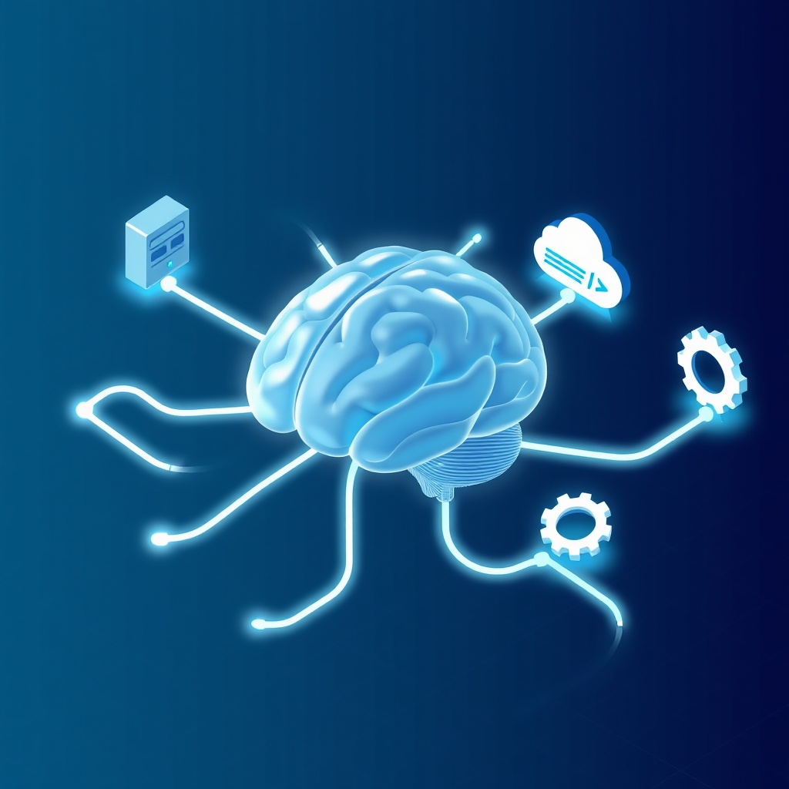

[Home](../index.md) > [Topics](./index.md)  
# 🧠🌍⚙️ Model Context Protocol  
  
  
## 🤖 AI Summary  
### 🔨 Tool Report: Model Context Protocol (MCP) ⚙️  
  
👉 **What Is It?** 🧐 The Model Context Protocol (MCP) 🤝 is an open protocol 🌐 designed to connect Large Language Models (LLMs) 🧠 with external data sources 💾 and tools 🛠️. It's a specification 📜 for how LLM applications 🤖 can seamlessly integrate with the outside world 🌍.  
  
☁️ **A High Level, Conceptual Overview:**  
  
* 🍼 **For A Child:** Imagine your brain 🧠 (the LLM) needs help remembering things 💭. MCP is like a special backpack 🎒 that carries all the important information ℹ️ your brain needs to answer questions ❓ and do cool stuff 😎.  
* 🏁 **For A Beginner:** MCP is a set of rules 📏 that allows LLMs to easily access 🗝️ and use information from other programs 💻 and databases 🗄️. This helps LLMs be more useful 💯 and accurate ✅.  
* 🧙‍♂️ **For A World Expert:** MCP is a standardized communication layer 📡 facilitating context injection 💉 into LLMs. It defines a protocol 📜 for structured data exchange ↔️, enabling richer interactions 💬 and more complex workflows ⚙️.  
  
🌟 **High-Level Qualities:**  
  
* Open-source 🔓: Anyone can use and contribute ➕.  
* Standardized 📏: Ensures compatibility 🤝 between different systems.  
* Extensible ➕: Designed to support a wide range of data sources 💾 and tools 🛠️.  
* Community-driven 🧑‍🤝‍🧑: Developed and maintained by a collaborative community 🌐.  
  
🚀 **Notable Capabilities:**  
  
* Connects LLMs to external data 🔗.  
* Enables LLMs to use external tools 🧰.  
* Facilitates AI-powered IDEs 💻.  
* Enhances chat interfaces 💬.  
* Creates custom AI workflows ⚙️.  
  
📊 **Typical Performance Characteristics:** This is a protocol specification 📜, so performance is dependent on the implementation ⚙️. However, MCP aims for efficient data transfer 🚀 and low latency ⏱️ to ensure smooth integration 🤝.  
  
💡 **Examples Of Prominent Products, Applications, Or Services & Hypothetical Use Cases:**  
  
* AI-powered IDEs 💻: MCP could allow an LLM to access code documentation 📚, API references 🔗, and project files 📁 in real-time ⏱️.  
* Enhanced chat interfaces 💬: MCP could enable an LLM to retrieve information from databases 🗄️ or external websites 🌐 to answer user questions more accurately ✅.  
* Custom AI workflows ⚙️: MCP could be used to create complex AI systems 🤖 that combine LLMs with other tools 🛠️, such as data analysis software 📊 or robotic process automation (RPA) systems 🤖.  
  
📚 **A List Of Relevant Theoretical Concepts Or Disciplines:**  
  
* Large Language Models (LLMs) 🧠  
* Natural Language Processing (NLP) 🗣️  
* Artificial Intelligence (AI) 🤖  
* Data Integration 🔗  
* Protocol Design 📜  
* [Software Engineering](./software-engineering.md) 💻  
  
🌲 **Topics:**  
  
* 👶 Parent: Artificial Intelligence (AI) 🤖  
* 👩‍👧‍👦 Children:  
    * Large Language Models (LLMs) 🧠  
    * Data Integration 🔗  
    * API Design 💻  
* 🧙‍♂️ Advanced topics:  
    * Contextual Embedding 🧠  
    * Knowledge Graphs 🕸️  
    * Semantic Web 🌐  
  
🔬 **A Technical Deep Dive:** MCP likely defines a set of APIs 💻 and data structures 🗄️ that allow LLMs to request ❓ and receive 📥 information from external sources. It may use standard data formats 📄 like JSON or XML and communication protocols 📡 like HTTP. The specific technical details ⚙️ are available in the protocol specification 📜.  
  
🧩 **The Problem(s) It Solves:**  
  
* Abstract: Provides a standardized way 📏 for LLMs to access external knowledge 🧠 and tools 🛠️.  
* Common Examples:  
    * LLMs lacking real-time information ⏱️.  
    * LLMs unable to use external APIs 💻.  
* Surprising Example: Enabling LLMs to control physical robots 🤖 by accessing robot control APIs 🕹️.  
  
👍 **How To Recognize When It's Well Suited To A Problem:** When you need an LLM to interact with external data 💾 or tools 🛠️ to solve a problem 🧩.  
  
👎 **How To Recognize When It's Not Well Suited To A Problem (And What Alternatives To Consider):** If the LLM doesn't need external information ℹ️ or tools 🛠️, then MCP is not necessary. Alternatives include direct API calls 📞 or hardcoding ⌨️ information into the LLM.  
  
🩺 **How To Recognize When It's Not Being Used Optimally (And How To Improve):** If the data transfer is slow 🐌 or the integration is complex 🤯, the MCP implementation may need optimization ⚙️.  
  
🔄 **Comparisons To Similar Alternatives (Especially If Better In Some Way):** Other approaches exist for connecting LLMs to external data 💾, but MCP aims to be a standardized and open solution 🔓, potentially leading to wider adoption 🌐 and better interoperability 🤝.  
  
🤯 **A Surprising Perspective:** MCP could eventually allow LLMs to access and understand the entire internet 🌐 in a structured way 🗄️, leading to unprecedented levels of knowledge 🧠 and capability 💪.  
  
📜 **Some Notes On Its History, How It Came To Be, And What Problems It Was Designed To Solve:** MCP is run by Anthropic, PBC. It was designed to address the problem of LLMs needing external context 🧠 to perform tasks effectively ✅.  
  
📝 **A Dictionary-Like Example Using The Term In Natural Language:** "The developer used the Model Context Protocol 🤝 to connect the LLM to a database 🗄️ of customer information ℹ️."  
  
😂 **A Joke:** I tried to explain the Model Context Protocol to my toaster 🍞. It just kept asking for more bread 🤷. I guess it only understands one protocol.  
  
📖 **Book Recommendations:**  
  
* Topical: [🗣️💻 Natural Language Processing with Transformers](../books/natural-language-processing-with-transformers.md) by Tunstall, von Werra, Wolf 📚  
* Tangentially related: [💾⬆️🛡️ Designing Data-Intensive Applications: The Big Ideas Behind Reliable, Scalable, and Maintainable Systems](../books/designing-data-intensive-applications.md) by Kleppmann 📚  
* Topically opposed: [🦄👤🗓️ The Mythical Man-Month: Essays on Software Engineering](../books/the-mythical-man-month.md) by Brooks 📚 (focuses on software project management, not AI integration)  
* More general: [🤖🧠 Artificial Intelligence: A Modern Approach](../books/artificial-intelligence-a-modern-approach.md) by Russell & Norvig 📚  
* More specific: (Currently, there aren't many books specifically on MCP, as it's a relatively new protocol. Keep an eye out for future publications!)  
* Fictional: [😈💻👹🤖 Daemon](../books/daemon.md) and _Freedom™_ by Suarez 📚 (explores AI integration in a fictional context)  
* Rigorous: (The [MCP specification documents](https://github.com/modelcontextprotocol) themselves are the most rigorous source.)  
* Accessible: (Keep an eye out for blog posts and tutorials on MCP from Anthropic and the community.)  
  
📺 **Links To Relevant YouTube Channels Or Videos:**  
- [Anthropic MCP + Ollama. No Claude Needed? Check it out!](../videos/anthropic-mcp-ollama-no-claude-needed-check-it-out.md)