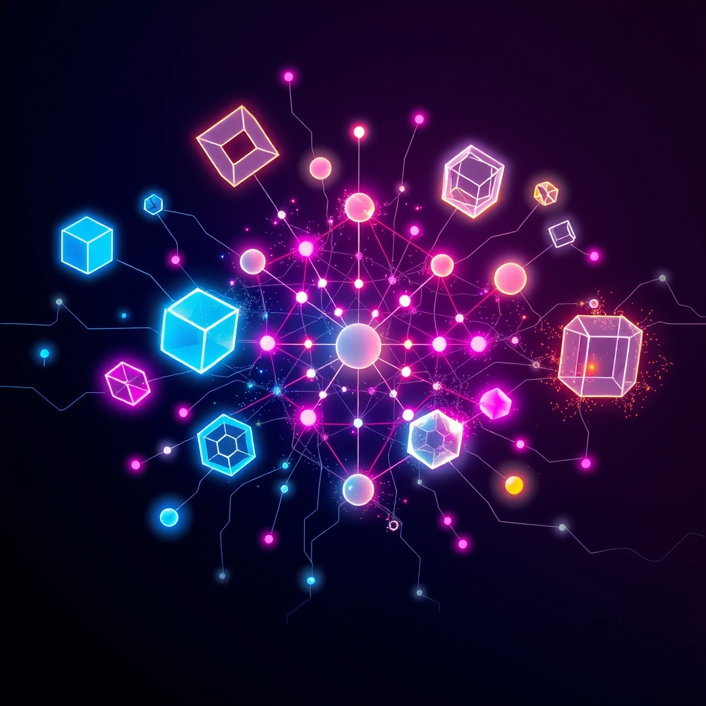

[Home](../index.md) > [Topics](./index.md)  
# 💻🗣️ Programming Languages  
  
## 🤖 AI Summary  
**High-Level Summary:**  
Programming languages are the essential tools that bridge the gap between human intentions and machine execution. They provide a structured way to communicate instructions to computers, enabling us to create software, applications, and systems. The core principles revolve around syntax (the rules of the language), semantics (the meaning of the instructions), and paradigms (the styles of programming). The goals are to enable efficient, reliable, and maintainable software development. The significance lies in their ability to automate tasks, solve complex problems, and drive technological innovation across all domains. 💻✨  
  
**Subcategories:**  
1.  **Imperative Languages:**  
    * These languages focus on describing *how* a program operates by explicitly changing the program's state. They use statements that modify variables and control the flow of execution.  
    * Examples: C, Java, Python (to some extent). ➡️📝  
2.  **Declarative Languages:**  
    * These languages focus on describing *what* a program should achieve, rather than how it should achieve it. They express the logic of a computation without explicitly specifying the control flow.  
    * Examples: SQL, Prolog, HTML. ❓💡  
3.  **Object-Oriented Languages (OOP):**  
    * These languages organize code around "objects," which encapsulate data and behavior. They emphasize concepts like inheritance, polymorphism, and encapsulation.  
    * Examples: Java, C++, Python, C#. 📦🔗  
4.  **Functional Languages:**  
    * These languages treat computation as the evaluation of mathematical functions and avoid changing state and mutable data. They emphasize immutability and recursion.  
    * Examples: Haskell, Lisp, Scala, Clojure. 🧮➡️  
5.  **Scripting Languages:**  
    * These are designed for automating tasks, gluing together components, and rapid prototyping. They are often interpreted and have simpler syntax.  
    * Examples: Python, JavaScript, Ruby, Bash. 🐍📜  
6.  **Markup Languages:**  
    * These languages define the structure and presentation of text documents. While not strictly programming languages in the traditional sense, they are essential for web development and document processing.  
    * Examples: HTML, XML, Markdown. 🏷️🌐  
  
**Book Recommendations:**  
1.  **"Structure and Interpretation of Computer Programs" (SICP) by Harold Abelson and Gerald Jay Sussman:**  
    * This classic text uses Scheme (a dialect of Lisp) to explore fundamental programming concepts and paradigms. It's a challenging but rewarding read that provides a deep understanding of computation. 📖🧠  
2.  **[🧼💾 Clean Code: A Handbook of Agile Software Craftsmanship](../books/clean-code.md) by Robert C. Martin:**  
    * While not specific to a single language, this book focuses on writing maintainable and readable code, which is essential for any programmer. It covers principles and practices applicable to various languages. 🧹✨  
3.  **"Programming Pearls" by Jon Bentley:**  
    * This book contains a lot of very interesting programming problems and their solutions. It is very useful for improving problem solving skills. 💎💻  
4.  **"Effective Java" by Joshua Bloch:**  
    * This book is very useful for anyone that wants to become a better java programmer. It is filled with useful information about how to write clean, and effective Java code. ☕️📚  
5.  **"Python Crash Course, 2nd Edition: A Hands-On, Project-Based Introduction to Programming" by Eric Matthes:**  
    * For those wanting to learn a very versatile language, this book is a great place to start. It is very beginner friendly. 🐍🚀  
  
## 💬 [Gemini](https://gemini.google.com/app) Prompt  
> For the category of Programming Languages, please provide:  
A High-Level Summary: A concise overview of the core principles, goals, and significance of this category.  
Subcategories: A list of the major subcategories or branches within this category, with a brief description of each.  
Book Recommendations: A selection of 3-5 influential or accessible books that provide a good introduction to this category or its key subcategories.  
Use lots of emojis.  
  
## 🦋 Bluesky    
<blockquote class="bluesky-embed" data-bluesky-uri="at://did:plc:i4yli6h7x2uoj7acxunww2fc/app.bsky.feed.post/3mmbl4mmps42t" data-bluesky-cid="bafyreifqrvfawcxhlxfmeioqol3qu6opmj5aazcksnh2sezqf36fiebhlq">
💻🗣️ Programming Languages  
  
#AI Q: 💻 Which programming language changed the way you solve problems?  
  
🛠️ Development Paradigms | 🧼 Code Craftsmanship | 🧩 Algorithmic Logic |  
https://bagrounds.org/topics/programming-languages
&mdash; <a href="https://bsky.app/profile/did:plc:i4yli6h7x2uoj7acxunww2fc?ref_src=embed">Bryan Grounds (@bagrounds.bsky.social)</a> <a href="https://bsky.app/profile/did:plc:i4yli6h7x2uoj7acxunww2fc/post/3mmbl4mmps42t?ref_src=embed">2026-05-20T09:17:51.000Z</a></blockquote>  
  
## 🐘 Mastodon    
<blockquote class="mastodon-embed" data-embed-url="https://mastodon.social/@bagrounds/116612770867909285/embed" style="background: #282c37; border-radius: 8px; border: 1px solid #393f4f; margin: 0; max-width: 540px; min-width: 270px; overflow: hidden; padding: 0;"> <a href="https://mastodon.social/@bagrounds/116612770867909285" target="_blank" style="align-items: center; color: #d9e1e8; display: flex; flex-direction: column; font-family: system-ui, -apple-system, BlinkMacSystemFont, 'Segoe UI', Oxygen, Ubuntu, Cantarell, 'Fira Sans', 'Droid Sans', 'Helvetica Neue', Roboto, sans-serif; font-size: 14px; justify-content: center; letter-spacing: 0.25px; line-height: 20px; padding: 24px; text-decoration: none;"> <svg xmlns="http://www.w3.org/2000/svg" xmlns:xlink="http://www.w3.org/1999/xlink" width="32" height="32" viewBox="0 0 79 75"><path d="M63 45.3v-20c0-4.1-1-7.3-3.2-9.7-2.1-2.4-5-3.7-8.5-3.7-4.1 0-7.2 1.6-9.3 4.7l-2 3.3-2-3.3c-2-3.1-5.1-4.7-9.2-4.7-3.5 0-6.4 1.3-8.6 3.7-2.1 2.4-3.1 5.6-3.1 9.7v20h8V25.9c0-4.1 1.7-6.2 5.2-6.2 3.8 0 5.8 2.5 5.8 7.4V37.7H44V27.1c0-4.9 1.9-7.4 5.8-7.4 3.5 0 5.2 2.1 5.2 6.2V45.3h8ZM74.7 16.6c.6 6 .1 15.7.1 17.3 0 .5-.1 4.8-.1 5.3-.7 11.5-8 16-15.6 17.5-.1 0-.2 0-.3 0-4.9 1-10 1.2-14.9 1.4-1.2 0-2.4 0-3.6 0-4.8 0-9.7-.6-14.4-1.7-.1 0-.1 0-.1 0s-.1 0-.1 0 0 .1 0 .1 0 0 0 0c.1 1.6.4 3.1 1 4.5.6 1.7 2.9 5.7 11.4 5.7 5 0 9.9-.6 14.8-1.7 0 0 0 0 0 0 .1 0 .1 0 .1 0 0 .1 0 .1 0 .1.1 0 .1 0 .1.1v5.6s0 .1-.1.1c0 0 0 0 0 .1-1.6 1.1-3.7 1.7-5.6 2.3-.8.3-1.6.5-2.4.7-7.5 1.7-15.4 1.3-22.7-1.2-6.8-2.4-13.8-8.2-15.5-15.2-.9-3.8-1.6-7.6-1.9-11.5-.6-5.8-.6-11.7-.8-17.5C3.9 24.5 4 20 4.9 16 6.7 7.9 14.1 2.2 22.3 1c1.4-.2 4.1-1 16.5-1h.1C51.4 0 56.7.8 58.1 1c8.4 1.2 15.5 7.5 16.6 15.6Z" fill="currentColor"/></svg> 
Post by @bagrounds@mastodon.social
 
View on Mastodon
 </a> </blockquote> 