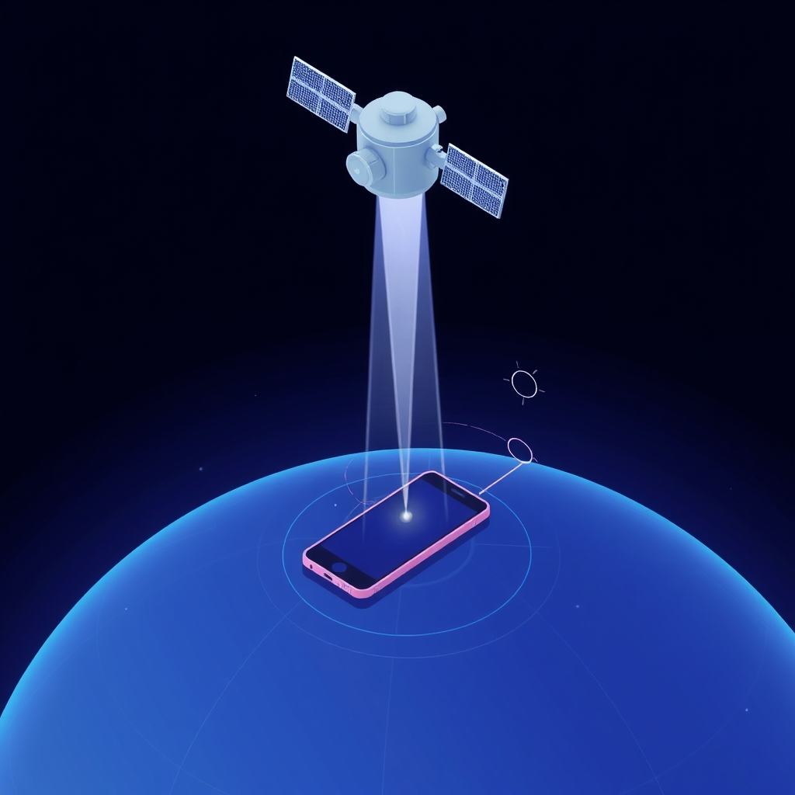

[Home](../index.md) > [Topics](./index.md)  
# 🛰️📐≈ Pseudorange  
  
## 🤖 AI Summary  
### 👉 What Is It?  
  
* Pseudorange is a measurement of distance between a GPS receiver and a GPS satellite. 🛰️ It's called "pseudo" because it's not a true range due to synchronization errors between the receiver's clock and the satellite's clock. ⌚️ It's a key concept in Global Navigation Satellite Systems (GNSS) like GPS. 📍  
  
### ☁️ A High Level, Conceptual Overview  
  
* **🍼 For A Child:** Imagine you and your friends are trying to find a hidden treasure. 🗺️ You each have walkie-talkies that tell you how far you are from different radio towers. But because your watches aren't perfectly in sync, the distances are a little off. These "almost distances" are like pseudoranges! 🎁  
* **🏁 For A Beginner:** Pseudorange is the estimated distance between a GPS receiver and a satellite, calculated from the time it takes for a signal to travel. However, because the receiver's clock isn't perfectly synchronized with the satellite's atomic clock, the calculated distance has an error. This error makes it a "pseudorange" rather than a true range. 📏  
* **🧙‍♂️ For A World Expert:** Pseudorange represents a biased range measurement, incorporating the receiver's clock offset into the signal propagation delay. It is a fundamental observable in GNSS positioning, subject to errors from atmospheric delays, multipath effects, and receiver noise. 📡 It forms the basis of least-squares solutions for position determination, necessitating sophisticated algorithms for clock error mitigation and precise positioning. ⚛️  
  
### 🌟 High-Level Qualities  
  
* Relatively easy to measure. 📏  
* Fundamental input for GNSS positioning. 📍  
* Subject to various error sources. ⚠️  
* Provides a basis for navigation solutions. 🧭  
  
### 🚀 Notable Capabilities  
  
* Enables basic position estimation. 🗺️  
* Provides timing information. ⌚️  
* Supports navigation and tracking applications. 🚗  
* Used to calculate an initial position fix. 📐  
  
### 📊 Typical Performance Characteristics  
  
* Accuracy varies depending on receiver quality and environmental conditions. 🌦️  
* Pseudorange errors can range from a few meters to tens of meters. 📏  
* Typical GPS pseudorange accuracy is around 1-10 meters without differential corrections. 📊  
  
### 💡 Examples Of Prominent Products, Applications, Or Services That Use It Or Hypothetical, Well Suited Use Cases  
  
* GPS navigation in cars and smartphones. 🚗📱  
* Aviation navigation systems. ✈️  
* Surveying and mapping applications. 🗺️  
* Tracking systems for vehicles and assets. 🚚  
* Emergency location services. 🚨  
  
### 📚 A List Of Relevant Theoretical Concepts Or Disciplines  
  
* GNSS (Global Navigation Satellite Systems) 🛰️  
* Satellite navigation 🧭  
* Signal processing 📡  
* Least-squares estimation 📐  
* Error analysis 📊  
* Time and frequency metrology ⌚️  
  
### 🌲 Topics:  
  
* 👶 Parent:  
    * GNSS 🛰️  
* 👩‍👧‍👦 Children:  
    * GPS 📍  
    * GNSS positioning 🗺️  
    * Clock synchronization ⌚️  
    * Range measurements 📏  
* 🧙‍♂️ Advanced topics:  
    * [Kalman Filtering](./kalman-filter.md) 📊  
    * Carrier-phase measurements 📡  
    * Differential GNSS (DGNSS) ⚛️  
    * Precise Point Positioning (PPP) 📐  
  
### 🔬 A Technical Deep Dive  
  
Pseudorange is calculated by multiplying the time it takes for a signal to travel from a satellite to a receiver by the speed of light. ⚡️ The receiver measures the time difference between when the signal was transmitted and when it was received. However, the receiver's clock is not perfectly synchronized with the satellite's atomic clock, leading to a clock bias. This bias introduces an error into the calculated range, making it a "pseudorange." ⌚️ The mathematical representation is usually: $$ \rho = c(t_r - t_s) + c(dt_r - dt_s) $$ where $\rho$ is the pseudorange, $c$ is the speed of light, $t_r$ is the receiver's reception time, $t_s$ is the satellite's transmission time, $dt_r$ is the receiver clock error, and $dt_s$ is the satellite clock error. 📏  
  
### 🧩 The Problem(s) It Solves  
  
* **Abstract:** Enables distance estimation for positioning and navigation. 🧭  
* **Common Examples:** Determining a user's location on Earth using GPS. 📍 Navigating a plane or ship. ✈️🚢  
* **Surprising Example:** Tracking the movement of wildlife for ecological studies, revealing migration patterns with surprising precision. 🦌  
  
### 👍 How To Recognize When It's Well Suited To A Problem  
  
* When basic position estimation is required. 🗺️  
* When real-time navigation is needed. 🚗  
* When low-cost positioning solutions are preferred. 💸  
* When a reasonable position fix is needed quickly. ⏱️  
  
### 👎 How To Recognize When It's Not Well Suited To A Problem (And What Alternatives To Consider)  
  
* When high-precision positioning is required. 📐 Alternatives: Carrier-phase GNSS, RTK (Real-Time Kinematic), PPP. ⚛️  
* When signal blockage or multipath effects are significant. 🌲 Alternatives: Inertial navigation systems (INS), terrestrial positioning systems. 📡  
* When very low latency is required. ⚡️ Alternatives: Ultra-Wideband (UWB) systems. 📡  
  
### 🩺 How To Recognize When It's Not Being Used Optimally (And How To Improve)  
  
* Large positioning errors indicate poor signal quality or inadequate clock synchronization. ⌚️  
* Improve by using differential corrections (DGPS), better receivers, or more satellites. 📡  
* Ensure clear sky view to reduce multipath and signal blockage. ☁️  
  
### 🔄 Comparisons To Similar Alternatives  
  
* **Carrier-phase measurements:** More accurate, but require more complex processing. 📡  
* **RTK (Real-Time Kinematic):** Provides centimeter-level accuracy, but requires a base station. ⚛️  
* **PPP (Precise Point Positioning):** Offers high accuracy without a base station, but requires longer convergence times. 📐  
  
### 🤯 A Surprising Perspective  
  
* The errors in pseudorange measurements, while initially seen as a limitation, have driven the development of advanced correction techniques and algorithms, leading to incredibly precise positioning capabilities. 🤯  
  
### 📜 Some Notes On Its History, How It Came To Be, And What Problems It Was Designed To Solve  
  
* Pseudorange measurements were fundamental to the development of GPS in the 1970s. 🇺🇸  
* They were designed to provide a means of determining position using satellite signals, addressing the need for global navigation. 🗺️  
* The initial limitations of pseudorange accuracy spurred ongoing research into error reduction and precise positioning. 💡  
  
### 📝 A Dictionary-Like Example Using The Term In Natural Language  
  
* "The GPS receiver calculated its position using pseudoranges from multiple satellites." 🛰️  
  
### 😂 A Joke  
  
* "Pseudorange? It's like a real range, but with a slight... misunderstanding about time. You know, like when your watch says it's Tuesday, but your brain thinks it's still Monday. We've all been there." ⌚️😂  
  
### 📖 Book Recommendations  
  
* **Topical:** "Global Positioning System: Theory and Applications" by B. Hofmann-Wellenhof, H. Lichtenegger, and J. Collins. 📚  
* **Tangentially Related:** "Navigation Systems: A Survey of Modern Guidance, Navigation, and Control" by M. Grewal, A. Andrews, and C. Bartone. 🧭  
* **Topically Opposed:** "Inertial Navigation Systems with Geodetic Applications" by D. Titterton and J. Weston. 🌲  
* **More General:** "Understanding GPS: Principles and Applications" by E. Kaplan and C. Hegarty. 🗺️  
* **More Specific:** "GNSS Data Processing: Theory and Algorithms" by P. Teunissen and O. Montenbruck. 📐  
* **Fictional:** "Cryptonomicon" by Neal Stephenson (for a fictional take on code breaking and related tech). 💻  
* **Rigorous:** "Least-Squares Adjustment: With Applications in Surveying and Geodesy" by P. Cross. 📊  
* **Accessible:** "GPS Made Easy: Using Global Positioning Systems in the Outdoors" by L. Letham. 🏞️  
  
## 🦋 Bluesky    
<blockquote class="bluesky-embed" data-bluesky-uri="at://did:plc:i4yli6h7x2uoj7acxunww2fc/app.bsky.feed.post/3mmcv3xtc4m2j" data-bluesky-cid="bafyreigtdp6mthckj7aqfjzqxyr3k4ynsjmyp34svvukoi4x25rhbyu324">
🛰️📐≈ Pseudorange  
  
#AI Q: 📍 How much do you rely on GPS to find your way?  
  
🛰️ Satellite Navigation | ⌚️ Clock Synchronization | 📍 Positioning Technology  
https://bagrounds.org/topics/pseudorange
&mdash; <a href="https://bsky.app/profile/did:plc:i4yli6h7x2uoj7acxunww2fc?ref_src=embed">Bryan Grounds (@bagrounds.bsky.social)</a> <a href="https://bsky.app/profile/did:plc:i4yli6h7x2uoj7acxunww2fc/post/3mmcv3xtc4m2j?ref_src=embed">2026-05-20T21:49:06.000Z</a></blockquote>  
  
## 🐘 Mastodon    
<blockquote class="mastodon-embed" data-embed-url="https://mastodon.social/@bagrounds/116617026564572584/embed" style="background: #282c37; border-radius: 8px; border: 1px solid #393f4f; margin: 0; max-width: 540px; min-width: 270px; overflow: hidden; padding: 0;"> <a href="https://mastodon.social/@bagrounds/116617026564572584" target="_blank" style="align-items: center; color: #d9e1e8; display: flex; flex-direction: column; font-family: system-ui, -apple-system, BlinkMacSystemFont, 'Segoe UI', Oxygen, Ubuntu, Cantarell, 'Fira Sans', 'Droid Sans', 'Helvetica Neue', Roboto, sans-serif; font-size: 14px; justify-content: center; letter-spacing: 0.25px; line-height: 20px; padding: 24px; text-decoration: none;"> <svg xmlns="http://www.w3.org/2000/svg" xmlns:xlink="http://www.w3.org/1999/xlink" width="32" height="32" viewBox="0 0 79 75"><path d="M63 45.3v-20c0-4.1-1-7.3-3.2-9.7-2.1-2.4-5-3.7-8.5-3.7-4.1 0-7.2 1.6-9.3 4.7l-2 3.3-2-3.3c-2-3.1-5.1-4.7-9.2-4.7-3.5 0-6.4 1.3-8.6 3.7-2.1 2.4-3.1 5.6-3.1 9.7v20h8V25.9c0-4.1 1.7-6.2 5.2-6.2 3.8 0 5.8 2.5 5.8 7.4V37.7H44V27.1c0-4.9 1.9-7.4 5.8-7.4 3.5 0 5.2 2.1 5.2 6.2V45.3h8ZM74.7 16.6c.6 6 .1 15.7.1 17.3 0 .5-.1 4.8-.1 5.3-.7 11.5-8 16-15.6 17.5-.1 0-.2 0-.3 0-4.9 1-10 1.2-14.9 1.4-1.2 0-2.4 0-3.6 0-4.8 0-9.7-.6-14.4-1.7-.1 0-.1 0-.1 0s-.1 0-.1 0 0 .1 0 .1 0 0 0 0c.1 1.6.4 3.1 1 4.5.6 1.7 2.9 5.7 11.4 5.7 5 0 9.9-.6 14.8-1.7 0 0 0 0 0 0 .1 0 .1 0 .1 0 0 .1 0 .1 0 .1.1 0 .1 0 .1.1v5.6s0 .1-.1.1c0 0 0 0 0 .1-1.6 1.1-3.7 1.7-5.6 2.3-.8.3-1.6.5-2.4.7-7.5 1.7-15.4 1.3-22.7-1.2-6.8-2.4-13.8-8.2-15.5-15.2-.9-3.8-1.6-7.6-1.9-11.5-.6-5.8-.6-11.7-.8-17.5C3.9 24.5 4 20 4.9 16 6.7 7.9 14.1 2.2 22.3 1c1.4-.2 4.1-1 16.5-1h.1C51.4 0 56.7.8 58.1 1c8.4 1.2 15.5 7.5 16.6 15.6Z" fill="currentColor"/></svg> 
Post by @bagrounds@mastodon.social
 
View on Mastodon
 </a> </blockquote> 