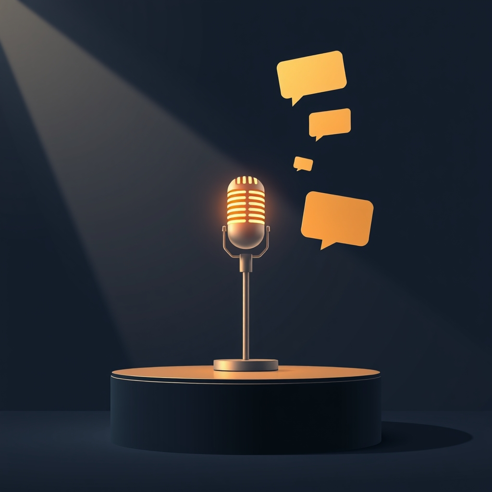

[Home](../index.md) > [Topics](./index.md) > [Knowledge](./a-hierarchical-view-of-human-knowledge.md) > [Social Sciences](./social-sciences.md) > [Communication Studies](./communication-studies.md)  
# 🎤🗣️ Public Speaking and Rhetoric  
  
## 🤖 AI Summary  
**🗣️ High-Level Summary:**  
  
Public Speaking and Rhetoric is the art and science of effective communication, focusing on how to craft and deliver persuasive, informative, and engaging messages. It encompasses the study of language 📝, delivery 🎤, audience analysis 👥, and the construction of arguments 🧠. The goal is to influence 🎯, inform 💡, or entertain 🎉 an audience through thoughtful and impactful communication. Its significance lies in its power to shape public discourse 🌐, build relationships 🤝, and drive social change 🚀.  
  
**🏛️ Subcategories:**  
  
* **Classical Rhetoric:**  
    * Focuses on the ancient Greek 🏺 and Roman 🏛️ principles of rhetoric, including the five canons (invention, arrangement, style, memory, and delivery) and the three modes of persuasion (ethos, pathos, logos). It's the foundation of modern rhetorical study! 📜✨  
* **📣 Persuasive Speaking:**  
    * Deals with the techniques and strategies for influencing an audience's beliefs, attitudes, or actions. This includes understanding audience psychology 🧠 and constructing compelling arguments 🗣️. It's about changing minds! 🤝🌟  
* **📊 [Informative Speaking](./informative-speaking.md):**  
    * Centers on conveying information clearly and effectively to an audience. This involves structuring presentations 📝, using visual aids 🖼️, and ensuring audience comprehension 💡. It's about sharing knowledge! 📚🎉  
* **⚖️ Argumentation and Debate:**  
    * Focuses on the principles of logical reasoning 🧠, evidence-based argumentation 🔍, and effective debate techniques 🗣️. This includes understanding fallacies ⚠️ and constructing sound arguments 🛡️. It's about critical thinking! 🤔🏆  
* **🎤 Public Speaking Delivery:**  
    * Covers the nonverbal aspects of public speaking, such as voice modulation 🗣️, body language 🕺, eye contact 👀, and stage presence 🎭. This emphasizes the importance of confident and engaging delivery 🌟. It's about commanding the room! 🤩✨  
* **🧐 Rhetorical Analysis:**  
    * The study of how writers and speakers use words to influence an audience 📝. This includes analysis of speeches 🗣️, written works 📚, and other forms of communication 🌐. It's about understanding the power of words! 🔍🧠  
  
**📚 Book Recommendations:**  
  
1.  **🤣 "Thank You for Arguing: What Aristotle, Lincoln, and Homer Simpson Can Teach Us About the Art of Persuasion" by Jay Heinrichs:**  
    * This book provides a fun and accessible introduction to classical rhetoric 🏛️, using contemporary examples 📺 to illustrate key concepts. It's a great read for anyone looking to improve their persuasive skills 🤝.  
2.  **👶🗣️ "Public Speaking for Dummies" by Malcolm Kushner:**  
    * This is a very good starting point for people new to public speaking. It covers a lot of the basics, and is easy to read. It's user friendly. 👍  
3.  **🤩💡 "Talk Like TED: The 9 Public-Speaking Secrets of the World's Top Minds" by Carmine Gallo:**  
    * This book analyzes the techniques used by successful TED speakers 🎤, providing practical advice on how to create engaging and impactful presentations 🌟. It's perfect for those looking to elevate their speaking skills 🚀.  
4.  **🏛️📖 "The Art of Rhetoric" by Aristotle:**  
    * This is the classic text on rhetoric. It is a more academic read, but it is the foundation of the study of rhetoric. It is a must read for serious students. 🧐  
5.  **🧐🏛️ "On Rhetoric: A Theory of Civic Discourse" by Aristotle, translated by George A. Kennedy**  
    * Another version of the above text, but with different translation. This is a very important text for anyone studying rhetoric. It provides a deeper understanding of the subject. 🧠  
  
## 💬 [Gemini](https://gemini.google.com/app) Prompt  
> For the category of Public Speaking and Rhetoric, please provide:  
A High-Level Summary: A concise overview of the core principles, goals, and significance of this category.  
Subcategories: A list of the major subcategories or branches within this category, with a brief description of each.  
Book Recommendations: A selection of 3-5 influential or accessible books that provide a good introduction to this category or its key subcategories.  
Use lots of emojis.  
  
## 🦋 Bluesky    
<blockquote class="bluesky-embed" data-bluesky-uri="at://did:plc:i4yli6h7x2uoj7acxunww2fc/app.bsky.feed.post/3mmdhofnyjo26" data-bluesky-cid="bafyreidaarvzfjlo5csqowtymmacirz6hinvaj5spojvtb5qculdpbtiwm">
🎤🗣️ Public Speaking and Rhetoric  
  
#AI Q: 🎤 Which matters more in a speech: logical facts or emotional connection?  
  
🗣️ Communication Skills | 🎯 Persuasion Art | 🧠 Logical Argument  
https://bagrounds.org/topics/public-speaking-and-rhetoric
&mdash; <a href="https://bsky.app/profile/did:plc:i4yli6h7x2uoj7acxunww2fc?ref_src=embed">Bryan Grounds (@bagrounds.bsky.social)</a> <a href="https://bsky.app/profile/did:plc:i4yli6h7x2uoj7acxunww2fc/post/3mmdhofnyjo26?ref_src=embed">2026-05-21T03:21:32.000Z</a></blockquote>  
  
## 🐘 Mastodon    
<blockquote class="mastodon-embed" data-embed-url="https://mastodon.social/@bagrounds/116617475923703174/embed" style="background: #282c37; border-radius: 8px; border: 1px solid #393f4f; margin: 0; max-width: 540px; min-width: 270px; overflow: hidden; padding: 0;"> <a href="https://mastodon.social/@bagrounds/116617475923703174" target="_blank" style="align-items: center; color: #d9e1e8; display: flex; flex-direction: column; font-family: system-ui, -apple-system, BlinkMacSystemFont, 'Segoe UI', Oxygen, Ubuntu, Cantarell, 'Fira Sans', 'Droid Sans', 'Helvetica Neue', Roboto, sans-serif; font-size: 14px; justify-content: center; letter-spacing: 0.25px; line-height: 20px; padding: 24px; text-decoration: none;"> <svg xmlns="http://www.w3.org/2000/svg" xmlns:xlink="http://www.w3.org/1999/xlink" width="32" height="32" viewBox="0 0 79 75"><path d="M63 45.3v-20c0-4.1-1-7.3-3.2-9.7-2.1-2.4-5-3.7-8.5-3.7-4.1 0-7.2 1.6-9.3 4.7l-2 3.3-2-3.3c-2-3.1-5.1-4.7-9.2-4.7-3.5 0-6.4 1.3-8.6 3.7-2.1 2.4-3.1 5.6-3.1 9.7v20h8V25.9c0-4.1 1.7-6.2 5.2-6.2 3.8 0 5.8 2.5 5.8 7.4V37.7H44V27.1c0-4.9 1.9-7.4 5.8-7.4 3.5 0 5.2 2.1 5.2 6.2V45.3h8ZM74.7 16.6c.6 6 .1 15.7.1 17.3 0 .5-.1 4.8-.1 5.3-.7 11.5-8 16-15.6 17.5-.1 0-.2 0-.3 0-4.9 1-10 1.2-14.9 1.4-1.2 0-2.4 0-3.6 0-4.8 0-9.7-.6-14.4-1.7-.1 0-.1 0-.1 0s-.1 0-.1 0 0 .1 0 .1 0 0 0 0c.1 1.6.4 3.1 1 4.5.6 1.7 2.9 5.7 11.4 5.7 5 0 9.9-.6 14.8-1.7 0 0 0 0 0 0 .1 0 .1 0 .1 0 0 .1 0 .1 0 .1.1 0 .1 0 .1.1v5.6s0 .1-.1.1c0 0 0 0 0 .1-1.6 1.1-3.7 1.7-5.6 2.3-.8.3-1.6.5-2.4.7-7.5 1.7-15.4 1.3-22.7-1.2-6.8-2.4-13.8-8.2-15.5-15.2-.9-3.8-1.6-7.6-1.9-11.5-.6-5.8-.6-11.7-.8-17.5C3.9 24.5 4 20 4.9 16 6.7 7.9 14.1 2.2 22.3 1c1.4-.2 4.1-1 16.5-1h.1C51.4 0 56.7.8 58.1 1c8.4 1.2 15.5 7.5 16.6 15.6Z" fill="currentColor"/></svg> 
Post by @bagrounds@mastodon.social
 
View on Mastodon
 </a> </blockquote> 