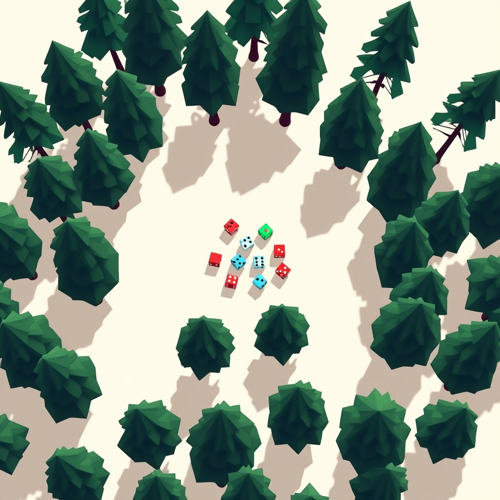

[Home](../index.md) > [Topics](./index.md)  
# 🎲🌲📊 Random Forest Classifier  
  
## 🤖 AI Summary  
  
### 👉 What Is It?  
  
🌳 A Random Forest Classifier is a type of **supervised machine learning algorithm**. 🤓 It belongs to a broader class of algorithms called **ensemble methods**, specifically a **bagging** technique. 🛍️ The "Random Forest" part isn't an acronym; it literally refers to a 🌲🌳🌲 collection (a "forest") of many individual **decision trees** 🌳 that operate somewhat randomly. 🎲 Each tree "votes" 🗳️ on a classification, and the forest chooses the classification having the most votes. 🏆  
  
### ☁️ A High Level, Conceptual Overview  
  
🍼 **For A Child:** Imagine you want to guess if a new animal ❓🐾 is a cat 🐈 or a dog 🐕. Instead of asking one friend 🙋, you ask a whole bunch of friends! 🙋‍♀️🙋‍♂️🙋 Each friend looks at different things – one might look at the ears 👂, another the tail 🐕‍, another the sound it makes 🗣️. Then, everyone shouts out their guess, and the answer that most friends shouted is probably the right one! ✅ A Random Forest is like that group of friends, but with computers 💻 making guesses!  
  
🏁 **For A Beginner:** A Random Forest Classifier is a predictive model 📊 used for classification tasks (e.g., is this email spam 📧 or not spam?). It works by building a multitude of decision trees 🌳🌳🌳 during training. When a new data point needs to be classified, it's run through all the individual trees. 🏃‍♀️ Each tree provides a classification (a "vote"). The Random Forest then outputs the class that received the majority of votes from its constituent trees. 🗳️➡️🏆 The "random" part comes from two sources: 1️⃣ each tree is trained on a random subset of the training data (with replacement, called bootstrapping), and 2️⃣ at each split in a tree, only a random subset of features is considered. 🤔 This randomness helps to create diverse trees, which generally leads to a more robust and accurate overall model. 💪  
  
🧙‍♂️ **For A World Expert:** A Random Forest Classifier is an ensemble learning method leveraging bootstrap aggregating (bagging) and random feature subspace selection to construct a collection of decorrelated decision trees. 🌲🌳🌲 For a given classification task, each tree in the forest produces a class prediction, and the final model output is determined by a majority vote among these predictions. 🗳️ The introduction of randomness—both in sampling the training data for each tree (via bootstrapping) and in selecting a subset of features at each node split—serves to reduce variance compared to a single decision tree, without a substantial increase in bias. 📉 This often results in improved generalization performance and robustness to overfitting, particularly on high-dimensional datasets. 🚀 It inherently provides measures of feature importance and can handle missing data with reasonable efficacy. 💡  
  
### 🌟 High-Level Qualities  
  
- 💪 **Robustness to Overfitting:** Generally less prone to overfitting compared to individual decision trees, especially with enough trees.  
- 🎯 **High Accuracy:** Often provides high classification accuracy on many types of datasets.  
- ⚙️ **Handles High Dimensionality:** Effective with datasets having many features (variables).  
- 🔄 **Versatility:** Can be used for both classification and regression tasks (though here we focus on classification).  
- 🧩 **Handles Missing Data:** Can maintain accuracy when a large proportion of the data is missing.  
- ⚖️ **Implicit Feature Importance:** Can estimate the importance of different features in making predictions.  
- 💨 **Parallelizable:** The construction of individual trees can be done in parallel, speeding up training. ⚡  
  
### 🚀 Notable Capabilities  
  
- 🌲 **Ensemble Learning:** Combines multiple "weak" learners (decision trees) to create a "strong" learner.  
- 🎲 **Random Subspace Method:** At each split in a tree, only a random subset of features is considered, leading to more diverse trees.  
- 🛍️ **Bootstrap Aggregating (Bagging):** Each tree is trained on a random sample of the data drawn with replacement.  
- 🗳️ **Majority Voting:** The final prediction is based on the most frequent prediction among all trees.  
- 📏 **Out-of-Bag (OOB) Error Estimation:** Provides an unbiased estimate of the test set error without needing a separate validation set by using the data points not included in the bootstrap sample for each tree.  
- 📊 **Feature Importance Ranking:** Can rank features based on how much they contribute to reducing impurity or increasing accuracy.  
  
### 📊 Typical Performance Characteristics  
  
- ⏱️ **Training Time:** Can be relatively slow to train compared to simpler algorithms like Naive Bayes or Logistic Regression, especially with a large number of trees 🌳🌲🌳 or features. Training time generally scales linearly with the number of trees and `m log m` with the number of samples `m` (due to sorting in tree building).  
- 🧠 **Prediction Time:** Usually fast 💨 once trained, as it involves passing data through pre-built trees.  
- 💾 **Memory Usage:** Can be high, as it needs to store multiple trees. 🌲💾 Each tree can be moderately complex.  
- 📈 **Accuracy:** Often achieves high accuracy, competitive with many state-of-the-art algorithms, especially on tabular data. Typically in the 80-95% accuracy range on well-suited problems, but this is highly dataset-dependent.  
- ⚙️ **Scalability:** Scales well to large datasets in terms of the number of samples and features, though memory can become a constraint.  
- 🔢 **Number of Trees (n_estimators):** More trees generally improve performance up to a point, after which returns diminish. Common values range from 100 to 1000+.  
- 🌳 **Max Depth of Trees:** Limiting tree depth can prevent overfitting and reduce memory. If not set, trees grow until all leaves are pure or contain fewer than a minimum number of samples.  
- ⭐ **Feature Subset Size (max_features):** Typically p​ for classification (where p is the total number of features) is a good heuristic.  
  
### 💡 Examples Of Prominent Products, Applications, Or Services That Use It Or Hypothetical, Well Suited Use Cases  
  
- 🏦 **Banking:** Credit card fraud detection 💳🕵️‍♀️, loan default prediction 💸.  
- 💊 **Healthcare & Medicine:** Disease diagnosis (e.g., identifying cancer from patient data 🧑‍⚕️🔬), drug discovery 🧪.  
- 🛍️ **E-commerce & Retail:** Customer segmentation, predicting customer churn 📉, product recommendation (less common than collaborative filtering, but possible).  
- 🌍 **Ecology & Remote Sensing:** Land cover classification from satellite imagery 🛰️🏞️, species distribution modeling 🐒.  
- 📉 **Stock Market Analysis:** Predicting stock price movements (though with caution due to market volatility!) 💹.  
- 🧬 **Bioinformatics:** Classifying gene expression data, identifying protein interactions.  
- 🤖 **Manufacturing:** Predictive maintenance (e.g., identifying when a machine part is likely to fail ⚙️➡️💔).  
- 🎮 **Gaming:** Predicting player behavior or preferences.  
- 📜 **Hypothetical:** Classifying handwritten digits ✍️🔢, identifying sentiment in text reviews 👍👎, predicting the type of a plant based on its characteristics 🌸🌿.  
  
### 📚 A List Of Relevant Theoretical Concepts Or Disciplines  
  
- 🧠 **Machine Learning:** The overarching field.  
- 📊 **Supervised Learning:** Learning from labeled data.  
- 🌳 **Decision Tree Learning:** The base learner (e.g., CART, ID3, C4.5).  
- 🧩 **Ensemble Methods:** Combining multiple models.  
- 🛍️ **Bootstrap Aggregating (Bagging):** Creating multiple training sets by sampling with replacement.  
- 🎲 **Random Subspace Method (Feature Bagging):** Using random subsets of features.  
- 📈 **Bias-Variance Tradeoff:** Random Forests aim to reduce variance.  
- 📉 **Overfitting and Generalization:** Key concepts in model performance.  
- 📊 **Information Theory:** Concepts like Gini impurity or entropy are used for splitting criteria in trees.  
- 💯 **Voting Theory:** How individual predictions are combined.  
- 🧮 **Statistics:** Foundations for sampling, hypothesis testing, and model evaluation.  
  
### 🌲 Topics:  
  
- 👶 **Parent:**  
    - 🤖 Machine Learning  
    - 🧩 Ensemble Learning  
    - 🌳 Tree-Based Methods  
- 👩‍👧‍👦 **Children:** (More specific implementations or variations)  
    - Extremely Randomized Trees (ExtraTrees) 🌲🌲🌲  
    - Isolation Forest (for anomaly detection, a different application but related structure) 🌳➡️👽  
- 🧙‍♂️ **Advanced topics:**  
    - 🤖 **Hyperparameter Optimization:** Techniques like Grid Search, Randomized Search, Bayesian Optimization for tuning parameters like `n_estimators`, `max_depth`, `min_samples_split`, `max_features`.  
    - 💡 **Feature Importance Interpretation:** Understanding the nuances of different feature importance measures (e.g., Gini importance vs. permutation importance).  
    - ⚖️ **Handling Imbalanced Datasets:** Strategies like class weighting, undersampling, oversampling (e.g., SMOTE) in conjunction with Random Forests.  
    - 📈 **Model Calibration:** Ensuring the predicted probabilities are well-calibrated.  
    - 🔗 **Random Forest for Regression:** Adapting the algorithm for predicting continuous values.  
    - 🌳 **Understanding Out-of-Bag (OOB) Error:** Its properties and reliability.  
    - 🔍 **Dealing with Correlated Features:** How they can affect feature importance measures.  
    - 🐍 **Incremental Random Forests:** Adapting forests for streaming data.  
  
### 🔬 A Technical Deep Dive  
  
A Random Forest Classifier operates through the following key steps:  
  
1. 🎒 **Bootstrapping:** From the original training dataset of N samples, T new training sets (bootstrap samples) are created by randomly sampling N samples _with replacement_. This means some samples may appear multiple times in a bootstrap sample, while others may not appear at all (these are the out-of-bag samples).  
2. 🌳 **Tree Growth:** For each of the T bootstrap samples, a decision tree is grown.  
    - 🌲 **Feature Randomization:** At each node in the tree, instead of considering all available features to find the best split, only a random subset of mtry​ features is selected (where mtry​ is typically much smaller than the total number of features M). The best split is then determined from this subset.  
    - 📏 **Splitting Criterion:** Common criteria for splitting nodes in classification trees include Gini impurity or information gain (entropy). The goal is to choose the split that results in the purest child nodes (i.e., nodes that predominantly contain samples from a single class).  
    - 🌲 **No Pruning (Typically):** Individual trees are usually grown to their maximum possible depth, without pruning, to ensure high variance and low bias for individual learners. The ensemble averaging then reduces the overall variance.  
3. 🗳️ **Aggregation (Voting):** Once all T trees are trained, to classify a new, unseen instance:  
    - The instance is passed down each of the T trees.  
    - Each tree outputs a class prediction (a "vote").  
    - The Random Forest outputs the class that received the majority of votes from all the trees. For example, if 70 trees vote for "Class A" and 30 trees vote for "Class B", the final prediction is "Class A".  
4. 💯 **Out-of-Bag (OOB) Error Estimation:** For each tree, the samples not included in its bootstrap training set (the OOB samples) can be used as a test set. To get the OOB error for a specific sample, predict its class using only the trees that did _not_ have this sample in their bootstrap set. The overall OOB error is the misclassification rate of these OOB predictions, providing an unbiased estimate of the generalization error.  
  
The key hyperparameters that control the model include:  
  
- `n_estimators`: The number of trees in the forest. 🌲🌳🌲  
- `max_features`: The number of features to consider when looking for the best split. 🤔  
- `max_depth`: The maximum depth of each tree. 📏  
- `min_samples_split`: The minimum number of samples required to split an internal node. 🔢  
- `min_samples_leaf`: The minimum number of samples required to be at a leaf node. 🍃  
- `criterion`: The function to measure the quality of a split (e.g., "gini" or "entropy"). 📉  
  
The randomness injected through bootstrapping and feature selection is crucial for decorrelating the individual trees, which is key to the variance reduction achieved by the ensemble. 🎲➡️📉  
  
### 🧩 The Problem(s) It Solves  
  
- 🎯 **Abstractly:** It solves the problem of building a robust and accurate classifier by combining the predictions of many less accurate and potentially unstable base learners (decision trees), thereby reducing variance and improving generalization. It addresses the challenge of finding a good bias-variance tradeoff.  
- 📧 **Specific Common Examples:**  
    - Classifying emails as spam 🗑️ or not spam 📥.  
    - Identifying if a customer will click on an ad 🖱️ or not.  
    - Determining if a loan applicant is a good 👍 or bad 👎 credit risk.  
    - Diagnosing a disease based on symptoms and medical data 🩺.  
- 😲 **A Surprising Example:**  
    - 🎮 **Predicting player movements in video games for more realistic AI opponents:** By training on vast amounts of player data, a Random Forest could predict likely player actions (e.g., take cover, attack, retreat) based on the current game state, leading to more challenging and human-like non-player characters (NPCs). 🤖👾  
  
### 👍 How To Recognize When It's Well Suited To A Problem  
  
- 📊 **Tabular Data:** Excels with structured, table-like data.  
- ✨ **Mix of Feature Types:** Handles both categorical and numerical features well (though preprocessing like one-hot encoding for categorical features is often needed).  
- 🤷‍♀️ **Non-Linear Relationships:** Effective when the relationship between features and the target variable is non-linear and complex.  
- 🚀 **Need for High Accuracy without Extensive Tuning:** Often provides good results "out-of-the-box" with default hyperparameters.  
- 🧩 **High-Dimensional Data:** Works well even when the number of features is large.  
- 🤔 **Feature Importance is Desired:** Provides a useful measure of which features are most influential.  
- 💧 **Some Missing Data:** Can handle missing values reasonably well (often through imputation or by design in some implementations).  
- ⚖️ **When you need a model less prone to overfitting than a single decision tree.**  
  
### 👎 How To Recognize When It's Not Well Suited To A Problem (And What Alternatives To Consider)  
  
- 🖼️ **Extremely High-Dimensional Sparse Data like Text or Images:** While it _can_ be used, specialized models like Convolutional Neural Networks (CNNs) for images 📸 or Transformer models for text 📜 often perform better.  
    - Alternatives: CNNs, RNNs, Transformers, Naive Bayes for text.  
- 📈 **Problems Requiring Extreme Interpretability of the Model Logic:** While feature importance is available, the "forest" of many deep trees can be a black box 📦, making it hard to understand _why_ a specific prediction was made in simple terms.  
    - Alternatives: Logistic Regression, Single Decision Trees (pruned), Rule-based systems.  
- 💨 **Real-time Prediction with Extremely Low Latency Requirements & Limited Resources:** While prediction is generally fast, if every millisecond ⏱️ and every byte of memory 💾 counts on a constrained device, simpler models might be better.  
    - Alternatives: Naive Bayes, Linear Models, Quantized Neural Networks.  
- 🔄 **Data with Strong Linear Relationships where Simplicity is Key:** If the underlying data structure is inherently linear, simpler models like Logistic Regression might perform just as well and be more interpretable.  
    - Alternatives: Logistic Regression, Linear SVM.  
- 📦 **Small Datasets:** While it can work, it might overfit if the dataset is too small to create diverse trees.  
    - Alternatives: Logistic Regression, k-Nearest Neighbors (k-NN), Naive Bayes.  
- 📉 **When a probabilistic output with perfect calibration is essential without post-processing.** Random Forest probabilities can sometimes be poorly calibrated.  
    - Alternatives: Logistic Regression, Calibrated Naive Bayes.  
  
### 🩺 How To Recognize When It's Not Being Used Optimally (And How To Improve)  
  
- 👎 **Poor Performance (Low Accuracy):**  
    - 🤔 **Symptom:** The model isn't predicting well on unseen data.  
    - 🛠️ **Improvement:**  
        - Tune hyperparameters (e.g., `n_estimators`, `max_depth`, `max_features`, `min_samples_split`). Use GridSearchCV or RandomizedSearchCV. ⚙️  
        - Perform better feature engineering or selection. ✨  
        - Ensure data is properly preprocessed (e.g., handling missing values, encoding categorical features). 🧹  
        - Increase the number of trees if it's too low. 🌲➡️🌳🌲  
- 🐢 **Very Slow Training:**  
    - 🤔 **Symptom:** Training takes an unacceptably long time.  
    - 🛠️ **Improvement:**  
        - Reduce `n_estimators` (but monitor performance).  
        - Decrease `max_depth`. 📏  
        - Use a smaller `max_features`.  
        - Parallelize training if not already doing so (`n_jobs=-1` in scikit-learn). ⚡  
        - Subsample the data if it's massive (though this might reduce accuracy).  
- 💾 **High Memory Consumption:**  
    - 🤔 **Symptom:** The model is too large for memory.  
    - 🛠️ **Improvement:**  
        - Reduce `n_estimators`.  
        - Limit `max_depth` of trees.  
        - Consider reducing the number of features.  
- 📈 **Overfitting (High Variance):**  
    - 🤔 **Symptom:** Great performance on training data, poor on test/OOB data.  
    - 🛠️ **Improvement:**  
        - Increase `n_estimators` (counter-intuitively, more trees usually _reduces_ overfitting for RF).  
        - Decrease `max_depth`.  
        - Increase `min_samples_split` or `min_samples_leaf`. 🍃  
        - Ensure `max_features` is not too large (e.g., try p​).  
- 📉 **Underfitting (High Bias):**  
    - 🤔 **Symptom:** Poor performance on both training and test data.  
    - 🛠️ **Improvement:**  
        - Decrease `min_samples_split` or `min_samples_leaf`.  
        - Increase `max_depth` (allow trees to grow deeper).  
        - Increase `max_features` (give trees more options).  
        - Ensure enough trees (`n_estimators`).  
        - Add more relevant features or improve existing ones. ✨  
  
### 🔄 Comparisons To Similar Alternatives  
  
- 🌳 **Single Decision Tree:**  
    - 👍 RF is generally more accurate and less prone to overfitting.  
    - 👎 Single trees are more interpretable.  
- 📈 **Gradient Boosting Machines (e.g., XGBoost, LightGBM, CatBoost):**  
    - 🚀 Often achieve slightly higher accuracy than Random Forests, especially on structured/tabular data.  
    - 🐢 Can be more sensitive to hyperparameters and slower to train (as trees are built sequentially).  
    - 🤔 RF is conceptually simpler and easier to tune for "good enough" results.  
- 🤖 **Support Vector Machines (SVM):**  
    - 👍 SVMs can be very effective in high-dimensional spaces and for clear margin of separation.  
    - 👎 SVMs can be less intuitive, more sensitive to kernel choice and parameters, and training can be slow for large datasets. RFs handle mixed data types more naturally.  
- 🧠 **Neural Networks (Deep Learning):**  
    - 🖼️📜 Neural Networks excel at unstructured data like images, text, and audio.  
    - 📊 For tabular data, Random Forests and Gradient Boosting often match or outperform NNs and require less data and tuning.  
    - ⚙️ NNs are generally more complex to design and train.  
- 😇 **Naive Bayes:**  
    - 💨 Much faster to train and simpler.  
    - 👎 Makes strong independence assumptions that are often violated, leading to lower accuracy than RF.  
- 🤝 **k-Nearest Neighbors (k-NN):**  
    - 🧠 Simple, instance-based learner.  
    - 🐢 Can be slow at prediction time for large datasets, sensitive to feature scaling and the "curse of dimensionality." RF often scales better.  
  
### 🤯 A Surprising Perspective  
  
🤯 Despite being made of many "weak" and complex decision trees that individually might overfit like crazy, the Random Forest as a whole is remarkably robust to overfitting! 🎉 It’s like a chaotic committee 🤪🤪🤪 that somehow makes incredibly sensible collective decisions. The magic ✨ is in the _decorrelation_ of the trees, achieved through bagging and random feature selection. This allows the errors of individual trees to average out. 🌲➕🌲➕🌲 = 💪🧠  
  
### 📜 Some Notes On Its History, How It Came To Be, And What Problems It Was Designed To Solve  
  
- ⏳ The foundational ideas for Random Forests were developed by **Tin Kam Ho** in 1995 with her "random decision forests" which used the random subspace method. 🎲  
- 🌟 The full algorithm was then significantly extended and popularized by **Leo Breiman** and **Adele Cutler** in 2001. Breiman coined the name "Random Forests"™️. (Leo Breiman was a true giant in statistics and machine learning! 🧑‍🔬)  
- 🎯 **Problems it was designed to solve:**  
    - Improve the accuracy of single decision trees, which were known to be unstable and prone to overfitting. 📉➡️📈  
    - Create a classifier that was robust, accurate, and relatively easy to use. ✅  
    - Handle high-dimensional data effectively. 📊  
    - Provide useful internal estimates of error (OOB error) and variable importance. 💯💡  
- 🤝 It built upon earlier work on **bagging** (Bootstrap Aggregating) by Leo Breiman (1996) and the **random subspace method** by Tin Kam Ho (1998). The key innovation was combining these ideas and refining the tree-building process.  
  
### 📝 A Dictionary-Like Example Using The Term In Natural Language  
  
🗣️ "To predict customer churn with high accuracy, the data science team implemented a **Random Forest Classifier**, leveraging its ability to handle numerous customer attributes and its robustness against overfitting." 🎯🛒  
  
### 😂 A Joke  
  
Why did the Random Forest Classifier break up with the Naive Bayes Classifier? 🤔  
  
... Because it found Naive Bayes too "independent" and wanted a relationship with more "features"! 💔😂  
  
Or...  
  
A random forest is cool. It's like, a bunch of trees, right? And they all vote. 🌲🗳️ But if one tree is really loud, does it get two votes? I bet it thinks it does. That tree's an egomaniac. 🤪  
  
### 📖 Book Recommendations  
  
📚 **Topical (Directly on Random Forests & Ensemble Methods):**  
  
- 🥇 _Ensemble Methods: Foundations and Algorithms_ by Zhi-Hua Zhou. (More academic, covers many ensemble techniques including RF).  
- 🌳 _The Elements of Statistical Learning_ by Trevor Hastie, Robert Tibshirani, and Jerome Friedman. (Chapter 15 covers Random Forests in depth). 🧙‍♂️  
  
📚 **Tangentially Related (Decision Trees, General ML):**  
  
- 🌲 _Classification and Regression Trees_ by Leo Breiman, Jerome Friedman, Richard Olshen, and Charles Stone. (The classic CART book, foundational for understanding trees).  
- 🤖 _Pattern Recognition and Machine Learning_ by Christopher M. Bishop. (Excellent general ML book).  
- 🐍 _Hands-On Machine Learning with Scikit-Learn, Keras & TensorFlow_ by Aurélien Géron. (Practical implementation and good explanations). 🏁  
  
📚 **Topically Opposed (e.g., Simpler Models, Bayesian Methods):**  
  
- 😇 _Bayesian Reasoning and Machine Learning_ by David Barber. (For a different philosophical approach to modeling uncertainty).  
- 📏 _An Introduction to Generalized Linear Models_ by Annette J. Dobson and Adrian G. Barnett. (Focuses on linear frameworks).  
  
📚 **More General (Statistics, Data Science):**  
  
- 📊 _An Introduction to Statistical Learning with Applications in R_ by Gareth James, Daniela Witten, Trevor Hastie, and Robert Tibshirani.1 (More accessible version of "Elements," great for beginners/intermediate). 🏁🍼  
- 📈 _[Naked Statistics](../books/naked-statistics.md): Stripping the Dread from the Data_ by Charles Wheelan. (Accessible introduction to statistical concepts). 🍼  
  
📚 **More Specific (Advanced Ensemble Topics):**  
  
- 🚀 _Boosting: Foundations and Algorithms_ by Robert E. Schapire and Yoav Freund. (Though about boosting, it's the other major ensemble family).  
  
📚 **Fictional (Just for fun, evoking "forests" or "decisions"):**  
  
- 🌲 _The Overstory_ by Richard Powers. (Not about ML, but a magnificent novel about trees and interconnectedness).  
- 🤔 _The Lord of the Rings_ by J.R.R. Tolkien. (Ents are like decision trees, and Fangorn is a very old forest... a stretch, I know! 😂)  
  
📚 **Rigorous (Mathematical Foundations):**  
  
- 🧙‍♂️ _The Elements of Statistical Learning_ by Trevor Hastie, Robert Tibshirani, and Jerome Friedman (already mentioned, but fits here too).  
- [🎲🧮 Probability Theory: The Logic of Science](../books/probability-theory.md) by E.T. Jaynes. (Deep dive into probabilistic reasoning).  
  
📚 **Accessible (Easier to grasp introductions):**  
  
- 🏁 _Hands-On Machine Learning with Scikit-Learn, Keras & TensorFlow_ by Aurélien Géron (already mentioned).  
- 🍼 _Machine Learning for Absolute Beginners_ by Oliver Theobald.