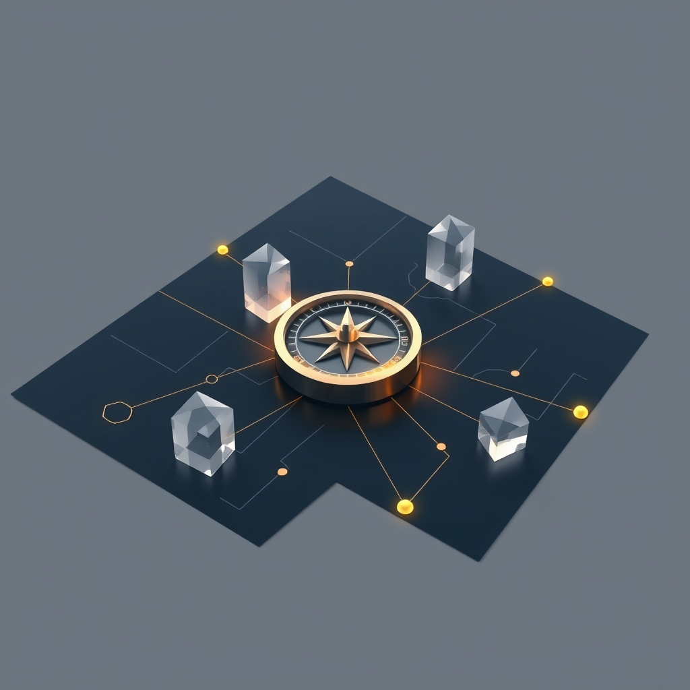

[Home](../index.md) > [Topics](./index.md)  
# 📋⚖️ Rules  
  
## Why do we make rules?  
- Life is complicated and full of decisions to make.  
- When should I eat, sleep, work, play, speak, act, plan?  
- Thinking is hard.  
- Making good decisions is hard.  
- As individuals, we get to think about our goals and how best to achieve them.  
- If we put all this effort into thinking about how to achieve our goals, perhaps we can come up with shortcuts to avoid having to think so hard about every little thing, all the time.  
- We can make our own rules.  
- I want to achieve Y.  
- If I consistently do X in circumstance C, I think that'll get me to Y in a reasonable manner.  
- Rules are like plans.  
- I don't want to get up at 6am every morning.  
- But I have a long commute 2 days per week, and I'll need to get up at 6am on those days.  
- My understanding of sleep, according to the scientists, is that consistency is pretty important for good quality sleep.  
- Based on my own experience, I know that it's easy to forget about what's going on tomorrow and I hate sleeping in and being late because I forgot that I have a long commute on Tuesdays.  
- So if I make a rule for myself - wake up at 6am every morning - I should never be late for work because I slept in, and I should get pretty good quality sleep (at least in terms of consistency), which will allow me to feel good physically and mentally on a regular basis.  
- I know I also need enough sleep, so I may want another rule that says I fall asleep by 10pm every night so that I can get 8 hours of sleep.  
- I get to make this rule for myself, based on my understanding of reality, in order to make it easier to achieve my goals.  
  
## Why do we break rules?  
- We might not be able to follow the rules.  
- We might realize that the rules aren't helping us achieve our goals in the way we expected when we made them in the first place.  
  
## How do we make rules with a group?  
- If an individual makes rules in order to more easily achieve their goals according to their understanding of reality, then maybe a group can do the same.  
- A group can make rules together in order to make it easier to achieve their collective goals according to their collective understanding of reality.  
