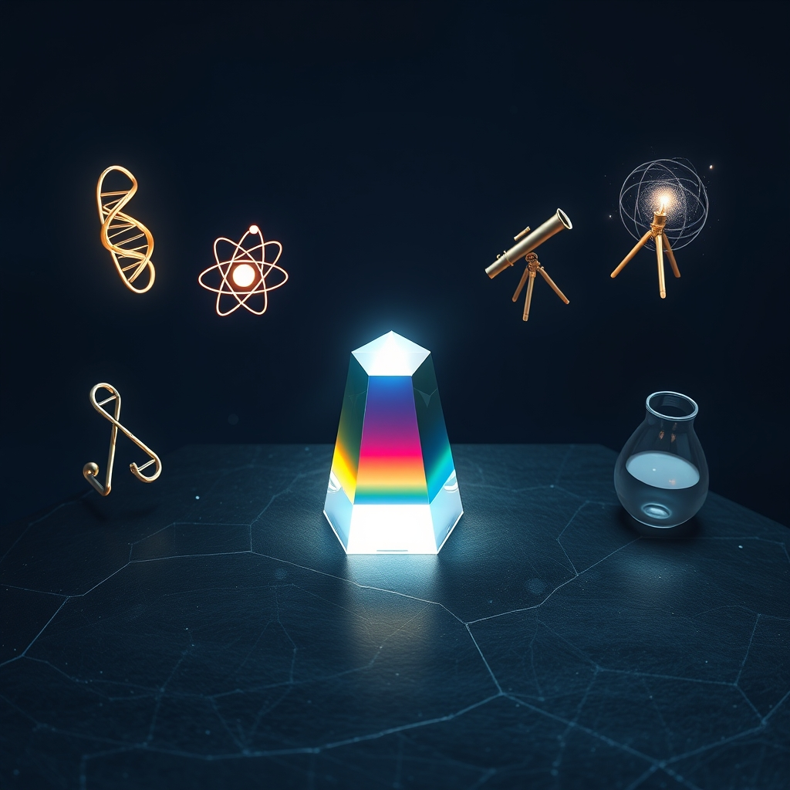

[Home](../index.md) > [Topics](./index.md) > [Knowledge](./a-hierarchical-view-of-human-knowledge.md)  
# 🧪🔬🔭 Science  
  
## 🤖 AI Summary  
**Science** 🧪🔬🔭  
* **High-Level Summary:**  
    * Science is a systematic and organized pursuit of knowledge about the natural world 🌍 through observation, experimentation, and theoretical explanation. Its core principles include objectivity, empirical evidence, and testability. The primary goal of science is to develop a comprehensive understanding of how the universe works, leading to the creation of theories and laws that can predict and explain phenomena. The significance of science lies in its ability to drive technological advancements 💻, improve human health 🩺, and expand our understanding of our place in the cosmos ✨.  
  
* **Subcategories:**  
    * **Physics:** The study of matter, energy, space, and time, and their fundamental interactions. It explores the laws governing the universe from the subatomic to the cosmic scale. ⚛️⚡️  
    * **Chemistry:** The study of the composition, structure, properties, and changes of matter. It investigates how atoms and molecules interact to form substances and how those substances react with each other. 🧪⚗️  
    * **Biology:** The study of living organisms and their interactions with each other and their environment. It encompasses a wide range of fields, including genetics, ecology, physiology, and evolutionary biology. 🧬🌱  
    * **Astronomy:** The study of celestial objects, space, and the physical universe as a whole. It involves observing and analyzing stars, planets, galaxies, and other cosmic phenomena. 🌌🔭  
    * **Earth Science:** The study of the Earth's physical structure, composition, processes, and history. It includes geology, meteorology, oceanography, and environmental science. 🌎⛰️  
  
* **Book Recommendations:**  
    * "[A Brief History of Time](../books/a-brief-history-of-time.md)" by Stephen Hawking: 🕰️➡️🌌  
    * "The Periodic Table" by Primo Levi: 📖➡️⚛️  
    * "[Sapiens: A Brief History of Humankind](../books/sapiens-a-brief-history-of-humankind.md)" by Yuval Noah Harari: 🚶➡️🌍  
    * "[The Sixth Extinction](../books/the-sixth-extinction.md): An Unnatural History" by Elizabeth Kolbert: 💀➡️⚠️  
    * "What If?: Serious Scientific Answers to Absurd Hypothetical Questions" by Randall Munroe:❓➡️💡  
  
## 💬 [Gemini](https://gemini.google.com/app) Prompt  
> For the category of Science, please provide:  
A High-Level Summary: A concise overview of the core principles, goals, and significance of this category.  
Subcategories: A list of the major subcategories or branches within this category, with a brief description of each.  
Book Recommendations: A selection of 3-5 influential or accessible books that provide a good introduction to this category or its key subcategories.  
Use lots of emojis.  
  
## 🦋 Bluesky    
<blockquote class="bluesky-embed" data-bluesky-uri="at://did:plc:i4yli6h7x2uoj7acxunww2fc/app.bsky.feed.post/3mj4szd5qh32j" data-bluesky-cid="bafyreiawmezuxtqkn6j76pqm4ttmzh2jlfpjwp4aung77wuxqsr22cughm">
🧪🔬🔭 Science  
  
#AI Q: 🧪 Which scientific discovery changed your perspective on the world most?  
  
⚛️ Physics | 🧬 Biology | 🌌 Astronomy | 🌎 Earth Science  
https://bagrounds.org/topics/science
&mdash; <a href="https://bsky.app/profile/did:plc:i4yli6h7x2uoj7acxunww2fc?ref_src=embed">Bryan Grounds (@bagrounds.bsky.social)</a> <a href="https://bsky.app/profile/did:plc:i4yli6h7x2uoj7acxunww2fc/post/3mj4szd5qh32j?ref_src=embed">2026-04-10T07:40:17.000Z</a></blockquote>  
## 🐘 Mastodon    
<blockquote class="mastodon-embed" data-embed-url="https://mastodon.social/@bagrounds/116379275477856864/embed" style="background: #282c37; border-radius: 8px; border: 1px solid #393f4f; margin: 0; max-width: 540px; min-width: 270px; overflow: hidden; padding: 0;"> <a href="https://mastodon.social/@bagrounds/116379275477856864" target="_blank" style="align-items: center; color: #d9e1e8; display: flex; flex-direction: column; font-family: system-ui, -apple-system, BlinkMacSystemFont, 'Segoe UI', Oxygen, Ubuntu, Cantarell, 'Fira Sans', 'Droid Sans', 'Helvetica Neue', Roboto, sans-serif; font-size: 14px; justify-content: center; letter-spacing: 0.25px; line-height: 20px; padding: 24px; text-decoration: none;"> <svg xmlns="http://www.w3.org/2000/svg" xmlns:xlink="http://www.w3.org/1999/xlink" width="32" height="32" viewBox="0 0 79 75"><path d="M63 45.3v-20c0-4.1-1-7.3-3.2-9.7-2.1-2.4-5-3.7-8.5-3.7-4.1 0-7.2 1.6-9.3 4.7l-2 3.3-2-3.3c-2-3.1-5.1-4.7-9.2-4.7-3.5 0-6.4 1.3-8.6 3.7-2.1 2.4-3.1 5.6-3.1 9.7v20h8V25.9c0-4.1 1.7-6.2 5.2-6.2 3.8 0 5.8 2.5 5.8 7.4V37.7H44V27.1c0-4.9 1.9-7.4 5.8-7.4 3.5 0 5.2 2.1 5.2 6.2V45.3h8ZM74.7 16.6c.6 6 .1 15.7.1 17.3 0 .5-.1 4.8-.1 5.3-.7 11.5-8 16-15.6 17.5-.1 0-.2 0-.3 0-4.9 1-10 1.2-14.9 1.4-1.2 0-2.4 0-3.6 0-4.8 0-9.7-.6-14.4-1.7-.1 0-.1 0-.1 0s-.1 0-.1 0 0 .1 0 .1 0 0 0 0c.1 1.6.4 3.1 1 4.5.6 1.7 2.9 5.7 11.4 5.7 5 0 9.9-.6 14.8-1.7 0 0 0 0 0 0 .1 0 .1 0 .1 0 0 .1 0 .1 0 .1.1 0 .1 0 .1.1v5.6s0 .1-.1.1c0 0 0 0 0 .1-1.6 1.1-3.7 1.7-5.6 2.3-.8.3-1.6.5-2.4.7-7.5 1.7-15.4 1.3-22.7-1.2-6.8-2.4-13.8-8.2-15.5-15.2-.9-3.8-1.6-7.6-1.9-11.5-.6-5.8-.6-11.7-.8-17.5C3.9 24.5 4 20 4.9 16 6.7 7.9 14.1 2.2 22.3 1c1.4-.2 4.1-1 16.5-1h.1C51.4 0 56.7.8 58.1 1c8.4 1.2 15.5 7.5 16.6 15.6Z" fill="currentColor"/></svg> 
Post by @bagrounds@mastodon.social
 
View on Mastodon
 </a> </blockquote>   
